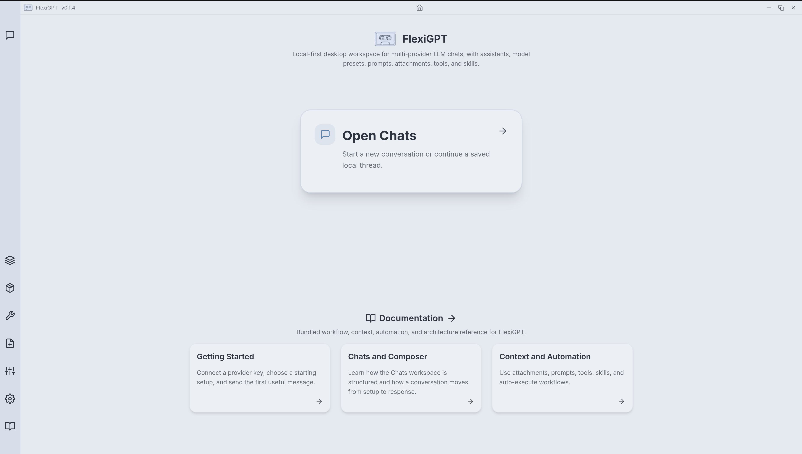
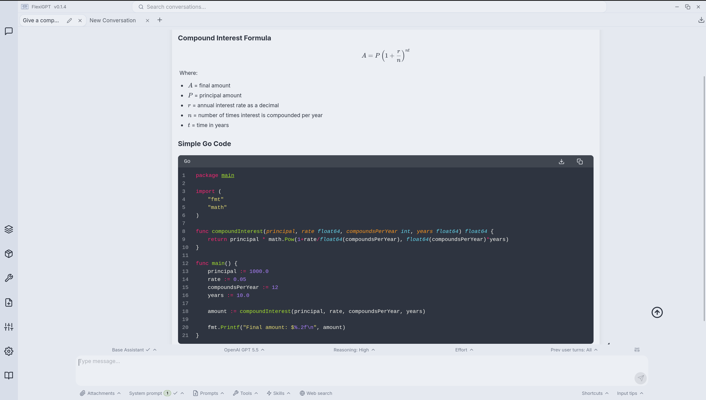
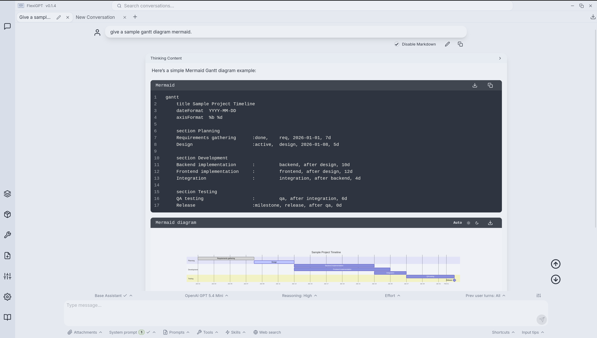
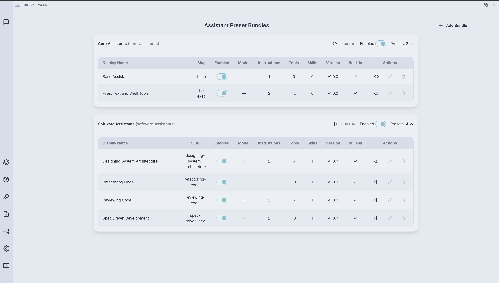
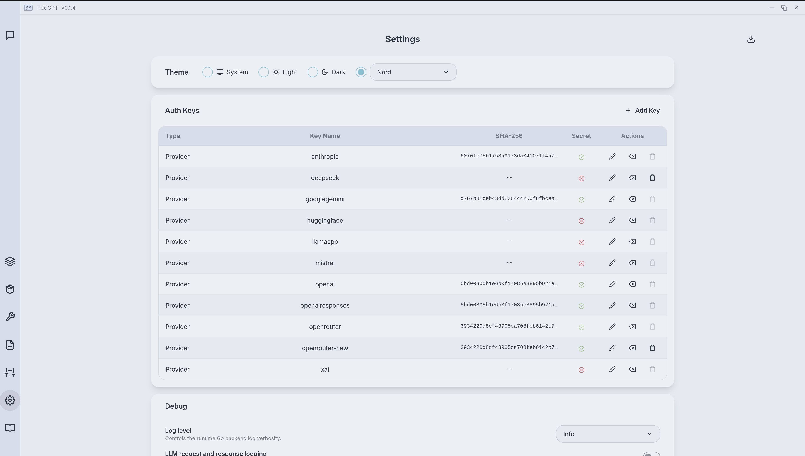

# FlexiGPT

FlexiGPT is a local-first BYOK AI workspace for power users and teams who need repeatable prompts, tools, skills, model choices, assistants/agents, and private local history across multiple LLM providers.

## Who FlexiGPT is for

FlexiGPT is built for people who use LLMs as part of repeatable work, not just one-off chat.

- Power and local-first users who want provider choice, private local history, and control over configuration and orchestration.
- Developers and technical writers who develop features, review diffs, debug failures, write tests/docs, and reuse assistants/agents, prompts, attachments, tools, and model setups.
- Consultants and small teams who want consistent assistant workflows without sending chat history through another hosted app.

## Install

1. Download the latest release from [GitHub Releases](https://github.com/flexigpt/flexigpt-app/releases).
   - macOS: `.pkg`
   - Linux: `.flatpak`
   - Windows: `.exe`
2. Install the package. Detailed installation steps are in [Installation](./frontend/app/docs/content/00-installation.md).
3. Launch FlexiGPT.

## Quick start

1. Get an API key for a provider.
   - [OpenAI](https://platform.openai.com/settings/organization/api-keys)
   - [Anthropic Claude](https://platform.claude.com/settings/keys)
   - [Google Gemini](https://aistudio.google.com/api-keys)
   - [xAI](https://console.x.ai/team/default/api-keys)
   - [Mistral AI](https://console.mistral.ai/home?profile_dialog=api-keys)
   - [OpenRouter](https://openrouter.ai/workspaces/default/keys)
   - [Hugging Face](https://huggingface.co/settings/tokens)
2. Add the key in **Settings -> Auth Keys**.
3. Open **Chats**.
4. Start from a built-in assistant preset or choose a model preset directly.
5. Attach files, folders, notes, PDFs, URLs, or code when the model needs source material.
6. Send.

Good first workflows:

- Use a home screen workflow card such as Develop a Feature, Review Code, or Investigate a Bug.
- Attach only the relevant source material.
- For code changes, start with a repo path or changed files and let the Feature Developer workflow inspect, scope, implement, and verify the change.
- Send the prefilled prompt as-is or adjust it for your task.
- Reuse or customize the assistant preset once the workflow fits your style.

FlexiGPT does not bill you directly. Usage costs and limits come from the provider account behind the key you configure.

FlexiGPT does not proxy LLM calls through a FlexiGPT-hosted service. Requests go directly to the provider or endpoint you configure.

## Screenshots

[All images are here](./images/).

## Key features

### Provider-independent model choices with built-in presets

- Built-in support for OpenAI, Anthropic, Google Gemini, xAI, Mistral, Hugging Face, OpenRouter, and local `llama.cpp`.
- Custom endpoints across OpenAI Chat Completions, OpenAI Responses, Anthropic Messages, and Google GenerateContent-style APIs.
- Curated built-in providers and model presets so you can start quickly without manually defining endpoints or defaults first.
- API keys are stored securely through the OS keyring, not in plain-text exported settings.

### Repeatable AI workspace

- One interface for chats, tabs, reusable assistant presets, model presets, prompt templates, attachments, tools, skills, search, and exports.
- Build repeatable workflows by combining model choices, instructions, attachments, tools, and skills.
- Switch providers or models as you iterate.
- Multi-tab conversations with local history search and resume flows.
- Export the current conversation as JSON.

### Assistants, tools, and agentic workflows with human-in-loop controls

- Assistant presets bundle starting text, model choice, instructions, tools, and skills into reusable starting setups.
- Tools can be attached per conversation or per message and configured for manual review or auto-execution.
- When an eligible auto-execute tool is called, FlexiGPT can run it and submit the result back to the model.
- Keep tools manual when you want tighter control over execution.

### Rich response rendering and inspection

- Markdown rendering with syntax-highlighted code blocks.
- Mermaid diagram rendering with zoom and source or image export workflows.
- KaTeX math rendering.
- Citations, token usage, and per-message request/response details for inspection and debugging.
- Message-level controls for copying, inspection, and follow-up iteration.

### Private local context and history

- Local conversation storage and full-text search.
- File, folder, image, PDF, and URL attachments.
- Bundled offline docs shipped inside the app.
- Conversations, workflow catalogs, and configuration are stored locally.
- Selected request context is sent to the provider or endpoint you choose when you send.
- Use your own provider accounts. FlexiGPT does not proxy or bill model usage.

### Built-in software development workflows

- Develop bounded features and enhancements from local repo context with a spec, implementation steps, edits, and focused verification.
- Review code, diffs, and PRs for correctness, security, reliability, maintainability, and test gaps.
- Investigate bugs from logs, stack traces, failing outputs, source files, and config.
- Refactor code, design tests, implement tests, explore codebases, and review architecture with built-in software assistant presets.
- Use read-only presets for review/investigation and write/shell-capable presets for implementation, with manual review for write and shell tools.

### Built-in product, research, and technical-writing workflows

- Built-in assistants cover PRD/MRD writing, decision records, user feedback analysis, roadmap prioritization, delivery risk review, and stakeholder status updates.
- Technical-writing assistants cover docs audits, docs authoring, API reference, release notes, and troubleshooting guides.

## Documentation

### Repository-only install notes

- [Installation](./frontend/app/docs/content/00-installation.md)

### Bundled in-app docs

Start here:

- [Getting Started](./frontend/app/docs/content/01-getting-started.md)
- [Concepts and Ownership](./frontend/app/docs/content/02-concepts-and-ownership.md)
- [Chat Workspace](./frontend/app/docs/content/03-chat-workspace.md)

Context and reusable setup:

- [Composer Context](./frontend/app/docs/content/04-composer-context.md)
- [Reusable Catalogs](./frontend/app/docs/content/05-reusable-catalogs.md)

Setup, safety, and help:

- [Providers and Models](./frontend/app/docs/content/06-providers-and-models.md)
- [Privacy, Data, and Troubleshooting](./frontend/app/docs/content/07-privacy-data-and-troubleshooting.md)

Recipes:

- [Everyday Recipes](./frontend/app/docs/content/08-everyday-recipes.md)
- [Setup Recipes](./frontend/app/docs/content/09-setup-recipes.md)

Architecture reference:

- [Architecture Overview](./frontend/app/docs/content/11-architecture-overview.md)
- [Backend Roles and Responsibilities](./frontend/app/docs/content/12-backend-roles-and-responsibilities.md)
- [Frontend Roles and Responsibilities](./frontend/app/docs/content/13-frontend-roles-and-responsibilities.md)
- [Chats Workspace and Composer Design](./frontend/app/docs/content/14-chats-workspace-and-composer-design.md)

## Built with

- Data storage: `JSON` and `SQLite` files in the local filesystem.
- [Go](https://go.dev/) backend.
- [Wails](https://wails.io/) desktop application platform.
- Official Go SDKs by [OpenAI](https://github.com/openai/openai-go), [Anthropic](https://github.com/anthropics/anthropic-sdk-go), and [Google GenAI](https://github.com/googleapis/go-genai).
- [Vite](https://vite.dev/) and [React Router v7](https://reactrouter.com/) frontend in [TypeScript](https://www.typescriptlang.org/).
- [DaisyUI](https://daisyui.com/) with [Tailwind CSS](https://tailwindcss.com/) for styling.
- Tooling: [GolangCI-Lint](https://golangci-lint.run/), [Knip](https://knip.dev/), [ESLint](https://eslint.org/), [Prettier](https://prettier.io/), and [GitHub Actions](https://github.com/features/actions).

## Contributing

Developer setup is documented in [devsetup.md](./devdocs/contributing/devsetup.md).

## License

Copyright (c) 2024 - Present - Pankaj Pipada

All source code in this repository, unless otherwise noted, is licensed under the Mozilla Public License, v. 2.0. See [`LICENSE`](./LICENSE) for details.
