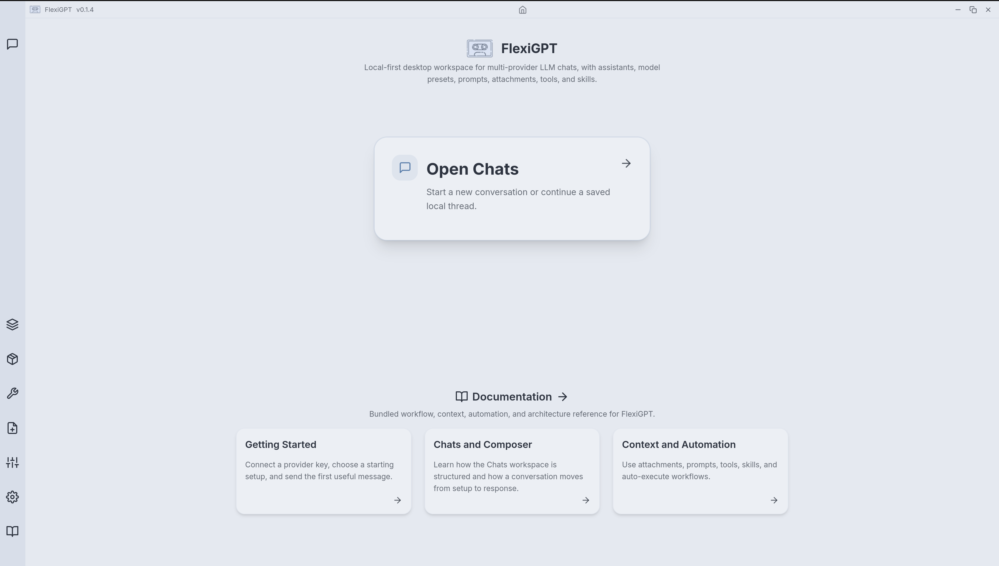
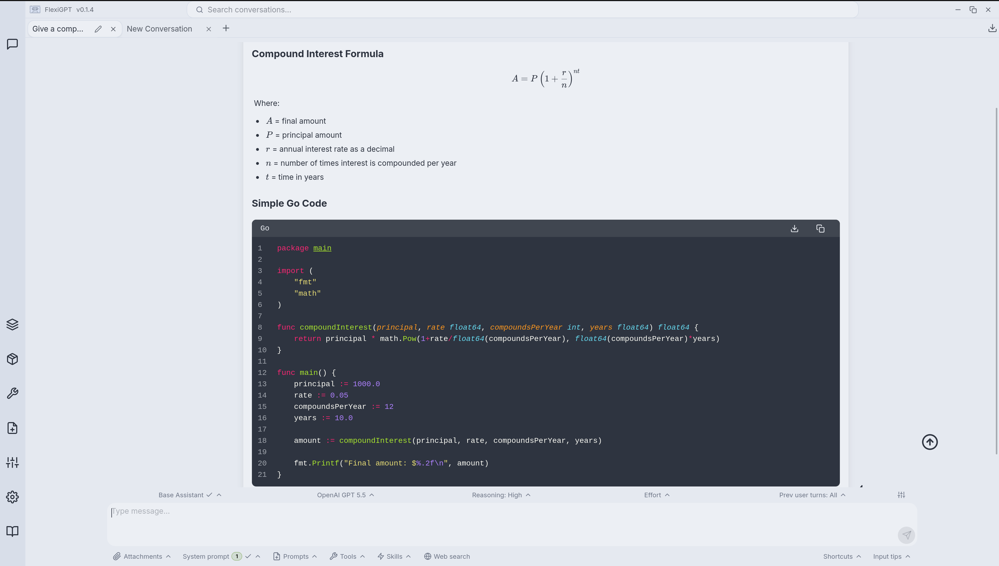
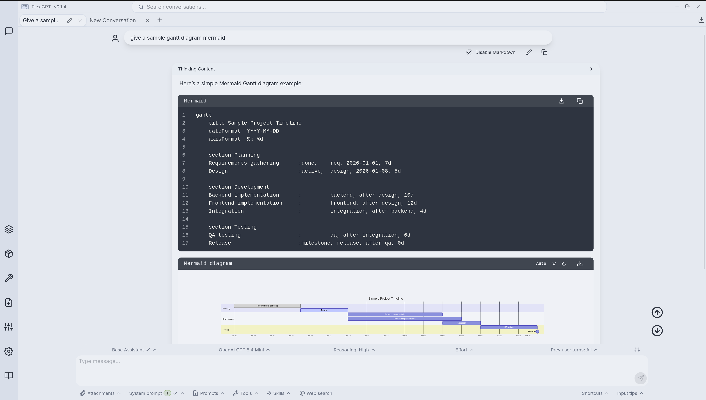
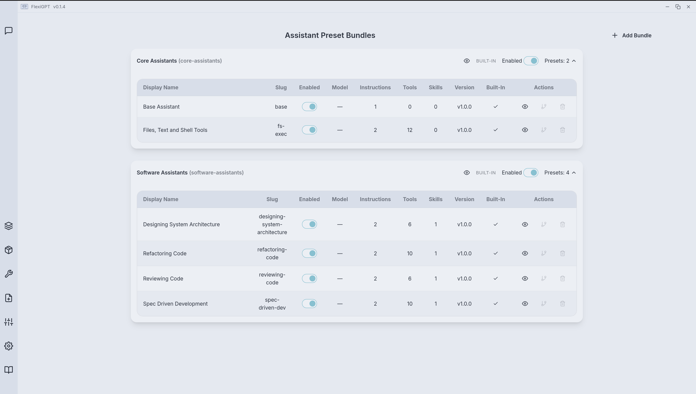
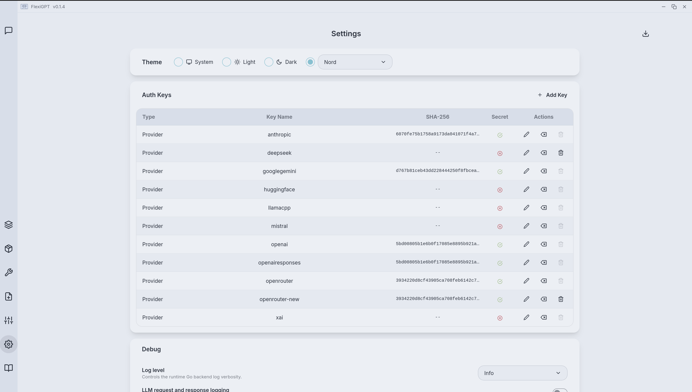

# FlexiGPT: Local-First AI Workspace

FlexiGPT is a local-first BYOK AI workspace for power users and teams who need repeatable LLM workflows with model choices, Agents, Workspaces, MCP servers, tools, Skills, and private local history across multiple providers.

## Who FlexiGPT is for

- Power users, developers, writers, consultants, teams, and interface builders who use LLMs for repeatable work.

## Why are you doing this?

- I want to be in the driver's seat when using LLMs.
- I want to use LLMs as tools while staying in control of what I do and how I do it. Most systems seem to be designed to let their tooling and workflows drive the work.

## What are you doing?

- Writing the whole LLM setup down as plain, versionable files: models, prompts, Agents, MCP servers, Skills, tools, files, and Workspace context. Open and spec driven, no provider or platform lock-in.
- Assembling every request from that setup, with its exact input inspectable before it is sent. Nothing gets injected behind your back.
- Controlling every action: you declare what runs automatically, what asks first, and what is never allowed. Pause automatic execution mid task, change input, resume as needed. Per tool, per Agent, per Workspace.
- Keeping a record of each run - input, output, and what it changed - so it can be reviewed, diffed, and repeated.
- Exposing all of it through one uniform interface, so any application can drive the same setup.
- Building use-case UIs on top of that interface, starting with chat.

## Install

1. Download the latest release from [GitHub Releases](https://github.com/flexigpt/flexigpt-app/releases).
   - macOS: `.pkg`
   - Linux: `.flatpak`
   - Windows: `.exe`
2. Install the package. Detailed installation steps are in [Installation](./frontend/app/docs/content/00-installation.md).
3. Launch FlexiGPT.

## Quick start

1. Get an API key for a hosted provider, or start a local LLM server you control.
   - [OpenAI](https://platform.openai.com/settings/organization/api-keys)
   - [Anthropic Claude](https://platform.claude.com/settings/keys)
   - [Google Gemini](https://aistudio.google.com/api-keys)
   - [xAI](https://console.x.ai/team/default/api-keys)
   - [Mistral AI](https://console.mistral.ai/home?profile_dialog=api-keys)
   - [OpenRouter](https://openrouter.ai/workspaces/default/keys)
   - [Hugging Face](https://huggingface.co/settings/tokens)
2. Add the key in **Settings -> Auth Keys**.
   - For local endpoints that require a non-empty key, add a harmless placeholder key for the local provider.
3. Open **Model Presets**. Enable a built-in provider/model or fork a provider preset for your endpoint.
4. Open **Chats**.
5. Choose a built-in Agent for a reusable starting setup, or choose a model preset directly.
6. Attach files, folders, notes, PDFs, URLs, or code when the model needs source material.
7. Optionally select a **Workspace** for recurring repository or folder context, or an already configured **MCP server** for connected tools, resources, or prompts.
8. Send.

Good first workflows:

- Use a home screen workflow card such as Develop a Feature, Review Code, or Investigate a Bug.
- Attach only the relevant source material.
- For code changes, start with a repo path or changed files and let the **Spec Driven Development** Agent inspect, scope, implement, and verify the change.
- Review the prefilled opening text and adjust it for your task before sending.
- Export, edit, and import an Agent when you need a durable variation.

FlexiGPT does not bill you directly. Usage costs and limits come from the provider account behind the key you configure.

FlexiGPT does not proxy LLM calls through a FlexiGPT-hosted service. Requests go directly to the provider or endpoint you configure.

## Screenshots

[All images are here](./images/).

## Key features

### Provider-independent model choices with built-in presets

- Built-in support for OpenAI, Anthropic, Google Gemini, xAI, Mistral, Hugging Face, OpenRouter, and local/self-hosted runtimes such as LocalAI, LM Studio, `llama.cpp`, Ollama, SGLang, and vLLM.
- Custom endpoints across OpenAI Chat Completions, OpenAI Responses, Anthropic Messages, and Google GenerateContent-style APIs.
- Curated built-in providers and model presets so you can start quickly without manually defining endpoints or defaults first.
- Provider and model presets are configurable, so local users can copy/fork a built-in provider preset, adjust the endpoint, headers, compatibility type, and model defaults, then use the forked provider in Chats.
- API keys are stored securely through the OS keyring, not in plain-text exported settings.

### Repeatable AI workspace

- One interface for chats, tabs, reusable Agents, Workspaces, MCP servers, model presets, attachments, tools, Skills, search, and exports.
- Build repeatable workflows by combining Agents, Workspaces, model choices, attachments, tools, Skills, and connected services.
- Skills can seed starter drafts, carry instruction-only behavior, or manage reusable workflow state.
- Switch providers or models as you iterate.
- Multi-tab conversations with local history search and resume flows.
- Export the current conversation as JSON.

### Agents, Workspaces, MCP servers, and human-in-the-loop tools

- Agents can prepare a model choice, instructions, opening text, tools, Skills, and connected services without locking the chat.
- Workspaces provide reusable repository or folder context without reattaching the same project material.
- MCP servers can contribute selected tools, resources, resource templates, prompts, and instructions from configured local or remote services.
- Tools can be attached per conversation or per message and configured for manual review or auto-execution.
- When an eligible auto-execute tool is called, FlexiGPT can run it and submit the result back to the model.
- Keep tools manual when you want tighter control over execution.

### Rich response rendering and inspection

- Markdown rendering with syntax-highlighted code blocks.
- Mermaid diagram rendering with zoom and source or image export workflows.
- KaTeX math rendering.
- Citations, token usage, and per-message request/response details for inspection and debugging.
- Message-level controls for copying, inspection, and follow-up iteration.

### Private local context and history

- Local conversation storage and full-text search.
- File, folder, image, PDF, and URL attachments.
- Bundled offline docs shipped inside the app.
- Conversations, Agent Collections, Agent files, Workspace setup, MCP server catalogs, and configuration are stored locally.
- Selected request context is sent to the provider or endpoint you choose when you send.
- Use your own provider accounts. FlexiGPT does not proxy or bill model usage.

### Built-in software development workflows

- Develop bounded features and enhancements from local repo context with a spec, implementation steps, edits, and focused verification.
- Review code, diffs, and PRs for correctness, security, reliability, maintainability, and test gaps.
- Investigate bugs from logs, stack traces, failing outputs, source files, and config.
- Refactor code, design tests, implement tests, explore codebases, and review architecture with built-in software Agents.
- Use read-only Agents for review/investigation and write/shell-capable Agents for implementation, with manual review for write and shell tools.

### Built-in product, research, and technical-writing workflows

- Built-in Agents cover PRD/MRD writing, decision records, user feedback analysis, roadmap prioritization, delivery risk review, and stakeholder status updates.
- Technical-writing Agents cover docs audits, docs authoring, API reference, release notes, and troubleshooting guides.

## Documentation

### Repository-only install notes

- [Installation](./frontend/app/docs/content/00-installation.md)

### Bundled in-app docs

Start here:

- [Getting Started](./frontend/app/docs/content/01-getting-started.md)
- [Concepts and Ownership](./frontend/app/docs/content/02-concepts-and-ownership.md)
- [Chat Workspace](./frontend/app/docs/content/03-chat-workspace.md)

Context and reusable setup:

- [Composer Context](./frontend/app/docs/content/04-composer-context.md)
- [Agents](./frontend/app/docs/content/11-agents.md)
- [Workspaces](./frontend/app/docs/content/12-workspaces.md)
- [MCP Servers](./frontend/app/docs/content/10-mcp-servers.md)
- [Reusable Catalogs](./frontend/app/docs/content/05-reusable-catalogs.md)

Setup, safety, and help:

- [Providers and Models](./frontend/app/docs/content/06-providers-and-models.md)
- [Privacy, Data, and Troubleshooting](./frontend/app/docs/content/07-privacy-data-and-troubleshooting.md)
- [Local LLM Setup](./frontend/app/docs/content/14-local-llm-setup.md)

Recipes:

- [Everyday Recipes](./frontend/app/docs/content/08-everyday-recipes.md)
- [Unified Diff Apply](./frontend/app/docs/content/13-unified-diff-apply.md)
- [Setup Recipes](./frontend/app/docs/content/09-setup-recipes.md)

## Built with

- Data storage: `JSON` and `SQLite` files in the local filesystem.
- [Go](https://go.dev/) backend.
- [Wails](https://wails.io/) desktop application platform.
- Official Go SDKs by [OpenAI](https://github.com/openai/openai-go), [Anthropic](https://github.com/anthropics/anthropic-sdk-go), and [Google GenAI](https://github.com/googleapis/go-genai).
- [Vite](https://vite.dev/) and [React Router v7](https://reactrouter.com/) frontend in [TypeScript](https://www.typescriptlang.org/).
- [DaisyUI](https://daisyui.com/) with [Tailwind CSS](https://tailwindcss.com/) for styling.
- Tooling: [GolangCI-Lint](https://golangci-lint.run/), [Knip](https://knip.dev/), [OxLint](https://oxc.rs/docs/guide/usage/linter.html), [Prettier](https://prettier.io/), and [GitHub Actions](https://github.com/features/actions).

## Contributing

Developer setup is documented in [devsetup.md](./devdocs/contributing/devsetup.md).

## License

Copyright (c) 2024 - Present - Pankaj Pipada

All source code in this repository, unless otherwise noted, is licensed under the Mozilla Public License, v. 2.0. See [`LICENSE`](./LICENSE) for details.
