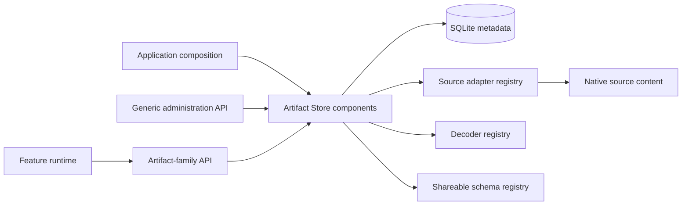
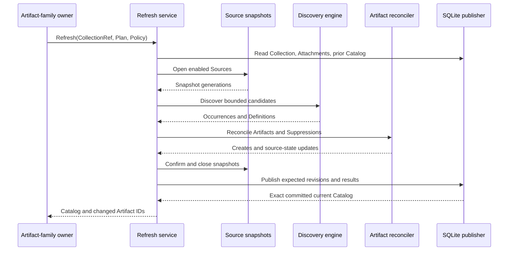

# Artifact Store High-Level Design

## 1. Document status and authority

This document describes the implemented Artifact Store architecture as:

- This HLD defines architectural intent, ownership boundaries, protocols, invariants, and change gates.
- Implemented code, persisted schemas, registered codecs, and exposed API contracts define current operational behavior.
- A discrepancy between this HLD and implementation must be resolved explicitly. It must not become an undocumented compatibility rule.

## 2. Terminology

### 2.1 Artifact family

An artifact family is an application feature that owns one or more Collection kinds, Artifact kinds, document schemas, discovery policies, and runtime projections.

Current examples include:

- Workspace Collections and Workspace Context Artifacts.
- Skill Bundles and Agent Skill Artifacts.
- MCP Bundles, MCP Server Artifacts, and MCP Policy Artifacts.

An artifact family is also referred to in this document as an artifact owner.

There is no single `ArtifactOwner` Go interface. The role is expressed through several narrow protocols:

- `shareable.Codec`
- `discovery.Decoder`
- `artifact.Policy`
- `artifact.ArtifactIDProvider`
- Feature-owned planning and lifecycle services
- Feature-owned runtime resolvers

### 2.2 Source provider

A Source provider is an implementation of the Source adapter and snapshot protocols. It owns access to native source bytes.

Current implementations are:

- `fs-directory`
- `embedded-directory`
- `managed-directory`

### 2.3 Metadata provider

The metadata provider persists local control state and implements repository and publication ports.

The current metadata provider is SQLite.

### 2.4 Source content

Source content is the native byte representation exposed through a Source snapshot. It can be:

- External filesystem content.
- Embedded application content.
- Application-managed package content.

### 2.5 Definition

A Definition is a canonical semantic projection emitted by a decoder. It is not a copy of a source package and is not a runtime object.

### 2.6 Occurrence

An Occurrence is a Collection-specific observation of one decoded resource at:

```text
Collection + Source + Locator + SubresourceLocator
```

### 2.7 Artifact

An Artifact is a stable local record that adopts or pins one typed Source Binding. It combines local application-owned fields with source-derived state.

## 3. Intent

### 3.1 Problem statement

Application features need a common way to:

- Register local content namespaces.
- Attach byte-producing Sources to feature-owned Collections.
- Discover and decode source content safely.
- Preserve a coherent current view of discovered resources.
- Give selected resources stable local identity.
- Preserve local settings while source content changes.
- Author complete packages in application-managed storage.
- Validate supported portable documents.
- Install protected application-owned content.
- Resolve source-backed content safely at runtime.

These mechanics are common across artifact families, but the domain meaning of a Workspace, Skill, MCP Server, policy, or future artifact type is not common.

Artifact Store therefore provides generic control-plane and source-observation mechanics while artifact families retain semantic ownership.

### 3.2 Architectural outcomes

Artifact Store is intended to provide:

- Stable local identity independent of native file paths and content digests.
- Root-scoped topology and mutation policy.
- Extensible Source providers behind one snapshot protocol.
- Extensible decoders behind one discovery protocol.
- Current Catalog publication with optimistic concurrency.
- Separation of Catalog Occurrences from local Artifacts.
- Local adoption, pinning, suppression, and purge mechanics.
- Complete managed package publication.
- Shareable document schema dispatch and canonicalization.
- Protected topology installation and hydration coordination.
- Trusted source verification primitives for feature runtimes.

### 3.3 Actors and responsibilities

| Actor                   | Primary responsibility                                                                                                                  |
| ----------------------- | --------------------------------------------------------------------------------------------------------------------------------------- |
| Application composition | Select adapters, decoders, codecs, policies, clocks, protected Roots, and lifecycle ownership                                           |
| Artifact-family owner   | Define Collection and Artifact semantics, local data schemas, discovery plans, adoption policy, typed lifecycle, and runtime projection |
| Source provider         | Normalize private Source configuration and expose coherent snapshots of native bytes                                                    |
| Decoder author          | Recognize bounded candidates and emit canonicalizable semantic Definitions                                                              |
| Shareable codec author  | Validate and canonicalize one schema-qualified portable document                                                                        |
| Metadata provider       | Persist local state and enforce aggregate transaction and concurrency invariants                                                        |
| Runtime consumer        | Resolve an `ArtifactRef`, enforce feature policy, and materialize runtime state                                                         |
| Protected installer     | Install application-owned topology and packages under privileged composition control                                                    |
| Transport wrapper       | Expose generic or feature APIs without bypassing domain services                                                                        |

## 4. Scope

### 4.1 Supported content ownership modes

| Mode                        | Native-byte authority                                            | Local behavior                                                                                 |
| --------------------------- | ---------------------------------------------------------------- | ---------------------------------------------------------------------------------------------- |
| Linked external content     | External Source selected by the user or feature                  | Artifact Store observes and indexes content without copying it into managed storage            |
| Managed application content | Writable managed Source                                          | Complete package directories are written under application-owned storage                       |
| Protected built-in content  | Embedded application packages materialized by trusted installers | Packages are installed into a protected managed Source and reconciled through normal discovery |

The `embedded-directory` adapter is a generic capability. It is usable only for providers supplied by application composition. The current application composition does not configure general embedded providers for ordinary user Sources.

### 4.2 Explicit non-goals

The current implementation does not provide:

- Artifact or Collection import and export.
- Portable archive generation or extraction.
- Generic package, tree, or blob content-addressed storage.
- Generic content-closure generation.
- Source-independent snapshots of linked content.
- Offline fallback for unavailable linked files.
- Generic URI or network acquisition.
- Generic dependency acquisition or dependency resolution.
- Import provenance records.
- Cross-Root transfer.
- Direct Artifact movement between Collections.
- A generic persisted shareable-document repository.
- Catalog history.
- Generic secret storage or secret resolution.
- Generic process or runtime-session management.
- Automatic deletion of arbitrary linked source content.
- A distributed transaction spanning Source storage and SQLite metadata.

Any addition to these areas requires an HLD amendment.

## 5. Requirements hierarchy

All requirements in this section describe current design intent. Implementation mapping is provided later in this document.

### 5.1 `AS-R01`: Preserve ownership and semantic boundaries

Intent: Artifact Store must remain a generic local content control plane rather than becoming a second implementation of each feature domain.

| ID         | Subrequirement                                                                                                                               |
| ---------- | -------------------------------------------------------------------------------------------------------------------------------------------- |
| `AS-R01.1` | Local Root, Source, Collection, and Artifact identity must remain outside source-owned and shareable documents.                              |
| `AS-R01.2` | Artifact families must own Collection kinds, Artifact kinds, document semantics, local data schemas, discovery policy, and runtime behavior. |
| `AS-R01.3` | Source providers must own native byte access and provider-specific configuration.                                                            |
| `AS-R01.4` | Runtime handles, sessions, processes, native paths, and registrations must remain outside durable Artifact identity.                         |
| `AS-R01.5` | Definitions must be semantic projections, not native package backups or generic content-addressed objects.                                   |
| `AS-R01.6` | Generic services must validate structural invariants without interpreting feature-specific local JSON data.                                  |

### 5.2 `AS-R02`: Provide local topology, identity, and lifecycle

Intent: All local entities must participate in an explicit topology with stable identity and guarded lifecycle transitions.

| ID         | Subrequirement                                                                                                         |
| ---------- | ---------------------------------------------------------------------------------------------------------------------- |
| `AS-R02.1` | A Root must define a local namespace, storage namespace, and mutation-policy boundary.                                 |
| `AS-R02.2` | Sources and Collections must belong to exactly one Root.                                                               |
| `AS-R02.3` | Collection Attachments must reference Sources in the same Root.                                                        |
| `AS-R02.4` | Root, Source, Collection, and Artifact IDs must be caller or feature supplied UUIDv7 values.                           |
| `AS-R02.5` | Entity creation must start at revision one with UTC creation and modification timestamps.                              |
| `AS-R02.6` | Mutable local operations must use expected revisions and must not silently overwrite concurrent changes.               |
| `AS-R02.7` | Root, Source, and Collection retirement must preserve metadata while removing the entity from ordinary active reads.   |
| `AS-R02.8` | Root, Source, and Collection purge must require the entity to be retired and must enforce child-reference constraints. |
| `AS-R02.9` | Application composition must be able to distinguish protected Roots from retained Roots.                               |

### 5.3 `AS-R03`: Abstract native storage through Sources

Intent: Artifact Store consumers must operate on native content through a bounded Source protocol rather than provider-specific filesystem access.

| ID         | Subrequirement                                                                                                                   |
| ---------- | -------------------------------------------------------------------------------------------------------------------------------- |
| `AS-R03.1` | Every Source kind must be registered through a unique `source.Adapter`.                                                          |
| `AS-R03.2` | Source configuration must be normalized by its adapter before persistence.                                                       |
| `AS-R03.3` | Full Source configuration must remain available only through trusted internal runtime ports.                                     |
| `AS-R03.4` | Normal administration reads must return `source.Summary` and must not expose private configuration.                              |
| `AS-R03.5` | A Source snapshot must expose generation, stat, directory enumeration, bounded file opening, confirmation, and close operations. |
| `AS-R03.6` | Snapshot generations must act as source-owned concurrency tokens.                                                                |
| `AS-R03.7` | Optional native-path, managed-package, bootstrap, and managed-root capabilities must be advertised through separate interfaces.  |
| `AS-R03.8` | Source providers must own provider-specific traversal, link, path, and publication behavior.                                     |

### 5.4 `AS-R04`: Support feature-owned Collections and Attachments

Intent: Collections must provide local aggregate boundaries without forcing one generic feature model.

| ID         | Subrequirement                                                                                                   |
| ---------- | ---------------------------------------------------------------------------------------------------------------- |
| `AS-R04.1` | A Collection must have a feature-owned kind, local display metadata, enablement, and opaque canonical JSON data. |
| `AS-R04.2` | An Attachment must join one Collection to one same-Root Source with a feature-owned role and opaque local data.  |
| `AS-R04.3` | One Source must be attachable to multiple Collections in the same Root.                                          |
| `AS-R04.4` | An enabled Attachment must not reference a disabled Source.                                                      |
| `AS-R04.5` | Disabling a Source must be rejected while active Collections retain enabled Attachments to it.                   |
| `AS-R04.6` | Attachment creation, update, replacement, and deletion must advance the owning Collection revision atomically.   |
| `AS-R04.7` | An Attachment must not be detached while Collection Artifacts or Suppressions still reference its Source.        |
| `AS-R04.8` | Generic transport APIs must not expose untyped Collection mutation as a substitute for feature services.         |

### 5.5 `AS-R05`: Discover source content and publish a coherent current Catalog

Intent: Feature-selected discovery must result in one validated and coherent current view per Collection.

| ID          | Subrequirement                                                                                                                                                       |
| ----------- | -------------------------------------------------------------------------------------------------------------------------------------------------------------------- |
| `AS-R05.1`  | Artifact-family owners must provide a validated discovery plan for every enabled Source Attachment participating in refresh.                                         |
| `AS-R05.2`  | Discovery plans must define scope, decoder eligibility, optional decoder hints, authority, expected content, expected generation, and safety limits.                 |
| `AS-R05.3`  | Discovery execution must be deterministic for equivalent Source snapshots, plans, decoder sets, and policy inputs.                                                   |
| `AS-R05.4`  | Candidate reads must be bounded by entry count, traversal depth, candidate size, total bytes, and context cancellation.                                              |
| `AS-R05.5`  | Decoder selection must reject ambiguous highest-priority recognition.                                                                                                |
| `AS-R05.6`  | Decoders must not emit duplicate resources at the same locator and subresource locator.                                                                              |
| `AS-R05.7`  | Valid decoded output must be canonicalized into a `definition.Definition` before publication.                                                                        |
| `AS-R05.8`  | A current Catalog must record Collection, Attachment, and Source revisions, enabled Source generations, plan and decoder fingerprints, diagnostics, and Occurrences. |
| `AS-R05.9`  | Valid, invalid, and missing Occurrences must remain distinct from local Artifacts.                                                                                   |
| `AS-R05.10` | The current canonical Definition must be cached with its valid current Occurrence.                                                                                   |
| `AS-R05.11` | Replacing the current Catalog must also atomically apply source-derived Artifact creates and updates.                                                                |
| `AS-R05.12` | A stale Catalog must remain readable for diagnostics and refresh reconciliation.                                                                                     |

### 5.6 `AS-R06`: Preserve stable local Artifact identity

Intent: Local identity and user policy must survive source changes.

| ID          | Subrequirement                                                                                                                          |
| ----------- | --------------------------------------------------------------------------------------------------------------------------------------- |
| `AS-R06.1`  | Persistent Artifact references must use `artifact.ArtifactRef`, consisting of Root ID and Artifact ID.                                  |
| `AS-R06.2`  | Every Artifact must retain a typed `artifact.SourceBinding`.                                                                            |
| `AS-R06.3`  | Local Artifact fields and source-derived fields must have separate writers.                                                             |
| `AS-R06.4`  | Local updates must preserve binding, kind, adoption mode, source state, and creation identity.                                          |
| `AS-R06.5`  | Source reconciliation must preserve Artifact ID, Collection, name, enablement, adoption mode, and local data.                           |
| `AS-R06.6`  | Manual adoption must require a valid current Occurrence and expected Catalog revision.                                                  |
| `AS-R06.7`  | Pinning must permit a typed binding to exist before valid source content is available.                                                  |
| `AS-R06.8`  | Automatic adoption must be controlled by an artifact-family-supplied `artifact.Policy`.                                                 |
| `AS-R06.9`  | A kind change at the same physical Source occurrence must make an existing Artifact incompatible rather than silently replacing it.     |
| `AS-R06.10` | Suppression must prevent creation or automatic re-adoption of the exact typed Source Binding.                                           |
| `AS-R06.11` | Unadoption and purge must remove only local Artifact metadata unless a feature invokes a separate source-side managed-content workflow. |
| `AS-R06.12` | Direct Artifact move must remain unsupported.                                                                                           |

### 5.7 `AS-R07`: Enforce concurrency and transaction boundaries

Intent: Concurrent metadata and Source changes must be detected rather than silently merged.

| ID         | Subrequirement                                                                                                                |
| ---------- | ----------------------------------------------------------------------------------------------------------------------------- |
| `AS-R07.1` | Mutable metadata operations must use positive expected revisions.                                                             |
| `AS-R07.2` | Catalog publication must compare the expected prior Catalog revision.                                                         |
| `AS-R07.3` | Catalog publication must compare Collection, Attachment, and Source revisions.                                                |
| `AS-R07.4` | Refresh must confirm Source snapshots after decoding and policy work and before metadata publication.                         |
| `AS-R07.5` | Managed Source mutations must use Source revision and snapshot generation tokens.                                             |
| `AS-R07.6` | Metadata publication must be atomic within SQLite.                                                                            |
| `AS-R07.7` | Source-side package publication and SQLite revision acknowledgement must remain separate operations.                          |
| `AS-R07.8` | Create replay must use caller-supplied identity and current creation-intent comparison rather than a generic idempotency key. |
| `AS-R07.9` | No operation may claim atomicity across external Sources and SQLite.                                                          |

### 5.8 `AS-R08`: Support complete managed package publication

Intent: Application-managed content must use semantic complete-package operations rather than arbitrary public file edits.

| ID          | Subrequirement                                                                                                                                                    |
| ----------- | ----------------------------------------------------------------------------------------------------------------------------------------------------------------- |
| `AS-R08.1`  | A managed package must be addressed as `<kind>/<name>/<version>`.                                                                                                 |
| `AS-R08.2`  | Artifact families must own package-kind values and package-internal filename conventions.                                                                         |
| `AS-R08.3`  | Managed files must use bounded portable relative locators.                                                                                                        |
| `AS-R08.4`  | Publication must reject duplicate paths, portable case collisions, reserved names, file-directory conflicts, excessive files, and excessive bytes.                |
| `AS-R08.5`  | A writable adapter must publish or replace one complete package directory.                                                                                        |
| `AS-R08.6`  | Equivalent package publication must be replayable without duplicating package state.                                                                              |
| `AS-R08.7`  | A changed package generation must advance Source metadata revision.                                                                                               |
| `AS-R08.8`  | Managed Artifact orchestration must be able to publish, refresh, and verify a pinned Artifact against an expected Definition digest.                              |
| `AS-R08.9`  | Managed Artifact removal must remove the package, refresh the Collection, verify that the pinned Artifact became missing, and then purge local Artifact metadata. |
| `AS-R08.10` | Protected managed package operations must require the trusted installer path.                                                                                     |

### 5.9 `AS-R09`: Validate shareable schema documents

Intent: Supported portable documents must enter through a schema-qualified canonicalization boundary.

| ID         | Subrequirement                                                                                              |
| ---------- | ----------------------------------------------------------------------------------------------------------- |
| `AS-R09.1` | A shareable schema must be identified by entity type, kind, schema ID, and schema version.                  |
| `AS-R09.2` | Registered codecs must have unique schema keys.                                                             |
| `AS-R09.3` | Published JSON Schemas must be compiled during composition.                                                 |
| `AS-R09.4` | Canonicalization must validate the JSON Schema before invoking the selected codec.                          |
| `AS-R09.5` | Codec output must be canonical JSON, satisfy the same schema, and contain matching key and digest metadata. |
| `AS-R09.6` | Feature entry points expecting a known schema must use `CanonicalizeExpected`.                              |
| `AS-R09.7` | Canonicalization must not imply persistence, acquisition, import, or local entity creation.                 |
| `AS-R09.8` | Artifact entity codecs may be registered without creating a generic shareable Artifact repository.          |

### 5.10 `AS-R10`: Provide safe runtime handoff

Intent: Runtime consumers must resolve current local identity and verify native source state without bypassing Source protocols.

| ID         | Subrequirement                                                                                                   |
| ---------- | ---------------------------------------------------------------------------------------------------------------- |
| `AS-R10.1` | Runtime resolution must begin from `artifact.ArtifactRef`, not a path, digest, Catalog index, or process handle. |
| `AS-R10.2` | Feature runtimes must verify Collection and Artifact type, state, enablement, and feature policy.                |
| `AS-R10.3` | Native bytes must be read through Source snapshots with bounded size and generation confirmation.                |
| `AS-R10.4` | Exact source-byte consumers must verify the recorded source-content digest.                                      |
| `AS-R10.5` | Native paths may be resolved only through adapters explicitly implementing local-path capability.                |
| `AS-R10.6` | Snapshot reuse must serialize operations when adapters do not promise concurrent snapshot access.                |
| `AS-R10.7` | Artifact Store must never execute discovered content during discovery or reconciliation.                         |
| `AS-R10.8` | Runtime state must be ephemeral and rebuildable from Artifact Store and feature-owned state.                     |

### 5.11 `AS-R11`: Protect application-owned topology

Intent: Built-in topology must be installed by application composition without assigning product semantics to generic Artifact Store services.

| ID          | Subrequirement                                                                                                         |
| ----------- | ---------------------------------------------------------------------------------------------------------------------- |
| `AS-R11.1`  | Application policy must declare protected and retained Root sets.                                                      |
| `AS-R11.2`  | Ordinary mutation of protected Roots and descendants must be rejected.                                                 |
| `AS-R11.3`  | Retirement and purge of retained Roots must be rejected while ordinary descendant mutation remains allowed.            |
| `AS-R11.4`  | Protected topology installation must require privileged installer context.                                             |
| `AS-R11.5`  | Generic topology declarations must contain only Root and Source metadata.                                              |
| `AS-R11.6`  | Artifact-family installers must own Collections, Artifacts, package semantics, package bytes, and refresh policy.      |
| `AS-R11.7`  | Hydration comparison must be prepared as a batch so installers sharing a Root are invalidated together.                |
| `AS-R11.8`  | Stale hydration reset must remove managed Root content before purging Root metadata.                                   |
| `AS-R11.9`  | Hydration markers must survive reset until complete replacement installation succeeds.                                 |
| `AS-R11.10` | Final Catalog reconciliation must run after all installers sharing managed Sources have completed package publication. |

### 5.12 `AS-R12`: Maintain explicit composition and API boundaries

Intent: Extension protocols, domain services, persistence, and transport must remain separately replaceable.

| ID         | Subrequirement                                                                                                                                               |
| ---------- | ------------------------------------------------------------------------------------------------------------------------------------------------------------ |
| `AS-R12.1` | Domain packages must define repository and service ports without depending on SQLite.                                                                        |
| `AS-R12.2` | `system.Open` must compose adapters, decoders, codecs, repositories, services, and policies.                                                                 |
| `AS-R12.3` | Artifact-family services must consume narrow domain ports rather than SQLite implementation details.                                                         |
| `AS-R12.4` | Generic administration transport must expose only generic Root, Source, Source-kind, and managed Source package behavior.                                    |
| `AS-R12.5` | Mutable slices, maps, JSON, Definitions, diagnostics, and snapshots returned across service boundaries must be caller-owned or explicitly lifecycle-managed. |
| `AS-R12.6` | The API wrapper must not own the lifecycle of supplied `system.Components`.                                                                                  |
| `AS-R12.7` | The current unreleased schema must require a compatible store layout and does not promise migration from prior development layouts.                          |

### 5.13 `AS-R13`: Keep unsupported transfer and execution features out of scope

| ID         | Subrequirement                                                                                                            |
| ---------- | ------------------------------------------------------------------------------------------------------------------------- |
| `AS-R13.1` | Artifact Store must not implement generic import, export, archive, closure, or provenance protocols without a new design. |
| `AS-R13.2` | Artifact Store must not use a generic package or Definition CAS as an implicit linked-content backup.                     |
| `AS-R13.3` | Artifact Store must not acquire arbitrary network or URI content.                                                         |
| `AS-R13.4` | Artifact Store must not provide generic dependency resolution.                                                            |
| `AS-R13.5` | Artifact Store must not own feature runtime processes, credentials, or secret semantics.                                  |
| `AS-R13.6` | Artifact Store must not provide direct Artifact move or cross-Root transfer.                                              |

## 6. Architecture overview

### 6.1 System context



### 6.2 Architectural planes

| Plane                | Contents                                                                                                                        | Authority                                       |
| -------------------- | ------------------------------------------------------------------------------------------------------------------------------- | ----------------------------------------------- |
| Local control plane  | Roots, Sources, Collections, Attachments, Catalogs, Occurrences, cached Definitions, Artifacts, Suppressions, hydration markers | SQLite through Artifact Store services          |
| Native content plane | Linked files, embedded files, managed package files                                                                             | Selected Source provider                        |
| Protocol plane       | Source adapters, decoders, artifact policies, schema codecs, Root policies                                                      | Application composition and artifact families   |
| Installation plane   | Protected topology declarations, static IDs, package scopes, hydration fingerprints                                             | Application composition and built-in installers |
| Runtime plane        | Resolved paths, sessions, process handles, prompts, registrations, provider state                                               | Feature runtime services                        |

There is no independent durable Definition plane. Canonical Definitions are persisted as part of current valid Occurrences.

### 6.3 Aggregate hierarchy

```text
Root
  Sources
  Collections
    Attachments -> Sources in the same Root
    Current Catalog
      Current Occurrences
        Optional current cached Definition
    Artifacts
      Source Binding -> attached Source
    Suppressions
      Source Binding -> attached Source
```

Relationships are Root-scoped, but current SQLite primary keys make Root, Source, Collection, and Artifact IDs globally unique within one store.

### 6.4 Ownership of mutable fields

| State                                                                                        | Writer                                             |
| -------------------------------------------------------------------------------------------- | -------------------------------------------------- |
| Root display metadata and lifecycle                                                          | `root.Service`                                     |
| Source display metadata, enablement, private config, lifecycle, and revision acknowledgement | `source.Service`                                   |
| Source native bytes and generation                                                           | Source adapter                                     |
| Collection display metadata, enablement, local data, and lifecycle                           | Artifact-family owner through `collection.Service` |
| Attachment role, enablement, and local data                                                  | Artifact-family owner through `collection.Service` |
| Discovery plan                                                                               | Artifact-family owner                              |
| Occurrences and cached Definitions                                                           | Discovery and refresh                              |
| Artifact ID, name, enablement, adoption mode, and local data                                 | Artifact-family owner through `artifact.Service`   |
| Artifact resolved Definition, source state, and diagnostics                                  | Refresh reconciliation                             |
| Suppressions                                                                                 | Artifact-family owner through `artifact.Service`   |
| Runtime state                                                                                | Feature runtime                                    |
| Protected topology declarations                                                              | Application composition                            |

## 7. Core model and state

### 7.1 Identity and value rules

- Root, Source, Collection, and Artifact IDs are UUIDv7 values.
- IDs are supplied by callers, features, static application registries, or an explicit `ArtifactIDProvider`.
- Artifact Store does not silently allocate IDs in entity services.
- Kinds, roles, decoder IDs, and storage keys use lowercase dotted or hyphenated identifiers.
- Generic locators are slash-separated relative paths.
- Portable locators apply additional cross-platform restrictions.
- Mutable opaque `Data` and `Config` values must be JSON objects within configured bounds.
- Revisions are positive integers.
- Timestamps are UTC and must not move backwards.

### 7.2 Root

A Root owns:

- A globally unique Root ID.
- A globally unique storage key.
- Display name and description.
- Revision and timestamps.
- Optional retirement state.
- Source and Collection descendants.
- Mutation and deletion policy classification.

A Root is not itself a portable Collection or package.

Root state transitions are:

```text
absent -> active -> retired -> purged
```

Rules:

- Create starts at revision one.
- Storage key and identity are immutable.
- Update changes display name or description.
- Retirement requires no active Source or Collection descendants.
- Purge requires the Root to be retired and to have no active descendants.
- Retired descendants may be removed by Root purge through metadata cascade.
- A protected Root rejects ordinary mutation.
- A retained Root rejects only Root retirement and purge.

### 7.3 Source

A Source stores:

- Source ID and Root ID.
- A copy of the Root storage key.
- Source storage key.
- Source kind.
- Display name and enabled state.
- Private normalized configuration.
- Revision and timestamps.
- Optional retirement state.

`source.Summary` omits private configuration.

Source state transitions are:

```text
absent -> active enabled or active disabled -> retired -> purged
```

A special compensation transition also exists:

```text
new active unattached Source -> discarded
```

Rules:

- Kind, Root, storage keys, and identity are immutable after creation.
- Updating configuration replaces it only when a non-nil replacement is supplied.
- A nil update configuration preserves the existing normalized configuration.
- A Source cannot be disabled while active Collections retain enabled Attachments to it.
- Retirement disables the Source and requires no Attachments from active Collections.
- Purge requires retirement.
- `Discard` is limited to active unattached Sources and exists for failed higher-level provisioning.
- Managed Source content changes advance Source revision through `MarkContentChanged`.

### 7.4 Collection

A Collection stores:

- Collection ID and Root ID.
- Feature-owned Collection kind.
- Display name and description.
- Enabled state.
- Opaque canonical local JSON data.
- Revision and timestamps.
- Optional retirement state.

Collection state transitions are:

```text
absent -> active enabled or active disabled -> retired -> purged
```

Rules:

- Kind, Root, and identity are immutable.
- Initial Collection and Attachment creation is one metadata transaction.
- Membership changes advance the Collection revision.
- Retirement disables the Collection.
- Retired Collections are excluded from ordinary readers.
- `GetRetired` is a separate lifecycle capability used by typed purge workflows.
- Purge requires retirement.

### 7.5 Attachment

An Attachment stores:

- Root and Collection identity.
- Source identity.
- Feature-owned role.
- Enabled state.
- Opaque canonical local JSON data.
- Revision and timestamps.

Rules:

- Source and Collection must share a Root.
- At most one Attachment exists for a given Collection and Source.
- An enabled Attachment requires an enabled Source.
- Attachment mutation and Collection revision advancement occur in one transaction.
- Detach and replacement require expected Collection and Attachment revisions.
- Detach and replacement are blocked while Artifacts or Suppressions use the prior Source.

### 7.6 Catalog

A Catalog is the single current published discovery snapshot for one Collection.

It records:

- Root and Collection identity.
- Catalog revision.
- Collection revision.
- Attachment revisions.
- Source revisions.
- Generations for enabled Source and Attachment pairs.
- Discovery-plan fingerprint.
- Decoder-registry fingerprint.
- Publication time.
- Aggregate diagnostics.
- Current Occurrences.

The Catalog is current relative to persisted Collection, Attachment, and Source metadata at the time it is read.

`catalog.Reader.GetCurrent` may return:

- A valid current Catalog with no error.
- A valid stale Catalog with an error wrapping `ErrCatalogStale`.
- `ErrCatalogUnavailable` when no Catalog has been published.

Catalog staleness is currently detected from:

- Collection revision mismatch.
- Attachment revision mismatch.
- Source revision mismatch.

Catalog reads do not automatically compare:

- A feature's newly desired plan fingerprint.
- The currently composed decoder fingerprint.
- External filesystem content that changed without a Source metadata update.

Artifact-family services may compare plan and decoder fingerprints when deciding whether to refresh.

### 7.7 Occurrence

An Occurrence is identified by:

```text
OccurrenceKey {
  CollectionID
  SourceID
  Locator
  SubresourceLocator
}
```

Occurrence states are:

| State     | Meaning                                                                                                                         |
| --------- | ------------------------------------------------------------------------------------------------------------------------------- |
| `valid`   | The candidate was decoded successfully and has a canonical Definition, Definition digest, source-content digest, and decoder ID |
| `invalid` | The candidate or decoded resource was observed but could not produce an acceptable Definition                                   |
| `missing` | A previously known candidate or subresource is absent or no longer recognized within authoritative scope                        |

A new unrecognized candidate may produce no Occurrence. A previously known resource at that locator becomes missing when it is observed but no decoder recognizes it.

A valid Occurrence must contain:

- Artifact kind.
- Logical name and optional logical version.
- Definition digest.
- Cached canonical Definition.
- Exact candidate source-content digest.
- Decoder ID.
- Observation timestamp.

A non-valid Occurrence cannot retain a cached Definition.

### 7.8 Definition

A Definition contains:

- Digest.
- Artifact kind.
- Schema ID and schema version.
- Logical name and optional version.
- Display metadata and labels.
- Canonical JSON body.
- Optional generic dependency selectors.

Definition canonicalization:

1. Canonicalizes the body as a bounded JSON object.
2. Validates metadata and dependency selectors.
3. Computes a digest over the semantic payload, excluding the `Digest` field.
4. Verifies a supplied digest when present.
5. Returns an owned canonical value.

Current persistence behavior:

- The Definition is cached in `artifact_current_occurrences.definition_json`.
- It is keyed operationally by the Occurrence, not by digest.
- Catalog replacement replaces the Definition cache.
- There is no lookup API that retrieves arbitrary Definitions by digest.
- There is no Definition history.
- There is no root-scoped Definition CAS.

### 7.9 Artifact

An Artifact stores:

- Artifact ID.
- Root and Collection identity.
- Source Binding.
- Artifact kind.
- Local name.
- Local enabled state.
- Adoption mode.
- Local opaque canonical JSON data.
- Resolved Definition digest when permitted by source state.
- Source-derived state and diagnostics.
- Revision and timestamps.

Persistent reference:

```text
ArtifactRef {
  RootID
  ArtifactID
}
```

Source Binding:

```text
SourceBinding {
  SourceID
  Locator
  SubresourceLocator
  ExpectedKind
}
```

`ExpectedKind` must equal the Artifact kind.

Artifact adoption modes are:

| Mode       | Meaning                                                                                     |
| ---------- | ------------------------------------------------------------------------------------------- |
| `observed` | Created from a valid current Occurrence, manually or by refresh policy                      |
| `pinned`   | Created for an expected typed Source Binding, whether or not valid content currently exists |

Artifact source states are:

| State          | Resolved Definition | Meaning                                                                      |
| -------------- | ------------------- | ---------------------------------------------------------------------------- |
| `available`    | Required            | A valid current Occurrence matches the Artifact kind                         |
| `missing`      | Forbidden           | No current matching Occurrence is available                                  |
| `invalid`      | Forbidden           | The current physical occurrence is invalid                                   |
| `incompatible` | Required            | A valid occurrence exists at the same physical location but has another kind |

Physical source identity deliberately excludes expected kind:

```text
SourceID + Locator + SubresourceLocator
```

This prevents a source kind change from causing the old Artifact to become missing while a new Artifact is automatically created at the same physical location.

### 7.10 Suppression

A Suppression stores:

- Root and Collection identity.
- Exact typed Source Binding.
- Revision and timestamps.

A Suppression:

- Does not alter Source content.
- Prevents Artifact insertion for the same typed binding.
- Prevents automatic adoption for the same typed binding.
- Can be created directly or atomically with unadoption or purge.
- Can be removed with an expected suppression revision.

### 7.11 Managed package

A managed package address is:

```text
ManagedPackageAddress {
  Kind
  Name
  Version
}
```

Its Source-relative directory is:

```text
<kind>/<name>/<version>
```

A package is a non-empty set of regular files relative to that directory.

Artifact Store owns the address shape and portable path safety. Artifact families own:

- Package kind values.
- Name and version meaning.
- Primary document names.
- Package resource conventions.
- Relationship between package files and Artifacts.

## 8. Protocols

## 8.1 Artifact-family owner protocol

An artifact-family owner uses Artifact Store through a combination of registration-time and runtime protocols.

### 8.1.1 Registration phase

An artifact family may provide:

- One or more Collection-kind constants.
- One or more Artifact-kind constants.
- `shareable.Codec` implementations for supported portable documents.
- `discovery.Decoder` implementations.
- Optional shareable-schema binding on decoders.
- An `artifact.ArtifactIDProvider` for automatic adoption.
- Feature-owned Root or protected topology declarations when applicable.

Application composition registers codecs and decoders through `system.Config`.

Artifact Store validates kind syntax and duplicate registrations. It does not maintain a semantic registry of Collection or Artifact kinds.

### 8.1.2 Local model phase

The artifact family defines:

- The schema of `collection.Collection.Data`.
- The schema of `collection.Attachment.Data`.
- The schema of `artifact.Artifact.Data`.
- Attachment roles.
- Default names and enablement.
- Typed lifecycle rules.
- Which Source kinds are acceptable.
- Whether Sources are linked, managed, or protected.
- Which Artifacts are runtime-consumable.

Generic services validate only that local data is a bounded JSON object.

### 8.1.3 Collection provisioning phase

The artifact family:

1. Ensures or selects a Root.
2. Creates or selects Sources.
3. Creates a typed Collection.
4. Creates Attachments with feature-owned roles and data.
5. Uses expected revisions for later topology changes.

The feature must not persist paths as Artifact identity. Paths belong in private Source configuration or Source Bindings as source-relative locators.

### 8.1.4 Discovery phase

For refresh, the artifact family provides:

- One `discovery.SourcePlan` for every enabled Source and Attachment pair.
- A plan revision representing feature discovery-policy identity.
- Decoder allow lists and hints where needed.
- Optional expected source-content digests.
- An `artifact.Policy` for automatic adoption.

The artifact family must change plan revision when planning behavior changes in a way that can affect scope, decoder eligibility, or interpretation.

### 8.1.5 Artifact phase

The artifact family uses `artifact.Service` to:

- Adopt a valid Occurrence.
- Pin an expected binding.
- Set local name.
- Set local enablement.
- Replace local data.
- Suppress or unsuppress a binding.
- Unadopt an observed Artifact.
- Purge local Artifact metadata.
- Purge and suppress atomically.

The feature must validate expected Collection and Artifact kinds before presenting domain-specific behavior.

### 8.1.6 Managed authoring phase

For managed content, the artifact family may use `managedartifact.Service` to:

- Publish a complete package for a Collection.
- Publish a package expected to resolve one pinned Artifact.
- Refresh after source-side change.
- Verify an expected Definition digest.
- Remove a package and clean up the pinned Artifact.

Package interpretation remains feature-owned.

### 8.1.7 Runtime phase

A runtime integration:

1. Accepts an `ArtifactRef`.
2. Loads the Artifact.
3. Verifies Collection and Artifact kinds.
4. Applies local and feature-specific enablement.
5. Requires an acceptable Artifact source state.
6. Reads the current Catalog or cached Definition where required.
7. Verifies native Source generation and content digest when native bytes are required.
8. Materializes ephemeral runtime state.
9. Stores no runtime handle back into Artifact identity.

### 8.1.8 Dependency restrictions

Artifact-family owners may depend on:

- `root`
- `source`
- `collection`
- `catalog`
- `artifact`
- `definition`
- `diagnostic`
- `discovery`
- `refresh`
- `managedartifact`
- `shareable`
- Narrow capabilities exposed by `system.Components`

Artifact-family owners must not depend directly on:

- `artifactstore/sqlite`
- Managed adapter filesystem paths.
- Private Source configuration through public summaries.
- Wails transport wrappers as domain services.
- Internal SQLite tables or triggers.

## 8.2 Source provider protocol

### 8.2.1 Base adapter contract

Every Source provider implements:

- `Kind()`
- `NormalizeConfig(ctx, raw)`
- `Open(ctx, source)`

`NormalizeConfig` must:

- Validate provider-specific configuration.
- Reject unsupported or unknown values as appropriate.
- Return owned canonical JSON.
- Avoid exposing normalized secrets through summaries.

`Open` must:

- Validate Source kind and configuration.
- Return a non-nil snapshot.
- Return a valid non-empty generation.
- Return a snapshot whose lifecycle belongs to the caller.

### 8.2.2 Snapshot contract

A `source.Snapshot` exposes:

- `Generation`
- `Stat`
- `ReadDir`
- `Open`
- `Confirm`
- `Close`

Provider obligations:

- Locators are source-relative.
- `Stat` returns the exact requested locator.
- `ReadDir` returns direct children only.
- Directory results must not contain duplicate locators.
- Entries must identify exactly one of directory or regular file.
- `Open` must reject non-regular content.
- `Confirm` must fail when the provider can determine that the Source changed from the opened generation.
- Methods must respect context cancellation.
- The snapshot must reject use after `Close`.

Consumer obligations:

- Validate and bound traversal.
- Close readers returned by `Open`.
- Confirm snapshots before relying on a multi-step read.
- Close snapshots on success and failure.
- Not assume snapshot methods are concurrently safe.

### 8.2.3 Optional capabilities

| Interface                          | Capability                                                        |
| ---------------------------------- | ----------------------------------------------------------------- |
| `source.LocalPathResolver`         | Resolve a source-relative locator to a trusted native local path  |
| `source.LocalPathCapability`       | Advertise Source kinds supporting native paths                    |
| `source.ManagedPackageWriter`      | Publish and remove complete semantic package directories          |
| `source.ManagedSourceBootstrapper` | Establish and discard empty adapter-owned managed Source storage  |
| `source.ManagedRootRemover`        | Remove all managed Source storage below an application-owned Root |

Optional capabilities are not inferred from Source kind strings by consumers.

### 8.2.4 Current Source providers

| Provider             | Behavior                                                                                                                                                        |
| -------------------- | --------------------------------------------------------------------------------------------------------------------------------------------------------------- |
| `fs-directory`       | Reads an absolute configured directory, computes a tree generation, supports local paths, applies traversal exclusions                                          |
| `embedded-directory` | Reads a composition-provided `fs.FS`, computes a content generation, has no native local-path capability                                                        |
| `managed-directory`  | Stores package trees under Artifact Store content storage, supports local paths, bootstrap, complete package writing, package removal, and managed Root removal |

The filesystem adapter uses normal operating-system traversal semantics. Its lexical containment checks do not turn an approved Source root into a general symlink sandbox. Source selection and feature runtime policy remain responsible for deciding which external roots are trusted.

## 8.3 Decoder protocol

A decoder implements:

- Stable decoder ID.
- Stable implementation revision.
- Recognition.
- Decoding.

Recognition levels are:

- `RecognitionNone`
- `RecognitionPossible`
- `RecognitionPreferred`

Selection rules:

1. Only allowed decoders are considered when a plan supplies an allow list.
2. Every candidate is passed to registered eligible decoders.
3. The highest recognition level wins.
4. Equal non-zero highest recognition is an ambiguity.
5. Invalid recognition values are contract violations.
6. A new unrecognized candidate creates no valid Occurrence.
7. A previously known candidate that becomes unrecognized is marked missing.

A decoder receives an owned `discovery.Candidate` containing:

- Source ID and kind.
- Locator.
- Exact source-content digest.
- Bounded candidate bytes.
- Requested decoder IDs derived from plan hints.

A decoder returns:

- Zero or more decoded resources.
- Candidate-level diagnostics.
- Per-resource diagnostics.

A decoded resource contains:

- Optional subresource locator.
- Definition candidate.
- Diagnostics.

Decoder obligations:

- Do not execute content.
- Do not mutate shared input.
- Do not emit duplicate subresource locators for one candidate.
- Keep diagnostic locations within the candidate and emitted subresource.
- Represent content-specific failures as diagnostics.
- Emit Definitions that can pass generic canonicalization.

The discovery engine, not the decoder, computes or verifies the canonical Definition digest.

## 8.4 Discovery-plan protocol

A `discovery.Plan` contains:

- Feature-owned plan revision.
- One `SourcePlan` per planned Source.

A `SourcePlan` contains:

- Source ID.
- Explicit locators.
- Directory roots.
- Include patterns.
- Decoder hints.
- Optional expected content digests.
- Optional expected Source generation.
- Allowed decoder IDs.
- Authoritative flag.
- Candidate and traversal limits.

Refresh requires:

- Every enabled Attachment and enabled Source pair to have a plan.
- Disabled pairs not to appear in the plan.
- Planned Sources to be attached to the Collection.
- Referenced decoders to exist in the registry.

Plan fingerprinting:

- Uses normalized deterministic plan data.
- Includes the feature-owned plan revision.
- Excludes expected Source generation because generation is a concurrency precondition, not discovery-policy identity.
- Sorts Source plans and relevant slices deterministically.

Authoritative behavior:

- If `Authoritative` is true, previously known in-scope resources not observed in the new scan become missing.
- If false, previous unobserved resources outside the new observation set can remain in the resulting source-specific occurrence set.
- A candidate explicitly read but no longer recognized makes its prior resources missing regardless of plan authority.

Expected content behavior:

- An expected locator outside scope is invalid.
- An expected locator absent from the snapshot causes refresh failure.
- A digest mismatch produces an invalid Occurrence and diagnostic.

## 8.5 Refresh and publication protocol

The refresh operation is the central synchronization protocol between Sources, Catalogs, and Artifacts.



Detailed sequence:

1. Validate context, Collection reference, plan, and adoption policy.
2. Require mutation permission for the Root.
3. Read the active enabled Collection.
4. Read all Attachments.
5. Read the prior current or stale Catalog when available.
6. Read each attached Source and capture Source and Attachment revisions.
7. Open snapshots for enabled Source and Attachment pairs.
8. Execute discovery using prior per-Source Occurrences as reconciliation input.
9. Read existing Artifacts and Suppressions.
10. Reconcile source-derived Artifact state and derive automatic Artifact creates.
11. Confirm all opened snapshots after decoding and policy work.
12. Close snapshots before publication.
13. Calculate plan and decoder fingerprints.
14. Build a `refresh.Publication`.
15. Publish Catalog, Occurrences, cached Definitions, Artifact creates, and source-state updates in one SQLite transaction.
16. Validate that the returned Catalog exactly matches the requested publication.

Publication preconditions include:

- Expected prior Catalog revision.
- Expected Collection revision.
- Exact Attachment revision map.
- Exact Source revision map.
- One generation for every currently enabled Source and Attachment pair.
- Valid plan and decoder fingerprints.
- Valid Occurrences.
- Valid Artifact creates and source-state updates.

The SQLite publisher cannot independently inspect external Source generations. Coherence is established by snapshot confirmation immediately before publication plus metadata revision checks inside the transaction.

An external Source can still change after confirmation and before or after commit. Consumers that require native bytes must use runtime generation and digest verification.

Publication failure leaves the prior Catalog and Artifact source state intact because the new state is committed in one SQLite transaction.

## 8.6 Artifact reconciliation protocol

For every existing Artifact, reconciliation finds the current Occurrence by physical identity:

```text
SourceID + Locator + SubresourceLocator
```

State derivation is:

| Current occurrence                  | Artifact result |
| ----------------------------------- | --------------- |
| No occurrence                       | `missing`       |
| `missing` occurrence                | `missing`       |
| `invalid` occurrence                | `invalid`       |
| Valid occurrence with matching kind | `available`     |
| Valid occurrence with another kind  | `incompatible`  |

Only these source-owned fields may change:

- `ResolvedDefinition`
- `State`
- `Diagnostics`
- `Revision`
- `ModifiedAt`

These local fields remain unchanged:

- Artifact ID.
- Root and Collection.
- Binding.
- Kind.
- Name.
- Enabled state.
- Adoption mode.
- Local data.
- Creation time.

Automatic adoption considers only:

- Valid Occurrences.
- Occurrences with a Definition and digest.
- Bindings not already represented.
- Physical locations not already represented by an Artifact of another kind.
- Bindings not suppressed.
- Positive decisions from `artifact.Policy`.
- Policy results without error diagnostics.
- Unique valid Artifact IDs.

The policy receives:

- Current Collection.
- Current Occurrence.
- Owned canonical Definition.

It returns:

- Artifact draft.
- Whether to create.
- Diagnostics.
- Error.

## 8.7 Adoption, pinning, suppression, and purge protocols

### Adoption

Manual adoption:

- Requires a mutable Root.
- Requires an active enabled Collection.
- Requires an attached Source.
- Requires a positive expected Catalog revision.
- Requires the expected Catalog to still be current.
- Requires a valid matching Occurrence and Definition digest.
- Creates an `observed` Artifact at revision one.

### Pinning

Pinning:

- Requires a mutable Root.
- Requires an active enabled Collection.
- Requires an attached Source.
- Requires expected Collection revision.
- Accepts a complete typed Source Binding.
- Creates a `pinned` Artifact.
- Uses current Catalog state when a current Catalog exists.
- Can begin missing when the Catalog is unavailable or stale.
- Reconciles normally after later refresh.

### Suppression

Suppression:

- Is scoped to Collection and exact typed Source Binding.
- Requires an attached Source.
- Requires expected Collection or suppression revision depending on operation.
- Blocks Artifact insertion for the exact binding.
- Can be created with observed Artifact unadoption.
- Can be created atomically with Artifact purge.

### Purge

Artifact purge:

- Requires expected Artifact revision.
- Deletes only local Artifact metadata.
- Does not delete linked bytes.
- Does not remove a managed package unless a feature invokes managed removal separately.
- Does not retain source-derived Definition content outside the current Catalog.

`PurgeAndSuppress` performs deletion and suppression insertion in one metadata transaction so refresh cannot observe an intermediate unsuppressed gap.

## 8.8 Managed Source package protocol

### 8.8.1 Package validation

Before publication:

- Address kind, name, and version are validated as portable names.
- At least one file is required.
- Every file locator is portable and relative.
- Duplicate exact paths are rejected.
- Case-insensitive portable collisions are rejected.
- File and directory path conflicts are rejected.
- Platform-reserved names are rejected.
- Trailing dots and spaces are rejected.
- Aggregate file count and byte limits are enforced.
- File content is copied into owned buffers.
- Files are sorted deterministically.

### 8.8.2 Source-side publication

Current managed layout:

```text
<artifact-store>/content/
  <root-storage-key>/
    <source-storage-key>/
      <package-kind>/
        <name>/
          <version>/
            <package files>
```

Staging is outside the published Source tree:

```text
<artifact-store>/staging/
  <root-storage-key>/
    <source-storage-key>/
      <temporary package directories>
```

The managed adapter:

1. Serializes managed package mutations within the adapter.
2. Compares existing package content for replay.
3. Requires expected generation for replacement.
4. Writes complete files into a staging directory.
5. Moves prior package content to staging during replacement.
6. Renames the staged package into the target location.
7. Attempts restoration if replacement fails.
8. Removes stale replaced content after successful publication.
9. Returns a confirmed resulting Source generation.

This is a staged package publication boundary, not a transaction with SQLite.

### 8.8.3 Metadata acknowledgement

`system.Components.PublishManagedPackage`:

1. Validates expected Source revision.
2. Reads and confirms the pre-publication generation.
3. Supplies that generation when the caller omitted it.
4. Invokes the managed writer.
5. Advances Source revision when resulting content generation changed.
6. Returns Source summary and resulting generation.

If source-side publication succeeds but Source revision update conflicts, the package can already be present. The caller must reload and retry. Equivalent package detection supports convergence.

### 8.8.4 Removal

Managed package removal:

1. Validates address, Source revision, and expected generation.
2. Confirms the current Source generation.
3. Removes the complete package directory through staging.
4. Prunes empty package parents.
5. Confirms the resulting generation.
6. Advances Source revision when content changed.

Removal is replayable when the package is already absent.

### 8.8.5 Managed Artifact orchestration

`managedartifact.Service` adds Artifact-aware guarantees:

- The target Artifact must be pinned.
- Its binding and revision must still match the caller's view.
- The Source must be attached to the owning Collection.
- Publication plans must include the managed Source.
- Publication can require the Artifact to resolve to an expected Definition digest after refresh.
- Removal refreshes and verifies the Artifact becomes missing before local purge.

`PublishCollection` performs generic complete package publication and optional Collection refresh without interpreting package content.

## 8.9 Shareable document protocol

### 8.9.1 Schema registration

A schema key contains:

```text
SchemaKey {
  Entity
  Kind
  SchemaID
  SchemaVersion
}
```

Supported entities are:

- `collection`
- `artifact`

Collection schema keys validate kinds as Collection kinds. Artifact schema keys validate kinds as Artifact kinds.

Each registered `shareable.Codec` provides:

- Schema key.
- Published JSON Schema bytes.
- Canonicalization implementation.

Registry creation:

- Rejects nil codecs.
- Rejects duplicate schema keys.
- Requires `$schema` and `$id`.
- Compiles each JSON Schema.
- Sorts registered keys deterministically.

### 8.9.2 Canonicalization

Canonicalization sequence:

1. Validate context.
2. Parse the input as one bounded JSON object.
3. Read kind, schema ID, and schema version.
4. Select the exact codec for the requested entity.
5. Validate input against the compiled JSON Schema.
6. Invoke the codec.
7. Validate the codec's returned schema key.
8. Validate output against the same JSON Schema.
9. Require output bytes to already be canonical JSON.
10. Require output header and digest to match `ParsedDocument` metadata.
11. Return an owned copy.

`CanonicalizeExpected` additionally requires the resulting key to equal the caller's expected schema key.

Artifact-family codecs own semantic validation and domain-specific digest calculation. The registry owns dispatch, schema execution, expected-key checking, and output enforcement.

Canonicalization does not:

- Persist the document.
- Create a Collection.
- Create an Artifact.
- Acquire referenced members.
- Resolve URIs.
- Publish a package.

### 8.9.3 Decoder binding

A decoder may optionally implement the internal shareable-schema binding capability. `system.Open` binds the composed registry before the decoder is used.

This permits a decoder to validate source-owned documents through the same registry instead of creating a second untrusted-document entry point.

## 8.10 Runtime source verification protocol

Artifact Store provides trusted primitives for runtime consumers.

### Confirm generation

`source.ConfirmSnapshotGeneration`:

- Opens a Source snapshot.
- Compares generation.
- Confirms the snapshot.
- Closes it.
- Joins confirmation and close failures.

### Read one bounded entry

`source.ReadSnapshotEntry`:

- Requires a valid regular `source.Entry`.
- Applies a maximum byte limit.
- Reads through the snapshot.
- Verifies read size equals the previously reported size.
- Returns owned bytes.

### Read one verified entry

`source.ReadVerifiedSnapshotEntry`:

- Opens a snapshot for an exact generation.
- Stats and reads the requested locator.
- Confirms the snapshot.
- Returns bytes and exact digest.
- Closes the snapshot.

### Verify exact content

`source.VerifySnapshotContentDigest`:

- Confirms generation.
- Reads bounded bytes.
- Computes the source-content digest.
- Rejects changed content.

### Resolve a verified native path

`source.ResolveVerifiedLocalPath`:

- Requires local-path capability.
- Verifies an anchoring source locator against generation and digest.
- Resolves a feature-selected local locator through the adapter.
- Does not expose private Source configuration.

The artifact family owns the semantic relationship between the verified locator and the local locator it requests.

### Verification sessions

A `source.VerificationSession`:

- Reuses one snapshot for repeated verification against the same Source revision and generation.
- Serializes snapshot operations.
- Confirms and closes all snapshots at session close.
- Prevents use after close.

## 8.11 Metadata repository protocol

Domain packages define repository interfaces:

- `root.Repository`
- `source.Repository`
- `collection.Repository`
- `artifact.Repository`
- `catalog.Reader`
- `refresh.Publisher`
- `topology.HydrationStore`

Services own domain workflow and validation. Repositories own durable compare-and-set and transaction enforcement.

The SQLite implementation revalidates important invariants rather than trusting service callers. Examples include:

- Expected revision progression.
- Active parent existence.
- Same-Root relationships.
- Attachment existence.
- Current Catalog revision.
- Adoptable Occurrence state.
- Pinned Artifact state derivation.
- Source-derived Artifact transition derivation.
- Suppression conflicts.
- Child lifecycle constraints.

`refresh.Publisher` is a wider transaction port because Catalog replacement, Occurrence replacement, automatic Artifact creation, and source-derived Artifact updates must commit atomically.

## 8.12 Root protection and topology protocol

### Root policies

`protection.RootPolicy` identifies protected Roots.

Protected Roots:

- Reject ordinary Root, Source, Collection, Artifact, refresh, and managed package mutations.
- Permit mutation when trusted installer context is present.

`protection.RootDeletionPolicy` identifies retained Roots.

Retained Roots:

- Permit ordinary descendant mutation.
- Reject Root retirement and Root purge.
- Are not bypassed by installer context.

### Privileged installer capability

`protection.WithPrivilegedInstaller` places a narrow trusted marker in context.

Only application composition and trusted installers may create such a context. Transport wrappers must never grant it.

The current capability bypasses generic protected-Root mutation checks. Installer code and application composition therefore form the security boundary.

### Protected topology declaration

`topology.Declaration` contains only:

- One Root draft.
- One or more Source drafts.

It deliberately excludes:

- Collection kinds.
- Artifact kinds.
- Package bytes.
- Package addresses.
- Discovery plans.
- Artifact registrations.
- Runtime state.

`system.Components.EnsureProtectedTopology` ensures only the generic protected Root and Sources.

Artifact-family installers remain responsible for the rest.

### Hydration protocol

A hydration record contains:

- Installer name.
- Root ID.
- Source ID.
- Desired-state fingerprint.

Hydration records intentionally have no foreign key to the Root so they can survive stale Root removal.

Application bootstrap sequence:

1. Collect desired hydration from every hydration-aware installer.
2. Compare all desired states as one batch.
3. Mark all installers sharing a reset Root as non-current.
4. Remove stale managed Root content.
5. Purge stale Root metadata.
6. Ensure generic protected topology.
7. Run each artifact-family `EnsureHydration`.
8. After all package publication, run each `FinalizeHydration`.
9. Commit new hydration markers only after complete convergence.

If installation stops after reset but before marker commit, the old marker remains and the next startup retries installation.

## 8.13 API and lifecycle protocol

### Generic administration API

`artifactstore.API` exposes:

- Root create, get, list, update, retire, and purge.
- Source create, get, list, update, retire, and purge.
- Registered Source-kind listing.
- Managed Source state inspection.
- Managed package publication.
- Managed package removal.

It returns Source summaries rather than full Sources.

Source configuration is write-only through create and update bodies.

### Feature APIs

Workspace, Skill, and MCP APIs expose typed behavior using shared `system.Components`.

They own:

- Collection and Attachment mutation.
- Artifact operations.
- Discovery plans.
- Refresh policy.
- Runtime projections.
- Typed cleanup.
- Feature-specific overlays and secrets.

### Lifecycle ownership

- `system.Open` creates and owns SQLite-backed components.
- The application composition root owns `Components.Close`.
- `artifactstore.API.Close` is intentionally a no-op for transport symmetry.
- Closing the API does not close supplied components.
- Source snapshots and readers have explicit caller-owned close lifecycles.

### Error protocol

Artifact Store uses sentinel errors in `basespec`.

Important categories include:

| Error                                    | Meaning                                                               |
| ---------------------------------------- | --------------------------------------------------------------------- |
| `ErrInvalid`                             | Structurally or semantically invalid input                            |
| `ErrConflict`                            | Optimistic concurrency failure or incompatible current state          |
| `ErrNotFound` and typed not-found errors | Requested local or source entity is unavailable                       |
| `ErrProtected`                           | Root policy or installer capability denied the operation              |
| `ErrUnsupported`                         | Capability or format is not supported                                 |
| `ErrSourceUnavailable`                   | Source adapter or provider cannot serve the Source                    |
| `ErrCatalogUnavailable`                  | No current Catalog has been published                                 |
| `ErrCatalogStale`                        | A valid Catalog exists but metadata inputs changed                    |
| `ErrDecoderUnavailable`                  | A requested decoder is not registered                                 |
| `ErrAmbiguousDecoder`                    | Decoder selection cannot choose one winner                            |
| `ErrReferenceUnresolved`                 | A requested source occurrence or runtime reference cannot be resolved |
| `ErrDigestMismatch`                      | Supplied or current content differs from its expected digest          |
| `ErrSuppressed`                          | A typed Source Binding is explicitly suppressed                       |
| `ErrClosed`                              | A component or lifecycle-managed object is unavailable                |

Context cancellation and deadlines propagate as context errors.

## 9. Concurrency and replay

### 9.1 Revision protocol

Revisions apply to:

- Roots.
- Sources.
- Collections.
- Attachments.
- Catalogs.
- Artifacts.
- Suppressions.

Normal update behavior:

- Expected revision must be positive.
- The persisted current revision must match.
- A changed value advances revision by one.
- No-op metadata updates generally return the current value without advancing revision.
- Modification time must advance for persisted changes.

### 9.2 Create replay

Caller-supplied IDs are the replay key.

Current creation-intent comparisons are:

| Entity     | Current replay comparison                                                                                   |
| ---------- | ----------------------------------------------------------------------------------------------------------- |
| Root       | ID, storage key, display name, description                                                                  |
| Source     | ID, Root, Root storage key, Source storage key, kind, display name, enabled state, normalized configuration |
| Collection | Root, ID, kind; feature services may enforce stronger intent                                                |
| Artifact   | Root, Collection, binding, kind, adoption mode, name, enabled state, local data                             |

Replay compares against current persisted state, not a historical creation request.

There is no generic idempotency key, operation log, or acknowledged-operation cache.

### 9.3 Source generation protocol

A Source revision records metadata or acknowledged managed-content change.

A Source generation records the adapter-observed byte state.

These are deliberately separate:

- External bytes can change without a Source revision.
- Source metadata can change without native bytes changing.
- Managed publication normally changes generation first and acknowledges it with a Source revision afterward.

### 9.4 Atomicity boundaries

Atomic SQLite operations include:

- Collection creation with initial Attachments.
- Attachment mutation with Collection revision advancement.
- Artifact purge with Suppression insertion.
- Catalog and Occurrence replacement with Artifact creates and source-state updates.
- Metadata-only lifecycle transitions.

Operations that are not one transaction include:

- Source-side package publication plus Source revision update.
- Source-side package removal plus Source revision update.
- Managed package publication plus Collection refresh.
- External Source changes plus Catalog publication.
- Runtime path resolution plus later process execution.

## 10. Persistence and storage layout

### 10.1 Store manifest

The Artifact Store base directory contains a manifest declaring:

- Format: `flexigpt-artifactstore/v1`
- Content layout: `semantic-packages/v1`

When no manifest exists:

- Stale manifest temporary files are removed.
- The base directory must otherwise be empty.
- A new manifest is written through a temporary file and rename.
- Content and staging directories are created.

An unsupported or malformed manifest is rejected.

### 10.2 SQLite metadata

The metadata database is `app.sqlite`.

Current configuration includes:

- Foreign keys enabled.
- WAL journal mode.
- Busy timeout.
- A bounded connection pool.

The current metadata schema marker is `artifact_store_v2`. This marker is independent of the outer store manifest version.

Required tables are:

| Table                             | Responsibility                                       |
| --------------------------------- | ---------------------------------------------------- |
| `artifact_roots`                  | Root metadata                                        |
| `artifact_topology_hydrations`    | Protected installer hydration markers                |
| `artifact_sources`                | Source metadata and private normalized configuration |
| `artifact_collections`            | Collection metadata and local data                   |
| `artifact_collection_attachments` | Collection to Source membership and feature data     |
| `artifact_current_catalogs`       | One current Catalog header per Collection            |
| `artifact_current_occurrences`    | Current Occurrences and cached canonical Definitions |
| `artifact_artifacts`              | Stable local Artifact records                        |
| `artifact_suppressions`           | Exact typed binding suppressions                     |

There are no historical migration scripts for earlier development schemas. A store that does not satisfy the current schema contract must be recreated until a released migration policy is introduced.

### 10.3 SQLite constraints

SQLite enforces:

- Global entity ID uniqueness.
- Global Root storage-key uniqueness.
- Source storage-key uniqueness within a Root.
- Same-Root foreign-key relationships.
- One Attachment per Collection and Source.
- One Occurrence per Collection, Source, locator, and subresource.
- One Artifact per Collection and typed Source Binding.
- One Suppression per Collection and typed Source Binding.
- Valid state enums.
- Positive revisions.
- Required active parents for Attachments, Occurrences, Artifacts, and Suppressions.
- Source enablement rules.
- Source retirement attachment rules.
- Root retirement and purge child rules.

Service and repository checks remain necessary because database constraints alone do not encode every domain transition.

### 10.4 Native content locations

| Source kind         | Native location                                             |
| ------------------- | ----------------------------------------------------------- |
| External filesystem | Outside Artifact Store, at private configured absolute path |
| Embedded            | Application-provided `fs.FS`                                |
| Managed             | Artifact Store `content` hierarchy                          |
| Managed staging     | Artifact Store `staging` hierarchy                          |

SQLite stores Source configuration and semantic metadata. It does not store linked native file content.

## 11. Security and resource boundaries

### 11.1 Untrusted content

Discovery treats source bytes as untrusted.

Artifact Store:

- Reads but does not execute candidates.
- Requires registered decoders.
- Validates decoder outputs.
- Canonicalizes Definition bodies.
- Bounds diagnostic sizes.
- Restricts diagnostic locations to the decoded candidate.
- Rejects invalid provider and decoder contracts.

### 11.2 Key limits

Current base limits include:

| Resource                                       | Limit      |
| ---------------------------------------------- | ---------- |
| Source configuration                           | 1 MiB      |
| Collection, Attachment, or Artifact local data | 1 MiB      |
| Definition body                                | 4 MiB      |
| Canonical Definition or shareable document     | 16 MiB     |
| Definition dependencies                        | 4096       |
| One discovery candidate                        | 4 MiB      |
| Total scan bytes                               | 512 MiB    |
| Default candidates                             | 10,000     |
| Hard discovery candidates                      | 100,000    |
| Default entries                                | 100,000    |
| Hard discovery entries                         | 1,000,000  |
| Default traversal depth                        | 64         |
| Hard traversal depth                           | 256        |
| Locator length                                 | 4096 bytes |
| Diagnostics per value                          | 128        |

Artifact families may choose lower operational limits through discovery plans.

### 11.3 Locator safety

Generic locators reject:

- Empty paths where a root is not allowed.
- Absolute paths.
- Backslashes.
- Colons.
- NUL.
- Empty, `.` or `..` segments.
- Control characters.
- Excessive length.

Portable locators additionally reject:

- Platform-reserved characters.
- Reserved basenames.
- Trailing dots or spaces.
- Case-insensitive package collisions.

### 11.4 Filesystem policy

The Source adapter is the authority for filesystem traversal behavior.

The current filesystem adapter:

- Uses normal native path traversal.
- Uses lexical relative-path containment.
- Can follow ordinary operating-system symlinks.
- Excludes configured directory names.
- Skips Git submodule directories by default.
- Omits non-regular, non-directory entries from discovery.

Artifact Store does not claim that a selected external Source is a sandbox.

### 11.5 Configuration privacy

- Full `source.Source.Config` is available only through trusted internal readers and runtime.
- Public Source reads return `source.Summary`.
- Source updates can preserve existing configuration without reading it.
- Artifact Store does not scan arbitrary content for secret-looking values.
- Credential semantics remain application or feature owned.

### 11.6 Runtime safety

- A Definition being valid does not authorize execution.
- Runtime services must apply feature-specific enablement, trust, secret, approval, and process policies.
- Native paths are never returned through generic Source summaries.
- Runtime verification reduces stale-source use but cannot eliminate changes after verification.

## 12. Module hierarchy and responsibility map

## 12.1 Foundation layer

| Module                              | Responsibility                                                                   | Protocols defined               | Primary users                                                     |
| ----------------------------------- | -------------------------------------------------------------------------------- | ------------------------------- | ----------------------------------------------------------------- |
| `internal/artifactstore/basespec`   | IDs, kinds, locators, limits, validation, sentinel errors                        | Common value and error contract | All Artifact Store modules, artifact families, adapters, decoders |
| `internal/artifactstore/diagnostic` | Bounded structured diagnostics, cloning, equality, severity handling             | Diagnostic contract             | Decoders, discovery, reconciliation, Catalog consumers            |
| `internal/artifactstore/definition` | Canonical semantic Definition model, body helpers, selectors, digest calculation | Definition contract             | Decoder authors, discovery, artifact-family consumers             |
| `internal/artifactstore/mapstoreio` | Bounded JSON and raw-content codecs for MapStore                                 | Storage codec helper            | Managed Source adapter                                            |

## 12.2 Aggregate domain layer

| Module                                   | Responsibility                                                                   | Protocols defined                                                   | Artifact-family use                                                                   |
| ---------------------------------------- | -------------------------------------------------------------------------------- | ------------------------------------------------------------------- | ------------------------------------------------------------------------------------- |
| `internal/artifactstore/root`            | Root model, repository port, lifecycle service                                   | `root.Repository`                                                   | Select or create namespace Roots; inspect Root lifecycle                              |
| `internal/artifactstore/source`          | Source model, summaries, lifecycle, snapshots, runtime, managed package model    | Adapter, Snapshot, Runtime, optional capabilities, repository ports | Select Sources, inspect summaries, build managed publications, verify runtime content |
| `internal/artifactstore/collection`      | Collection and Attachment models and lifecycle                                   | Reader, RetiredReader, Repository                                   | Define typed Collection and Attachment workflows                                      |
| `internal/artifactstore/catalog`         | Current Catalog, Occurrence model, stale-read boundary, cached Definition lookup | `catalog.Reader`                                                    | Inspect current discovery state and Definition projections                            |
| `internal/artifactstore/artifact`        | Artifact, Source Binding, Suppression, reconciliation, lifecycle service         | Reader, Repository, Policy, ID provider                             | Adopt, pin, mutate local fields, suppress, purge, define auto-adoption                |
| `internal/artifactstore/refresh`         | End-to-end refresh orchestration and atomic publication model                    | Runner, Publisher, reader ports                                     | Submit plans and adoption policy                                                      |
| `internal/artifactstore/managedartifact` | Managed package and pinned Artifact coordination                                 | Function capability dependencies and service requests               | Author and remove feature-owned managed content                                       |

## 12.3 Extension-protocol layer

| Module or interface                | Implemented by                              | Used by                            |
| ---------------------------------- | ------------------------------------------- | ---------------------------------- |
| `source.Adapter`                   | Source provider authors                     | `source.Registry`, `system.Open`   |
| `source.Snapshot`                  | Source provider authors                     | Discovery and runtime verification |
| `source.LocalPathResolver`         | Native-path-capable providers               | Trusted feature runtimes           |
| `source.ManagedPackageWriter`      | Writable Source providers                   | Managed package orchestration      |
| `source.ManagedSourceBootstrapper` | Managed providers needing physical setup    | Source creation and compensation   |
| `source.ManagedRootRemover`        | Managed providers supporting topology reset | Protected hydration reset          |
| `discovery.Decoder`                | Artifact-family decoder authors             | Discovery engine                   |
| `artifact.Policy`                  | Artifact-family owners                      | Reconciler during refresh          |
| `artifact.ArtifactIDProvider`      | Application or artifact family              | Automatic adoption                 |
| `shareable.Codec`                  | Artifact-family schema authors              | Shareable registry                 |
| `protection.RootPolicy`            | Application composition                     | All mutation services              |
| `protection.RootDeletionPolicy`    | Application composition                     | Root retirement and purge          |
| `topology.Ensurer`                 | `system.Components`                         | Application built-in registry      |
| `topology.HydrationCoordinator`    | `system.Components`                         | Application built-in registry      |

## 12.4 Source implementation layer

| Module                                   | Responsibility                                                                                |
| ---------------------------------------- | --------------------------------------------------------------------------------------------- |
| `internal/artifactstore/source/fsdir`    | External filesystem Source, tree fingerprinting, traversal policy, native path capability     |
| `internal/artifactstore/source/embedded` | Composition-provided embedded filesystem Source                                               |
| `internal/artifactstore/source/managed`  | Managed package storage, staging, bootstrap, publication, removal, native paths, Root cleanup |

Source adapter authors should normally depend only on:

- `basespec`
- `source`
- Provider-specific utilities

They should not depend on Collection, Artifact, or feature semantics.

## 12.5 Discovery and schema layer

| Module                              | Responsibility                                                                       | Defined for                                  |
| ----------------------------------- | ------------------------------------------------------------------------------------ | -------------------------------------------- |
| `internal/artifactstore/discovery`  | Plan models, normalization, fingerprints, decoder registry, bounded discovery engine | Artifact-family planners and decoder authors |
| `internal/artifactstore/shareable`  | Schema keys, codec registry, JSON Schema compilation, canonicalization enforcement   | Artifact-family portable document codecs     |
| `internal/artifactstore/definition` | Canonical semantic decoder output                                                    | Decoders and Catalog consumers               |

A decoder defines source-to-Definition interpretation.

A shareable codec defines portable-document validation and canonicalization.

These are separate protocols. A decoder may use a shareable codec through the registry, but not every decoder input is a shareable document.

## 12.6 Persistence layer

| Module                                                | Responsibility                                                                                                 | Artifact-family access |
| ----------------------------------------------------- | -------------------------------------------------------------------------------------------------------------- | ---------------------- |
| `internal/artifactstore/sqlite`                       | Repository implementations, schema, transactions, triggers, current Catalog publication, hydration persistence | None directly          |
| `internal/artifactstore/sqlite/adapters.go`           | Adapts one SQLite store into domain repository interfaces                                                      | None directly          |
| `internal/artifactstore/sqlite/refresh.go`            | Atomic Catalog, Occurrence, Definition-cache, and Artifact source-state publication                            | None directly          |
| `internal/artifactstore/sqlite/topology_hydration.go` | Hydration marker persistence and trusted Root metadata reset                                                   | None directly          |

Artifact-family code must use domain services and ports rather than SQLite packages.

## 12.7 Composition and topology layer

| Module                              | Responsibility                                                                                                            |
| ----------------------------------- | ------------------------------------------------------------------------------------------------------------------------- |
| `internal/artifactstore/system`     | Store layout, component composition, registries, managed package entry points, protected topology, hydration coordination |
| `internal/artifactstore/protection` | Protected and retained Root policies and installer context                                                                |
| `internal/artifactstore/topology`   | Generic protected declarations, installed topology values, hydration contracts, embedded package reading                  |
| `internal/artifactbuiltin`          | Application-owned IDs, storage names, built-in topology, package conventions, bootstrap registry                          |

`artifactbuiltin` is application composition, not generic Artifact Store domain logic.

It may own:

- Static IDs.
- Protected Root and Source declarations.
- Package names and paths.
- Built-in installer names.
- Artifact-family schema constants.
- Application storage layout names.

## 12.8 Boundary layer

| Module                                   | Responsibility                                                                              |
| ---------------------------------------- | ------------------------------------------------------------------------------------------- |
| `internal/artifactstore/api.go`          | Transport-independent generic Root, Source, Source-kind, and managed package administration |
| `internal/artifactstore/api_req_resp.go` | Generic administration request and response models                                          |
| `cmd/agentgo/wrapper_artifactstore.go`   | Wails wrapper and application composition for Artifact Store                                |
| Feature wrappers under `cmd/agentgo`     | Wails exposure of Workspace, Skill, and MCP feature APIs                                    |

Transport wrappers:

- Must use services.
- Must not access SQLite.
- Must not expose private Source configuration.
- Must not grant privileged installer context.
- Must not reinterpret Artifact Store errors as hidden compatibility behavior.

## 12.9 Current application composition

The current application composition:

- Opens one Artifact Store under the application data directory.
- Registers filesystem, embedded, and managed Source adapters.
- Registers Workspace, Skill, and MCP decoders.
- Registers Workspace, Skill, MCP Bundle, MCP Server, and MCP Policy shareable codecs.
- Declares one protected built-in Root.
- Declares retained Workspace and MCP user Roots.
- Shares `system.Components` with Workspace, Skill, and MCP feature services.
- Runs built-in artifact installers through the shared bootstrap and hydration coordinator.
- Closes components from the application lifecycle root.

## 13. Requirement-to-module traceability

| Requirement | Main protocols                                 | Primary modules                                                              |
| ----------- | ---------------------------------------------- | ---------------------------------------------------------------------------- |
| `AS-R01`    | Ownership separation                           | `basespec`, `definition`, feature services, `system`                         |
| `AS-R02`    | Entity lifecycle and Root policy               | `root`, `source`, `collection`, `artifact`, `protection`, `sqlite`           |
| `AS-R03`    | Adapter and snapshot protocols                 | `source`, `source/fsdir`, `source/embedded`, `source/managed`                |
| `AS-R04`    | Collection and Attachment protocol             | `collection`, `sqlite/collection.go`                                         |
| `AS-R05`    | Plan, decoder, Catalog, refresh publication    | `discovery`, `catalog`, `definition`, `refresh`, `sqlite/refresh.go`         |
| `AS-R06`    | Artifact ownership and reconciliation          | `artifact`, `sqlite/artifact.go`, `refresh`                                  |
| `AS-R07`    | Revision, generation, and transaction protocol | Domain services, `refresh`, `source`, `sqlite`                               |
| `AS-R08`    | Managed package protocol                       | `source/managed_package.go`, `source/managed`, `managedartifact`, `system`   |
| `AS-R09`    | Shareable schema protocol                      | `shareable`, artifact-family codecs                                          |
| `AS-R10`    | Verified runtime handoff                       | `source/runtime.go`, `source/verified_path.go`, feature runtimes             |
| `AS-R11`    | Protected topology and hydration               | `protection`, `topology`, `system`, `artifactbuiltin`                        |
| `AS-R12`    | Composition and API boundaries                 | `system`, domain repository ports, `api.go`, Wails wrappers                  |
| `AS-R13`    | Scope exclusions                               | Enforced by absence of transfer, CAS, archive, move, and acquisition modules |

## 14. Current implementation state

### 14.1 Implemented

- Root lifecycle and policy enforcement.
- Source lifecycle with private configuration.
- Filesystem, embedded, and managed Source adapters.
- Bounded Source snapshots with generation and confirmation.
- Collection and Attachment lifecycle.
- One current Catalog per Collection.
- Valid, invalid, and missing Occurrences.
- Canonical Definition derivation and current-Occurrence caching.
- Manual adoption and pinning.
- Automatic adoption policy.
- Source-state reconciliation.
- Suppression and unsuppression.
- Artifact local field updates.
- Artifact purge and atomic purge-with-suppression.
- Complete managed package publication and removal.
- Managed Artifact publication and removal orchestration.
- Shareable Collection and Artifact schema registration.
- JSON Schema validation and canonicalization.
- Verified runtime Source reads and native path resolution.
- Protected and retained Root policy.
- Protected topology installation.
- Batch hydration preparation, reset, finalization, and commit.
- SQLite atomic refresh publication.
- Generic Root and Source administration API.
- Feature-owned Workspace, Skill, and MCP APIs.

### 14.2 Intentionally absent

- Definition CAS.
- Root-scoped Definition repository.
- Catalog history.
- Generic persisted shareable documents.
- Artifact move.
- Import and export.
- Content closures.
- Archive transport.
- Generic package CAS.
- Generic network acquisition.
- Generic URI materialization.
- Generic dependency resolution.
- Import provenance.
- Cross-Root transfer.
- Generic runtime execution.
- Generic secrets.

### 14.3 Fresh-schema policy

The current store is unreleased and uses a fresh-schema policy.

- The outer store layout is identified by the manifest.
- The current SQLite schema uses the `artifact_store_v2` marker.
- Historical development layouts are not migrated.
- An incompatible store must be recreated.
- A released migration policy requires a future design and compatibility commitment.

## 15. Change gates

This HLD must be amended before implementing:

- Artifact or Collection import and export.
- Archive creation or extraction.
- Content closure generation.
- Generic package, blob, tree, or Definition CAS.
- Linked-source snapshotting or offline fallback.
- Generic URI or network acquisition.
- Generic dependency acquisition or resolution.
- Import provenance.
- Cross-Root transfer.
- Artifact move.
- Catalog history.
- A generic persisted shareable-document repository.
- A stronger or differently scoped installer capability.
- A released SQLite migration policy.
- Generic secret handling.
- Generic process execution.

A future transfer design must define at minimum:

- Portable identity.
- Local identity allocation.
- Package boundaries.
- Content materialization.
- Digest vocabulary.
- Provenance.
- Trust and safety policy.
- Concurrency and rollback.
- Partial-failure behavior.
- Runtime behavior after Source loss.
- Cross-Root authorization.
- Compatibility and migration policy.
