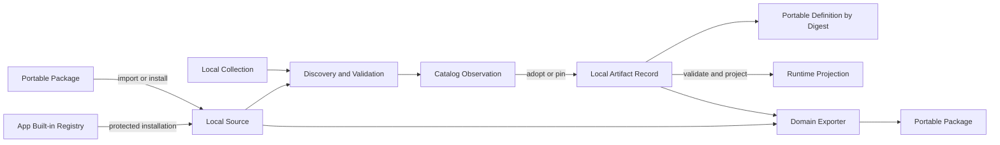
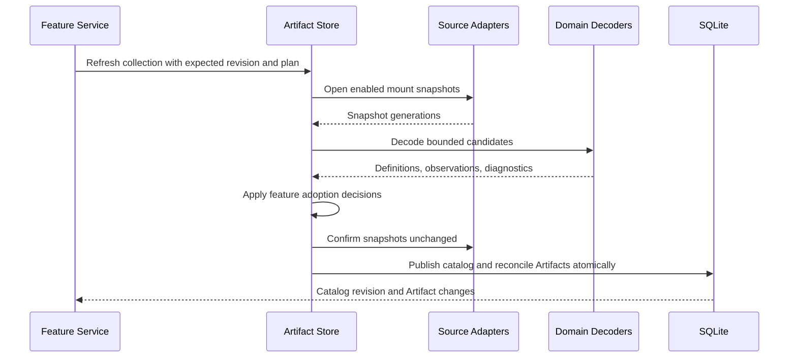
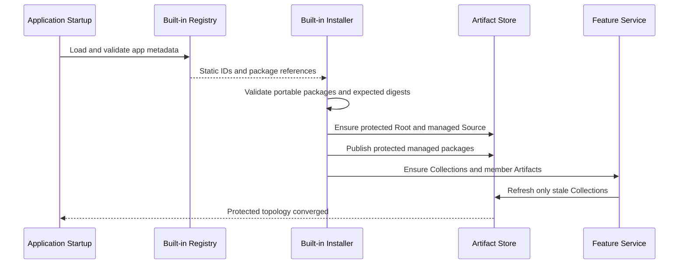

# Artifact Store High-Level Design

## Document role

This document defines the stable architecture and requirements of Artifact Store.

It is authoritative for:

- The separation between portable content and local application state.
- Root, Source, Collection, catalog, Definition, and Artifact concepts.
- Local identity and create replay.
- Discovery, adoption, pinning, suppression, and reconciliation.
- Portable Artifact and Collection representations.
- Package references, content closure, import, and export.
- Protected built-in topology.
- Feature-service and runtime boundaries.
- Persistence, consistency, and security invariants.

Workspace and Skills define their domain-specific behavior in their own HLDs.

The final section records current implementation status, code mapping, and next steps.

## Current delivery scope

The current delivery is the local Artifact Store control plane, protected
built-in hydration, feature and runtime integration, and Wails-facing
administration bindings.

Portable Artifact and Collection transfer, generic content closures and
archives, and direct Artifact move are intentionally deferred. Test work is
handled separately and is not listed as an outstanding architecture task here.

## Architectural statement

Artifact Store manages local installations of portable domain content.

Portable content contains domain meaning and native files. It never contains application-owned IDs, local paths, local enablement, revisions, credentials, diagnostics, or runtime state.

Local Artifact Store records assign application identity, source location, lifecycle, and user policy to portable content.

Feature services such as Workspace and Skills define what that content means. Artifact Store owns common identity, source access, discovery, integrity, catalog, lifecycle, and transfer mechanics.

Runtime objects are derived from validated local records and are never durable Artifact identities.

Built-ins use the same portable package formats as user content. A separate app-owned registry maps portable built-in members to protected local IDs and installation defaults.

## System flow



## Goals

Artifact Store must:

- Provide one local substrate for different Artifact domains.
- Keep local installation state separate from portable content.
- Support Sources from filesystem, embedded content, managed storage, and future adapters.
- Support homogeneous and heterogeneous Collections.
- Preserve stable local Artifact identity while source content changes.
- Distinguish discovered content from locally managed Artifacts.
- Support managed, external, imported, and built-in content through the same lifecycle.
- Support portable individual Artifacts and portable Collections.
- Preserve native files through deterministic content closures.
- Let domain services own semantics without importing them into Artifact Store.
- Keep runtime state outside the persistence model.

## Non-goals

The initial design does not require:

- Cross-device synchronization.
- Historical catalog retention.
- Direct Artifact movement between Collections.
- Arbitrary network acquisition during discovery.
- Package signatures or publisher trust.
- Generic runtime process management.
- Secret storage.
- Support for every future Artifact kind.
- Generic feature policy inside Artifact Store.
- A public raw Collection editor.

Direct Artifact movement is deferred. The implemented `artifact.Service.Move`
method returns `basespec.ErrUnsupported`, and no Artifact or Collection
import/export fallback is currently exposed.

## Architectural planes

### Portable semantic plane

The portable semantic plane contains:

- Portable Artifact Definitions.
- Portable Collection Definitions.
- Logical names and versions.
- Portable labels.
- Domain semantic bodies.
- Package-relative member references.
- Portable dependency selectors.
- Content and integrity metadata.

Portable semantic objects are schema-versioned canonical JSON.

### Portable payload plane

The portable payload plane contains native files such as:

- `SKILL.md`.
- Markdown Context.
- Scripts.
- Resources.
- JSON and YAML domain documents.
- Domain package directories.

Native files remain native. They are referenced through relative locators in a portable manifest.

### Local control plane

The local control plane contains:

- Root, Source, Collection, and Artifact IDs.
- Source access configuration.
- Source Mounts.
- Revisions and timestamps.
- Enablement.
- Adoption and pinning state.
- Suppression.
- Diagnostics.
- User aliases and tags.
- Installed provenance.
- Local policy and secret references.

This state is stored in SQLite or another local metadata implementation and is never exported automatically.

### App installation plane

The app installation plane contains:

- The built-in registry.
- Static local built-in IDs.
- Protected topology declarations.
- References to embedded portable packages.
- Installation defaults.
- App schema version.

The built-in registry is app metadata, not a portable package.

### Runtime plane

The runtime plane contains:

- Skill registrations.
- Skill sessions.
- Loaded Context.
- MCP processes and connections.
- Active model clients.
- Runtime indexes.
- Native package locations.
- Prompt and inference state.

Runtime state is derived and rebuildable.

## Data ownership

| Concern                                | Portable package | Artifact Store local state           | Feature-local state      | Runtime                 |
| -------------------------------------- | ---------------- | ------------------------------------ | ------------------------ | ----------------------- |
| Domain semantics                       | Yes              | Definition digest and validated copy | No                       | Consumed                |
| Native files                           | Yes              | Source-backed                        | No                       | Read as needed          |
| Root, Source, Collection, Artifact IDs | No               | Yes                                  | Referenced               | Temporary lookup        |
| Enablement                             | No               | Common enablement                    | Optional domain override | Evaluated               |
| Local path                             | No               | Private Source configuration         | No                       | Temporary trusted value |
| Source generation                      | No               | Yes                                  | No                       | Verified                |
| User tags and aliases                  | No               | Optional common fields               | Yes                      | No                      |
| Diagnostics                            | No               | Yes                                  | May project              | Returned                |
| Credentials                            | No               | Secret reference at most             | Secret binding           | Acquired temporarily    |
| Runtime session state                  | No               | No                                   | No                       | Yes                     |

## Core model

### Root

A Root is a local technical namespace and trust boundary.

A Root owns:

- Sources.
- Collections.
- Definition reachability.
- Lifecycle and retention policy.

A Root is not a Workspace, Skill Bundle, or user-visible content package.

Cross-Root reuse requires an explicit import, copy, or future sharing operation.

### Source

A Source is a Root-scoped provider of bytes.

A Source owns:

- Source kind.
- Private access configuration.
- Revision.
- Enabled and retired state.
- Snapshot generation.
- Bounded stat, directory-read, and content-read operations.
- Optional trusted capabilities, such as native local-path resolution.
- Optional managed package publication.

A Source does not know:

- Collection meaning.
- Portable logical name.
- Bundle identity.
- Workspace semantics.
- Artifact identity.
- Adoption policy.
- Source-scope policy.

A Source may be mounted by multiple Collections in the same Root.

One Source may physically contain multiple portable Collection packages. Source
Mount-local discovery scope selects which package subtree applies to each
Collection. A Source must not encode portable package identity, bundle identity,
Artifact identity, Collection kind, or feature policy.

### Collection

A Collection is a local feature aggregate.

Examples include:

- `workspace.collection`
- `skill.bundle`
- `mcp.bundle`
- `tool.bundle`
- `model.provider`
- `agent.collection`
- `assistant.collection`
- `conversation.bundle`

A Collection may be homogeneous or heterogeneous. Artifact Store does not
require every Artifact in a Collection to have the same kind.

A Collection owns:

- Collection kind.
- Local display and enablement state.
- Schema-versioned local feature data.
- Source Mounts.
- One current catalog.
- Artifact Records.
- Suppressions.
- Retirement state.
- Optional Portable Collection Definition state.

A local Collection Record is never exported directly.

### Source Mount

A Source Mount, represented in code as a Collection Attachment, attaches one Source to one Collection.

It contains:

- Collection and Source identity.
- Consumer-defined role.
- Enabled state.
- Schema-versioned local mount data.
- Revision.

Examples of local mount data include:

- Discovery root.
- Include and exclude settings.
- Role-specific discovery policy.
- Package scope.

Source Mount data is local and is not included in a Portable Collection Definition.

The Source and Collection must belong to the same Root.

A Source Mount cannot be removed while active Artifacts or suppressions still depend on it.

### Source Binding

A Source Binding identifies one expected source output.

```text
SourceBinding {
  SourceID
  Locator
  SubresourceLocator
  ExpectedKind
}
```

`OutputKey` is optional when one locator and subresource can produce only one output. Domain decoders must otherwise provide a stable output key.

A Source Binding is local. It is not a portable member reference.

### Catalog Publication

A Catalog Publication is one coherent discovery result for a Collection.

It records:

- Collection revision.
- Source Mount revisions.
- Source revisions.
- Source snapshot generations.
- Discovery-plan fingerprint.
- Decoder-capability fingerprint.
- Observations.
- Diagnostics.
- Publication revision and time.

Only one publication is current for a Collection.

A failed or stale refresh leaves the previous publication unchanged.

### Catalog Observation

A Catalog Observation describes what discovery currently sees at a Source Binding.

An Observation may be:

- Valid.
- Invalid.
- Missing.
- Unsupported.
- Incompatible with an existing Artifact expectation.

An Observation is not durable user identity.

A valid Observation may exist without an Artifact Record. An Artifact Record may remain after its Observation becomes missing or invalid.

### Portable Artifact Definition

A Portable Artifact Definition is immutable semantic content represented as canonical JSON.

```text
PortableArtifactDefinition {
  Kind
  SchemaID
  SchemaVersion
  LogicalName
  LogicalVersion
  Labels
  Body
  Dependencies
}
```

It must not contain:

- Root, Source, Collection, or Artifact IDs.
- Absolute local paths.
- Local enablement.
- Local aliases or user tags.
- Revisions or timestamps.
- Diagnostics.
- Credential values.
- Runtime state.

Definitions are addressed by `definitionDigest`.

A digest does not by itself authorize access across Roots. Definition reachability is Root-scoped.

### Portable Collection Definition

A Portable Collection Definition describes a shareable aggregate.

```text
PortableCollectionDefinition {
  CollectionKind
  SchemaID
  SchemaVersion
  Namespace
  LogicalName
  LogicalVersion
  Labels
  Body
  Members
}
```

A member contains:

```text
PortableMemberRef {
  Key
  ExpectedKind
  Optional
  Order
  Content
  ExpectedDefinitionDigest
  ExpectedClosureDigest
}
```

`Key` is stable within the portable Collection and is independent of local IDs and file paths.

A member may be:

- Embedded in the Collection document.
- A subresource of the Collection document.
- A relative package locator.
- An external URI accepted by explicit acquisition policy.

The initial release may support embedded and relative members while rejecting external URIs.

#### Current implemented Collection envelope

The implemented generic portable Collection envelope is
`schema.SkillCollectionV1`:

```text
CollectionDefinition {
  Digest
  Kind
  SchemaID
  SchemaVersion
  LogicalName
  LogicalVersion
  DisplayName
  Description
  Labels
  Body
  Members []ContentRef
}
```

`ContentRef` currently contains `Locator`, `URI`, `SubresourceLocator`,
`Digest`, `MediaType`, and `Role`. Stable member keys, expected derived
Definition digests, closure digests, and package profiles remain deferred.

### Collection portable state

A local Collection may track:

- Current observed Portable Collection Definition digest.
- Original imported Collection Definition digest.
- Source and locator of an observed Collection Definition.
- Installed package digest.
- Import provenance.
- Mapping from portable member keys to local Artifact IDs.

These relationships are local and must not be written back into the portable Collection Definition.

### Artifact Record

An Artifact Record is the stable local representation of adopted or pinned content.

It contains:

- `ArtifactID`.
- Root and Collection identity.
- Artifact kind.
- Source Binding.
- Current Definition digest, when available.
- Adoption mode.
- Common enablement.
- Schema-versioned local feature data.
- Source-derived state.
- Diagnostics.
- Revision and timestamps.

The durable reference is:

```text
ArtifactRef {
  RootID
  ArtifactID
}
```

The current address is:

```text
ArtifactAddress {
  RootID
  CollectionID
  ArtifactID
  Kind
}
```

Persistent selections use `ArtifactRef`, not `ArtifactAddress`, paths, digests, or catalog positions.

### Suppression

A Suppression records that a typed Source Binding must not be automatically adopted.

Suppression is local and Collection-scoped.

Removing an auto-adopted Artifact may create a Suppression so that refresh does not immediately recreate it.

### Local lifecycle meanings

Artifact Store distinguishes these local operations:

- Retirement disables normal use while retaining local metadata.
- Unadoption removes local Artifact management while leaving source content
  unchanged.
- Suppression prevents automatic re-adoption of a typed Source Binding.
- Source-side deletion is feature-owned and applies only where the feature
  defines deletion semantics.
- Purge removes local metadata only after the owning feature has completed
  required source-side and consumer-reference checks.

Purge does not imply recursive deletion of external filesystem content, managed
payload directories, or immutable Definition files. Physical retention and
recoverable cleanup remain Source and content-repository responsibilities.

### Local feature data

Collection, Source Mount, and Artifact feature data must be:

- Local only.
- Schema-versioned.
- Validated by the owning feature service.
- Hidden from generic public APIs.
- Excluded from portable export.
- Migrated independently from portable schemas.

A local data envelope should identify:

```text
LocalFeatureData {
  SchemaID
  SchemaVersion
  Body
}
```

Current core persistence accepts bounded canonical JSON objects for Collection,
Attachment, Artifact, and private Source data. Artifact Store does not yet
enforce a generic local-data envelope or load feature schemas itself. Skill
Bundle and Workspace currently decode their own local data, which must remain
feature-local after the pending shareable-document schema consolidation.

## Identity and create replay

Root, Source, Collection, and Artifact IDs are caller-supplied UUIDv7 values.

Artifact Store:

- Validates IDs.
- Never allocates IDs.
- Uses IDs as replay identity for explicit creation.
- Uses revisions for optimistic concurrency.

Feature services and application composition own ID generation.

An import operation validates the package and then builds an identity plan before mutating Artifact Store.

```text
ImportIdentityPlan {
  RootID
  SourceIDs
  CollectionIDs
  ArtifactIDByMemberKey
}
```

Built-in installation receives static IDs from the app registry.

### Creation intent

Repeated creation with the same ID returns the existing entity only when immutable creation intent matches.

| Entity     | Immutable creation intent                                                              |
| ---------- | -------------------------------------------------------------------------------------- |
| Root       | Root ID, initial display name, initial description                                     |
| Source     | Root ID, Source ID, Source kind, normalized private configuration                      |
| Collection | Root ID, Collection ID, Collection kind                                                |
| Artifact   | Root ID, Artifact ID, Collection ID, Source Binding, kind, adoption mode, initial name |

A changed immutable intent returns conflict.

Mutable fields continue to use revision-checked updates.

### Semantic uniqueness

Entity ID uniqueness does not bypass semantic uniqueness.

- Artifact Source Bindings are unique by Root, Collection, Source, locator,
  subresource locator, output key, and expected kind.
- Different `ArtifactID` values for the same binding conflict.
- Feature logical-name uniqueness remains feature-owned.
- A Source Binding remains valid only while its Source is mounted to the
  Artifact's current Collection.

### No idempotency keys

Artifact Store has no generic idempotency-key field or index.

- Explicit create replay uses the caller-supplied entity ID.
- Managed package integrity uses a package digest.
- Source revisions and generations are request-time concurrency tokens.
- Source revisions and generations are not stored as operation identities in Artifact local data.
- Artifact Store stores no acknowledged-generation cache or managed-operation replay token in local Artifact data.

## Digest and package model

Different digest meanings must remain explicit.

| Digest             | Meaning                                             |
| ------------------ | --------------------------------------------------- |
| `definitionDigest` | Canonical semantic JSON                             |
| `fileDigest`       | Exact bytes of one file                             |
| `entrypointDigest` | Exact bytes of the domain entrypoint                |
| `closureDigest`    | Canonical sorted closure file inventory             |
| `collectionDigest` | Canonical Portable Collection Definition            |
| `packageDigest`    | Canonical package manifest and closure identities   |
| `transportDigest`  | Optional digest of a particular archive byte stream |

A package digest is not automatically the same as the ZIP file digest.

Canonicalization must define:

- JSON canonicalization algorithm.
- Duplicate-key rejection.
- UTF-8 requirements.
- Relative path normalization.
- File-entry ordering.
- Digest self-exclusion.
- Archive timestamp and permission normalization.

## Portable content references

A portable reference uses exactly one primary reference form.

```text
PortableContentRef {
  EmbeddedSubresource
  Locator
  URI
  Base
  EntryPoint
  MediaType
}
```

Rules include:

- `Locator` is slash-separated and relative.
- Absolute paths are prohibited.
- `.` and `..` segments are prohibited.
- Archive escape is prohibited.
- Control characters are prohibited.
- Package and document bases must be unambiguous.
- External URIs require explicit resolver policy.
- Self-contained packages cannot depend on unresolved external content.

## Supported content shapes

Artifact Store supports, subject to registered domain decoders:

- One file producing one Artifact.
- One file or array producing several Artifacts through subresource locators or output keys.
- One directory or package producing one Artifact plus assets.
- One Collection document embedding several Artifacts.
- One Collection document referencing separate Artifact files or packages.

## Content closure

A Content Closure identifies every file required to transfer or verify one Artifact.

```text
ContentClosure {
  EntryPoint
  PackageRoot
  Files
  ClosureDigest
}
```

Each file entry contains:

```text
ContentFile {
  Locator
  FileDigest
  Size
  MediaType
  Role
  ExecutableIntent
}
```

The domain owns which files belong to a closure.

Artifact Store owns:

- Locator safety.
- Digest verification.
- Duplicate path detection.
- Archive containment.
- Size and count limits.
- Deterministic ordering.
- Generic package assembly.

## Portable package manifest

A Portable Package Manifest identifies the portable transport unit without
introducing another local identity model.

It contains:

- Package schema and profile.
- Included Portable Collection Definition or Portable Artifact Definition.
- Referenced member Definitions and Content Closures.
- Complete relative file inventory.
- Typed integrity digests.

## Package profiles

### Linked package

A linked package may contain:

- A portable manifest.
- Relative references into a surrounding source tree.
- Policy-approved external references.

A linked package may not be self-contained.

### Self-contained package

A self-contained package contains:

- One Portable Artifact or Collection Definition.
- Every required member.
- Every required Content Closure.
- A complete relative file inventory.
- Expected integrity digests.

A self-contained package remains valid when moved to another machine or directory.

## Domain extension model

Artifact Store never imports Workspace, Skill, MCP, Agent, or other domain packages.

A domain registers implementations for:

- Portable Collection decoder and validator.
- Portable Artifact decoder and validator.
- Discovery decoder.
- Discovery-plan builder.
- Local Collection and Artifact data validators.
- Member enumerator.
- Content Closure enumerator.
- Native importer and exporter.
- Runtime projector or handoff adapter.
- Adoption and collision policy.
- Optional portable-reference and dependency extractor.

Artifact Store owns the orchestration and generic invariants.

An unknown or unsupported schema remains visible as an unsupported Observation
with structured diagnostics. It must not be adopted as a valid Artifact.

## Component ownership

| Concern                   | Artifact Store  | Domain service                 | Application       | Runtime                |
| ------------------------- | --------------- | ------------------------------ | ----------------- | ---------------------- |
| Root and Source lifecycle | Owns            | Uses                           | Configures        | No                     |
| Collection persistence    | Owns mechanics  | Owns meaning                   | Composes          | No                     |
| Discovery snapshots       | Owns            | Supplies plan                  | No                | No                     |
| Definition storage        | Owns            | Supplies schema and validation | No                | Reads verified content |
| Adoption and suppression  | Owns mechanics  | Owns policy                    | No                | No                     |
| Package safety            | Owns            | Supplies codecs and closure    | Configures limits | No                     |
| Feature local data        | Stores envelope | Owns schema                    | No                | Evaluates              |
| Built-in registry         | No              | Installer port                 | Owns              | No                     |
| Runtime projection        | Verifies inputs | Projects                       | Routes            | Owns lifecycle         |
| Secrets                   | No values       | Defines slots                  | Resolves bindings | Acquires temporarily   |

## Collection refresh workflow



The workflow must:

- Read Collection, Source Mount, Source, and current catalog revisions.
- Open bounded snapshots.
- Execute a deterministic domain discovery plan.
- Validate every emitted Definition.
- Store immutable Definitions idempotently.
- Preserve invalid and unsupported observations.
- Reconcile existing Artifact source state.
- Apply feature-provided automatic adoption decisions.
- Confirm that all inputs remain current.
- Atomically replace the catalog and Artifact source-derived state.

Failure leaves the previous catalog unchanged.

## Adoption workflow

A feature adopts a current valid Observation by supplying an `ArtifactID`.

Artifact Store:

- Revalidates catalog currentness.
- Verifies the Observation is valid.
- Verifies the Source Binding is unique.
- Creates or replays the Artifact using the supplied ID.
- Associates the current Definition digest.
- Applies local defaults.
- Preserves the Observation as catalog state.

The Observation remains distinct from the Artifact.

## Pinning workflow

Pinning records expected content before valid content exists.

The feature supplies:

- `ArtifactID`.
- Collection.
- Typed Source Binding.
- Artifact kind.
- Local defaults.

The resulting Artifact may initially be missing.

A later refresh can reconcile the pinned Artifact to a valid Definition without changing its identity.

## Suppression workflow

Suppression prevents automatic adoption.

The feature:

- Removes or unadopts the Artifact according to domain policy.
- Creates a Suppression for the typed Source Binding.
- Leaves the source content discoverable as a suppressed Observation.

Unsuppression removes the local decision. A later refresh may auto-adopt the Observation again.

## Managed authoring workflow

Managed authoring spans an external content store and SQLite, so it is not one transaction.

The workflow is:

- Feature validates the domain request.
- Feature allocates local IDs.
- Domain serializer produces native files.
- Managed Source stages the complete package.
- Domain decoder validates staged content.
- Managed Source publishes the package atomically where supported.
- Source revision and generation advance.
- Feature refreshes the target Collection.
- Feature adopts or resolves the expected Artifact.
- Orphan cleanup compensates if metadata publication fails.

Retries use the same local IDs and expected package digest.

## Artifact export workflow

The workflow is:

- Resolve the Artifact and owning Collection.
- Apply feature export policy.
- Validate the current catalog and Definition.
- Open or capture one coherent Source snapshot.
- Ask the domain exporter for native representation.
- Ask the domain closure enumerator for all required files.
- Verify file and closure digests.
- Exclude local-only fields.
- Build deterministic directory or archive output.
- Return explicit omissions or portability failures.

Export does not mutate local identity or policy state.

## Artifact import workflow

The workflow is:

- Open the input through a bounded local or policy-controlled resolver.
- Detect a supported domain format.
- Validate portable schema, references, paths, and digests.
- Resolve the complete content closure.
- Ask the feature to choose a destination Collection.
- Ask the application or feature to allocate an identity plan.
- Stage package files in a managed or package Source.
- Create or reuse required local Source Mounts.
- Publish content.
- Refresh the destination Collection.
- Adopt the intended Observation using the allocated `ArtifactID`.
- Record local acquisition provenance.

Portable identity never replaces local identity.

## Collection export workflow

The workflow is:

- Resolve the local Collection through its feature service.
- Ask the domain exporter for a Portable Collection Definition.
- Select members according to explicit export options.
- Resolve every selected member Artifact.
- Enumerate each member Content Closure.
- Rewrite vendored references to package-relative locators.
- Build one deterministic package inventory.
- Report unsupported, omitted, unavailable, or nonportable members.
- Emit linked or self-contained output.

Local Source Mounts, enablement, and local Artifact metadata are not exported.

## Collection import workflow

The workflow is:

- Validate the Portable Collection Definition.
- Resolve and validate every required member and closure.
- Reject the complete import if a required member is invalid.
- Ask the feature and application for an identity plan.
- Stage all content before local publication.
- Create the local Collection, Sources, and Source Mounts.
- Publish the package into local Sources.
- Refresh the Collection.
- Adopt members using `ArtifactIDByMemberKey`.
- Record package, Collection, and member provenance.

The initial release does not require partial Collection import.

## Runtime resolution workflow

A runtime request starts with `ArtifactRef`.

Artifact Store and the owning feature service:

- Resolve the current Artifact.
- Resolve current Collection membership.
- Verify Collection and Artifact enablement.
- Verify the catalog is current.
- Verify the Artifact is available.
- Load and validate the current Definition by digest.
- Verify Source generation or immutable package closure.
- Use a trusted Source capability when native content is required.
- Hand a verified domain projection to runtime.

Runtime handles are not persisted back into Artifact Store.

## Protected built-in topology

### Built-in registry

The app-owned built-in registry declares:

- Registry schema version.
- One protected Root ID.
- One protected managed Source ID.
- Static Collection IDs.
- Static Artifact IDs.
- References to embedded portable Collection packages.
- Mappings from static Artifact IDs to portable member keys.
- Local installation defaults.
- Expected package digests.

Each package reference resolves through the installer-injected embedded or
external filesystem to a regular package directory. The installer validates
every static UUIDv7 value, package location, member key, and expected digest
before mutating protected local topology.

It does not duplicate:

- Portable logical names.
- Portable descriptions.
- Skill instructions.
- Portable member locators.
- Portable member digests already owned by the package.
- Native package bytes.

### Protection model

The current built-in metadata is split by ownership:

- `internal/builtin/artifact-builtin-registry.json` declares the protected Root
  and shared managed Source.
- `internal/builtin/skills/skill-registry.json` declares static Skill
  Collection and Artifact registrations, package payload locations, and member
  entrypoints.
- Embedded `collection.json` files own portable Collection semantics and member
  content references.

`artifactbuiltin` hydrates embedded `collection.json` payloads, calculates
member content digests from package bytes, publishes complete package
directories to the protected managed Source, pins static Artifacts, and
refreshes scoped Collection catalogs. A persisted hydration fingerprint covers
topology, registrations, canonical Collection Definitions, member digests, and
package files.

Protected structural state includes:

- Protected Root identity.
- Protected managed Source.
- Collection kind and identity.
- Source Mount topology.
- Artifact identity and source binding.
- Managed package content.

Only the trusted installer or update path may mutate protected structural state.

Ordinary Root, Source, Collection, Source Mount, refresh, and managed-package
operations reject protected structural mutations, including when a caller
accidentally carries installer context. Protected package publication and
removal require both the configured protected Root and a trusted installer
capability injected only into the installer or explicit update path.

The protected-topology ensure operation accepts only the configured protected
Root ID. Installer capability does not authorize creation of arbitrary
protected Roots.

Local user preferences may be exposed through narrow feature APIs where product policy allows:

- Collection enabled state.
- Artifact enabled state.
- Local display alias.
- Local presentation settings.

Preference mutation never grants permission to change package content, topology, or bindings.

### Built-in installation workflow



The installer:

- Runs once during application startup.
- Creates exactly one protected Root and one protected managed Source on a fresh installation.
- Never iterates user Roots as installation targets.
- Never copies built-ins into user Roots.
- Uses portable member keys to map package content to static Artifact IDs.
- Preserves existing local user preferences.
- Rejects an active `skill.bundle` in the protected Root when it uses a
  declared built-in logical bundle name with a non-registry Collection ID.
- Rejects an undeclared active `agent.skill` Artifact in a canonical built-in
  Skill Bundle.
- Rejects undeclared structural records in canonical built-in Collections.
- Refreshes only unavailable or stale catalogs.

The protected managed Source may contain several portable Collection packages.
Each built-in Collection Mount carries local discovery scope that selects only
its package subtree.

Dynamic records are never adopted, copied, renamed, or migrated into canonical
built-in topology. A contaminated canonical built-in Collection is an
operational conflict requiring explicit offline repair.

### Built-in semantic references

Portable references to app built-ins use semantic identity.

```json
{
  "bundle": "core-instructions",
  "skill": "markdown-output"
}
```

They do not contain local `ArtifactRef`, Root IDs, Source paths, or registry metadata.

The application resolves the semantic reference to the installed static local Artifact.

Local app presets may store the resolved `ArtifactRef`. Export converts it back to a semantic reference or rejects it as nonportable.

### Workspace exclusion

Workspace does not own protected built-in content.

- Workspace rejects the protected Root.
- Workspace cannot mount the protected Source.
- Workspace cannot adopt protected built-in Artifacts.
- Workspace references remain same-Root.
- Installed and built-in Skills are combined with Workspace content at the application or conversation layer.

## Persistence model

### SQLite

SQLite stores local control-plane metadata:

- Roots.
- Sources.
- Collections.
- Source Mounts.
- Catalog publications.
- Observations and diagnostics.
- Artifact Records.
- Suppressions.
- Definition reachability.
- Protected topology hydration state.
- Schema-versioned local feature data.

The current schema starts at version one and has a migration ledger. Schema
version two adds `artifact_topology_hydrations`. Collection portable-state
linkage, generic shareable-artifact persistence, and import provenance are not
yet persisted.

### Content repository

The content repository stores:

- Immutable canonical Definition JSON.
- Managed Source package files.
- Imported package payloads where applicable.

`MapStore` remains the implementation boundary for content it owns.

`MapStore` is the sole Artifact Store implementation for immutable Definition
files and managed package payloads. Managed Source generations cover every
published payload directory while excluding only private staging content.

Feature code must not inspect private `MapStore` paths or reimplement its containment, link, permission, or durability behavior.

Metadata purge intentionally does not add an independent recursive filesystem delete after SQLite commits. Source adapters and the content repository own physical retention, orphan cleanup, and any future recoverable cleanup policy.

### Embedded application content

Application resources contain:

- Built-in registry JSON.
- Portable built-in package manifests.
- Native built-in package files.

The registry and portable packages remain distinct inputs.

## Consistency and transaction boundaries

All local mutations use optimistic revisions.

Catalog publication fails when any of these change during refresh:

- Collection revision.
- Source Mount revision.
- Source revision.
- Source snapshot generation.
- Discovery-plan fingerprint.
- Decoder fingerprint.
- Current catalog revision.

SQLite transactions may atomically update:

- Catalog publication.
- Artifact source-derived state.
- Suppressions.
- Local metadata.

No API may claim one transaction spans SQLite and an external filesystem.

Managed writes and imports therefore require:

- Staging.
- Source-side publication.
- Metadata publication.
- Retry or compensation.
- Orphan cleanup.

## API boundary

### Artifact administration API

The shared Artifact API may expose:

- Root lifecycle.
- Source lifecycle.
- Source kinds.
- Managed Source package publication and removal.
- Managed Source confirmed generation.

Source configuration is accepted on create or replacement but is not returned.
When a Source update omits private configuration, Artifact Store preserves the existing private configuration. Clients do not need to receive or resend local paths or other opaque configuration merely to update display or enablement state.

### Feature APIs

Feature APIs own:

- Collection creation and update.
- Source Mount roles and local data.
- Refresh plans.
- Adoption.
- Pinning.
- Suppression.
- Artifact local settings.
- Typed purge.
- Import and export.
- Runtime projection.

There is no public raw Collection mutation API.

Generic Artifact purge remains an internal capability used only after feature ownership and source cleanup checks.

## Security requirements

Artifact Store must:

- Treat all source content as untrusted during discovery.
- Never execute discovered content.
- Bound traversal depth, count, and bytes.
- Revalidate content retrieved by digest.
- Keep Source configuration private.
- Keep secret values outside Artifact Store.
- Reject archive traversal, duplicate normalized paths, links, and decompression bombs.
- Reject absolute portable paths.
- Require explicit network acquisition policy that enforces scheme, redirect,
  address, size, timeout, media-type, and digest constraints.
- Verify all declared digests.
- Avoid lexical scanning for arbitrary UUID-looking or secret-looking user text.
- Prevent system-generated local metadata from entering portable schemas structurally.
- Confirm one coherent snapshot for self-contained export and produce equivalent
  canonical output for equivalent portable input and export options.
- Keep Root authorization separate from digest identity and restrict physical
  digest deduplication to one trust boundary.

Source adapters own direct filesystem symlink policy. The current filesystem Source adapter permits normal operating-system symlink traversal. Feature
services and Artifact Store generic layers must not add a second path or symlink policy above the selected Source adapter.

## Requirements

| ID       | Requirement                                                                                                          |
| -------- | -------------------------------------------------------------------------------------------------------------------- |
| `AS-R01` | Separate portable content, local control state, app installation metadata, and runtime state                         |
| `AS-R02` | Manage Root-scoped Sources with private configuration and bounded snapshots                                          |
| `AS-R03` | Manage typed Collections and same-Root Source Mounts                                                                 |
| `AS-R04` | Publish one coherent current catalog per Collection                                                                  |
| `AS-R05` | Preserve valid, invalid, and missing Observations with structured diagnostics and derive incompatible Artifact state |
| `AS-R06` | Store immutable canonical Artifact and Collection Definitions by digest                                              |
| `AS-R07` | Manage stable Artifact Records through adoption, pinning, suppression, unadoption, and purge                         |
| `AS-R08` | Use caller-supplied UUIDv7 IDs and revision-based concurrency                                                        |
| `AS-R09` | Support staged managed Source publication and recovery                                                               |
| `AS-R10` | Support portable individual Artifact import and export                                                               |
| `AS-R11` | Support portable Collection import and export                                                                        |
| `AS-R12` | Support deterministic multi-file Content Closures                                                                    |
| `AS-R13` | Keep domain semantics in registered feature adapters                                                                 |
| `AS-R14` | Support protected built-in installation without placing local IDs in portable packages                               |
| `AS-R15` | Resolve runtime projections from current verified Artifact state                                                     |
| `AS-R16` | Keep generic public mutation behind feature-aware APIs                                                               |
| `AS-R17` | Preserve local settings during source reconciliation                                                                 |
| `AS-R18` | Record local import and installation provenance                                                                      |
| `AS-R19` | Support schema evolution for local and portable formats                                                              |
| `AS-R20` | Enforce package, path, digest, archive, and network safety                                                           |

## Acceptance outcomes

Artifact Store satisfies this HLD when:

- Portable packages contain no application-owned IDs or local state.
- Local IDs remain stable while source content and Definition digests change.
- One Source can be mounted by multiple Collections in the same Root.
- Workspace and Skill services use the same generic lifecycle without sharing domain policy.
- Observations remain separate from Artifact Records.
- Invalid content does not hide unrelated valid content.
- Source reconciliation preserves local Artifact settings.
- One Artifact can be imported or exported independently.
- One Collection can be imported or exported with all required member closures.
- Built-ins use normal portable packages and separate app registry metadata.
- Runtime receives only current verified projections.
- No second Skill or Workspace persistence model is required.
- Feature services remain the public boundary for Collection and Artifact meaning.

## Artifact Store Implementation Status and Next Steps

This section records:

- Current code and component ownership.
- Implemented HLD requirements.
- Partial or missing behavior.
- Known architectural deviations.
- Ordered code-level next steps.
- Verification required before completion.

### Current summary

The local Artifact Store lifecycle and protected built-in installation path are
implemented.

Present capabilities include:

- Roots and Sources.
- Filesystem, embedded, and managed Source adapters.
- Collections and Source Mounts.
- Collection-scoped catalogs with source, attachment, plan, decoder, and
  generation currentness checks.
- Immutable canonical Artifact Definitions.
- Canonical Portable Collection Definition codecs.
- Artifact adoption, pinning, suppression, and purge.
- Managed package publication.
- Revision and Source-generation currentness.
- Workspace and Skill Bundle integration.
- Artifact-backed Skill runtime resolution.
- Protected topology hydration and embedded `collection.json` installation.
- Wails-facing Artifact Store, Workspace, and Skill integration.

Portable transfer, generic content closure, archive handling, import
provenance, and direct Artifact move are intentionally deferred rather than
active delivery gaps.

### Current implementation architecture

| Architecture area           | Current component                                                                  |
| --------------------------- | ---------------------------------------------------------------------------------- |
| Application ownership       | Application opens one Artifact Store during startup and injects services           |
| Root and Source services    | Artifact Store Root and Source service packages                                    |
| Source adapters             | Filesystem, embedded, managed, and registered adapters                             |
| Content persistence         | `MapStore` for immutable Definitions and managed package payloads                  |
| Collection lifecycle        | Collection and Collection Attachment services                                      |
| Discovery                   | Source snapshots, plans, registered decoders, bounded traversal                    |
| Catalog publication         | Collection-scoped current catalog and currentness validation                       |
| Definition repository       | Canonical JSON and digest-addressed Definition storage                             |
| Artifact lifecycle          | Adoption, pinning, suppression, local update, unadoption, and purge                |
| Protected topology          | `artifactstore/topology.Declaration` and protected Root policy                     |
| Built-in topology metadata  | `internal/builtin/artifact-builtin-registry.json`                                  |
| Built-in Skill registration | `internal/builtin/skills/skill-registry.json` and embedded `collection.json` files |
| Built-in installer          | `internal/skill/artifactbuiltin`, using injected topology and Skill Bundle ports   |
| Public Artifact API         | Root, Source, Source kind, and managed package administration                      |
| Feature mutation            | Workspace and Skill Bundle typed services                                          |
| Portable transfer           | Deferred                                                                           |

### Current local workflow

The current local flow is:

```mermaid
flowchart LR
    API[Feature API] --> COLLECTION[Collection Service]
    COLLECTION --> SNAPSHOT[Source Snapshots]
    SNAPSHOT --> DECODERS[Registered Decoders]
    DECODERS --> DEFINITIONS[Canonical Definitions]
    DEFINITIONS --> CATALOG[Collection Catalog]
    CATALOG --> RECONCILE[Artifact Reconciliation]
    RECONCILE --> SQLITE[Artifact Store SQLite]
```



The local lifecycle follows the intended architecture:

- Feature services construct discovery plans.
- Artifact Store opens Source snapshots.
- Decoders produce typed Definitions and Observations.
- Definitions are stored idempotently.
- Catalog and Artifact source-derived state are published coherently.
- Runtime reconciliation is performed later by consumers.

### Requirement mapping

| Requirement                            | Status                             | Mapping                                                                                                    |
| -------------------------------------- | ---------------------------------- | ---------------------------------------------------------------------------------------------------------- |
| `AS-R01` plane separation              | Present                            | Local entities, canonical Definitions, private Sources, and derived runtime are separated                  |
| `AS-R02` Root and Source lifecycle     | Present                            | Root-scoped Source services and adapters                                                                   |
| `AS-R03` Collections and Source Mounts | Present                            | Collection and attachment persistence with same-Root checks                                                |
| `AS-R04` coherent catalog              | Present                            | One current Collection catalog with revision and generation checks                                         |
| `AS-R05` Observation states            | Present                            | Catalogs preserve valid, invalid, and missing states; reconciliation derives incompatibility               |
| `AS-R06` immutable Definitions         | Partial                            | Artifact Definitions are root-scoped and persisted; Collection Definition codecs are not repository-backed |
| `AS-R07` Artifact lifecycle            | Present                            | Adoption, pinning, suppression, unadoption, and purge                                                      |
| `AS-R08` caller-supplied IDs           | Present                            | UUIDv7 validation and create replay                                                                        |
| `AS-R09` managed Source publication    | Present                            | Staging, generation, package publication, and recovery behavior                                            |
| `AS-R10` Artifact transfer             | Deferred                           | No complete importer or exporter is in the current delivery                                                |
| `AS-R11` Collection transfer           | Deferred                           | No complete package import or export is in the current delivery                                            |
| `AS-R12` Content Closure               | Deferred                           | No generic closure model is in the current delivery                                                        |
| `AS-R13` domain adapters               | Present                            | Workspace and Skill decoders and policy remain outside core                                                |
| `AS-R14` protected built-ins           | Present                            | Protected topology hydrates embedded `collection.json` Skill packages through Artifact Store               |
| `AS-R15` runtime resolution            | Present for Agent Skills           | Artifact-backed resolver verifies current state                                                            |
| `AS-R16` typed feature boundary        | Present                            | Raw public Collection mutation is not exposed                                                              |
| `AS-R17` local state preservation      | Present                            | Source reconciliation preserves local Artifact fields                                                      |
| `AS-R18` import provenance             | Deferred                           | Transfer is not implemented in the current delivery                                                        |
| `AS-R19` schema evolution              | Present with pending consolidation | SQLite v1-to-v2 migrations exist; generic shareable-document schemas remain pending                        |
| `AS-R20` package safety                | Partial                            | Source bounds and managed package safety exist; archive and URI transfer are deferred                      |

### Current persistence behavior

Current persistence includes:

- Fresh `artifact_store_v1` marker and migration-ledger version-one baseline.
- Bootstrap of existing pre-ledger Artifact Store v1 databases into the ledger.
- Transactional migration to schema version two for topology hydration records.
- No migration from legacy standalone feature stores.
- Root containment.
- Source and Collection revisions.
- Attachment relationship checks.
- Artifact source-binding uniqueness.
- Detach guards while bound Artifacts or suppressions remain.
- Root-scoped Definition reachability.
- Current catalog replacement.
- Private Source configuration.
- Managed Source generation.

### Deferred transfer design and active schema consolidation

Portable transfer, archive, closure, acquisition, provenance, and move design
below is deferred. It does not describe missing current local-lifecycle work.

#### Pending: schema-backed shareable artifact documents

Add canonical JSON schema documents and associated Go schema types/codecs under
`internal/builtin/schema` for shareable Artifact and Collection documents,
beginning with embedded built-in `collection.json` files.

Artifact Store must use registered schemas to canonicalize, validate, store,
and retrieve those shareable artifacts uniformly, while preserving root-scoped
access controls and without importing Skill or Workspace feature packages.

After migration, remove duplicated shareable-document parsing, hydration, and
retrieval code from Skill and Workspace. This is the active pending
architecture item and is separate from deferred import/export.

#### Digest taxonomy

Current code reports canonical Definition digests and raw `SKILL.md` verification.

The revised HLD additionally distinguishes:

- Entry-point digest.
- Closure digest.
- Collection digest.
- Package digest.
- Transport digest.

These should not be represented by one ambiguous digest field.

#### Content Closure

There is no generic persisted or generated closure containing:

- Package root.
- Entry point.
- File inventory.
- File roles.
- Exact file digests.
- Closure digest.

This blocks self-contained export.

#### Transfer service

The following are missing:

- Format detection.
- Package reader.
- Archive extractor.
- Safe acquisition interface.
- Import identity planning.
- Generic staged import.
- Deterministic package writer.
- Collection and Artifact import/export orchestration.
- Import provenance.

#### Built-in preference policy

Current protected-root guards intentionally deny ordinary preference mutation.
Protected Collection and Artifact enablement is installer-owned. If product
policy later permits a user preference, the owning feature must add an explicit
narrow operation that cannot mutate protected topology, bindings, or managed
package content.

#### Schema migration

- The migration ledger records the version-one baseline and schema version two
  topology-hydration migration.
- Every future SQLite schema change must add a transactional forward migration,
  advance the supported version, and reject unsupported future versions.

#### Observation output identity

Current occurrence identity uses Collection, Source, locator, and subresource.

- The decoder engine explicitly rejects duplicate outputs for this key.
- A future `OutputKey` expansion requires a schema migration and corresponding Binding, catalog, and uniqueness-key changes.

### Deferred transfer design

All remaining transfer-oriented work in this section is deferred. The
schema-backed shareable-artifact consolidation above is the active architecture
follow-up.

#### Define portable core types

Add or finalize Artifact Store types for:

- `PortableCollectionDefinition`.
- `PortableMemberRef`.
- `PortableArtifactDefinition`.
- `PortableContentRef`.
- `ContentClosure`.
- `ContentFile`.
- `PortablePackageManifest`.
- Typed digest fields.
- `ImportIdentityPlan`.
- Collection portable state.
- Import provenance.

These types must remain free of consumer imports.

#### Add canonical package support

Create an Artifact Store package responsible for:

- Canonical package manifest validation.
- Relative locator validation.
- File inventory sorting.
- File and closure digest calculation.
- Deterministic directory output.
- Deterministic archive output.
- Archive limits and containment.
- Duplicate normalized path detection.

Domain packages provide semantics and closure enumeration.

#### Add transfer orchestration

Add internal services for:

- Artifact import.
- Artifact export.
- Collection import.
- Collection export.
- Staged package publication.
- Import compensation.
- Orphan cleanup.
- Provenance recording.

The generic service must receive domain codecs and a caller-supplied identity plan.

#### Persist Collection portable state

Extend Artifact Store persistence with:

- Collection Definition digest reachability.
- Current and origin Collection Definition relationships.
- Imported package digest.
- Source manifest binding where applicable.
- Portable member-key to local Artifact mapping or provenance.

#### Maintain protected topology policy

Review:

- `artifactstore/topology.Declaration`.
- Protected Root guards.
- Protected managed package methods.
- Built-in installer capability injection.

The implemented policy keeps protected topology and enablement installer-owned.
Any future approved local preference must remain narrower than structural mutation.

#### Maintain the migration ledger

- For every future metadata schema revision, add a transactional migration to the Artifact Store migration runner, record its applied version, and retain explicit rejection of unsupported future schemas.
- This does not require migration from the old standalone Skill Store.

#### Add transfer security tests

Cover:

- Absolute path rejection.
- `..` traversal.
- Duplicate paths.
- Case-collision behavior at the selected materializer.
- Archive links.
- Decompression limits.
- File-count and byte limits.
- Digest mismatch.
- Stale Source snapshot during export.
- Invalid domain Definition.
- Unsupported external URI.
- Package closure escape.

### Recommended implementation order

- Freeze portable envelopes and digest vocabulary.
- Add Content Closure interfaces and Context and Skill implementations.
- Add deterministic package writer.
- Add Artifact export.
- Add Collection export.
- Add bounded package reader and archive validation.
- Add Artifact import.
- Add Collection import.
- Add Collection portable-state persistence and provenance.
- Complete built-in package loading using the same package reader.
- Add an explicit SQLite migration with the first schema evolution.
- Enable Workspace and Skill public transfer APIs.
- Add remote acquisition only after local package transfer is stable.

### Completion criteria

Artifact Store can be marked complete for the revised HLD when:

- Skills and Context can emit verified Content Closures.
- One Artifact can round-trip through export and import.
- One Skill Bundle can round-trip with new local IDs.
- One Workspace can round-trip with Context and Skills.
- Built-ins install from the same portable package format.
- No exported package contains local IDs or local state.
- Package output is deterministic.
- Collection origin and package provenance are locally queryable.
- Protected structural mutation and local preference policy are verified.
- Forward SQLite migration is available.
