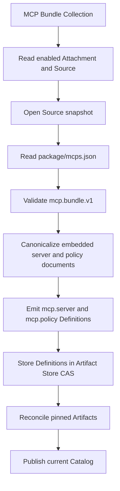

# MCP on Artifact Store High-Level Design

## Document status and authority

This document defines the authoritative design for implementing MCP on Artifact Store and replacing the existing standalone MCP Store.

The target architecture is:

- MCP bundles are Artifact Store Collections.
- MCP servers are source-backed Artifacts.
- MCP policies are source-backed, shareable Artifacts.
- Portable MCP configuration uses a Claude-compatible `mcpServers` schema with FlexiGPT extensions.
- Artifact Store owns persistence, discovery, immutable Definition storage, managed package publication, and local Artifact identity.
- MCP feature code owns MCP validation, policy composition, installation input handling, runtime projection, authentication integration, and typed lifecycle operations.
- Secret values, OAuth tokens, and per-install secret bindings remain application-local and never enter shareable documents.
- Dynamic MCP protocol discovery and runtime sessions remain process-local.

The existing MCP feature has not shipped as a production compatibility contract. The migration is therefore a clean cutover:

- No legacy API compatibility layer.
- No legacy ID aliases.
- No user MCP Store migration.
- No secret migration.
- No OAuth token migration.
- No built-in overlay migration.
- No dual read or dual write.
- No fallback to the old MCP Store.

The only data conversion is a source-controlled conversion of the existing embedded built-in MCP definitions into the new shareable JSON format and static built-in registration format.

## Purpose

The MCP feature provides:

- User MCP Bundle lifecycle.
- Protected built-in MCP Bundle installation.
- Shareable MCP server definitions.
- Shareable MCP trust and execution policies.
- Portable installation and connection requirements.
- Per-install input and secret bindings.
- MCP authentication and setup.
- Runtime server connections.
- Dynamic tools, resources, resource templates, and prompts.
- Approval and execution policy enforcement.
- Assistant preset, conversation, inference, and MCP Apps integration.

The MCP feature is built over Artifact Store in the same architectural style as Workspace and Skills.

Artifact Store remains generic and does not acquire MCP-specific transport, policy, authentication, or runtime semantics.

## Current scope

The following are included:

- Managed user MCP Bundles.
- Protected built-in MCP Bundles.
- `stdio` MCP servers.
- Streamable HTTP MCP servers.
- No-auth, API-key, OAuth authorization-code, and OAuth client-credentials authentication.
- Shareable installation input declarations.
- Shareable connection profiles and connection override semantics.
- Shareable MCP policies.
- Local input bindings and secret references.
- Runtime discovery and invocation.
- Artifact-backed assistant, conversation, and inference references.

The following are explicitly deferred:

- MCP Bundle import.
- MCP Bundle export.
- Standalone MCP server import or export.
- Standalone MCP policy import or export.
- Archive creation or extraction.
- Generic package closure generation.
- Generic package CAS beyond Artifact Store Definitions.
- URI or network acquisition of MCP configuration documents.
- Cross-Root transfer.
- Artifact move.
- General Artifact Source Binding rebinding.
- Persistent MCP runtime capability history.
- Migration of the old user MCP Store.
- Migration of old MCP secrets, OAuth tokens, or built-in user overlays.

The schemas are designed to be shareable, but no transfer API is part of this delivery.

## Architectural model

The target entity model is:

```text
MCP User Root
  MCP Bundle Collection
    Managed Source Attachment
    MCP Server Artifacts
    MCP Policy Artifacts
    Current configuration Catalog

MCP Built-in Root
  Protected MCP Bundle Collections
    Protected managed Source Attachment
    Static MCP Server Artifacts
    Static MCP Policy Artifacts
    Current configuration Catalog

Application-local state
  MCP installation input bindings
  Secret references
  OAuth tokens
  OAuth loopback settings
  Built-in runtime enablement and setup overlays

MCP runtime
  Client sessions
  Auth state
  Dynamic discovery snapshots
  Tools, resources, templates, prompts
  Approval state
```

The primary durable references are:

```go
type MCPBundleRef = collection.CollectionRef
type MCPServerRef = artifact.ArtifactRef
type MCPPolicyRef = artifact.ArtifactRef
```

A server's logical name remains part of its shareable semantics, but is not its durable local identity.

## Architectural planes

| Plane                    | Contents                                                                             | Owner                          |
| ------------------------ | ------------------------------------------------------------------------------------ | ------------------------------ |
| Local control plane      | Roots, Sources, Collections, Attachments, Catalogs, Artifacts, revisions, enablement | Artifact Store                 |
| Shareable document plane | MCP Bundle, MCP Server, and MCP Policy documents                                     | MCP schema codecs              |
| Definition plane         | Immutable canonical `mcp.server` and `mcp.policy` Definitions                        | Artifact Store Definition CAS  |
| Managed content plane    | Selected supported MCP Bundle document package files                                 | Artifact Store managed Sources |
| Installation plane       | Input bindings, selected profiles, local paths, secret references                    | MCP feature and Setting Store  |
| Secret plane             | API keys, environment secrets, OAuth client credentials, OAuth tokens                | Setting Store secret storage   |
| Runtime plane            | Clients, sessions, protocol snapshots, approvals                                     | MCP runtime                    |
| Consumer plane           | Assistant presets, conversations, inference selections                               | Owning consumer stores         |

## Root topology

## MCP user Root

Application composition creates one retained, non-protected MCP user Root.

It contains:

- The editable base MCP Bundle.
- User-created MCP Bundles.
- User-managed MCP Sources.
- User MCP Server Artifacts.
- User MCP Policy Artifacts.

The Root ID is application-owned and static.

The Root cannot be retired or purged through ordinary application APIs.

On a clean installation application composition creates one editable empty
base MCP Bundle under this Root. Its Collection and managed Source IDs are new
Artifact Store IDs and are not aliases for the old standalone MCP Store base
Bundle ID.

User Collections and Artifacts remain mutable through typed MCP feature APIs.

## MCP built-in Root

Application composition creates one protected MCP built-in Root.

It contains:

- A protected managed MCP Source.
- Static built-in MCP Bundle Collections.
- Static built-in MCP Server Artifacts.
- Static built-in MCP Policy Artifacts.

The built-in registry owns:

- Root ID.
- Source ID.
- Collection IDs.
- Artifact IDs.
- Package locations.
- Artifact-to-subresource mappings.
- Installation defaults.

Ordinary callers cannot mutate protected source documents, Collections, Artifacts, or Artifact data.

Mutable per-install built-in setup is stored separately as application-local installation state.

The Artifact Store Root policy must support sets of protected and retained Roots. The current `StaticRootPolicy` implementation may be replaced by an application policy implementing the existing interfaces for multiple Roots.

## Artifact Store entity mapping

| MCP concept                 | Artifact Store representation                                     |
| --------------------------- | ----------------------------------------------------------------- |
| MCP Bundle                  | `mcp.bundle` Collection                                           |
| MCP Server                  | `mcp.server` Artifact                                             |
| MCP Policy                  | `mcp.policy` Artifact                                             |
| User-authored bundle source | Bundle-owned `managed-directory` Source                           |
| Built-in source             | Protected `managed-directory` Source                              |
| Shareable MCP package       | Canonical `mcps.json` in a managed Source package                 |
| Server connection semantics | Immutable `mcp.server` Definition                                 |
| Trust and invocation policy | Immutable `mcp.policy` Definition                                 |
| User enablement             | Collection and Artifact enablement                                |
| Per-install setup values    | Artifact local installation data or built-in installation overlay |
| Secret values               | Setting Store                                                     |
| Dynamic tools and resources | MCP runtime snapshot                                              |

## Shareable schema family

The MCP schema family contains three registered schemas.

| Entity     | Kind         | Schema ID       | Version |
| ---------- | ------------ | --------------- | ------- |
| Collection | `mcp.bundle` | `mcp.bundle.v1` | `v1`    |
| Artifact   | `mcp.server` | `mcp.server.v1` | `v1`    |
| Artifact   | `mcp.policy` | `mcp.policy.v1` | `v1`    |

All schemas:

- Use strict JSON Schema validation.
- Reject unknown fields outside declared extension points.
- Use canonical JSON.
- Calculate an omitted digest or verify a supplied digest.
- Exclude local Artifact Store identity.
- Exclude secret values.
- Exclude runtime state.
- Are versioned independently from the current legacy MCP schema version.

### Published JSON Schema resources

The authoritative source-controlled schema resources are:

- `internal/mcp/schema/mcp-bundle-v1.schema.json`
- `internal/mcp/schema/mcp-server-v1.schema.json`
- `internal/mcp/schema/mcp-policy-v1.schema.json`

Each codec returns the byte-identical embedded schema resource to the Artifact
Store shareable-schema registry. The registry compiles and validates the
appropriate document before MCP semantic canonicalization occurs.

The `$schema` and `$id` fields belong to the published JSON Schema resources.
They are not fields of canonical MCP document instances. Canonical instances
use `kind`, `schemaID`, and `schemaVersion`, matching existing Skill and
Workspace document conventions.

JSON Schema validates document structure and unknown fields. MCP semantic
canonicalization remains responsible for cross-field rules, URL safety,
placeholder declarations, policy resolution constraints, digest calculation,
and materialized connection validation.

## Claude-compatible MCP core

The portable MCP Bundle uses a top-level `mcpServers` object compatible with the Claude-style `mcps.json` model.

The core server configuration uses:

- `type`
- `command`
- `args`
- `env`
- `url`
- `headers`

FlexiGPT additions are contained under `bundleExtension`.

The canonical portable transport names are:

- `stdio`
- `http`

For compatibility:

- A missing `type` with a present `command` canonicalizes to `stdio`.
- `http` maps internally to the existing streamable HTTP runtime transport.
- Legacy internal name `streamableHttp` is not emitted in the new portable schema.
- Unsupported transport types are rejected.

A pure Claude-compatible projection is the `mcpServers` object without FlexiGPT metadata. Import and export of that projection remain deferred.

## MCP Bundle document

The preferred filename for newly authored managed Bundles is:

```text
mcps.json
```

Example:

```json
{
  "kind": "mcp.bundle",
  "schemaID": "mcp.bundle.v1",
  "schemaVersion": "v1",
  "digest": "sha256:0000000000000000000000000000000000000000000000000000000000000000",
  "logicalName": "developer-tools",
  "logicalVersion": "1.0.0",
  "displayName": "Developer Tools",
  "description": "MCP servers for development workflows.",
  "labels": {
    "category": "development"
  },
  "mcpServers": {
    "github": {
      "type": "http",
      "url": "https://mcp.example.com/mcp",
      "headers": {
        "Authorization": "Bearer ${GITHUB_TOKEN}"
      }
    },
    "filesystem": {
      "type": "stdio",
      "command": "npx",
      "args": [
        "-y",
        "@modelcontextprotocol/server-filesystem",
        "${FILESYSTEM_ROOT}"
      ],
      "env": {}
    }
  },
  "bundleExtension": {
    "servers": {
      "github": {
        "displayName": "GitHub",
        "description": "GitHub MCP server.",
        "auth": {
          "mode": "apiKey"
        },
        "install": {
          "inputs": {
            "GITHUB_TOKEN": {
              "kind": "secret",
              "label": "GitHub token",
              "description": "Token used for the Authorization header.",
              "required": true
            }
          }
        },
        "policy": {
          "ref": "safe-default",
          "required": true
        }
      },
      "filesystem": {
        "displayName": "Filesystem",
        "description": "Filesystem MCP server.",
        "auth": {
          "mode": "none"
        },
        "install": {
          "inputs": {
            "FILESYSTEM_ROOT": {
              "kind": "path",
              "label": "Allowed filesystem root",
              "required": true
            }
          }
        },
        "policy": {
          "ref": "safe-default",
          "required": true
        }
      }
    },
    "policies": {
      "safe-default": {
        "kind": "mcp.policy",
        "schemaID": "mcp.policy.v1",
        "schemaVersion": "v1",
        "logicalName": "safe-default",
        "displayName": "Safe default MCP policy",
        "body": {
          "trustLevel": "untrusted",
          "defaultPolicy": {
            "defaultApprovalRule": "ask",
            "defaultExecutionMode": "manual",
            "requireApprovalForUnknownRisk": true,
            "requireApprovalForWrite": true,
            "requireApprovalForDestructive": true
          },
          "toolPolicies": {},
          "appsPolicy": {
            "enabled": false,
            "allowAppInitiatedToolCalls": false,
            "requireApprovalForOpenLink": true,
            "requireApprovalForContextUpdates": true
          }
        }
      }
    }
  }
}
```

### Bundle document rules

- `mcpServers` is the portable core.
- Every `mcpServers` key is the corresponding server logical name.
- `bundleExtension.servers` keys must match existing `mcpServers` keys.
- A server extension is optional.
- A missing server extension receives safe application defaults.
- Inline policy keys must match policy `logicalName`.
- Server names must be unique.
- Policy logical names must be unique.
- The document may contain zero servers.
- Every placeholder used by a server must be declared by that server's installation inputs or be an explicitly allowed environment lookup.
- The document contains no local Collection, Source, or Artifact IDs.
- The document contains no secret references, secret values, OAuth tokens, runtime status, or discovered capabilities.

### Bundle decoding

One `mcps.json` candidate may emit multiple Artifact Store occurrences.

Subresource identities are:

```text
mcpServers/<server-name>
policies/<policy-logical-name>
```

The decoder emits:

- One `mcp.server` Definition per `mcpServers` entry.
- One `mcp.policy` Definition per inline policy.
- Diagnostics attached to the corresponding subresource.

The local Collection is heterogeneous and may contain both server and policy Artifacts.

## Standalone MCP Server document

The generic shareable Artifact schema also supports a standalone server document.

Example:

```json
{
  "kind": "mcp.server",
  "schemaID": "mcp.server.v1",
  "schemaVersion": "v1",
  "digest": "sha256:0000000000000000000000000000000000000000000000000000000000000000",
  "logicalName": "github",
  "displayName": "GitHub",
  "description": "GitHub MCP server.",
  "labels": {},
  "mcpServer": {
    "type": "http",
    "url": "https://mcp.example.com/mcp",
    "headers": {
      "Authorization": "Bearer ${GITHUB_TOKEN}"
    }
  },
  "extension": {
    "auth": {
      "mode": "apiKey"
    },
    "install": {
      "inputs": {
        "GITHUB_TOKEN": {
          "kind": "secret",
          "label": "GitHub token",
          "required": true
        }
      }
    },
    "policy": {
      "ref": "safe-default",
      "required": true
    }
  }
}
```

The standalone schema and the embedded bundle server schema use the same canonical server model.

The bundle codec constructs this logical server document from:

- `mcpServers.<name>`
- `bundleExtension.servers.<name>`

The resulting Definition is identical whether the server was decoded from a bundle or from a standalone server document.

Standalone server acquisition and import are deferred. The schema and codec exist so server semantics are reusable and independently canonicalizable.

## MCP Server Definition

A canonical server document produces:

```text
Definition {
  Kind:          mcp.server
  SchemaID:      mcp.server.v1
  SchemaVersion: v1
  LogicalName:   server logical name
  DisplayName:   server display name
  Description:   server description
  Labels:
    mcp.transport
    mcp.auth-mode
  Body:
    canonical core MCP server config
    authentication declaration
    installation inputs
    connection profiles
    policy reference
  Dependencies:
    optional mcp.policy selector
}
```

The Definition contains no:

- Artifact Store IDs.
- Local enablement.
- Local input values.
- Local filesystem path values.
- Secret references.
- Secret values.
- OAuth token.
- Runtime snapshot.
- Connection status.
- Discovered tool state.

## Shareable MCP Policy Artifact

An MCP policy is an ordinary shareable Artifact document.

Artifact kind:

```text
mcp.policy
```

Schema ID:

```text
mcp.policy.v1
```

Example:

```json
{
  "kind": "mcp.policy",
  "schemaID": "mcp.policy.v1",
  "schemaVersion": "v1",
  "digest": "sha256:0000000000000000000000000000000000000000000000000000000000000000",
  "logicalName": "safe-default",
  "displayName": "Safe default MCP policy",
  "description": "Requires approval for uncertain or mutating operations.",
  "labels": {
    "policy.profile": "safe"
  },
  "body": {
    "trustLevel": "untrusted",
    "defaultPolicy": {
      "defaultApprovalRule": "ask",
      "defaultExecutionMode": "manual",
      "requireApprovalForUnknownRisk": true,
      "requireApprovalForWrite": true,
      "requireApprovalForDestructive": true
    },
    "toolPolicies": {
      "delete-repository": {
        "toolName": "delete-repository",
        "approvalRule": "deny",
        "executionMode": "manual",
        "allowStaleDigest": false
      }
    },
    "appsPolicy": {
      "enabled": false,
      "allowAppInitiatedToolCalls": false,
      "requireApprovalForOpenLink": true,
      "requireApprovalForContextUpdates": true
    }
  }
}
```

### Policy ownership

The policy owns:

- Trust level.
- Default approval rule.
- Default execution mode.
- Approval requirements by inferred risk.
- Tool-specific approval and execution overrides.
- Tool digest requirements.
- MCP Apps policy.

The policy does not own:

- Server identity.
- Secret values.
- Authentication credentials.
- Runtime approvals already granted.
- Conversation-specific tool exposure.
- Application hard safety constraints.

### Server policy reference

A server references a policy by portable logical name:

```json
{
  "policy": {
    "ref": "safe-default",
    "required": true
  }
}
```

Rules:

- The reference resolves within the same MCP Bundle Collection.
- The referenced Artifact must:
  - Have kind `mcp.policy`.
  - Be enabled.
  - Be available.
  - Have a valid `mcp.policy.v1` Definition.
  - Match the requested logical name.
- More than one matching policy is an ambiguity and makes the server unavailable.
- A missing required policy makes the server unavailable.
- A missing optional policy causes the application baseline policy to apply.
- An invalid referenced policy never silently applies partially.

The server Definition records a `definition.Selector` dependency for the referenced policy. Required versus optional behavior remains in the server Definition body because the current generic selector does not encode dependency optionality.

### Additional local policies

An installation may select additional policy Artifacts using `ArtifactRef`.

Additional policies:

- Must resolve through the MCP feature.
- Must be valid `mcp.policy` Artifacts.
- May only tighten the effective policy.
- Are stored as local installation data.
- Are not written back into the shareable server document.

### Effective policy composition

The resolved server policy is the primary policy when it is present. Additional
local policy Artifact references may only tighten that primary policy. When a
server has no resolved policy, the application baseline policy is used as the
primary policy and additional policies may only tighten that baseline.

Policy composition is deterministic and restrictive.

- `untrusted` dominates `trusted`.
- Approval rule order is `deny`, then `ask`, then `allow`.
- Execution mode order is `manual`, then `auto`.
- Approval requirement booleans are combined using logical OR.
- `allowStaleDigest: false` dominates `true`.
- Conflicting non-empty expected tool digests deny use until the policy conflict is resolved.
- Disabled MCP Apps policy dominates enabled policy.
- App-initiated tool-call denial dominates allowance.
- Approval requirements for links and context updates are combined using logical OR.
- Tool-selection overrides in conversations may tighten policy but cannot weaken it.
- Application hard safety constraints remain final and cannot be weakened by a shareable policy.

## Generic shareable Artifact codec support

Artifact Store currently registers shareable Collection codecs only. Its `shareable.SchemaKey` accepts `EntityCollection`, and the registry dispatches based on Collection kind, schema ID, and schema version.

This design extends that generic facility to shareable Artifact documents.

The required enhancement is:

```text
EntityType:
  collection
  artifact
```

A shareable schema key becomes conceptually:

```text
SchemaKey {
  Entity
  Kind
  SchemaID
  SchemaVersion
}
```

Validation of `Kind` depends on `Entity`:

- Collection entities use Collection-kind validation.
- Artifact entities use Artifact-kind validation.

The registry must support:

- Registering Artifact codecs.
- Listing Artifact schema keys.
- Reading the common document header.
- Strict JSON Schema validation.
- Canonicalization.
- Digest calculation and verification.
- Returning canonical raw JSON and schema metadata.

For MCP, the registered codecs are:

- `collection/mcp.bundle/mcp.bundle.v1/v1`
- `artifact/mcp.server/mcp.server.v1/v1`
- `artifact/mcp.policy/mcp.policy.v1/v1`

This generic enhancement does not mean:

- Artifact Store automatically creates an Artifact record.
- Artifact Store imports the document.
- Artifact Store acquires a URI.
- Artifact Store stores a generic shareable-document repository.
- Artifact Store resolves feature dependencies.
- Artifact Store applies MCP policy semantics.
- Artifact Store provides import or export APIs.

The registry validates and canonicalizes portable documents. MCP feature code converts canonical server and policy documents into `definition.Definition` values. Those Definitions are stored in the existing Root-scoped Definition CAS.

Therefore generic shareable Artifact codec support is part of this implementation and is not deferred.

## Connection and installation semantics

## Canonical-document responsibility boundary

All untrusted portable MCP document bytes must enter through Artifact Store's
shareable schema registry with the expected MCP schema key:

- `collection/mcp.bundle/mcp.bundle.v1/v1`
- `artifact/mcp.server/mcp.server.v1/v1`
- `artifact/mcp.policy/mcp.policy.v1/v1`

MCP lifecycle services, decoders, and built-in installers must not directly
call `ParseBundle`, `ParseServer`, `ParsePolicy`, `CanonicalizeBundle`,
`CanonicalizeServer`, or `CanonicalizePolicy` on source bytes. Those functions
are codec implementation hooks invoked by the Artifact Store registry.

After registry canonicalization, MCP may project the returned
`shareable.ParsedDocument` into typed MCP values and immutable Definitions.
That projection verifies the expected schema key, canonical JSON invariant,
and returned digest, but does not create a second schema-validation path.

Runtime Definition reads may revalidate typed MCP semantics as an integrity
check. They are not source-document ingress and do not replace registry
validation.

The shareable server document must contain enough information to determine:

- How the server is started or contacted.
- Which connection profiles are available.
- Which values must be supplied by an installation.
- Which values are optional.
- Which supplied values are secret.
- Which authentication flow is required.
- Which policy is required.

Actual installation values remain local.

## Installation inputs

A server extension may declare inputs:

```json
{
  "install": {
    "inputs": {
      "GITHUB_TOKEN": {
        "kind": "secret",
        "label": "GitHub token",
        "description": "Token used in the Authorization header.",
        "placeholder": "github_pat_...",
        "required": true
      },
      "MCP_HOST": {
        "kind": "text",
        "label": "MCP host",
        "required": false,
        "default": "mcp.example.com"
      },
      "FILESYSTEM_ROOT": {
        "kind": "path",
        "label": "Filesystem root",
        "required": true
      }
    }
  }
}
```

Supported input kinds are:

- `text`
- `secret`
- `path`
- `oauthClientCredentials`

The portable document contains metadata and defaults, never the installed secret value.

## Input substitution

Connection fields may contain placeholders:

```text
${INPUT_NAME}
```

Examples:

```json
{
  "url": "https://${MCP_HOST}/mcp"
}
```

```json
{
  "headers": {
    "Authorization": "Bearer ${GITHUB_TOKEN}"
  }
}
```

```json
{
  "args": ["${FILESYSTEM_ROOT}"]
}
```

Rules:

- Every placeholder must refer to a declared input.
- Substitution is allowed only in declared connection string fields.
- A required unresolved input makes the server unavailable.
- An optional unresolved input may use its default.
- Secret substitutions are never included in diagnostics or logs.
- Substituted HTTP header values are revalidated for CR, LF, and NUL.
- Substituted URLs are revalidated using MCP URL safety rules.
- Substituted environment names are not allowed. Only values may be substituted.
- Substituted command values are validated as direct executables and not shell wrappers.
- Paths are installation-local and are never placed in the resulting Definition after substitution.

## Connection profiles

The Claude-compatible `mcpServers` entry is the default connection profile.

FlexiGPT may define additional shareable connection profiles:

```json
{
  "connectionProfiles": {
    "corporate": {
      "http": {
        "url": "https://${CORPORATE_MCP_HOST}/mcp",
        "headers": {
          "X-Tenant": "${CORPORATE_TENANT}"
        },
        "removeHeaders": []
      }
    },
    "windows": {
      "stdio": {
        "command": "npx.cmd",
        "args": [
          "-y",
          "@modelcontextprotocol/server-filesystem",
          "${FILESYSTEM_ROOT}"
        ],
        "env": {},
        "removeEnv": []
      },
      "platforms": ["windows"]
    }
  }
}
```

Profile rules:

- A profile overlays the default connection.
- Scalar values replace default scalar values.
- Map entries replace matching default map entries.
- `removeHeaders` removes named default HTTP headers.
- `removeEnv` removes named default environment values.
- A profile cannot change to an incompatible transport unless it supplies a complete replacement transport.
- Platform-constrained profiles use portable platform names.
- The application selects one applicable profile per installation.
- Ambiguous automatic platform matches are invalid.
- An explicitly selected incompatible profile is invalid.
- Arbitrary local connection patches are not supported.
- A user requiring a different connection shape edits or creates a shareable connection profile.

This makes connection override semantics shareable while keeping actual local values private.

## Authentication schema

The FlexiGPT server extension supports:

```text
none
apiKey
oauth
clientCredentials
```

### No authentication

```json
{
  "auth": {
    "mode": "none"
  }
}
```

No authentication input is required.

### API key

```json
{
  "auth": {
    "mode": "apiKey"
  }
}
```

The API key is supplied through a required secret input referenced from an HTTP header template.

The actual key remains in Setting Store secret storage.

### OAuth authorization code

```json
{
  "auth": {
    "mode": "oauth",
    "clientCredentialsInput": "OAUTH_CLIENT",
    "clientIDMetadataDocumentURL": "https://client.example.com/mcp-client.json"
  }
}
```

Rules:

- `clientCredentialsInput` is optional for public PKCE clients.
- If supplied, it refers to an `oauthClientCredentials` installation input.
- `clientIDMetadataDocumentURL` may contain a declared non-secret input placeholder.
- OAuth authorization and refresh tokens are runtime-managed secrets.
- Redirect URL and loopback address are installation-local application settings.
- Tokens never enter source documents, Definitions, Artifacts, or policy documents.

### OAuth client credentials

```json
{
  "auth": {
    "mode": "clientCredentials",
    "clientCredentialsInput": "OAUTH_CLIENT"
  }
}
```

Rules:

- `clientCredentialsInput` is required.
- The local secret contains `clientID` and `clientSecret`.
- `clientSecret` is mandatory.
- The actual secret remains in Setting Store.
- Token responses remain runtime-managed secrets.

## Local application data

## User server Artifact data

Mutable user server installation data is stored in `Artifact.Data`.

Example:

```json
{
  "schemaVersion": "v1",
  "selectedConnectionProfile": "corporate",
  "inputs": {
    "MCP_HOST": {
      "value": "mcp.example.com"
    },
    "GITHUB_TOKEN": {
      "secretRef": "opaque-artifact-scoped-secret-reference"
    },
    "OAUTH_CLIENT": {
      "secretRef": "opaque-artifact-scoped-secret-reference"
    }
  },
  "additionalPolicies": [
    {
      "rootID": "019f0000-0000-7000-8000-000000000001",
      "artifactID": "019f0000-0000-7000-8000-000000000002"
    }
  ]
}
```

This data contains only:

- Selected connection profile.
- Non-secret input values.
- Secret references.
- Additional policy Artifact references.
- Feature-local installation state.

It does not contain:

- A duplicate transport configuration.
- Arbitrary header or environment patches.
- Trust or default policy bodies.
- Secret values.
- OAuth tokens.
- Runtime snapshots.

## Built-in installation overlays

Protected built-in Artifacts cannot use ordinary `Artifact.Data` mutation.

Built-in installation overlays use the same logical installation schema but are stored in the existing Setting Store through MapStore.

A built-in server overlay contains:

- Target `ArtifactRef`.
- Overlay revision.
- Effective runtime enablement.
- Selected connection profile.
- Input bindings.
- Secret references.
- Additional policy references.

A built-in bundle overlay contains:

- Target `CollectionRef`.
- Overlay revision.
- Effective runtime enablement.

Protected Collection and Artifact metadata remain enabled as required for discovery and hydration. Runtime eligibility applies the installation overlay.

On a clean installation:

- Built-in runtime enablement starts disabled.
- No setup input is configured.
- No API key is present.
- No OAuth client credential is present.
- No OAuth token is present.
- The user must configure required inputs and activate the built-in server.

## Global MCP application settings

Global MCP settings remain in Setting Store.

They include:

- OAuth loopback listen address.
- Current effective OAuth redirect information.
- Built-in installation overlays.
- Any application-wide MCP runtime settings.

These values are not shareable Artifact data.

## Secret references

Secret references are installation-local and Artifact-scoped.

A reference identifies:

- Root ID.
- Artifact ID.
- Secret kind.
- Secret slot.

Supported secret kinds include:

- Stdio environment value.
- HTTP header value.
- OAuth client credentials.
- OAuth token.

The serialized secret-reference format is opaque to feature consumers.

Secret values are stored only through Setting Store secret APIs.

No secret reference or value appears in:

- `mcps.json`.
- `mcp.server` Definitions.
- `mcp.policy` Definitions.
- Collection data.
- Attachment data.
- Catalog diagnostics.
- Runtime discovery snapshots returned to general consumers.

## Collection local data

`Collection.Data` contains MCP Bundle installation metadata:

```json
{
  "schemaVersion": "v1",
  "discoveryPolicyRevision": "mcp.bundle.discovery.v1",
  "logicalName": "developer-tools",
  "logicalVersion": "1.0.0",
  "labels": {
    "category": "development"
  },
  "managedSourceID": "019f0000-0000-7000-8000-000000000001"
}
```

Rules:

- `managedSourceID` identifies the Source owned exclusively by a user bundle.
- Built-in Collections do not own their protected shared Source.
- Collection display name, description, and enablement remain generic Collection fields.
- No compatibility or legacy identity fields are stored.

## Attachment local data

`Attachment.Data` contains discovery scope:

```json
{
  "schemaVersion": "v1",
  "documentLocator": "package/mcps.json"
}
```

Current MCP attachment roles are:

| Role      | Meaning                                   |
| --------- | ----------------------------------------- |
| `managed` | Bundle-owned user-authored managed Source |
| `builtin` | Protected application-managed Source      |

External and library attachment roles are not part of the current delivery because import and linked package installation are deferred.

## Discovery and Catalog publication

An MCP Bundle refresh processes one canonical `mcps.json` document.



The Source plan is:

- Explicitly scoped to `package/mcps.json`.
- Restricted to the MCP bundle decoder.
- Authoritative.
- Bounded by Artifact Store limits.
- Tied to the confirmed Source generation.
- Fingerprinted with the MCP discovery policy revision and decoder revision.

The decoder emits one occurrence for every server and policy subresource.

Managed and built-in MCP Artifacts are pinned. The refresh policy does not automatically adopt undeclared built-in Artifacts.

## Managed user Bundle authoring

Each user MCP Bundle owns one managed Source.

The managed package layout is:

```text
package/
  mcps.json
```

Creation of a user Bundle:

1. Create the managed Source.
2. Create the `mcp.bundle` Collection.
3. Attach the Source using role `managed`.
4. Publish an initial canonical `mcps.json`.
5. Refresh the Collection.

Creation of a server or policy:

1. Strictly validate the shareable document.
2. Allocate or accept a caller-supplied UUIDv7 Artifact ID.
3. Pin the expected subresource binding.
4. Update the canonical `mcps.json`.
5. Publish the complete `package` directory.
6. Refresh the Collection.
7. Verify the pinned Artifact resolves to the expected Definition.

Updating a server or policy:

1. Require current Collection and Artifact revisions.
2. Update the canonical shareable document.
3. Publish the complete package with expected Source generation.
4. Refresh.
5. Verify the expected Definition.
6. Invalidate any runtime session whose resolved version changed.

Deleting a server or policy:

1. Reject deletion when another required source Definition depends on it.
2. Remove the entry from `mcps.json`.
3. Publish the complete package.
4. Refresh and confirm the Artifact becomes missing.
5. Purge the local Artifact.
6. Remove associated installation state and secret references through typed MCP cleanup.

Artifact Store and managed Source publication remain separate transaction boundaries. Retry uses current revisions and Source generation.

## Built-in MCP conversion and hydration

The old embedded built-in MCP data is converted statically into the new source-controlled format.

This is a code and data conversion, not an application startup migration.

Normal Artifact-backed MCP startup reads only the dedicated converted embedded
package subtree. The historical `internal/builtin/mcp` tree remains
reference-only and is not opened, scanned, converted, or used as a runtime
fallback by normal application composition.

Each additional built-in Bundle must be added as a reviewed source-controlled
`mcps.json` package and static registration. Runtime conversion of a legacy
embedded JSON definition is prohibited.

For each old built-in bundle:

- Create one canonical `mcps.json`.
- Move every portable server transport into `mcpServers`.
- Move server metadata, auth mode, setup declarations, and connection profiles into `bundleExtension.servers`.
- Convert current trust, default policy, tool policies, and Apps policy into one or more `mcp.policy` documents.
- Add explicit required or optional policy references to servers.
- Convert setup fields into installation inputs and placeholders.
- Assign static Collection IDs.
- Assign static server Artifact IDs.
- Assign static policy Artifact IDs.
- Register every static Artifact against its `mcps.json` subresource.

The static conversion does not copy:

- User enabled or disabled overlays.
- Setup input values.
- API keys.
- Environment secrets.
- HTTP header secrets.
- OAuth client credentials.
- OAuth access or refresh tokens.
- OAuth authorization status.
- Runtime discovery snapshots.
- Approval decisions.

Secret cleanup for old development data is external to this design.

Built-in hydration:

1. Validate static registrations.
2. Canonicalize `mcps.json`.
3. Canonicalize every embedded server and policy Artifact document.
4. Calculate the hydration fingerprint.
5. Ensure the protected Root and Source.
6. Publish the managed package.
7. Create static Collections.
8. Pin static server and policy Artifacts.
9. Refresh the built-in Catalogs.
10. Commit hydration state.

### Hydration responsibility boundary

Artifact Store owns generic protected topology hydration mechanics:

- Hydration markers.
- Desired-fingerprint comparison.
- Generic protected Root and Source topology.
- Stale topology reset.
- Protected metadata, managed-source storage, and Definition cleanup.

MCP owns only feature hooks supplied to generic hydration:

- Static MCP Bundle registrations.
- Canonical `mcps.json` package bytes.
- Static server and policy Artifact registrations.
- MCP-specific installation-overlay cleanup for Artifact IDs removed by a
  changed static registry.

MCP Bundle document reconciliation is not topology hydration. It is the normal
feature lifecycle path for a user-managed Bundle and for an already-authorized
protected installer operation.

## Runtime business boundary

The runtime no longer depends on `mcp/store.Store`.

MCP Bundle discovery binds to the registered Artifact Store shareable schema
registry and rejects a document that cannot be canonicalized through it.

It depends on an MCP feature port:

```go
  type MCPServerResolver interface {
    ResolveMCPServer(
      ctx context.Context,
      ref artifact.ArtifactRef,
    ) (ResolvedMCPServer, error)
  }
```

A resolved server contains:

- Server `ArtifactRef`.
- Owning `CollectionRef`.
- Artifact revision.
- Catalog revision.
- Definition digest.
- Source generation.
- Source-content digest.
- Canonical portable server definition.
- Resolved required policy.
- Additional local policies.
- Effective composed policy.
- Selected connection profile.
- Resolved non-secret input values.
- Secret references.
- Effective runtime enablement.

It does not expose secret values.

The runtime resolves secret values only while preparing a connection.

## Runtime verification

Before connecting, the resolver and runtime must verify:

- The Artifact belongs to an `mcp.bundle` Collection.
- The Artifact kind is `mcp.server`.
- The Collection is enabled.
- The Artifact is enabled.
- Built-in installation runtime enablement is true.
- The Artifact state is `available`.
- The Catalog is current.
- The current occurrence matches the Artifact binding.
- The current occurrence Definition digest matches the Artifact.
- The `mcp.server.v1` Definition is valid.
- Every required policy resolves.
- Every additional local policy resolves.
- Every required installation input is bound.
- Every referenced secret exists.
- The Source revision matches the Catalog.
- The Source generation matches the Catalog.
- Exact `mcps.json` source bytes match the Catalog source-content digest.
- The fully substituted effective connection configuration validates.

Only then may the MCP SDK client connect.

### Runtime verification frequency

Read-only setup and auth-health projections validate Artifact, Collection,
Catalog, Definition, installation-data, and policy state without reading
secret values or rehashing source bytes. Secret values are resolved only while
preparing an actual connection. Exact source-byte verification remains limited
to connection establishment and explicit runtime refresh.

Full Artifact, Catalog, Definition, policy, Source generation, and exact
`mcps.json` byte verification occurs at connection establishment and explicit
runtime refresh.

The runtime stores the resulting resolved version with the live client session.
Ordinary tool calls, resource reads, prompt reads, and completions use that
already-verified session and do not rehash source bytes for every request.

Known MCP lifecycle mutations, policy changes, installation-overlay changes,
and secret-binding changes explicitly invalidate the corresponding runtime
session. A subsequent use reconnects through full verification.

This avoids repeated filesystem and Definition work while preserving fail-closed
behavior at connection and mutation boundaries. Artifact Store does not claim
that an external linked Source cannot change after a successful verification.

## Runtime state

Runtime sessions are keyed by `ArtifactRef`.

The session version includes:

- Server `ArtifactRef`.
- Artifact revision.
- Definition digest.
- Catalog revision.
- Source generation.
- Source-content digest.
- Installation overlay revision.
- Effective policy digest.

Runtime operations reject a session when its recorded version no longer matches current resolved state.

A disconnected or errored process-local session may retain its last verified
discovery snapshot until the bounded runtime snapshot TTL expires. This
snapshot is read-only and may support capability display only. It cannot
authorize tool invocation, resource reads, prompts, completions, or a new
connection. Any known lifecycle, policy, installation, or secret-binding
mutation invalidates the session and drops the snapshot.

The following remain process-local:

- MCP clients.
- Connection status.
- Dynamic tools.
- Dynamic resources.
- Dynamic resource templates.
- Dynamic prompts.
- Server instructions.
- Pending approvals.
- Cached allow-always and deny-always decisions.
- Protocol notifications.
- Last-known runtime snapshots.

Artifact Store Catalogs contain configuration discovery only. They do not contain MCP protocol discovery.

## Consumer reference model

All new MCP consumer schemas use `ArtifactRef`.

There is no `BundleID` and `ServerID` compatibility form.

## Conversation schema

`MCPServerSelection` becomes:

```go
  type MCPServerSelection struct {
    Server artifact.ArtifactRef `json:"server"`

    SnapshotDigest string `json:"snapshotDigest,omitempty"`

    ToolExposure  MCPToolExposure    `json:"toolExposure"`
    SelectedTools []MCPToolSelection `json:"selectedTools,omitempty"`

    IncludeServerInstructions bool `json:"includeServerInstructions,omitempty"`
  }
```

`MCPToolSelection` becomes:

```go
  type MCPToolSelection struct {
    Server artifact.ArtifactRef `json:"server"`

    ToolName         string `json:"toolName"`
    ProviderToolName string `json:"providerToolName,omitempty"`
    ChoiceID         string `json:"choiceID,omitempty"`
    Digest           string `json:"digest,omitempty"`

    ApprovalRule  *MCPApprovalRule  `json:"approvalRule,omitempty"`
    ExecutionMode *MCPExecutionMode `json:"executionMode,omitempty"`

    AppResourceURI string   `json:"appResourceUri,omitempty"`
    Visibility     []string `json:"visibility,omitempty"`
  }
```

Resource, template, and prompt references use the same server `ArtifactRef`.

`MCPToolCallProvenance` records:

- Server `ArtifactRef`.
- Resolved Collection reference when useful for display.
- Server display name.
- Tool name.
- Provider tool name.
- Tool digest.
- Tool-use and approval IDs.
- MCP App resource and instance identifiers.

## Assistant preset integration

`AssistantPreset.StartingMCPContext` continues to store an `MCPConversationContext`, but that context uses Artifact-backed server references.

Assistant preset lookup changes from:

```text
MCPServerConfigStore.GetMCPServer(BundleID, ServerID)
```

to an MCP feature lookup such as:

```go
  type MCPServerSelectionLookup interface {
    GetMCPServerSelectionSummary(
      ctx context.Context,
      ref artifact.ArtifactRef,
    ) (MCPServerSelectionSummary, error)
  }
```

The lookup verifies:

- Artifact identity.
- Owning Collection kind.
- Effective enablement.
- Current projection validity.
- Required policy availability.

Live tools, resources, templates, and prompts remain best-effort because they require runtime discovery.

No assistant preset migration is required because MCP is not a released compatibility surface.

## Inference integration

`MCPInferenceBridge` continues to own MCP hydration for inference, but every request uses server `ArtifactRef`.

The bridge:

- Resolves server instructions through runtime.
- Hydrates selected tools.
- Reads selected resources.
- Resolves resource templates.
- Retrieves prompts.
- Emits provider tool mappings.
- Records current Artifact-backed provenance.

Provider tool names and choice IDs are derived from:

```text
ArtifactRef + tool name
```

They are not derived from legacy `ServerID`.

MCP context remains untrusted external context when inserted into model input.

## MCP Apps integration

MCP Apps policy is sourced from the effective `mcp.policy`.

MCP App context updates and invocation provenance use server `ArtifactRef`.

App-initiated tool calls still require:

- Effective Apps policy enabled.
- App-initiated calls allowed.
- Matching server identity.
- `AppInstanceID`.
- Normal approval and digest checks.

## Approval policy integration

Approval decision keys use:

- Server `ArtifactRef`.
- Tool name.
- Tool digest.
- Inferred risk.

They no longer use legacy Bundle and Server IDs.

Approval tokens and pending decisions remain process-local.

Shareable policies establish defaults and constraints. Per-conversation tool selections may only tighten them.

## API boundary

Typed MCP APIs expose:

- Bundle `CollectionRef`.
- Server `ArtifactRef`.
- Policy `ArtifactRef`.
- Logical names.
- Display metadata.
- Effective enablement.
- Setup requirements and configured state.
- Sanitized connection shape.
- Effective policy summaries.
- Artifact and Catalog state.
- Diagnostics.
- Runtime status and capability counts.

Typed APIs never expose:

- Secret values.
- OAuth tokens.
- Source private configuration.
- Managed Source native paths.
- Internal runtime clients.
- Installer capability.

Every mutable operation uses expected revisions.

The old upsert-style APIs based on `BundleID` and `ServerID` are removed rather than adapted.

## Artifact Store changes

## Shareable Artifact entity support

Required generic Artifact Store change:

- Add `EntityArtifact`.
- Generalize shareable schema keys for Collection and Artifact kinds.
- Register Artifact codecs.
- Canonicalize Artifact documents.
- Validate Artifact document digests.
- Expose registered Artifact schema keys.

This change is generic and supports future shareable Artifact families.

## No Artifact Store persistence schema change

The existing persistence model already supports:

- Heterogeneous Collections.
- Multiple Artifact kinds.
- Subresource locators.
- Definition dependencies.
- Managed package publication.
- Static pinned Artifacts.
- Protected topology.
- Root-scoped Definition CAS.
- Source-content digest verification.

No new MCP-specific table is added to Artifact Store.

## No generic Artifact import behavior

The shareable Artifact registry does not create local Artifacts.

Local creation remains feature-owned:

- MCP bundle service allocates or accepts IDs.
- MCP bundle service pins Artifacts.
- Artifact Store discovery resolves Definitions.
- Artifact Store reconciliation updates source-derived state.

## Application Root policy

Application composition provides a set-based Root policy supporting:

- Retained MCP user Root.
- Protected MCP built-in Root.
- Existing Workspace and Skill Root requirements.

This uses existing Artifact Store policy interfaces.

## Registration

Artifact Store composition registers:

- MCP Bundle shareable Collection codec.
- MCP Server shareable Artifact codec.
- MCP Policy shareable Artifact codec.
- MCP Bundle discovery decoder.

## Storage and filesystem constraints

The MCP feature must not introduce direct filesystem persistence or traversal.

New MCP code must not:

- Call `os` for persistence.
- Call `filepath` to manage package storage.
- Walk native directories.
- Implement symlink policy.
- Resolve symlinks.
- Create a custom JSON file store.
- Create a custom SQLite store.
- Implement direct atomic file replacement.
- Duplicate Artifact Store containment checks.

Persistence rules:

- Artifact Store metadata continues through its established SQLite implementation.
- Immutable Definitions use the Artifact Store MapStore-backed Definition CAS.
- Managed package files use Artifact Store managed Source publication.
- Application settings and built-in installation overlays use the existing MapStore-backed Setting Store.
- No standalone MCP Store remains.

Source and file access rules:

- MCP source reads use Artifact Store `source.Runtime` and `source.Snapshot`.
- MCP managed writes use Artifact Store managed package APIs.
- Native Source behavior, including symlink behavior, remains exclusively owned by the selected Artifact Store Source adapter.
- MCP code works only with portable Source locators.
- Platform-specific path mapping remains below the MCP layer.
- If a user-authorized generic filesystem operation is required outside Artifact Store Source handling, it must use the established `llmtoolsutil` wrappers.
- MCP internal persistence must not use `llmtoolsutil` as a replacement for Artifact Store or MapStore.

This preserves the existing hardened cross-platform boundaries used by the Wails application.

## Implementation progress

The backend migration is being delivered as a clean cutover with no legacy
compatibility behavior. Legacy MCP Store source may remain temporarily as
reference-only code, but it must not be opened, read, written, or imported by
normal application composition.

Completed:

- Generic shareable Artifact entity support in the Artifact Store codec
  registry.
- Set-based protected and retained Root policy.
- Canonical `mcp.bundle.v1`, `mcp.server.v1`, and `mcp.policy.v1` domain
  models and codecs.
- `mcps.json` discovery and heterogeneous server and policy Definition
  projection.
- Restrictive policy composition.
- Artifact-scoped local installation data and secret-reference format.
- `mcp.bundle` Collection creation over managed Sources.
- Static server and policy Artifact pinning.
- Managed `mcps.json` publication and Catalog refresh.
- Server resolution through `ArtifactRef`, current Collection membership,
  current Catalog state, immutable Definitions, Source revision, Source
  generation, and exact source-content digest verification.
- Installation overlay optimistic concurrency contract.
- Server-installation validation against canonical `mcp.server` semantics.
- Profile-overlay and fully materialized connection validation.
- Source-document reconciliation that updates retained pinned Artifacts,
  publishes one complete `mcps.json`, confirms removed Artifacts become
  missing, and then purges their local metadata.
- Replace-plan validation before any MCP document mutation.
- ArtifactRef-native runtime manager implementation.
- Runtime session invalidation after known MCP lifecycle and installation
  mutations.
- ArtifactRef-native approval and MCP App policy enforcement.
- ArtifactRef-native runtime response contracts for tools, resources, prompts,
  completions, tool invocation, and MCP App context.
- Artifact-native SDK client contract using `server.RuntimeConfig`,
  `ArtifactRef` provider names, Artifact-owned notification routing, and
  resolved transport authentication.
- Artifact-native approval manager with single-use approval tokens and
  ArtifactRef, tool-digest, risk, and canonical-argument binding.
- Artifact-native OAuth authorization identity, pending loopback state, auth
  status, and auth-health model.
- MCP Bundle document-location support so multiple protected Bundles can use
  distinct `mcps.json` package locations in one shared managed Source.
- Protected MCP Bundle installer framework, static registration model, and
  protected installation-overlay purge hook.
- Revision-aware MCP installation-overlay repository contract for the existing
  application Setting Store.
- Legacy standalone MCP Store source quarantined behind the
  `legacy_mcp_store` build tag.
- Concrete Artifact-native SDK client and runtime composition.
- ArtifactRef-native application wrapper, approval routing, and runtime
  invalidation wiring.
- Setting Store-backed MCP installation-overlay adapter with in-process
  compare-and-swap serialization, protected-root overlay cleanup, and
  Artifact-scoped OAuth-token persistence.
- Artifact-scoped secret writer, resolver, cleanup, and runtime invalidation.
- Retained MCP user Root and protected MCP built-in Root composition.
- Assistant preset lookup cutover from legacy Bundle/Server identity to
  `ArtifactRef`.
- Conversation and inference hydration cutover to ArtifactRef-native MCP
  server, tool, prompt, resource, template, App-context, and provenance
  structures.
- Normal-build ArtifactRef-native assistant-preset validation and lookup
  wiring, with legacy BundleID/ServerID validation retained only behind
  `legacy_mcp_store`.
- ArtifactRef-native inference hydration that emits durable provider-tool
  mappings and enforces conversation policy tightening during mapped tool
  invocation.
- Artifact-backed Wails wrapper operations for discovery, resource reads,
  prompts, completion, auth health, global settings, and mapped tool calls.
- Strict installation-overlay decoding with non-conflicting nested
  `serverData` persistence and protected-overlay secret cleanup.
- Source-controlled conversion, schema-registry canonicalization, generic
  protected-topology bootstrap, and protected hydration registration for all
  supplied built-in MCP package groups.
- Normal startup isolation from the legacy embedded MCP resource tree.
- Legacy command wrapper, old assistant-preset wrapper, old inference MCP
  bridge, and old MCP context validator quarantined from normal builds.
- Expected-schema Artifact Store canonicalization for all MCP Bundle document
  ingress paths, including discovery, user lifecycle, and built-in hydration.
- MCP-specific converted built-in asset loading detached from generic builtin
  package exports.

Pending:

- Regenerate Wails bindings and replace frontend BundleID/ServerID calls with
  Artifact-backed MCP wrapper methods.
- Persist `CompletionResponseBody.MCPToolMappings` into the corresponding
  conversation turn before routing a later provider-tool invocation.
- Add schema, decoder, lifecycle, retry, policy, secret-redaction, runtime
  invalidation, built-in hydration, mapped-invocation, and clean-cutover tests.

## Clean cutover

The old MCP Store is removed from normal composition.

Legacy source may remain only behind the `legacy_mcp_store` build tag during
review. The normal build must not import, open, read, write, or migrate the
legacy Store.

The tag is a quarantine mechanism, not a supported alternate product build.

The cutover includes:

- Remove `mcpDirectoryName` as active MCP persistence.
- Stop calling `store.NewMCPStore`.
- Stop opening `mcpservers.json`.
- Stop opening `mcpbuiltin.overlay.sqlite`.
- Remove MCP runtime dependency on `*store.Store`.
- Remove assistant preset lookup dependency on the old MCP Store.
- Remove legacy Bundle and Server identity from MCP request and consumer schemas.
- Remove old built-in snapshot rebuilding.
- Remove old soft-delete cleanup for MCP bundles.
- Remove legacy MCP settings persistence.
- Remove all compatibility adapters.
- Keep legacy source only behind `legacy_mcp_store`; normal builds must not
  compile or bind old wrapper, inference, or assistant-preset MCP paths.
- Fail startup when converted built-in MCP registry data is absent rather than
  reading or converting legacy user-state at runtime.
- Keep legacy BundleID and ServerID wire types behind the same quarantine tag.
- Use ArtifactRef-native runtime transport DTOs in normal builds so an old
  `MCPServerConfig` cannot re-enter normal MCP composition accidentally.

The old MCP Store must not be deleted from the source tree until all backend
consumers have moved to the Artifact-backed resolver. It must be absent from
normal application composition throughout the cutover. No new code may read
or write both stores.

Built-in hydration fingerprints the complete normalized managed package
inventory, including every relative file locator, content digest, and size.
It must publish the same complete package inventory after canonicalizing the
selected `mcps.json` document.

The reconciliation implementation never deletes an MCP Artifact until the new
source document has been published, the Collection Catalog has refreshed, and
the previous binding is confirmed missing. This preserves retryability and
prevents local metadata purge while a source definition remains current.

The final removal gate is:

- No production import of `internal/mcp/store`.
- No call to `store.NewMCPStore`.
- No startup creation of `mcp_servers_v1`.
- No durable MCP reference containing the legacy Bundle and Server identity
  pair.

Development data may be deleted.

No automatic migration runs at startup.

No secrets, OAuth tokens, overlays, assistant presets, conversations, or runtime state are migrated.

## Lifecycle

### User Bundle

- Create Collection and managed Source.
- Update local Collection metadata.
- Enable or disable.
- Retire only after all server and policy Artifacts are removed.
- Purge retired Collection.
- Discard its bundle-owned managed Source after Collection purge.

### Built-in Bundle

- Installed only through protected hydration.
- Source semantics are read-only.
- Local runtime enablement is mutable through Setting Store overlay.
- Cannot be retired or purged through ordinary MCP APIs.

### User server

- Created as a pinned `mcp.server` Artifact.
- Portable connection changes update `mcps.json`.
- Installation input values update Artifact local data.
- Enablement uses Artifact enablement.
- Deletion removes the shareable entry, refreshes, and purges the Artifact.

### Built-in server

- Installed as a static pinned Artifact.
- Portable connection semantics are read-only.
- Profile selection and input bindings use built-in installation overlay.
- Effective runtime enablement uses built-in installation overlay.
- Cannot be purged through ordinary MCP APIs.

### Policy

- User policies are managed source-backed `mcp.policy` Artifacts.
- Built-in policies are static protected Artifacts.
- A required policy cannot be removed while a server Definition references it.
- A disabled or unavailable required policy makes dependent servers unavailable.

## Base invariants

- MCP Bundle identity is `CollectionRef`.
- MCP Server identity is `ArtifactRef`.
- MCP Policy identity is `ArtifactRef`.
- Server and policy logical names are portable semantic names, not local identity.
- `mcps.json` is the source authority for portable MCP configuration.
- The core `mcpServers` object follows Claude-style configuration semantics.
- FlexiGPT extensions are additive and live under `bundleExtension`.
- Server Definitions contain connection and installation requirements.
- Policy Definitions contain trust and enforcement semantics.
- Actual input values are installation-local.
- Secret values never enter shareable documents or Definitions.
- OAuth tokens remain runtime-managed secrets.
- Required policies fail closed when unresolved.
- Application safety constraints cannot be weakened by a shareable policy.
- Runtime clients and dynamic capabilities are not durable Artifacts.
- All durable consumer references use `ArtifactRef`.
- No new MCP persistence layer performs direct filesystem operations.
- Artifact Store Source adapters exclusively own native traversal and symlink behavior.
- No compatibility behavior exists for the old MCP Store.
- Import, export, move, and URI acquisition remain deferred.

## Next implementation steps

1. Add the concrete Setting Store adapter for installation overlays and OAuth
   token persistence, including compare-and-swap revision behavior.
2. Convert and commit the embedded built-in MCP package and static registry.
3. Wire the Artifact-native MCP services in application composition and remove
   all normal imports of `internal/mcp/store`.
4. Cut assistant presets, conversations, inference, and aggregate tool routing
   to ArtifactRef-only MCP references.
5. Regenerate Wails bindings and update the frontend.
6. Add schema, decoder, lifecycle, retry, policy, secret-redaction, runtime
   invalidation, built-in hydration, and clean-cutover tests.

## Current-scope requirements

| ID        | Requirement                                                                                                                  |
| --------- | ---------------------------------------------------------------------------------------------------------------------------- |
| `MCP-C01` | Represent MCP Bundles as `mcp.bundle` Collections                                                                            |
| `MCP-C02` | Represent MCP Servers as `mcp.server` Artifacts                                                                              |
| `MCP-C03` | Represent MCP Policies as `mcp.policy` Artifacts                                                                             |
| `MCP-C04` | Use `CollectionRef` and `ArtifactRef` as all durable MCP identities                                                          |
| `MCP-C05` | Use a Claude-compatible `mcpServers` core schema                                                                             |
| `MCP-C06` | Keep FlexiGPT extensions additive and namespaced                                                                             |
| `MCP-C07` | Support shareable connection profiles and installation requirements                                                          |
| `MCP-C08` | Support no-auth, API-key, OAuth, and client-credentials semantics                                                            |
| `MCP-C09` | Keep actual secret values and OAuth tokens application-local                                                                 |
| `MCP-C10` | Allow servers to reference required or optional shareable policies                                                           |
| `MCP-C11` | Compose multiple policies using deterministic restrictive rules                                                              |
| `MCP-C12` | Add generic shareable Artifact codec support to Artifact Store                                                               |
| `MCP-C13` | Store server and policy Definitions in Artifact Store CAS                                                                    |
| `MCP-C14` | Use managed package publication for user and built-in MCP documents                                                          |
| `MCP-C15` | Use one retained user Root and one protected built-in Root                                                                   |
| `MCP-C16` | Keep built-in setup overlays in MapStore-backed application settings                                                         |
| `MCP-C17` | Verify current source bytes before runtime connection                                                                        |
| `MCP-C18` | Keep runtime protocol discovery and sessions process-local                                                                   |
| `MCP-C19` | Update assistant, conversation, inference, and MCP Apps schemas to Artifact references                                       |
| `MCP-C20` | Remove the standalone MCP Store without compatibility or data migration                                                      |
| `MCP-C21` | Prohibit new direct filesystem and symlink handling in MCP layers                                                            |
| `MCP-C22` | Defer import, export, URI acquisition, cross-Root transfer, and Artifact move                                                |
| `MCP-C23` | Publish strict source-controlled MCP JSON Schema resources and validate discovery through the Artifact Store schema registry |
| `MCP-C24` | Route all MCP portable document ingress through Artifact Store expected-schema canonicalization                              |

## Implementation map

| Responsibility                              | Target area                                |
| ------------------------------------------- | ------------------------------------------ |
| MCP Bundle schema                           | `internal/mcp/schema`                      |
| MCP Server schema and Definition projection | `internal/mcp/artifact`                    |
| MCP Policy schema and composition           | `internal/mcp/policy`                      |
| Bundle lifecycle and managed authoring      | `internal/mcp/bundle`                      |
| Installation data codec                     | `internal/mcp/installation`                |
| Built-in registration and hydration         | `internal/mcp/artifactbuiltin`             |
| Runtime server resolver                     | `internal/mcp/runtime`                     |
| Auth and secret binding                     | `internal/mcp/auth`, `internal/mcp/secret` |
| Assistant preset lookup adapter             | `internal/assistantpreset/lookupimpl`      |
| Inference hydration                         | `internal/inferencewrapper`                |
| Shareable Artifact registry extension       | `internal/artifactstore/shareable`         |
| Artifact Store composition                  | `cmd/agentgo/wrapper_artifactstore.go`     |
| MCP Wails boundary                          | `cmd/agentgo/wrapper_mcp.go`               |
| Application Root policy                     | `cmd/agentgo` application composition      |
| Built-in static JSON conversion             | Source-controlled built-in MCP resources   |
