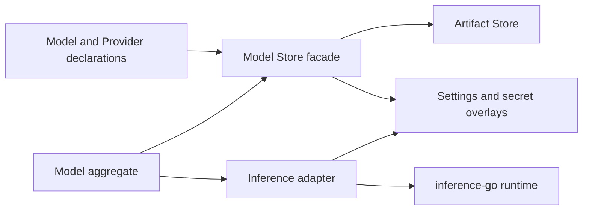

# Model Artifact Store HLD

## Status

This is a proposed target architecture.

The supplied code already has the required Artifact Store foundation, compiled built-in package lifecycle, protected built-in root, universal artifact enablement, and examples of external runtime adapters in Tool and MCP.

The legacy `internal/modelpreset` system remains unchanged during the first
migration phases. The replacement Model Store is source-backed and must not
import `inference-go` or legacy `modelpreset` packages.

## 1. Goal

Replace the legacy nested `ModelPresetStore` model with a new Artifact Store backed Model Store that manages two independent artifact types:

- `model.provider`
- `model`

A Model artifact links to a Provider artifact by a typed logical reference.

The resulting system must:

- Use one Artifact Store and one Model Store facade.
- Not embed models inside provider records.
- Not use Collections or Plugins to group providers and models.
- Allow providers and models to be created, updated, enabled, disabled, removed, and resolved independently.
- Support minimal declarations and layered defaults.
- Support generated built-ins sourced from `inference-go` through an external adapter.
- Keep `inference-go` and the Artifact Store independent.
- Preserve the legacy `modelpreset` store until consumers are migrated deliberately.

The key design rule is:

Provider and Model are source-backed Artifact Store artifacts. Provider
ownership of Model is represented only by an explicit Model-to-Provider
reference, not by nesting, containment, or collection membership. A Provider
may additionally hold a best-effort default Model reference.

## 2. Current state

| Area                    | Current state                                                                                                                                           | Reuse in new design                                                              |
| ----------------------- | ------------------------------------------------------------------------------------------------------------------------------------------------------- | -------------------------------------------------------------------------------- |
| Legacy model catalog    | `internal/modelpreset` has nested providers and models, JSON persistence, built-in overlays, and direct `inference-go` dependency                       | Keep unchanged during migration                                                  |
| Legacy model fallback   | `internal/modelpreset/artifactfallback` maps Artifact `model` names to legacy presets                                                                   | Keep as a temporary compatibility bridge only                                    |
| Artifact Store          | Supports source-backed artifacts, definitions, managed packages, refresh, built-ins, protected roots, enablement, local metadata, and compiled catalogs | Core persistence and lifecycle foundation                                        |
| Built-in hydration      | Tool, MCP, Skill, and Agent use generated `CompiledPackageSet` catalogs                                                                                 | Model built-ins should use the same mechanism                                    |
| Runtime adapter pattern | Tool Store does not import `llmtools-go`; `llmtoolsadapter` does                                                                                        | Model Store should not import `inference-go`; an external inference adapter does |
| Current model contract  | `artifactcontract/declaration/modelv1` is a placeholder model schema                                                                                    | Replace it as a breaking schema change                                           |
| Generic enablement      | `ArtifactAPI.SetEnabled` works even for protected built-ins                                                                                             | Use for Provider and Model independently                                         |
| External overlays       | MCP uses a settings-backed overlay for protected built-ins                                                                                              | Reuse the pattern for model runtime overrides and credentials                    |

The existing `modelv1` schema is registered in the generic declaration codec, but it is not a complete provider-aware model domain and has no dedicated model artifact consumer/runtime path. Given the stated lack of consumers, it should be replaced rather than evolved compatibly.

---

## 3. Requirements

### Functional requirements

- One Model Store facade manages two artifact types:
  - Provider artifacts.
  - Model artifacts.
- Providers and models are independently stored and independently lifecycle-managed.
- A Model explicitly names the Provider it uses.
- A Provider may exist without Models.
- A Model may exist before its Provider is available.
- A Provider removal or disablement must not delete Models.
- A Model whose Provider is unavailable is source-valid but not runnable.
- There are no direct Collections for models or providers.
- Models may be listed by provider as a query/filter operation, not as a persisted provider-owned child list.
- Built-in model definitions come from `inference-go` catalog data through an adapter.
- User-defined providers and models can use minimal declarations.
- More complex provider/model behavior can be declared as optional patches.
- Built-ins support independent enable/disable for Providers and Models.
- Built-ins may support selected runtime overlays without allowing source-definition mutation.

### Dependency requirements

- `internal/model/store/...` must not import:
  - `github.com/flexigpt/inference-go/spec`
  - `github.com/flexigpt/inference-go/modelpreset`
  - legacy `internal/modelpreset`
- `inference-go` must not import:
  - Artifact Store packages.
  - Model Store packages.
  - application packages.
- Runtime code must work from resolved runtime configuration, not by reaching into the Model Store itself.
- Application aggregate/composition code may depend on both the Model Store and the inference adapter.

### Security requirements

- API keys and credentials must not appear in:
  - Provider artifacts.
  - Model artifacts.
  - Artifact Definitions.
  - managed package files.
  - Artifact local `Data`.
  - generated built-in catalogs.
- Credentials must be held in an external secret/settings system and referred to through opaque local references.
- Static headers are allowed only when non-sensitive.
- Authorization headers and API keys must be supplied through credential resolution, not declaration headers.

---

## 4. Target architecture



Dependency direction:

```text
Artifact Store <- Model Store <- Model Aggregate <- Application composition
                                      |
                                      v
                              Inference adapter -> inference-go
```

The important boundary is:

- Model Store owns Artifact Store queries, source-backed model/provider lifecycle, domain validation, provider linkage, and overlay lookup.
- Inference adapter owns translation from portable model/provider data into `inference-go` runtime values.
- `inference-go` stays a standalone runtime library.
- The Model Store never exposes `inference-go/spec.ModelParam` or `spec.ProviderParam` in its contracts.

---

## 5. Artifact model

### 5.1 Artifact kinds

| Domain concept | Artifact kind    | Suggested managed package kind | Notes                                                        |
| -------------- | ---------------- | ------------------------------ | ------------------------------------------------------------ |
| Provider       | `model.provider` | `model-provider`               | A provider connection and default capability/request profile |
| Model          | `model`          | `model`                        | A provider-specific model identity and overrides             |

`model.provider` is intentionally namespaced.

It is a data artifact type, not an `artifactstore/providerapi.Provider` plugin.

### 5.2 No nesting and no collections

The old structure is:

```text
ProviderPreset
  └── ModelPresets map[ModelPresetID]ModelPreset
```

The new structure is:

```text
Provider Artifact     Model Artifact
-----------------     ----------------------------
name                  name
adapter               provider.name
connection patch      provider.scope
defaults patch        providerModelID
capabilities patch    defaults patch
                      capabilities patch
```

The Model Store must not persist:

```text
Provider.Models[]
Provider.DefaultModel
Provider.ModelPresets
Model.Collection
Model.ProviderChildren
```

A package directory is only a source storage unit. It is not a semantic collection.

Suggested managed package layout:

```text
model-provider/<provider-name>/unversioned/model-provider.yaml
model/<model-name>/unversioned/model.yaml
```

Each package can be published, refreshed, replaced, or removed independently.

### 5.3 Independent lifecycle rules

- Deleting a Provider does not delete Models that reference it.
- Disabling a Provider does not disable Models.
- Disabling a Model does not disable its Provider.
- A Model with a missing or disabled Provider remains listable.
- A Model with a missing or disabled Provider cannot resolve to an executable runtime configuration.
- A Model is only runnable when:
  - Model Artifact state is `available`.
  - Model Artifact is enabled.
  - Provider Artifact state is `available`.
  - Provider Artifact is enabled.
  - Provider reference resolves uniquely.
  - A compatible inference adapter is installed.
  - Required credentials are available.
  - Effective configuration validates against adapter rules.

This separates source availability from runtime availability.

---

## 6. Portable declaration schema

## 6.1 Provider declaration

Recommended type:

```yaml
type: model.provider
name: openai-responses
displayName: OpenAI Responses
adapter: openai.responses
```

This is sufficient for a minimal Provider when the selected runtime adapter supplies defaults.

An expanded Provider may declare only the fields it needs to override:

```yaml
type: model.provider
name: custom-openai
displayName: Internal OpenAI Gateway
adapter: openai.responses

connection:
  origin: https://gateway.example.internal
  path: /v1/responses
  headers:
    set:
      X-Product: FlexiGPT
    remove:
      - X-Deprecated-Header

defaults:
  timeoutMS: 120000
  maxOutputTokens: 4096

capabilities:
  modalitiesIn:
    - textIn
  modalitiesOut:
    - textOut
```

The exact capability shape should be owned by the new Model contract, not by `inference-go/capabilityoverride`.

## 6.2 Model declaration

Recommended minimal Model declaration:

```yaml
type: model
name: openai-responses-gpt-5-4
displayName: GPT 5.4

provider:
  name: openai-responses
  scope: builtin

providerModelID: gpt-5.4
```

Expanded Model declaration:

```yaml
type: model
name: internal-gpt-5-4
displayName: Internal GPT 5.4

provider:
  name: custom-openai

providerModelID: gpt-5.4

defaults:
  temperature: 0.2
  maxPromptTokens: 200000
  maxOutputTokens: 16000
  timeoutMS: 90000
  reasoning:
    type: singleWithLevels
    level: medium
  output:
    verbosity: medium

capabilities:
  modalitiesIn:
    - textIn
    - imageIn
  modalitiesOut:
    - textOut
```

### 6.3 Required minimum fields

| Artifact | Required fields                               |
| -------- | --------------------------------------------- |
| Provider | `type`, `name`, `adapter`                     |
| Model    | `type`, `name`, `provider`, `providerModelID` |

Everything else is optional.

This is the progressive-complexity rule.

A simple Provider and Model can work purely through runtime adapter defaults. More fields are declared only when the provider/model needs behavior different from those defaults.

### 6.4 Identity rules

A Model has two identities:

| Field             | Purpose                                                              |
| ----------------- | -------------------------------------------------------------------- |
| `name`            | Portable Artifact logical identity, stable within the Artifact Store |
| `providerModelID` | The provider wire identifier sent to the remote API                  |

Examples of valid `providerModelID` values:

```text
gpt-5.4
claude-sonnet-4-6
deepreinforce-ai/Ornith-1.0-35B-FP8:deepinfra
qwen3-vl:30b
```

These must not be used directly as Artifact logical names because they may include slashes, colons, provider routing suffixes, or unstable external naming conventions.

For generated built-ins, the adapter should create deterministic provider-qualified logical names. It must reject collisions instead of silently merging models.

### 6.5 Provider reference rules

A Model's provider reference should support:

```yaml
provider:
  name: openai-responses
  scope: builtin
```

Resolution behavior:

| Scope           | Resolution behavior                                              |
| --------------- | ---------------------------------------------------------------- |
| Omitted         | Search the Model Artifact's Root first, then protected built-ins |
| `builtin`       | Resolve only in the protected built-in Root                      |
| Any other value | Invalid in v1                                                    |

This permits:

- A user Model using a user Provider in the same Root.
- A user Model using a built-in Provider.
- A built-in Model using a built-in Provider.

It does not permit arbitrary cross-root linkage.

### 6.6 Fields intentionally excluded from v1

The following should not be in the Provider or Model artifact body:

- Raw API keys.
- OAuth tokens.
- Credential values.
- A nested list of Models inside Provider.
- Provider default Model.
- User-selected default Model.
- Artifact IDs.
- Source IDs.
- Artifact revisions.
- `inference-go` structs.
- Go type names such as `spec.ProviderSDKType`.
- Arbitrary top-level locators or alias behavior.

`model` and `model.provider` should be concrete declarations in v1. If aliases are needed later, add an explicit versioned alias design rather than overloading the initial model schema.

---

## 7. Progressive configuration and override order

The runtime must build an effective configuration in this order:

```text
Inference adapter defaults
  -> Provider declaration patch
  -> Provider local runtime overlay
  -> Model declaration patch
  -> Model local runtime overlay
  -> Per-completion request patch
```

This preserves the intended hierarchy:

```text
SDK default < Provider default < Model default < caller request
```

### 7.1 Field ownership

| Concern                        | Adapter default |                  Provider |                   Model |             Request |
| ------------------------------ | --------------: | ------------------------: | ----------------------: | ------------------: |
| Protocol adapter               |             Yes |        Selects adapter ID |                      No |                  No |
| Endpoint origin/path           |             Yes |                  Override |                      No |                  No |
| Authentication header behavior |             Yes | Adapter-approved override |                      No |                  No |
| Credential reference           |              No |              Overlay only |                      No |                  No |
| Static non-secret headers      |             Yes |                  Override |                      No |                  No |
| Timeout                        |             Yes |                   Default |                Override |            Override |
| Stream                         |             Yes |                   Default |                Override |            Override |
| Prompt/output limits           |             Yes |           Default ceiling | Model-specific override | Lower request value |
| Temperature                    |             Yes |                   Default |                Override |            Override |
| Reasoning defaults             |             Yes |                   Default |                Override |            Override |
| Cache/output/stop controls     |             Yes |                   Default |                Override |            Override |
| Provider model ID              |              No |                        No |                Required |                  No |
| Capability baseline            |             Yes |                  Override |       Restrict/override |      Validated only |
| Adapter-specific parameters    |             Yes |            Optional patch |          Optional patch |      Optional patch |

### 7.2 Patch semantics

The schema must distinguish omission from an explicit value.

Recommended rules:

- Missing field means inherit.
- `false` is an explicit override.
- `0` is an explicit override where zero is valid.
- Empty arrays can explicitly clear an inherited list.
- `null` is rejected unless a field explicitly defines null semantics.
- Lists replace inherited lists. They do not append implicitly.
- Header maps use explicit `set` and `remove` operations.
- Header names are compared case-insensitively.
- Adapter-specific JSON values are canonical JSON and replaced atomically by layer.
- There is no implicit deep merge of arbitrary JSON.

This fixes a major limitation of the old store, where zero values and optional fields are difficult to distinguish consistently.

### 7.3 Capabilities

The new Model contract needs its own portable capability patch type. It may mirror the semantics of current `inference-go` capabilities, but must not alias or import its types.

It should support, at minimum:

- Input and output modalities.
- Reasoning modes, levels, token budgets, summaries, context, and encryption.
- Temperature restrictions while reasoning is enabled.
- Stop sequence support and limits.
- Output formats and verbosity.
- Tool support, policy modes, parallel calls, forced tools, and client tool output forms.
- Caching support.
- Adapter parameter dialect where relevant.

Recommended rule:

- Provider capability declarations establish the supported provider envelope.
- Model declarations may narrow that envelope for a specific model.
- Local built-in overlays may narrow capabilities only.
- Capability expansion requires a trusted declaration update or adapter update.

This avoids a local user overlay claiming that an unsupported model can accept tools, images, JSON Schema, or reasoning.

---

## 8. Built-ins from `inference-go`

## 8.1 Required separation

The new Model Store must not import `inference-go`.

Instead, add an outer adapter, conceptually:

```text
internal/model/inferenceadapter
```

It has two jobs:

- Build-time catalog conversion.
- Runtime conversion to `inference-go`.

### Build-time conversion

```text
inference-go/modelpreset.DefaultCatalog()
  -> model inference catalog adapter
  -> canonical Provider and Model declarations
  -> compiled Artifact Store package catalog
  -> generated catalog JSON committed in repository
```

The generated catalog should be installed through the existing compiled package system used by Tools, MCPs, Skills, and Agents.

The runtime should load generated built-in Model artifacts. It should not dynamically read the legacy `inference-go/modelpreset` catalog as its source of truth.

### Runtime conversion

```text
Resolved Provider + Resolved Model + Overlay + Credential reference
  -> inference adapter
  -> inference-go ProviderParam
  -> inference-go ModelParam
  -> inference-go capability resolver
```

The inference adapter is the only place that imports both:

```text
internal/model/...
github.com/flexigpt/inference-go/...
```

The inference runtime itself receives normal `inference-go` values and knows nothing about Artifact Store records.

## 8.2 Built-in mapping

| Legacy catalog field           | New model artifact representation                   |
| ------------------------------ | --------------------------------------------------- |
| `ProviderPreset.Name`          | Provider Artifact logical name                      |
| `ProviderPreset.DisplayName`   | Provider `displayName`                              |
| `ProviderPreset.SDKType`       | Provider `adapter`                                  |
| `Origin`                       | Provider `connection.origin`                        |
| `ChatCompletionPathPrefix`     | Provider `connection.path`                          |
| `APIKeyHeaderKey`              | Provider adapter-approved auth patch                |
| `DefaultHeaders`               | Provider static header patch                        |
| Provider capabilities override | Provider capability patch                           |
| `ModelPreset.ID`               | Deterministic generated Model Artifact logical name |
| `ModelPreset.Name`             | Model `providerModelID`                             |
| `ModelPreset.DisplayName`      | Model `displayName`                                 |
| `ModelParam`                   | Model defaults and limits patch                     |
| Model capabilities override    | Model capability patch                              |
| `AdditionalParametersRawJSON`  | Atomic canonical adapter parameter value            |
| `DefaultProvider`              | Separate local model-selection setting              |
| `DefaultModelPresetID`         | Separate local model-selection setting              |
| Built-in disabled IDs          | Initial enablement and/or built-in overlay state    |

Application-owned legacy adjustments, such as OpenRouter headers, must also move into one of these locations:

- Generated Provider declaration.
- Application-owned Provider runtime overlay.
- Adapter-owned baseline.

They must not remain hidden in legacy `modelpreset/builtin` maps once the new path becomes authoritative.

## 8.3 Built-in package layout

The built-in catalog should use independent packages:

```text
model-provider/<provider>/unversioned/model-provider.yaml
model/<model>/unversioned/model.yaml
```

This preserves independent artifact updates.

A provider package update must not rewrite every model package. A model package update must not rewrite its provider package.

## 8.4 Generated catalog guarantees

The generator must fail if it cannot map a legacy built-in field safely.

It must not silently drop:

- Capability overrides.
- Reasoning defaults.
- Header overrides.
- cache/output/stop configuration.
- provider endpoint behavior.
- disabled state.
- model identity differences.
- router-specific model IDs.

Required tests:

- Generate catalog from `inference-go/modelpreset.DefaultCatalog`.
- Compare generated artifact declarations against committed catalog output.
- Resolve each generated Model through the new Model Store.
- Convert it through the inference adapter.
- Compare effective provider/model runtime behavior with the legacy catalog path.
- Verify that `nil`, explicit false, empty arrays, and empty capability lists retain their meaning.

---

## 9. Built-in override policy

Built-in artifact Definitions remain immutable because they are installed in the protected built-in Root.

Universal enablement still works because `ArtifactAPI.SetEnabled` is explicitly allowed for protected artifacts.

Recommended policy:

| Surface                             | Allowed for built-ins                           | Not allowed                             |
| ----------------------------------- | ----------------------------------------------- | --------------------------------------- |
| Provider enablement                 | Yes, independently                              | Disabling Models implicitly             |
| Model enablement                    | Yes, independently                              | Disabling Provider implicitly           |
| Provider credentials                | Yes, through external credential reference      | Raw API keys or tokens in artifacts     |
| Provider endpoint override          | Yes, through validated Provider runtime overlay | Changing Artifact identity              |
| Provider path/header override       | Yes, only adapter-approved non-secret fields    | Raw Authorization/API key header values |
| Provider request defaults           | Yes, through Provider runtime overlay           | Changing adapter protocol               |
| Model request defaults              | Yes, through Model runtime overlay              | Changing provider reference             |
| Provider default Model              | Yes, as best-effort local metadata              | Hard foreign-key semantics              |
| Model remote ID                     | No                                              | Must create a new Model artifact        |
| Capability restrictions             | Yes                                             | Capability expansion in local overlay   |
| Display name / labels / description | No in protected root                            | Source-definition mutation              |
| Source package bytes                | No                                              | Protected installer only                |
| Default provider/model selection    | Yes, in separate settings                       | Persisting it inside Provider artifact  |

Important behavior:

- Provider disablement gates runtime resolution for all linked Models.
- Model enablement remains its own independent user decision.
- A built-in Model overlay must never mutate its Definition.
- A built-in Provider overlay must never change its adapter identity.
- Credentials are stored outside the Artifact Store Definition and outside generic Artifact `Data`.

For protected built-ins, use the same settings-backed overlay persistence
pattern as MCP. Artifact Store itself provides Artifact.Data for mutable
Artifacts and universal enablement, but does not provide a generic typed
protected-artifact overlay repository. Do not add a custom file-backed model
overlay store.

For normal user-owned artifacts:

- The user can replace their source-backed Provider or Model declaration through managed package publication.
- Runtime overlays remain useful for local credentials and per-install tuning.
- Definitions remain source-owned, not patched through generic Artifact local data.

## 10. Model Store API shape

The Model Store facade should expose independent provider and model operations.

### Read and resolve operations

```text
ListProviders(root, filters)
GetProvider(ref)
ListModels(root, filters)
ListModelsByProvider(providerRef or provider logical name)
GetModel(ref)
ResolveModel(modelRef)
ResolveMappedModel(target)
SetProviderEnabled(ref, revision, enabled)
SetModelEnabled(ref, revision, enabled)
```

`ResolveModel` should return an internal resolved object containing:

```text
- Model Artifact and Definition
- Provider Artifact and Definition
- Model and Provider overlay revisions
- Effective portable configuration
- Effective capability profile
- A configuration fingerprint
```

The fingerprint should include:

- Model Artifact revision and Definition digest.
- Provider Artifact revision and Definition digest.
- Relevant overlay revisions.
- Adapter version.
- Credential version or credential reference metadata, but never raw secret content.

### Managed authoring operations

```text
CreateProvider
ReplaceProvider
DeleteProvider

CreateModel
ReplaceModel
DeleteModel
```

Each must use normal managed package publication and refresh.

They must not write direct rows into Artifact Store SQLite tables.

### Deletion behavior

Provider deletion must not require that no Models exist.

Instead:

```text
Provider removed
  -> Provider Artifact becomes missing
  -> linked Models remain available source artifacts
  -> Model resolution returns provider-unavailable
```

The UI may show dependency warnings, but the storage layer must not impose a provider-to-model cascade.

---

## 11. Default provider and default model selection

Provider `defaultModel` is a best-effort named relationship. The authored
Provider declaration may carry a baseline default. A mutable Provider may
override it through namespaced Artifact.Data. A protected built-in Provider
may override it through its settings-backed overlay.

```text
Provider default resolution:
  mutable Artifact.Data override
  -> protected settings overlay override
  -> Provider declaration defaultModel
  -> first enabled resolved linked Model
```

The global default Provider remains application selection policy. It is not
part of Provider artifact ownership.

## 12. Runtime flow

### 12.1 Resolve and execute a model

1. A caller selects a Model Artifact or Model mapped target.
2. Model Aggregate resolves the Model Artifact.
3. Model Store resolves the linked Provider Artifact.
4. Model Store verifies:
   - Artifact state.
   - Model enabled state.
   - Provider enabled state.
   - Provider reference uniqueness.
   - adapter support.
5. Model Store loads applicable Provider and Model overlays.
6. Aggregate applies the layered configuration merge.
7. Inference adapter resolves credential references.
8. Inference adapter converts portable values into `inference-go` values.
9. `inference-go` executes normally.
10. Runtime caching keys use the effective configuration fingerprint.

### 12.2 Built-in bootstrap

1. Build-time generator reads `inference-go` catalog.
2. Generator emits a compiled Model package set.
3. App composition registers the Model built-in installer.
4. Generic built-in bootstrap hydrates Provider and Model packages.
5. Artifact Store creates or refreshes artifacts.
6. Generic enablement and model-specific overlays are applied.
7. New Model Store can list and resolve built-ins.
8. Legacy `ModelPresetStore` continues serving old consumers until explicit cutover.

### 12.3 User authoring

1. User creates a Provider declaration.
2. Model Store publishes a `model-provider` managed package.
3. Artifact Store refresh creates the Provider Artifact.
4. User creates a Model declaration referencing that Provider name.
5. Model Store publishes a `model` managed package.
6. Artifact Store refresh creates the Model Artifact.
7. The Model becomes runnable only after Provider resolution and credentials succeed.

The inverse order is valid:

1. User creates a Model first.
2. Model is stored and listed.
3. It is unavailable because the Provider is unresolved.
4. User later creates the Provider.
5. The Model becomes resolvable without rewriting the Model artifact.

---

## 13. Legacy migration strategy

## Phase 0: coexistence

- Keep `internal/modelpreset` unchanged.
- Keep `ModelPresetStoreWrapper` unchanged.
- Keep `artifactfallback.Service` unchanged.
- Add the new system under `internal/model`.
- Do not replace old aggregate inference behavior yet.

## Phase 1: new contracts and built-ins

- Replace the placeholder `modelv1` schema.
- Add `model.provider` schema.
- Add generated built-in Provider and Model artifacts.
- Add read/list/resolve APIs.
- Keep them behind a new Model Store API and feature flag if needed.

## Phase 2: new runtime path

- Add Model Aggregate and inference adapter.
- Add a direct Artifact-to-Model mapped target mapper.
- New consumers can resolve new Model artifacts.
- Existing consumers continue using legacy model preset references.

## Phase 3: user data import

Create a migration/import tool that reads:

```text
modelpresets.json
modelpresetsbuiltin.overlay.sqlite
```

It must produce source-backed managed packages, not direct database writes.

Migration rules:

| Legacy data             | New target                                            |
| ----------------------- | ----------------------------------------------------- |
| User ProviderPreset     | Provider managed package                              |
| User ModelPreset        | Model managed package                                 |
| Built-in ProviderPreset | Generated built-in Provider artifact                  |
| Built-in ModelPreset    | Generated built-in Model artifact                     |
| Provider enabled flag   | Artifact enabled state and optional persisted overlay |
| Model enabled flag      | Artifact enabled state and optional persisted overlay |
| Default provider/model  | `ModelSelectionSettings`                              |
| API key behavior        | Credential binding migration or user reconfiguration  |
| Legacy ID               | Migration mapping metadata or sidecar index           |

The migration must be:

- Dry-run capable.
- Idempotent.
- Explicitly report name collisions.
- Explicitly report unsupported adapter parameters.
- Explicitly report unresolved provider links.
- Explicitly report credentials that require user action.
- Non-destructive to the legacy store.

## Phase 4: selective cutover

Migrate consumers one at a time:

- New Model management UI.
- New agent/runtime flows.
- New aggregate completion path.
- Existing conversation paths.
- Remaining legacy preset references.

During coexistence, do not silently mix new and legacy model identity spaces.

Recommended rule:

- Existing legacy consumers continue using old `ModelPresetRef`.
- New consumers use new Model Artifact targets.
- A bridge is only introduced where explicitly required and tested.

## Phase 5: retirement

Only after all consumers and persisted references are migrated:

- Remove legacy model fallback from new resolver configurations.
- Stop creating legacy model preset records.
- Retain read-only import support for at least one migration window.
- Eventually remove `internal/modelpreset` after data migration is complete.

---

## 14. Implementation mapping

| Layer                     | Work                                                                                                            |
| ------------------------- | --------------------------------------------------------------------------------------------------------------- |
| Declaration type registry | Add `TypeModelProvider = "model.provider"` in `artifactcontract/declaration`                                    |
| Provider schema           | Add `artifactcontract/declaration/modelproviderv1`                                                              |
| Model schema              | Replace placeholder `artifactcontract/declaration/modelv1` with provider-linked progressive schema              |
| Canonical codecs          | Register Provider schema codec in `artifactcontract/codec/registry.go`                                          |
| Canonical decoding        | Update declaration decoder tree validation so `model.provider` is a leaf type                                   |
| Resolver registry         | Add `model.provider` policy as a leaf, no selector/fallback support                                             |
| Contract topology         | Add document aliases/discovery for `model.yaml` and `model-provider.yaml`                                       |
| Model domain              | Create `internal/model/store/domain` with portable types, merger, validation, and provider reference resolution |
| Model consumer API        | Create `internal/model/store/consumerapi` for list/get/resolve/manage/enable operations                         |
| Model overlays            | Create `internal/model/store/overlay`, backed by settings and opaque credential refs                            |
| Built-in generator        | Create `internal/model/inferenceadapter/catalog` or equivalent build-time adapter                               |
| Built-in installer        | Create `internal/model/store/builtin` with generated `catalog_generated.json` and `CatalogInstaller`            |
| Model aggregate           | Create `internal/model/aggregate` with direct Artifact-to-mapped-target support                                 |
| Inference bridge          | Create `internal/model/inferenceadapter/runtime` that translates to `inference-go`                              |
| Application composition   | Add Model Store wrapper, aggregate, built-in installer, target mapper, and optional feature flag                |
| Migration tooling         | Add explicit legacy importer outside `internal/modelpreset`                                                     |
| Tests                     | Add parity, no-reverse-dependency, overlay, lifecycle, and migration tests                                      |

Recommended package layout:

```text
internal/model/
  aggregate/
  inferenceadapter/
    catalog/
    runtime/
  store/
    builtin/
    consumerapi/
    domain/
    overlay/
```

The legacy package remains separate:

```text
internal/modelpreset/
```

Do not place new artifact-backed types inside `internal/modelpreset`.

---

## 15. Task status

| Work item                                              | Status in supplied code      | Required action                                 |
| ------------------------------------------------------ | ---------------------------- | ----------------------------------------------- |
| Artifact Store source-backed lifecycle                 | Available                    | Reuse unchanged                                 |
| Protected built-in root and compiled catalog hydration | Available                    | Reuse unchanged                                 |
| Universal artifact enablement                          | Available                    | Wrap for Model Provider and Model APIs          |
| Generic external overlay pattern                       | Available through MCP design | Implement Model-specific overlay repository     |
| Legacy ModelPresetStore                                | Existing and active          | Leave unchanged during migration                |
| Legacy Artifact fallback                               | Existing                     | Keep only as transition bridge                  |
| Placeholder `modelv1` declaration                      | Exists but insufficient      | Replace as breaking schema                      |
| Provider artifact declaration                          | Missing                      | Implement `model.provider`                      |
| Independent Model-to-Provider link                     | Missing                      | Implement in Model contract/domain              |
| New Model Store facade                                 | Missing                      | Implement under `internal/model/store`          |
| Inference catalog adapter                              | Missing                      | Implement outside Model Store core              |
| Generated model built-ins                              | Missing                      | Implement using compiled package pattern        |
| Model target mapper/aggregate                          | Missing                      | Implement analogous to Tool aggregate           |
| Inference runtime adapter                              | Missing                      | Implement as outer dependency adapter           |
| Built-in override policy                               | Missing                      | Implement settings-backed overlays              |
| Legacy data migration                                  | Missing                      | Implement after new read/resolve path is stable |
| Existing old code behavior                             | Working                      | Do not modify in initial phases                 |

## Some implementation decisions

### Schema

There should be no shared `modelcommon` package between Model and Provider declaration contracts.

The only permitted common declaration bridge is a small named-reference type under `artifactcontract/declaration`, because both relationships need the same portable identity shape.

```text
Model -> Provider reference
Provider -> default Model reference
```

Everything else belongs to either:

```text
modelv1
modelproviderv1
```

note the schema should not be partial. It should support full range of features form inferencego.

The following files must be the actual source of truth:

```text
internal/artifactcontract/declaration/modelv1/model-v1.schema.json
internal/artifactcontract/declaration/modelproviderv1/model-provider-v1.schema.json
```

Each document implementation must use:

```go
//go:embed model-v1.schema.json
var schemaJSON []byte
```

or:

```go
//go:embed model-provider-v1.schema.json
var schemaJSON []byte
```

Provider and Model may repeat JSON Schema `$defs`. That duplication is intentional.

Do not create a shared JSON Schema file and do not make one schema depend on the other through `$ref`.

The only shared Go declaration type should be an identity reference:

```go
type ArtifactNameReference struct {
  Name  basespec.LogicalName
  Scope LookupScope
}
```

### Provider default Model is a best-effort link

Provider has an authored default Model reference:

```yaml
defaultModel:
  name: <this shoudl be actual mdoel name and not slug etc i.e gpt-5.5-sol etc>
```

It can be overridden locally:

- Mutable Provider: `Artifact.Data`.
- Protected Provider: settings overlay.

Resolution order:

```text
Provider local metadata defaultModel
  -> Provider declaration defaultModel
  -> first enabled resolved Model attached to this Provider
```

A stale or unresolved default does not invalidate the Provider. It falls back to the first enabled Model deterministically.

### Capability merging is runtime logic

The Model Store must not merge capability profiles.

The Model Store returns:

```text
Provider declaration capability input
Model declaration capability input
Provider local overlay capability input, if allowed later
Model local overlay capability input, if allowed later
```

The inference adapter owns:

```text
adapter base capabilities
+
provider capability declaration
+
model capability declaration
+
runtime request validation
```

The store validates declaration syntax and identity only. It does not decide effective runtime capabilities.

### No pointer slices

Do not use:

```go
*[]string
```

Use ordinary slices:

```go
[]string
```

Semantics:

- `nil` and `[]` mean the same thing for model/provider declarations.
- Empty arrays do not mean “clear inherited values”.
- If behavior must be disabled explicitly, use an explicit boolean property.

Examples:

```json
{
  "supportsReasoningConfig": false
}
```

```json
{
  "isSupported": false
}
```

```json
{
  "supportsTTL": false
}
```

This matches the shape of `inference-go` capability structures better than pointer slices.
The static Model and Provider schemas must support every field in `inference-go/spec.ModelCapabilities`.
The implementation should be structurally identical to MCP's `SettingsOverlayRepository`, but use the Model namespace and Model-specific payload validation.

### Sample target file layout

```text
internal/artifactcontract/declaration/
  model_reference.go
  modelv1/
    document.go
    model-v1.schema.json
  modelproviderv1/
    document.go
    model-provider-v1.schema.json

internal/model/
  aggregate/
    service.go
    target.go

  inferenceadapter/
    catalog_adapter.go
    runtime_adapter.go
    runtime_capabilities.go
    runtime_model_param.go
    runtime_provider_param.go

  store/
    builtin/
      catalog.go
      catalog_generated.json
      catalog_generated_test.go
      catalog_installer.go
      compile.go
      prepare.go

    consumerapi/
      api.go
      default_model.go
      managed.go
      metadata.go
      resolve.go
      types.go

    domain/
      const.go
      package_layout.go
      provider.go
      model.go

    overlay/
      settings_overlay_repository.go
      type_const.go
```

There should be no:

```text
internal/model/bootstrap
internal/model/store/selection
internal/artifactcontract/declaration/modelcommon
```

### Correct generated catalog structure

The Model generated catalog must follow Tool conventions.

- Required files

```text
internal/model/store/builtin/catalog.go
internal/model/store/builtin/catalog_generated.json
internal/model/store/builtin/catalog_generated_test.go
internal/model/store/builtin/catalog_installer.go
internal/model/store/builtin/compile.go
```

- Required behavior

- `catalog.go` follows Tool's `generatedCatalogValue`, `GeneratedCatalogSet`, and `GeneratedCatalogFingerprint` pattern.
- `compile.go` follows Tool's `Compile` pattern.
- `catalog_generated_test.go` follows Tool's candidate-file test pattern.
- Test failure writes:

```text
catalog_generated.next.json
```

- Developer manually renames the candidate:

```text
catalog_generated.next.json
-> catalog_generated.json
```

- There is no `go generate`.
- There is no second enablement manifest.
- There is no precompiled package set being passed into `artifactcontract/builtin.Compile`.

The correct generation flow is:

```text
inference-go catalog
  -> external model inference catalog adapter
  -> []PreparedPackage
  -> artifactcontract/builtin.Compile
  -> CompiledPackageSet
  -> catalog_generated.json
```
