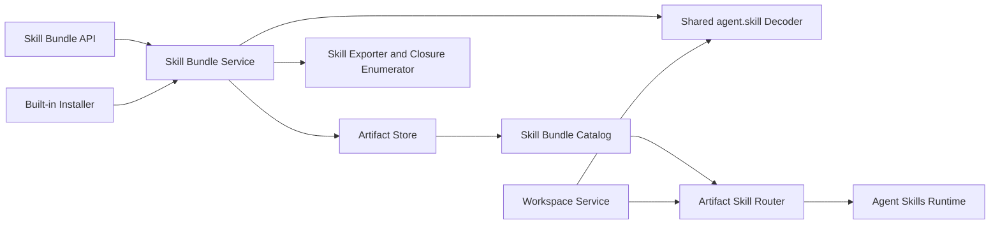
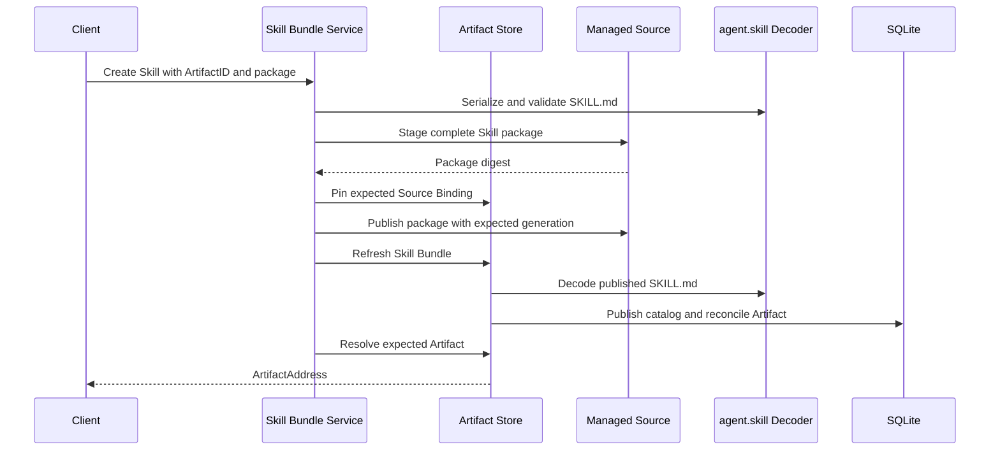
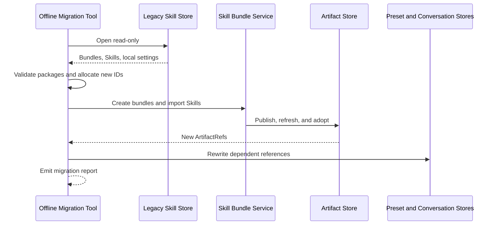
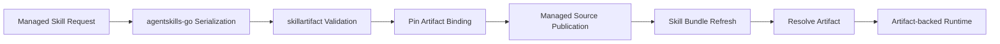

# Skills on Artifact Store High-Level Design

## Document role

This document defines Skill management on Artifact Store.

It is authoritative for:

- Skill Bundle and Skill representation.
- Portable Skill semantics.
- Managed, external, imported, Workspace, and built-in Skill behavior.
- Standalone Skill meaning.
- Skill Bundle import and export.
- Runtime projection into Agent Skills.
- Skill selection identity.
- Migration from the previous standalone Skill Store.

Generic Artifact Store behavior is defined in `artifactstore_hld.md`.

The final section records current implementation mapping and next steps.

## Current delivery scope

The active Skill backend is Artifact Store-backed and includes managed and
external Skill lifecycle, built-in hydration, runtime projection, assistant
preset integration, conversation integration, inference integration, and
frontend bindings.

Standalone and Bundle import/export, generic Skill content closure and archive
support, and direct Skill move are deferred. Test work is handled separately
and is not listed as an outstanding architecture task here.

## Architectural statement

A Skill is portable domain content whose native authority is `SKILL.md`.

Locally, every Skill is represented as an `agent.skill` Artifact Record.

An installed Skill belongs to a `skill.bundle` Collection.

A Workspace Skill belongs to a `workspace.collection`.

Both placements use the same portable Definition and runtime projection.

A standalone Skill is independently importable and exportable. It is not collectionless in local persistence.

Built-in Skills use the same portable Skill and Skill Bundle formats as user content. Static local built-in IDs and installation defaults remain in the app-owned built-in registry.

## Domain mapping

| Skill concept          | Artifact Store concept                           |
| ---------------------- | ------------------------------------------------ |
| Installed Skill Bundle | Local Collection of kind `skill.bundle`          |
| Portable Skill Bundle  | Portable Collection Definition                   |
| Installed Skill        | Local Artifact of kind `agent.skill`             |
| Workspace Skill        | `agent.skill` Artifact owned by a Workspace      |
| Standalone Skill       | Independently transferable `agent.skill` package |
| Skill directory        | Native Source-backed content closure             |
| `SKILL.md`             | Portable Skill semantic authority and entrypoint |
| Skill selection        | `ArtifactRef` plus selection behavior            |
| Runtime Skill          | Ephemeral Agent Skills `SkillDef`                |

## Skill architecture



`skillartifact` owns common `agent.skill` portable decoding and validation.

Both Skill Bundle and Workspace use the same decoder.

The Skill Bundle service owns installed Skill policy. Workspace owns Workspace placement policy.

## Skill Bundle model

A Skill Bundle is:

```text
CollectionKind = "skill.bundle"
```

Its local reference is:

```text
CollectionRef {
  RootID
  CollectionID
}
```

The local Skill Bundle contains:

- Local identity.
- Common enablement.
- Local display alias.
- Source Mounts.
- Local ordering and presentation preferences.
- Artifact Records.
- Catalog and diagnostics.
- Import provenance.
- Retirement state.

The local Collection Record is not exported directly.

## Portable Skill Bundle Definition

A Portable Skill Bundle uses:

```text
CollectionKind = "skill.bundle"
SchemaID = "skill.bundle.v1"
SchemaVersion = "v1"
```

Conceptually:

```json
{
  "kind": "skill.bundle",
  "schema": "skill.bundle",
  "schemaVersion": 1,
  "namespace": "example",
  "name": "writing-skills",
  "version": "1.0.0",
  "labels": {},
  "body": {
    "description": "Portable writing Skills"
  },
  "members": [
    {
      "key": "markdown-output",
      "kind": "agent.skill",
      "content": {
        "locator": "skills/markdown-output/SKILL.md",
        "base": "package"
      },
      "expectedDefinitionDigest": "sha256:...",
      "expectedClosureDigest": "sha256:..."
    }
  ]
}
```

The bundle owns:

- Logical bundle namespace and name.
- Logical version.
- Portable display metadata.
- Portable labels.
- Ordered or unordered member relationships.
- Package-relative member locators.
- Expected member integrity.

The bundle must not contain local Collection or Artifact IDs.

A member `key` is stable within the bundle and is used by:

- Import identity planning.
- Built-in registry mapping.
- Package diagnostics.
- Member update reconciliation.

A member key is not a local Artifact ID.

### Current implemented portable profile

The current codec uses `definition.CollectionDefinition` and generic
`definition.ContentRef` members. Built-in package `collection.json` files use
this profile. Member integrity is the digest of raw `SKILL.md` bytes, not an
expected derived Definition digest or a closure digest.

Stable member keys, expected Definition digests, closure digests, and
self-contained package profiles remain deferred transfer design.

## Skill Artifact model

A Skill is:

```text
ArtifactKind = "agent.skill"
```

Its local durable reference is:

```text
ArtifactRef {
  RootID
  ArtifactID
}
```

Its current placement is:

```text
ArtifactAddress {
  RootID
  CollectionID
  ArtifactID
  Kind = "agent.skill"
}
```

The Artifact Record stores:

- Local identity.
- Current Collection membership.
- Source Binding.
- Current Definition digest.
- Enablement.
- Local display alias.
- Local user tags.
- Source-derived state.
- Diagnostics.
- Revision.

It does not store a runtime path as identity.

## Portable Skill Definition

The canonical `agent.skill` Definition is derived from `SKILL.md`.

It contains portable semantics such as:

- Logical name.
- Display name.
- Description.
- Arguments.
- Insert behavior.
- Source or author labels.
- Markdown instructions.
- Domain-approved frontmatter.

It must not contain:

- Root, Source, Collection, or Artifact IDs.
- Local enablement.
- Local user tags.
- Absolute paths.
- Runtime registrations.
- Runtime sessions.
- Credential values.
- Local diagnostics.

Parser warnings belong to local Observations and diagnostics.

The exact `SKILL.md` byte digest belongs to the source Observation and package integrity model.

## Skill package closure

A Skill is normally a multi-file package.

```text
<skill-name>/
  SKILL.md
  resources/
  scripts/
```

The Skill Content Closure includes:

- `SKILL.md`.
- Domain-approved resource files.
- Domain-approved scripts.
- Required package metadata.

It excludes:

- Files outside the Skill package root.
- Local app metadata.
- Source configuration.
- Runtime indexes.
- Generated session state.
- Secret material injected by the app.

The closure enumerator defines:

- Package root.
- Entry point.
- Included file roles.
- File digests.
- Closure digest.
- Portable executable intent where supported.

Runtime execution permission remains local policy even if a script is included portably.

## Portable authority and local projection

Portable metadata has one authority.

- Skill semantic metadata is owned by `SKILL.md`.
- Bundle semantic metadata is owned by the Portable Skill Bundle Definition.
- The built-in registry does not duplicate portable metadata.
- Any retained app seed descriptor may index package resources, but it must not
  duplicate portable Skill names, descriptions, frontmatter, instructions, or
  member integrity metadata.
- Local list views may cache portable metadata, but the cache is rebuildable and not export authority.
- Local display aliases and user tags remain separate.
- No `MapStore` path, bundle key, overlay key, managed storage layout, or source
  location is durable Skill identity.

If the bundle manifest repeats a Skill logical name for indexing, import must verify it matches the decoded `SKILL.md` Definition.

## Skill placement

### Installed Skill

An installed Skill belongs to a `skill.bundle`.

It is managed through the Skill Bundle feature API.

### Workspace Skill

A Workspace Skill belongs to a `workspace.collection`.

It is managed through Workspace APIs.

It does not appear in installed Skill Bundle management.

### Standalone Skill

Standalone means:

- Independently importable.
- Independently exportable.
- Not dependent on exporting its containing bundle.

A standalone Skill still requires a destination Collection after import.

The destination may be:

- An explicitly selected Skill Bundle.
- A local personal or default Skill Bundle.
- A Workspace, through Workspace import policy.

The default Skill Bundle mapping is local app state. Direct Skill movement and
the import/export relocation fallback are deferred. The current Artifact Store
move operation returns `basespec.ErrUnsupported`.

## Skill Source Mount roles

A `skill.bundle` supports:

| Role       | Meaning                                               |
| ---------- | ----------------------------------------------------- |
| `managed`  | Application-authored Skill packages                   |
| `builtin`  | App-installed portable packages in the protected Root |
| `external` | User-selected filesystem packages                     |
| `imported` | Locally imported package content                      |
| `library`  | Reusable same-Root Skill content                      |

Artifact Store owns Source and Mount mechanics.

Skill Bundle owns:

- Allowed roles.
- Discovery scope.
- Adoption policy.
- Package layout expectations.
- Collision policy.
- Typed detach and cleanup behavior.

## Create Skill Bundle workflow

The caller supplies:

- Root.
- Collection ID.
- Local display defaults.
- Optional managed Source or existing Source Mount.

Skill Bundle service:

- Validates the Root is allowed.
- Creates `skill.bundle`.
- Creates or attaches the selected Source.
- Stores local bundle settings.
- Stores optional local portable-definition digest provenance when supplied.
- Does not publish a portable bundle manifest through a public transfer API.
- Returns `CollectionRef`.

Ordinary callers cannot create bundles in the protected Root.

## Managed Skill creation workflow



The workflow:

- Uses caller-supplied `ArtifactID` as create replay identity.
- Uses package digest as immutable package-content intent.
- Uses Source revision and generation as request-time concurrency tokens.
- Keeps the internal managed Source layout private.
- Validates through the common `agent.skill` decoder.
- Returns an Artifact only after discovery confirms published content.

An internal layout may include local IDs, but export rewrites content into a portable layout.

## Managed Skill update workflow

Managed Skill update:

- Resolves the existing Artifact and Source Binding.
- Verifies expected Artifact and Source revisions.
- Serializes and validates replacement package content.
- Stages and publishes the replacement at the existing stable binding where possible.
- Refreshes the owning Skill Bundle.
- Reconciles the existing Artifact to the new Definition.
- Preserves local enablement, alias, and user tags.
- Returns the new Artifact revision and Definition digest.

A package path change requires explicit trusted rebind behavior or create-copy-remove semantics.

## Managed Skill deletion workflow

Deletion:

- Resolves the Artifact through Skill Bundle ownership.
- Verifies expected revisions.
- Suppresses or otherwise prevents automatic recreation.
- Removes managed package content from the Source.
- Advances Source generation.
- Refreshes or marks the catalog stale.
- Purges or unadopts local Artifact metadata according to requested behavior.
- Reports retry-required state if source deletion completed but metadata cleanup failed.

Generic public Artifact purge is not used directly.

## External Skill workflow

The caller:

- Creates or selects a filesystem Source in the same Root.
- Selects a target Skill Bundle.
- Supplies a relative Skill entrypoint or discovery root.

Skill Bundle service:

- Mounts the Source using role `external`.
- Validates mount-local discovery scope.
- Refreshes the bundle.
- Finds or pins the expected `SKILL.md` Source Binding.
- Adopts the valid Observation.
- Returns `ArtifactAddress`.

The absolute filesystem path remains private Source configuration.

## Standalone Skill import workflow

The caller supplies:

- Portable directory, archive, or supported native input.
- Explicit destination Skill Bundle or request to use the personal bundle.
- Import options.

The workflow:

- Detects and validates `agent.skill`.
- Validates all package-relative paths and file digests.
- Parses `SKILL.md`.
- Enumerates and validates the complete closure.
- Resolves or creates the destination bundle.
- Allocates a new local Artifact ID.
- Stages content in an imported or managed Source.
- Mounts the Source if needed.
- Publishes content.
- Refreshes the destination bundle.
- Adopts the exact imported member.
- Records package provenance.
- Returns `ArtifactAddress`.

The package does not supply the local Artifact ID.

## Skill Bundle import workflow

The workflow:

- Validates `skill.bundle.v1`.
- Validates every required member and closure.
- Rejects duplicate member keys.
- Rejects path collisions and closure escape.
- Allocates local Source, Collection, and Artifact IDs.
- Stages the complete package.
- Creates the local `skill.bundle`.
- Mounts the imported Source.
- Publishes the package.
- Refreshes the bundle.
- Adopts members using the member-key identity plan.
- Records bundle and member provenance.

The initial release fails the complete import when a required member is invalid.

## Standalone Skill export workflow

The workflow:

- Resolves the Artifact and owning Collection.
- Verifies it is an `agent.skill`.
- Verifies current catalog and Source state.
- Loads the portable Definition.
- Captures `SKILL.md` and the complete closure.
- Verifies exact content digests.
- Emits a native directory or deterministic archive.
- Excludes local metadata.

The exported Skill is independent of its local containing bundle.

## Skill Bundle export workflow

The workflow:

- Resolves the local `skill.bundle`.
- Selects members using explicit export options.
- Builds a Portable Skill Bundle Definition.
- Assigns stable package member keys.
- Exports each selected Skill closure.
- Writes package-relative member locators.
- Computes Definition, closure, Collection, and package digests.
- Reports unavailable, denied, invalid, or omitted Skills.
- Emits linked or self-contained output.

Local bundle enablement and presentation ordering are not copied unless the domain explicitly defines a distinct portable equivalent.

## Built-in Skill workflow

Built-in Skills follow the protected topology contract in `artifactstore_hld.md`.

The app-owned registry supplies:

- Static Root, Source, Collection, and Artifact IDs.
- Portable package references.
- Artifact ID to member-key mappings.
- Installation defaults.
- Expected package digests.

Portable Skill Bundle packages supply:

- Logical bundle identity.
- Portable metadata.
- Member keys.
- Member locators.
- Member integrity.
- `SKILL.md` and native files.

Startup installation:

- Validates registry and packages.
- Ensures the protected Root and Source.
- Publishes package content.
- Ensures canonical Skill Bundle Collections.
- Ensures static Artifacts from member mappings.
- Refreshes stale catalogs.
- Preserves local preferences.
- Validates every static UUIDv7 value, package directory, member key, and
  expected package digest before mutation.
- Rejects a non-registry active bundle that claims a declared built-in logical
  bundle name.
- Rejects undeclared active `agent.skill` Artifacts in canonical built-in
  Skill Bundles.

Ordinary managed Skill operations cannot modify built-in package content or topology.

Built-in packages are hydrated into the protected managed Source because Agent
Skills requires a trusted native filesystem package directory for normal
resource and script behavior.

One protected managed Source may contain multiple bundle package roots. Each
canonical built-in Skill Bundle uses Mount-local discovery scope to select only
its own package subtree.

### Current built-in implementation

The implemented built-in metadata is split by ownership:

- `internal/builtin/artifact-builtin-registry.json` supplies the protected Root
  and shared managed Source.
- `internal/builtin/skills/skill-registry.json` supplies static Collection and
  Artifact IDs, package payload locations, member entrypoints, and defaults.
- Embedded `collection.json` files supply portable Collection semantics and
  member references.

`artifactbuiltin` hydrates `collection.json` payloads from embedded bytes,
calculates member digests, publishes complete package directories, pins static
Artifacts, and refreshes scoped catalogs. A persisted topology hydration
fingerprint drives stale protected-topology replacement before installation.

Protected Collection and Artifact enablement is installer-owned. There is no
ordinary user-preference mutation path for built-in topology or package data.

## Built-in semantic references

Portable app references to built-in Skills use:

```json
{
  "bundle": "core-instructions",
  "skill": "markdown-output"
}
```

The application resolves this reference through built-in metadata.

A local assistant preset may store the resolved `ArtifactRef`.

Export converts it back to a semantic reference or returns a portability error.

## Skill runtime selection

Persistent Skill selection uses:

```text
SkillSelection {
  Artifact
  PreLoadAsActive
  UseAsInstructions
}
```

`Artifact` is an `ArtifactRef`.

No persistent Skill selection contains:

- Bundle ID as runtime identity.
- Skill slug as local identity.
- Source path.
- `SkillDef`.
- Runtime provider registration ID.

## Runtime resolution workflow

```mermaid
flowchart LR
    REF[ArtifactRef] --> ARTIFACT[Resolve Artifact Record]
    ARTIFACT --> OWNER[Resolve Owning Collection]
    OWNER --> POLICY[Apply Skill Bundle or Workspace Policy]
    POLICY --> CURRENT[Verify Current Catalog and Availability]
    CURRENT --> DEFINITION[Validate agent.skill Definition]
    DEFINITION --> SOURCE[Verify Source Generation and SKILL.md Digest]
    SOURCE --> PATH[Resolve Trusted Package Directory]
    PATH --> SKILLDEF[Create Ephemeral SkillDef]
    SKILLDEF --> RUNTIME[Agent Skills Runtime]
```



Runtime resolution verifies:

- Artifact and Collection enablement.
- Current Collection membership.
- Current catalog.
- Current Definition digest.
- Source generation or package closure.
- Exact `SKILL.md` content from one confirmed snapshot immediately before
  trusted native-path handoff.
- Trusted local path capability when required.

The Agent Skills runtime owns:

- Provider registration.
- Runtime Skill indexing.
- Sessions.
- Prompts.
- Rendering.
- Resource access.
- Script execution.
- Sandbox behavior.

Artifact Store remains durable authority.

Artifact-backed runtime defaults scripts to disabled. Application composition
may explicitly enable scripts, while Agent Skills and `llmtools-go` retain
execution and sandbox policy ownership.

## Name collision policy

Skill name collisions must never resolve through map order, path order, or registration order.

The initial policy is fail-closed:

- Equal-precedence same-name Skills are unavailable.
- Diagnostics identify every colliding Artifact.
- Explicit `ArtifactRef` still identifies the local record, but runtime registration may reject ambiguity where the upstream runtime requires unique names.
- A future precedence policy must be explicit and explainable.

## Consumer integration

Backend consumers persist Artifact-based references.

| Consumer         | Durable representation                   |
| ---------------- | ---------------------------------------- |
| Skill runtime    | `ArtifactRef`                            |
| Assistant preset | Artifact-backed Skill selection          |
| Conversation     | Enabled and active `ArtifactRef` lists   |
| Inference        | Artifact-backed allow-list               |
| Workspace        | Workspace-owned `ArtifactRef` selections |

The Artifact router resolves current Collection ownership before choosing Skill Bundle or Workspace policy.

No consumer persists runtime `SkillDef` or local Source paths.

## Requirements

| ID       | Requirement                                                                       |
| -------- | --------------------------------------------------------------------------------- |
| `SK-R01` | Represent installed Skill Bundles as `skill.bundle` Collections                   |
| `SK-R02` | Represent all Skills as `agent.skill` Artifacts                                   |
| `SK-R03` | Use `SKILL.md` as portable Skill authority                                        |
| `SK-R04` | Share one `agent.skill` decoder between Skill Bundle and Workspace                |
| `SK-R05` | Support managed Skill creation, update, and deletion                              |
| `SK-R06` | Support external filesystem Skills through relative Source Bindings               |
| `SK-R07` | Preserve local Skill metadata across refresh and update                           |
| `SK-R08` | Use `ArtifactRef` for every durable Skill selection                               |
| `SK-R09` | Project verified Artifacts into ephemeral Agent Skills runtime objects            |
| `SK-R10` | Define a portable `skill.bundle.v1` format                                        |
| `SK-R11` | Support independently importable and exportable standalone Skills                 |
| `SK-R12` | Support complete Skill Bundle import and export                                   |
| `SK-R13` | Preserve `SKILL.md`, resources, and scripts in Content Closures                   |
| `SK-R14` | Install built-ins through portable packages and app-only static metadata          |
| `SK-R15` | Keep built-in and portable metadata separate                                      |
| `SK-R16` | Use fail-closed same-name collision behavior                                      |
| `SK-R17` | Keep runtime synchronization derived from Artifact Store                          |
| `SK-R18` | Keep installed and Workspace Skill ownership separate                             |
| `SK-R19` | Keep local paths, enablement, user tags, and runtime state out of portable Skills |
| `SK-R20` | Eliminate active dependence on the previous standalone Skill Store                |

## Migration addendum

### Migration intent

Artifact Store replaces the previous standalone Skill Store as the active backend source of truth.

The old Skill Store may remain temporarily as:

- Read-only reference code.
- Offline migration input.
- Test comparison input.

It must not remain:

- Active application state.
- A runtime registration source.
- A fallback resolver.
- A dual-write target.
- An identity provider for new Skills.

### Model mapping

| Previous Skill Store concept       | New model                                                |
| ---------------------------------- | -------------------------------------------------------- |
| Installed bundle                   | `skill.bundle` Collection                                |
| Installed Skill                    | `agent.skill` Artifact                                   |
| Bundle ID                          | No longer durable runtime identity                       |
| Skill slug                         | Portable logical field only                              |
| Skill location                     | Private Source configuration and relative Source Binding |
| Installed or Workspace type branch | Derived from current Collection ownership                |
| Skill runtime record               | Ephemeral projection from Artifact Store                 |
| Bundle metadata file               | Portable Skill Bundle Definition where shareable         |
| Local settings                     | Artifact Store and Skill-local SQLite state              |

### Identity migration

Legacy IDs are not reused automatically as Artifact Store IDs.

An offline importer:

- Allocates new Root, Source, Collection, and Artifact UUIDv7 values.
- Creates new Source Bindings.
- Creates new `ArtifactRef` selections.
- Records legacy identifiers only as local migration provenance if needed.
- Rewrites dependent assistant preset and conversation references.

Portable output never contains legacy IDs.

### Migration policy options

Product must choose one policy before release.

#### Reset policy

- Start with clean Artifact Store state.
- Reject old assistant preset and conversation schemas.
- Leave old Skill Store files untouched.
- Require users to reinstall or reimport Skills.
- Remove reference code after verification.

#### Offline importer policy

- Run an explicit migration command outside normal startup.
- Open the old Skill Store read-only.
- Validate every legacy Skill package.
- Create new Artifact Store identities.
- Publish packages into managed or imported Sources.
- Create Skill Bundle Collections and Skill Artifacts.
- Rewrite dependent local references.
- Produce a migration report.
- Never write back to the legacy store.
- Remove the importer from normal application composition.

No automatic startup migration is permitted.

### Offline migration workflow



The migration is complete only when:

- Every migrated Skill resolves through Artifact Store.
- Every dependent reference is rewritten or reported unresolved.
- Runtime registers only Artifact-backed Skills.
- Normal startup no longer opens the legacy store.
- No dual write remains.

### Legacy package removal

The old package may be deleted after:

- Artifact-backed installed Skill management reaches required product parity.
- Managed create, update, delete, and recovery are verified.
- Assistant presets, conversations, inference, and Workspace use `ArtifactRef`.
- Runtime registration no longer imports legacy identity.
- Reset or offline migration policy is complete.
- Reference-only tests have been replaced.

### Migration non-goals

Migration does not:

- Preserve legacy IDs as new Artifact IDs.
- Preserve absolute paths in portable content.
- Add a compatibility adapter to runtime.
- Keep both stores active.
- Run every application startup.
- Introduce a permanent legacy identity branch.

### Acceptance outcomes

Skill management satisfies this HLD when:

- Installed bundles are `skill.bundle` Collections.
- Installed and Workspace Skills use the same `agent.skill` Definition.
- Standalone Skills can be imported and exported independently.
- Skill Bundles preserve complete member closures.
- Built-ins use portable packages with separate app registry metadata.
- All durable Skill selections use `ArtifactRef`.
- Runtime receives only verified ephemeral Skill projections.
- Local aliases, user tags, paths, and enablement never enter portable packages.
- The old Skill Store is inactive and either removed or retained only for explicit offline use.

## Skills Implementation Status and Next Steps

This section records:

- Current package ownership.
- Implemented requirements.
- Partial and missing behavior.
- Legacy Skill Store status.
- Code-level next steps.
- Verification required before completion.

### Current summary

The active backend Skill lifecycle, protected built-in installation, runtime
integration, and frontend integration are Artifact Store-backed.

Present capabilities include:

- `skill.bundle` Collections.
- Shared `agent.skill` decoding.
- Managed Skill creation, same-binding replacement/update, and deletion.
- External filesystem Skills.
- Artifact-backed runtime resolution.
- Assistant preset, conversation, inference, Workspace, and frontend
  integration.
- Caller-supplied Artifact ID replay.
- Protected built-in topology hydrated from embedded `collection.json` files.
- Inactive reference-only legacy Skill Store.

Standalone and Bundle transfer, generic content closure, archive handling, and
direct move are deferred. They are not active delivery gaps for the current
Artifact-backed Skill lifecycle.

### Current implementation architecture

| Responsibility                 | Current package or component                                                 |
| ------------------------------ | ---------------------------------------------------------------------------- |
| Installed Skill feature        | `skillbundle`                                                                |
| Shared portable Skill decoding | `skillartifact`                                                              |
| Agent Skills implementation    | `agentskills-go`                                                             |
| Runtime tools and execution    | `llmtools-go` and Agent Skills runtime                                       |
| Artifact routing               | `internal/skill/runtime.ArtifactRouter`                                      |
| Built-in topology metadata     | `internal/builtin/artifact-builtin-registry.json`                            |
| Built-in Skill registration    | `internal/builtin/skills/skill-registry.json` and embedded `collection.json` |
| Built-in installer             | `internal/skill/artifactbuiltin`                                             |
| Legacy Skill Store             | `internal/skillstore`, reference-only                                        |
| Application composition        | `cmd/agentgo`                                                                |
| Managed payload storage        | Artifact Store managed Source and `MapStore`                                 |
| Portable Skill Bundle          | `skill.bundle.v1` linked manifest codec                                      |
| Transfer service               | Not implemented                                                              |

### Requirement mapping

| Requirement                                | Status                     | Mapping                                                                                      |
| ------------------------------------------ | -------------------------- | -------------------------------------------------------------------------------------------- |
| `SK-R01` Skill Bundle Collection           | Present                    | `skill.bundle` uses Artifact Store Collection                                                |
| `SK-R02` Skill Artifact                    | Present                    | Installed and Workspace Skills use `agent.skill`                                             |
| `SK-R03` `SKILL.md` authority              | Present                    | Common parser and validator                                                                  |
| `SK-R04` shared decoder                    | Present                    | `skillartifact` used by Skill Bundle and Workspace                                           |
| `SK-R05` managed lifecycle                 | Present                    | Create, replacement, refresh, retry, and managed deletion are implemented                    |
| `SK-R06` external Skills                   | Present                    | Filesystem Source and relative Source Binding                                                |
| `SK-R07` local metadata preservation       | Present                    | Artifact local data survives refresh                                                         |
| `SK-R08` ArtifactRef selections            | Present                    | Presets, conversations, inference, Workspace                                                 |
| `SK-R09` runtime projection                | Present                    | Verified ephemeral `SkillDef`                                                                |
| `SK-R10` portable bundle format            | Partial                    | Canonical `collection.json` codec exists; public package transfer is deferred                |
| `SK-R11` standalone transfer               | Deferred                   | No importer or exporter in the current delivery                                              |
| `SK-R12` bundle transfer                   | Deferred                   | No complete package workflow in the current delivery                                         |
| `SK-R13` resources and scripts closure     | Deferred                   | No generic Skill closure builder in the current delivery                                     |
| `SK-R14` built-in package installation     | Present                    | Protected topology hydrates embedded `collection.json` Skill packages through Artifact Store |
| `SK-R15` metadata separation               | Present                    | App registry metadata and portable collection descriptors are fully separated                |
| `SK-R16` same-name collision               | Present                    | Runtime merge and requested allow-lists fail closed on ambiguous names                       |
| `SK-R17` derived runtime state             | Present                    | Demand-driven reconciliation from Artifact Store                                             |
| `SK-R18` ownership separation              | Present                    | Installed and Workspace Skills remain separate                                               |
| `SK-R19` portable exclusion of local state | Present in persisted model | Definitions and collection JSON omit local state; transfer verification is deferred          |
| `SK-R20` legacy Store inactive             | Present                    | Reference-only package remains in source tree                                                |

### Current managed Skill workflow

Current behavior:



The workflow uses:

- Caller-supplied `ArtifactID`.
- Package SHA-256 as immutable content intent.
- Request-time Source revision and generation.
- Shared decoder validation.
- Managed Source staging and publication.
- Refresh before final Artifact resolution.

### Implemented behavior

#### Skill Bundle Collection

Current implementation provides:

- Typed `skill.bundle` service.
- Source Mount policy.
- Collection catalog.
- Artifact enablement.
- Local Skill data.
- External Source support.
- Managed Source support.

#### Managed Skills

Current implementation provides:

- Raw `SKILL.md` input.
- Structured `SkillDocument` input.
- Complete package input.
- Managed package staging.
- Pinning.
- Publication.
- Refresh.
- Replay through caller-supplied Artifact ID.
- Managed content cleanup before local purge.
- Retry-required reporting for partial deletion.

#### Shared Skill definition

Current implementation provides:

- `SKILL.md` parsing through `agentskills-go`.
- Canonical `agent.skill` Definition.
- Shared use by Workspace and Skill Bundle.
- Definition validation before runtime.

#### Runtime

Current implementation provides:

- Artifact router.
- Current Collection ownership resolution.
- Source generation verification.
- Raw `SKILL.md` digest verification.
- Native package path handoff.
- Demand-driven registration.
- Runtime version validation.
- Fail-closed unavailable allow-list behavior.
- Scripts disabled by default unless explicitly enabled.
- Before reconciliation, runtime re-reads each process-local Collection
  partition and removes unavailable partitions. Cached membership never decides
  durable Artifact eligibility.

#### Consumer migration

Current implementation provides:

- Assistant preset Artifact selections.
- Conversation Artifact references.
- Inference Artifact-backed allow-lists.
- Workspace Artifact references.
- No active use of legacy Bundle ID, Skill ID, slug, or location.

#### Legacy Store

Current implementation provides:

- `internal/skillstore` remains in source only for reference or explicit tooling.
- `cmd/agentgo` does not initialize it as active state.
- Runtime does not register legacy Skills.
- New writes do not target it.
- Older schemas are rejected or reset rather than silently adapted.

### Known gaps

#### Pending: schema-backed shareable Skill documents

Add canonical JSON schema documents and associated Go schema types/codecs under
`internal/builtin/schema`. Artifact Store must use those schemas to
canonicalize, validate, store, and retrieve shareable Skill and Collection
documents uniformly.

This migration must absorb the current duplicated portable-document behavior in
`internal/skill/artifactbuiltin/registry.go` and
`internal/skill/bundle/portable.go`, together with any Skill Bundle code that
owns shareable document semantics.

After Artifact Store owns schema-backed storage and retrieval, remove the
duplicated Skill-specific parsing and hydration code. This is pending and is
separate from deferred import/export.

#### Portable Skill closure

There is no reusable Skill closure enumerator covering:

- Package root.
- `SKILL.md`.
- Resource files.
- Script files.
- File roles.
- Exact digests.
- Closure digest.
- Portable executable intent.

Runtime Source verification is not a replacement for portable closure.

This work is deferred with portable Skill and Bundle transfer.

#### Standalone Skill transfer

There is no service for:

- Native directory export.
- Deterministic Skill archive export.
- Native Skill directory import.
- Archive import.
- Import into an explicit bundle.
- Personal/default bundle resolution.
- Import provenance.

This work is deferred.

#### Skill Bundle transfer

The linked `skill.bundle.v1` manifest is not a self-contained package.

Missing behavior includes:

- Member-key identity planning.
- Closure assembly.
- Deterministic package layout.
- Bundle package validation.
- Bundle import.
- Bundle export.
- Omission diagnostics.

This work is deferred with generic Content Closure and transfer orchestration.

#### Built-in package convergence

Built-in hydration is implemented for the current package model:

- Embedded `collection.json` files are hydrated into canonical Collection Definitions.
- Mount-local discovery scope selects each package directory in the shared protected Source.
- Package files and member digests participate in desired-state hydration.
- Static Artifacts are pinned and reconciled from scoped catalog observations.
- Dynamic built-in bundle and Artifact contamination is rejected.

#### Built-in package upgrades

The current upgrade protocol compares the desired hydration fingerprint and
performs a trusted protected-topology reset and reinstall when it changes.
Protected enablement and topology are installer-owned.

#### Installed-Skill management projection

The old management experience included more than raw Artifact rows.

A typed projection is still needed for:

- Portable Skill metadata.
- Local alias and user tags.
- Availability and diagnostics.
- Filtering.
- Pagination.
- Bundle context.
- Current Definition and package state.

#### Same-name policy

The current runtime policy is fail-closed. Collection reconciliation omits
colliding names, returns an explicit conflict, and requested artifact
allow-lists reject ambiguous names before runtime flows use a candidate.

#### Agent Skills session allow-list

Application composition passes resolved Artifact-backed allow-lists into the
Agent Skills session, prompt, list, and tool paths. Future upstream work must
not introduce an application-side shadow Skill catalog.

#### Local update semantics

Managed Skill content-update behavior should be verified as a first-class workflow, including:

- Stable Source Binding.
- Expected Artifact revision.
- Expected Source revision and generation.
- Package digest intent.
- Preservation of local data.
- Runtime version invalidation.

The current `CreateManagedSkill` replay/update path performs same-binding replacement, refresh, and runtime version invalidation.

### Migration status

### Current cutover behavior

Current cutover behavior includes:

- Artifact Store is active Skill authority.
- New Skill selections use `ArtifactRef`.
- Assistant presets use Artifact-backed selections.
- Conversations use Artifact-backed references.
- Inference uses Artifact-backed allow-lists.
- Workspace uses Artifact-backed Skills.
- Legacy runtime identity is inactive.
- No dual write exists.
- Clean `v1` application namespaces are used.
- Assistant preset, conversation, inference, and Workspace integration use the Artifact-backed runtime path.
- No normal application startup path initializes `internal/skillstore`.

#### Remaining migration work

- Remove `internal/skillstore` after final verification.
- Replace any remaining legacy-only tests.
- Complete installed-Skill management projection.
- Complete upstream session allow-list behavior.
- Confirm reset or offline migration policy for released legacy data.
- Remove temporary migration diagnostics or adapters, if any exist.
- Verify no normal package imports `internal/skillstore`.

#### Offline importer status

No offline importer is implemented.

If product chooses reset policy, this is acceptable.

Portable import is deferred. An offline importer must remain outside normal application startup.

If product chooses migration, an explicit external command remains required.

### Deferred transfer design

#### Implement Skill Content Closure

Add to `skillartifact` or a closely owned Skill portability package:

- Package-root detection.
- Entry-point validation.
- Resource and script enumeration.
- File-role classification.
- Exact digest calculation.
- Closure digest generation.
- Portable path validation.
- Source snapshot confirmation.

Use Artifact Store generic closure types.

Do not place archive mechanics in `skillartifact`.

#### Implement standalone Skill exporter

Add a typed Skill service operation that:

- Resolves the Artifact through its owning feature.
- Verifies current state.
- Obtains the shared Skill closure.
- Emits native directory or deterministic archive output.
- Excludes local metadata.
- Works for both installed and Workspace-owned Skills where policy allows.

#### Implement standalone Skill importer

Add support for:

- Explicit target Skill Bundle.
- Personal/default bundle resolution.
- Managed or imported package Source.
- Caller or application-generated Artifact ID.
- Refresh and adoption.
- Provenance.
- Replay with the same ID and package digest.

Workspace-targeted import remains owned by Workspace.

#### Implement Skill Bundle export

Extend `skill.bundle.v1` from linked manifest to complete package export:

- Stable member keys.
- Explicit member Definitions.
- Skill closure references.
- Relative package layout.
- Bundle and package digests.
- Omission diagnostics.
- Deterministic output.

#### Implement Skill Bundle import

Add typed import that:

- Validates complete bundle package.
- Allocates Collection, Source, and Artifact IDs.
- Publishes all package files.
- Creates Source Mount.
- Refreshes bundle.
- Adopts members by member key.
- Records provenance.
- Fails atomically at the logical package level for invalid required members.

#### Complete built-in package installer

Update `artifactbuiltin` to:

- Read portable Skill Bundle packages through the shared package reader.
- Validate package and member digests.
- Resolve registry member-key mappings.
- Publish package trees under stable protected Source roots.
- Scope each Collection mount to its package root.
- Ensure static Artifacts.
- Refresh only stale catalogs.
- Preserve user-local enablement and aliases.
- Reject undeclared structural records.

#### Define built-in update behavior

Add tests and code for:

- Package content change at stable member locator.
- Package version change.
- New member.
- Removed member.
- Failed publication.
- Failed refresh.
- Preserved local preference.
- Static Artifact ID stability.
- Registry and package mismatch.

#### Complete installed-Skill projection

Add typed list and get projections containing:

- ArtifactRef and address.
- Bundle reference.
- Portable name and description.
- Local alias.
- Source labels and local tags.
- Enabled state.
- Availability.
- Diagnostics.
- Current Definition digest.
- Runtime eligibility.
- Pagination and filters.

#### Complete same-name and allow-list behavior

Coordinate application and upstream runtime work so that:

- Runtime sessions retain allowed Artifact-backed Skills.
- `skills-load` cannot load a Skill outside the allow-list.
- Same-name ambiguity is consistently fail-closed.
- Diagnostic output identifies all candidates.
- No application-side shadow catalog is introduced.

#### Remove the legacy package

After parity verification:

- Remove normal imports of `internal/skillstore`.
- Remove legacy registration code.
- Remove obsolete schemas and identity types.
- Retain only a separate migration tool if product chose offline migration.
- Add a repository test that normal application packages cannot import the legacy package.

### Recommended implementation order

The following transfer order is deferred. The schema-backed shareable-document
consolidation remains the active architecture follow-up.

- Finalize Artifact Store Content Closure types.
- Implement shared Skill closure.
- Add standalone Skill export.
- Add Skill Bundle export.
- Complete built-in package loading using the same reader.
- Add standalone Skill import.
- Add Skill Bundle import.
- Define built-in upgrade behavior.
- Complete management projection.
- Complete same-name and session allow-list behavior.
- Decide reset versus offline migration.
- Remove `internal/skillstore`.
- Add end-to-end round-trip and migration tests.

### Required verification

Detailed verification remains deferred outside this HLD status update and is
not an outstanding implementation task for the current delivery.

#### Managed lifecycle

Verify failures after:

- Pin creation.
- Package staging.
- Package publication.
- Source metadata acknowledgement.
- Collection refresh.
- Final Artifact read.
- Managed package deletion.
- Local purge.
- A pending managed Skill rebases after another package advances the same
  managed Source and does not remain permanently tied to its first Source
  revision.

Retries must converge using the same Artifact ID and package digest.

#### Runtime

Verify:

- Runtime re-reads Artifact Store before registration.
- Workspace reconciliation cannot remove installed Skill partitions.
- Installed reconciliation cannot remove Workspace partitions.
- Source generation and `SKILL.md` digest are confirmed.
- Runtime version changes when Artifact revision or package content changes.
- Scripts remain disabled unless explicitly permitted.
- No runtime selection accepts legacy identity.
- MapStore-managed package payloads are accessed only through MapStore.
- Feature services do not add a second link, symlink, path, permission, or
  durability policy above the selected Source adapter or MapStore boundary.

#### Built-ins

Verify:

- Fresh startup creates one protected Root and Source.
- User Root creation creates no built-ins.
- Static registry IDs are used.
- Portable packages contain no local IDs.
- Registry metadata does not duplicate Skill semantics.
- Ordinary managed operations cannot mutate protected content.
- Local preference behavior matches product policy.
- Current catalogs are not republished on every startup.
- Retiring a built-in Collection does not cause startup convergence to recreate
  it or fail because a historical bootstrap marker remains reserved.
- A manually contaminated canonical built-in topology fails with an explicit offline-repair conflict.

#### Transfer

Verify:

- Standalone Skill round-trip.
- Bundle round-trip.
- Resources and scripts preserved.
- New local IDs after import.
- No local path or enablement in output.
- Invalid package closure rejected.
- Deterministic package output.
- Built-in package accepted by the same portable package reader.

#### Migration

Verify:

- `cmd/agentgo` does not initialize legacy Skill Store.
- Presets, conversations, inference, Workspace, and runtime do not call it.
- No dual write exists.
- Legacy schemas are not silently accepted.
- Reset or offline migration policy is explicit.
- Legacy package removal does not alter normal runtime behavior.

### Completion criteria

Skill migration and portability are complete when:

- All active Skill state is Artifact Store-backed.
- Standalone Skills and Skill Bundles can round-trip portably.
- Built-ins use the same portable package format.
- Runtime remains derived and Artifact-backed.
- Installed-Skill management reaches required product parity.
- Same-name and session allow-list behavior is fail-closed and complete.
- The old Skill Store is removed or isolated exclusively in an offline migration tool.
