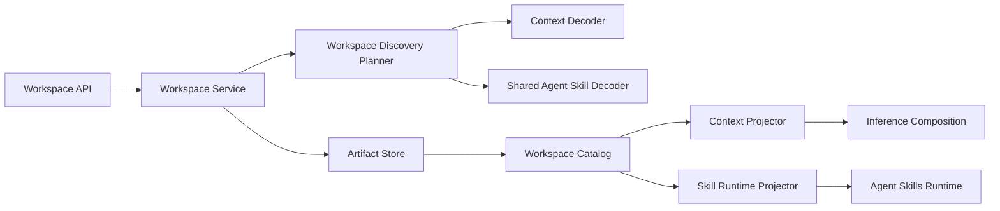
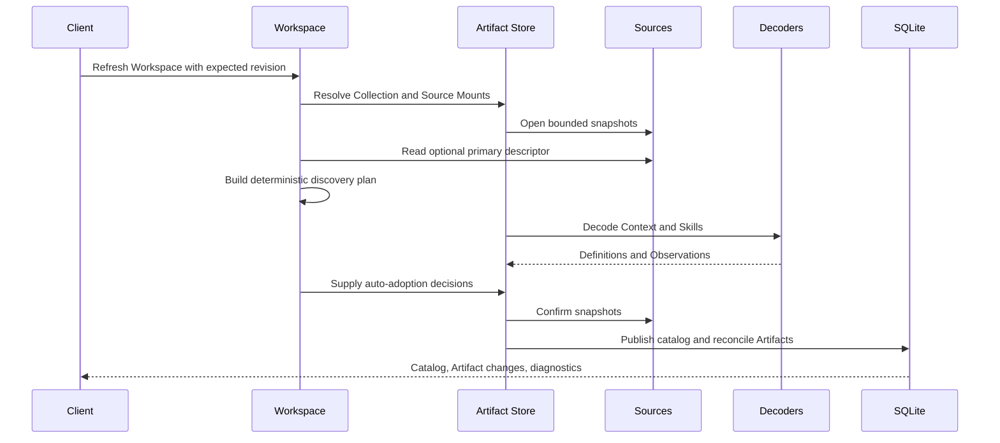
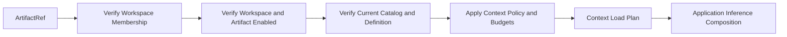
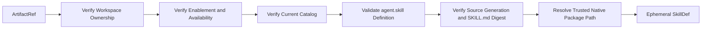
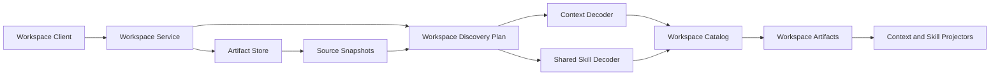

# Workspace High-Level Design

## Document role

This document defines Workspace as a feature built on Artifact Store.

It is authoritative for:

- Workspace meaning and identity.
- Workspace Source roles.
- Supported Workspace Artifact kinds.
- Workspace discovery and adoption policy.
- Workspace Context behavior.
- Workspace Skill behavior.
- Portable Workspace representation.
- Workspace import and export.
- Workspace runtime and application boundaries.

Generic Artifact Store behavior is defined in `artifactstore_hld.md`.

The final section records current implementation mapping and next steps.

## Current delivery scope

The current Workspace delivery includes lifecycle management, catalog and
Artifact management, Context composition, Skill runtime handoff, conversation
selection, inference hydration, frontend bindings, and application composition.

Portable Workspace import/export, Context and Skill content-closure transfer,
and direct Artifact move are deferred. Test work is handled separately and is
not listed as an outstanding architecture task here.

## Architectural statement

A Workspace is a local project Collection that discovers and manages heterogeneous project content.

In the first release, a Workspace supports:

- Context documents.
- Agent Skills.

A Workspace is represented locally as a `workspace.collection`.

A portable Workspace is represented as a Portable Collection Definition and package-relative member closure.

Local Source Mounts, paths, enablement, user preferences, runtime settings, and conversation state are not part of the portable Workspace.

## Domain mapping

| Workspace concept       | Artifact Store concept                                        |
| ----------------------- | ------------------------------------------------------------- |
| Workspace               | Local Collection Record of kind `workspace.collection`        |
| Workspace reference     | `WorkspaceRef{RootID, CollectionID}`                          |
| Portable Workspace      | Portable Collection Definition                                |
| Project directory       | Filesystem Source mounted as `primary`                        |
| Attached content        | Source mounted as `library`, `attached-package`, or `overlay` |
| Context document        | Artifact of kind `workspace.context`                          |
| Workspace Skill         | Artifact of kind `agent.skill`                                |
| Workspace catalog item  | Catalog Observation                                           |
| Selected Workspace item | `ArtifactRef`                                                 |
| Loaded Context          | Runtime Context projection                                    |
| Loaded Skill            | Ephemeral Agent Skills projection                             |

## Workspace architecture



Workspace does not own:

- Root and Source administration.
- Generic persistence.
- Generic package safety.
- Agent Skills sessions.
- Inference provider clients.
- Conversation persistence.
- Installed Skill Bundles.
- Built-in Skill ownership.
- Secret values.
- MCP processes.

## Workspace identity

A Workspace is one Collection:

```text
CollectionKind = "workspace.collection"
```

Its stable reference is:

```text
WorkspaceRef {
  RootID
  CollectionID
}
```

A configured Workspace Root may own multiple Workspaces. Current application
composition uses one retained, non-protected Workspace Root. Public create and
list requests retain a Root field only for transport compatibility; Workspace
creation and listing use the configured Root rather than a caller-selected Root.

A Workspace cannot use the protected built-in Root.

A Workspace is not a Root and does not own child Collections.

Context, Skills, and future supported kinds are Artifacts in the same heterogeneous Workspace Collection.

Workspace selections use:

```text
ArtifactRef {
  RootID
  ArtifactID
}
```

Workspace operations verify that the referenced Artifact currently belongs to the Workspace Collection.

## Local Workspace state

Local Workspace state includes:

- Local display name and description.
- Collection enablement.
- Source Mounts.
- Discovery overrides.
- Auto-adoption preferences.
- Context composition preferences.
- Runtime permission overrides.
- Artifact aliases and local tags.
- Artifact enablement and runtime-disable state.
- Revisions and diagnostics.

Local Workspace data uses a versioned schema.

Current implementation stores feature-local canonical JSON as:

- Collection data containing `DiscoveryPolicyRevision` and discovery preferences.
- Attachment data containing optional recursive and authoritative overrides.
- Artifact data containing `RuntimeDisabled`.

Workspace decodes and validates these structures itself. Artifact Store
currently validates canonical-object shape and size for local feature data.
The pending shared schema work must preserve that separation while moving
shareable document schema ownership and retrieval into Artifact Store.

Prompt and byte limits that are application-wide remain application configuration rather than Workspace data.

The primary Source relationship exists only through the `primary` Source Mount. It is not duplicated as another authoritative Source ID in Workspace local data.

## Workspace modes

Workspace mode is derived from Source Mounts.

### Empty Workspace

An empty Workspace has no enabled primary Source.

It may later receive:

- A primary Source.
- Library Sources.
- Attached packages.
- Overlay Sources.

### Filesystem Workspace

A filesystem Workspace has exactly one enabled primary filesystem Source Mount.

Replacing the primary Source is an explicit Workspace operation and does not replace Workspace identity.

## Source Mount roles

| Role               | Meaning                                 |
| ------------------ | --------------------------------------- |
| `primary`          | Main project Source                     |
| `library`          | Same-Root reusable local or team Source |
| `attached-package` | Imported or mounted package content     |
| `overlay`          | Supplemental content                    |

All Workspace Source Mounts are same-Root.

The `library` role is not a built-in library mechanism.

Workspace cannot mount the protected built-in Source.

Mount-local data may contain:

- Relative discovery root.
- Explicit Context targets.
- Skill roots.
- Include and exclude rules.
- Role-specific priority.

This data is local and is not exported automatically.

## Supported Artifact kinds

The first release supports:

| Kind                | Purpose                       |
| ------------------- | ----------------------------- |
| `workspace.context` | Bounded Context contribution  |
| `agent.skill`       | Shared Agent Skill definition |

Additional kinds require:

- Portable schema.
- Decoder and validator.
- Discovery policy.
- Adoption policy.
- Local view.
- Runtime or product projection.
- Import and export behavior.
- Security policy.

A future kind is not considered supported merely because Artifact Store can persist its JSON.

## Portable Workspace Definition

A portable Workspace uses:

```text
CollectionKind = "workspace.collection"
SchemaID = "workspace.collection.v1"
SchemaVersion = "v1"
```

Conceptually:

```json
{
  "kind": "workspace.collection",
  "schema": "workspace.collection",
  "schemaVersion": 1,
  "namespace": "example",
  "name": "sample-project",
  "version": "1.0.0",
  "labels": {},
  "body": {
    "description": "Portable project context",
    "discovery": {
      "context": [],
      "skillRoots": []
    }
  },
  "members": []
}
```

The exact JSON Schema is owned by Workspace, while the generic envelope and reference forms are owned by Artifact Store.

The portable Workspace may contain:

- Logical name and version.
- Description.
- Portable labels.
- Portable discovery hints.
- Explicit member references.
- Expected Definition and closure digests.
- Package-relative roots.
- Domain-approved portable ordering.

It must not contain:

- Root, Source, Collection, or Artifact IDs.
- Absolute paths.
- Local enablement.
- Local Source roles.
- Source configuration.
- User-specific runtime settings.
- Credential references.
- Conversation state.
- Diagnostics or timestamps.

### Current descriptor profile

`.flexigpt/workspace.json` is currently parsed as
`definition.CollectionDefinition` with schema ID `workspace.collection.v1` and
schema version `v1`. Its body contains Workspace discovery preferences.
Current descriptor members support only relative locators and optional exact
content digests from the primary Source.

Stable member keys, expected derived Definition digests, closure digests,
embedded materialization, external URI acquisition, package profiles, and local
provenance are deferred transfer behavior.

## Workspace descriptor

`.flexigpt/workspace.json` is the native Portable Workspace Definition.

It may be used in two profiles.

### Source descriptor profile

The descriptor may provide:

- Relative discovery targets.
- Skill roots.
- Explicit Context files.
- Expected content digests.
- Portable discovery hints.

Discovery may also find supported conventional content not explicitly listed, according to Workspace policy.

### Package manifest profile

A self-contained exported Workspace must contain:

- An explicit member list.
- Expected member Definition digests.
- Expected member closure digests.
- Package-relative member locators.
- Every required member file.

Discovery globs alone are not sufficient for a self-contained package.

The descriptor is not required to become an Artifact inside the Workspace it describes.

## Portable Workspace members

Each portable member has a stable key.

```text
WorkspaceMember {
  Key
  Kind
  ContentRef
  ExpectedDefinitionDigest
  ExpectedClosureDigest
  Optional
  Order
}
```

For the first release:

- Context members point to Markdown or supported Context documents.
- Skill members point to `SKILL.md` entrypoints or Skill package roots.
- Member locators are relative.
- External URI members may be rejected until acquisition policy is implemented.

## Workspace Context definition

A `workspace.context` Definition contains portable Context semantics.

```text
WorkspaceContextDefinition {
  LogicalName
  DisplayName
  Description
  ContextRole
  PortableOrder
  MediaType
  Text
  Labels
}
```

It must not contain:

- Local prompt budgets.
- Local enablement.
- Local truncation decisions.
- Source paths.
- Conversation state.
- Provider-specific request fields.

For a Markdown Context document, the native file remains the export authority. The canonical Definition is a validated semantic projection.

## Workspace discovery

Workspace initially recognizes:

- `.flexigpt/workspace.json`.
- `AGENTS.md`.
- `CLAUDE.md`.
- Optional `README.md`.
- Explicitly targeted Markdown Context files.
- Configured Skill roots containing `SKILL.md`.

The effective discovery plan is built from:

- Product defaults.
- Portable descriptor hints.
- Local Workspace discovery overrides.
- Source Mount role and local data.
- Registered decoder capabilities.

When a decoder requires an explicit locator or directory-root hint, the
Workspace planner must request that hint directly. Scanning a candidate alone
is not sufficient for decoders that intentionally recognize non-conventional
files only through an explicit discovery request.

Local overrides do not become portable content unless the user explicitly chooses to author them into the portable descriptor.

## Workspace refresh workflow



The refresh:

- Reads and confirms the descriptor from a primary Source snapshot, then pins
  that generation in the subsequent Artifact Store discovery plan.
- Does not publish an intermediate catalog.
- Automatically adopts supported Context and Skill Observations unless suppressed.
- Preserves existing local Artifact state.
- Publishes one coherent catalog.
- Does not mutate runtime registrations.
- Fails publication if the primary descriptor snapshot changes before final
  catalog publication.

A stale Source, Mount, Workspace, decoder, or discovery plan aborts publication.

## Observation and Artifact behavior

Workspace views distinguish:

- Valid unrecorded Observation.
- Invalid Observation.
- Unsupported Observation.
- Adopted Artifact.
- Pinned Artifact.
- Suppressed binding.
- Missing Artifact.
- Incompatible Artifact.
- Disabled Artifact.
- Stale catalog.

An Observation is visible without requiring local adoption.

An Artifact remains locally addressable when its source content becomes missing or invalid.

## Adoption workflow

A user or Workspace auto-adoption policy selects a valid Observation.

Workspace:

- Verifies the Observation kind is supported.
- Allocates or receives an `ArtifactID`.
- Applies kind-specific local defaults.
- Calls Artifact Store adoption.
- Returns `ArtifactAddress`.

Workspace never adopts unsupported kinds merely because their Definitions are valid JSON.

## Pinning workflow

A user may pin expected Context or Skill content before it exists.

Workspace validates:

- Source belongs to the Workspace Root.
- Source is mounted to the Workspace.
- Locator is Source-relative.
- Expected kind is supported.

The pinned Artifact becomes available when a later refresh finds matching valid content.

## Suppression workflow

When removing an automatically adopted Workspace Artifact, the user may choose:

- Remove only the local Artifact.
- Remove and suppress the Source Binding.

Suppression prevents later automatic recreation.

Unsuppression does not immediately recreate an Artifact. A subsequent refresh applies normal auto-adoption policy.

## Context selection workflow

Persistent Context selection uses `ArtifactRef`.

At selection time, Workspace validates:

- Root equality.
- Workspace membership.
- Artifact kind.
- Current visibility.

At inference time, Workspace revalidates current state and does not rely only on selection-time validation.

A usage record may retain:

- Selected Artifact revision.
- Selected Definition digest.
- Used Artifact revision.
- Used Definition digest.
- Source locator for local provenance.
- Availability and truncation decisions.

These are local conversation or inference records, not portable Workspace data.

## Context projection workflow



The Context projector owns:

- Artifact and Collection enablement checks.
- Runtime-disable checks.
- Definition validation.
- Context ordering.
- Prompt and document byte budgets.
- Truncation.
- Exclusion.
- Structured diagnostics.
- Source provenance.

Workspace returns a generic Context load plan. The application decides where it enters provider-specific inference requests.

## Workspace Skill workflow

Workspace uses the shared `agent.skill` Definition.

Runtime resolution is:



Workspace does not persist `SkillDef`, runtime location, or runtime registration state.

The Agent Skills runtime owns:

- Parsing and runtime package behavior.
- Sessions.
- Prompt rendering.
- Resource access.
- Script execution policy.
- Sandboxing.
- Registration lifecycle.

Workspace confirms the Source generation and exact raw `SKILL.md` digest from
one current Source snapshot immediately before handing a trusted native package
directory to Agent Skills.

## Installed and built-in Skill interaction

Workspace owns only Workspace Artifacts.

- Installed Skills remain in `skill.bundle` Collections.
- Built-in Skills remain in the protected Root.
- Workspace does not mount or adopt them, and rejects protected-root access.
- Workspace Artifact references remain same-Root.
- The application may combine Workspace and installed Skill selections for a conversation or agent preset.
- Portable Workspace packages may include their own Skill members.

A future external Skill dependency must use a portable semantic selector, not a local cross-Root `ArtifactRef`.

## Explicit references and portable selectors

Persistent local Workspace selections use `ArtifactRef`.

Portable selectors may match by:

- Artifact kind.
- Namespace and logical name.
- Supported version constraint.
- Portable labels.

Workspace resolution must:

- Exclude disabled, unavailable, stale, and projection-invalid candidates.
- Return unresolved when no candidate remains.
- Return ambiguity when equal-precedence candidates remain.
- Never choose by map order, path order, registration order, or source order.
- Return explainable candidate diagnostics whenever precedence is applied.

## Workspace export workflow

This workflow is deferred. No current Workspace API or Artifact Store service
exports linked or self-contained Workspace packages.

The caller chooses:

- Linked descriptor export.
- Self-contained package export.
- Selected members.
- Omission policy.

Workspace:

- Resolves the current Collection.
- Validates catalog currentness.
- Builds a Portable Workspace Definition.
- Converts selected Context and Skill Artifacts into portable member references.
- Requests Content Closures from Context and Skill exporters.
- Rewrites vendored content to package-relative locators.
- Excludes all local state.
- Reports unavailable or unsupported members.
- Delegates deterministic package assembly to Artifact Store.

Local enablement does not silently determine portable membership. Export selection is explicit.

## Workspace import workflow

This workflow is deferred. No current Workspace API or Artifact Store service
imports a portable Workspace package or allocates an import identity plan.

Workspace import:

- Validates the portable Workspace schema.
- Validates every required member.
- Resolves every relative member closure.
- Allocates new Root, Source, Collection, and Artifact IDs as applicable.
- Creates a managed or package Source.
- Creates the local `workspace.collection`.
- Mounts the Source using local roles.
- Publishes package content.
- Refreshes the Workspace.
- Adopts members using the import identity plan.
- Records package and member provenance.

Imported local IDs never come from the package.

The initial release may reject:

- External URI members.
- Unsupported Artifact kinds.
- Partial import.
- Missing required members.

## Workspace lifecycle

Workspace service rejects the configured protected Root before create, read,
list, refresh, import, mutation, retirement, and purge. This remains true even
when a caller carries trusted installer context.

Workspace implementation must not import built-in metadata, receive a built-in
resolver, or add a protected-root projection branch.

### Create empty Workspace

- Caller supplies a Workspace Collection ID.
- Application composition selects the configured Workspace Root.
- Workspace creates `workspace.collection` in that Root.
- No primary Source is created.
- Local defaults are stored.
- The empty catalog may be absent until refresh.

### Create filesystem Workspace

- Workspace provisioning creates or replays a filesystem Source through Artifact
  Store administration.
- Workspace creates `workspace.collection`.
- Workspace mounts the Source as `primary`.
- Workspace may perform an initial refresh.

### Attach additional Source

- Caller selects an existing same-Root Source.
- Workspace validates role and mount data.
- Workspace creates the Source Mount.
- The previous catalog becomes stale.
- Refresh is explicit.

### Replace primary Source

- Workspace validates the replacement Source.
- Existing Artifacts and suppressions depending on the previous Source must be resolved according to typed cleanup policy.
- Workspace replaces the primary mount.
- Workspace identity remains unchanged.
- The catalog becomes stale.

### Retire and purge

Retirement disables normal use while preserving local state.

Purge requires:

- Correct Workspace kind.
- Expected revision.
- Cleanup of Artifacts and suppressions.
- Cleanup or detachment of Source Mounts.
- Consumer reference policy.
- No ability to purge another Collection kind through Workspace APIs.

## API boundary

### Artifact administration API

Clients use Artifact administration for:

- Root creation and selection.
- Source registration.
- Source update and retirement.
- Source-kind discovery.
- Managed package generation.

### Workspace API

Clients use Workspace APIs for:

- Workspace lifecycle.
- Source Mount roles.
- Workspace refresh.
- Catalog inspection.
- Adoption and pinning.
- Suppression.
- Artifact enablement.
- Context projection.
- Workspace Skill resolution.
- Deferred future Workspace import and export.
- Typed purge.

There is no raw public Collection mutation route.

## Security requirements

Workspace must:

- Reject the protected Root.
- Reject cross-Root Artifact references.
- Reject protected built-in Sources.
- Keep Source configuration private.
- Require current catalog state before runtime handoff.
- Use only trusted Source capabilities for native paths.
- Keep runtime paths out of persistent references.
- Allow a trusted desktop management view to display a selected Source root path
  only as presentation data. That path must not become portable content,
  runtime identity, or conversation identity.
- Apply bounded Context composition.
- Delegate script and sandbox policy to Agent Skills runtime.
- Reject unsupported portable member forms.
- Never execute content during discovery or import validation.

## Requirements

| ID       | Requirement                                                                             |
| -------- | --------------------------------------------------------------------------------------- |
| `WS-R01` | Represent every Workspace as a `workspace.collection`                                   |
| `WS-R02` | Address Workspaces through `WorkspaceRef`                                               |
| `WS-R03` | Support empty and filesystem Workspace modes                                            |
| `WS-R04` | Enforce zero or one enabled primary Source Mount                                        |
| `WS-R05` | Support same-Root library, attached-package, and overlay Sources                        |
| `WS-R06` | Build bounded deterministic discovery plans                                             |
| `WS-R07` | Publish one coherent catalog per refresh                                                |
| `WS-R08` | Support Context and shared Agent Skill Artifacts                                        |
| `WS-R09` | Automatically adopt supported content while respecting suppression                      |
| `WS-R10` | Preserve local Artifact state during refresh                                            |
| `WS-R11` | Compose bounded Context load plans with provenance                                      |
| `WS-R12` | Resolve Workspace Skills through the shared Agent Skills runtime                        |
| `WS-R13` | Keep installed and Workspace Skill ownership separate                                   |
| `WS-R14` | Reject protected-root and cross-Root Workspace ownership                                |
| `WS-R15` | Define a portable `workspace.collection.v1` format                                      |
| `WS-R16` | Export linked and self-contained Workspaces                                             |
| `WS-R17` | Import portable Workspaces with new local IDs                                           |
| `WS-R18` | Preserve Context and Skill content closures                                             |
| `WS-R19` | Keep local paths, enablement, credentials, and runtime state out of portable Workspaces |
| `WS-R20` | Expose Workspace mutation only through typed Workspace APIs                             |

## Acceptance outcomes

Workspace satisfies this HLD when:

- Workspace is a local `workspace.collection`.
- Workspace identity remains stable when Sources change.
- Workspace Context and Skills are normal Artifact Records.
- Context and Skill Observations remain visible before adoption.
- Local Artifact state survives refresh.
- Context selection reaches inference with bounded provenance.
- Workspace Skills use the common `agent.skill` Definition.
- Runtime receives only verified ephemeral Skill projections.
- Workspace does not own installed or built-in Skills.
- `.flexigpt/workspace.json` contains no local IDs or paths.
- A Workspace can be exported with complete Context and Skill closures.
- A Workspace can be imported with newly assigned local IDs.
- Workspace APIs cannot mutate another Collection kind.

## Workspace Implementation Status and Next Steps

This section contains:

- Current implementation coverage.
- Package and component mapping.
- Missing behavior.
- Code-level next steps.
- Verification required for completion.

### Current summary

The local Workspace lifecycle and application integration are complete for:

- Empty and filesystem Workspaces.
- Source Mounts.
- Context and Skill discovery.
- Catalog inspection.
- Artifact adoption and suppression.
- Context composition.
- Artifact-backed Skill runtime handoff.
- Conversation selection and usage provenance.
- Inference Context hydration and Artifact-backed Skill allow-lists.
- Workspace frontend management and Wails bindings.

Portable Workspace transfer and direct Artifact move are deferred.

The current `.flexigpt/workspace.json` support is a limited discovery bootstrap, not a complete import or export format.

### Current implementation architecture

| Architecture responsibility | Current component                                                                  |
| --------------------------- | ---------------------------------------------------------------------------------- |
| Workspace lifecycle         | Workspace feature service over Artifact Store Collections                          |
| Workspace API               | Typed Workspace API and bindings                                                   |
| Source administration       | Shared Artifact Store Root and Source API                                          |
| Source roles                | Workspace attachment validation and local data                                     |
| Discovery planning          | Workspace planner combining defaults, descriptor, mounts, and decoder capabilities |
| Context decoding            | Workspace Context decoder                                                          |
| Skill decoding              | Shared `skillartifact` decoder                                                     |
| Catalog view                | Workspace projection over Artifact Store catalog and Artifacts                     |
| Context projection          | Workspace Context composer and load-plan builder                                   |
| Skill runtime handoff       | Artifact router and Agent Skills runtime                                           |
| Conversation provenance     | Workspace selection and usage recording                                            |
| Runtime synchronization     | Demand-driven resolution from Artifact Store                                       |
| Portable transfer           | Deferred                                                                           |

### Requirement mapping

| Requirement                                | Status                 | Mapping                                                                               |
| ------------------------------------------ | ---------------------- | ------------------------------------------------------------------------------------- |
| `WS-R01` Workspace Collection              | Present                | Workspace uses `workspace.collection`                                                 |
| `WS-R02` WorkspaceRef                      | Present                | Root and Collection identity                                                          |
| `WS-R03` empty and filesystem modes        | Present                | Empty and filesystem creation flows are implemented                                   |
| `WS-R04` one primary Source                | Present                | Mount policy enforces primary behavior                                                |
| `WS-R05` additional Source roles           | Present                | Library, package, and overlay mounts                                                  |
| `WS-R06` deterministic discovery           | Present                | Bounded planner and decoder fingerprints                                              |
| `WS-R07` coherent catalog                  | Present                | One Collection refresh publication                                                    |
| `WS-R08` Context and Skills                | Present                | `workspace.context` and shared `agent.skill`                                          |
| `WS-R09` automatic adoption                | Present                | Auto-adoption and suppression                                                         |
| `WS-R10` preserve local state              | Present                | Refresh reconciliation preserves local settings                                       |
| `WS-R11` Context composition               | Present                | Bounded load plans and provenance                                                     |
| `WS-R12` Skill runtime                     | Present                | Verified Artifact-backed handoff                                                      |
| `WS-R13` separate Skill ownership          | Present                | Workspace Skills excluded from installed Skill management                             |
| `WS-R14` protected Root rejection          | Present                | Workspace feature boundary rejects protected Root and Sources                         |
| `WS-R15` portable Workspace schema         | Partial                | `workspace.collection.v1` descriptor profile exists; schema-backed sharing is pending |
| `WS-R16` Workspace export                  | Deferred               | No linked or self-contained exporter in the current delivery                          |
| `WS-R17` Workspace import                  | Deferred               | No importer or identity planning in the current delivery                              |
| `WS-R18` member closure                    | Deferred               | Depends on deferred Artifact Store and Skill closure support                          |
| `WS-R19` no local state in portable output | Present in local model | Local state is separate; transferable-output verification is deferred                 |
| `WS-R20` typed API boundary                | Present                | Workspace mutations use typed service                                                 |

### Current Workspace workflow

The current local flow is:



### Implemented behavior

### Workspace management

Current implementation provides:

- Create empty Workspace.
- Create filesystem Workspace.
- Update Workspace.
- Replace primary Source.
- Retire Workspace.
- Typed purge.
- Attach existing same-Root Sources.

#### Catalog and Artifact management

Current implementation provides:

- Refresh.
- Catalog currentness.
- Decoder and discovery-plan fingerprints.
- Observation views.
- Automatic adoption.
- Manual adoption.
- Pinning.
- Suppression and unsuppression.
- Artifact enablement.
- Runtime disable.
- Unadoption.
- Typed purge.
- Attached arbitrary Markdown Context through explicit decoder hints.

#### Context

Current implementation provides:

- Context Definition validation.
- Convention ordering.
- Prompt and document byte limits.
- Truncation and exclusion.
- Structured diagnostics.
- Provenance.
- Inference hydration.

#### Skills

Current implementation provides:

- Shared `agent.skill` decoder.
- Workspace ownership validation.
- Current catalog validation.
- Source generation verification.
- Raw `SKILL.md` digest verification.
- Trusted native package path handoff.
- Demand-driven Agent Skills registration.

#### Application integration

Current implementation provides:

- Workspace frontend management.
- Conversation selection provenance.
- Installed Skill UI isolation.
- Workspace-scoped Skill sessions.
- Inference integration.
- No active Root observer or membership cache.
- Workspace session freshness retains `WorkspaceRef` so asynchronous session
  results cannot be accepted for another Workspace.

### Deferred transfer design and pending schema consolidation

#### Pending: schema-backed shareable Workspace documents

Add canonical JSON schema documents and associated Go schema types/codecs under
`internal/builtin/schema` for shareable Artifact and Collection documents.
Artifact Store must use those schemas to validate, canonicalize, store, and
retrieve shareable Workspace documents uniformly.

This migration must absorb the current Workspace-specific descriptor path,
including `workspace/discovery.DescriptorLoader`, the `descriptorBody` decoder
for `.flexigpt/workspace.json`, and Workspace-side retrieval and validation of
shareable Collection documents.

After Artifact Store owns schema-backed document storage and retrieval, remove
the duplicated Workspace implementation code. This is the active pending
architecture item and is separate from deferred import/export.

### Portable Workspace schema

The current descriptor does not yet provide the complete `workspace.collection.v1` contract required by the HLD.

The current bootstrap reader accepts only relative descriptor members from the
primary Source. Embedded members and external URI members are not implemented
in the current local workflow and must continue to return explicit unsupported
or invalid diagnostics until transfer support exists.

Missing or incomplete fields include:

- Explicit portable members.
- Stable member keys.
- Expected Definition digests.
- Expected closure digests.
- Package profile.
- Complete schema validation.
- Import provenance.

The current descriptor profile remains sufficient for local discovery bootstrap.

#### Context closure

Workspace Context export needs a domain Content Closure implementation that provides:

- Native Context file entrypoint.
- Exact byte digest.
- Media type.
- Package-relative export locator.
- Closure digest.

#### Skill closure dependency

This work is deferred with portable Workspace transfer.

Workspace Skill export depends on the shared Skill closure implementation.

Workspace must not implement a second Skill file walker.

#### Workspace exporter

No service currently:

- Builds a Portable Workspace Definition from a local Collection.
- Selects members using explicit export options.
- Exports Context and Skill closures.
- Rewrites package-relative locators.
- Reports omissions.
- Produces deterministic output.

#### Workspace importer

No service currently:

- Validates a complete Workspace package.
- Allocates an import identity plan.
- Creates the package Source.
- Creates the Workspace Collection.
- Mounts Sources.
- Publishes files.
- Refreshes and adopts members.
- Records provenance.

#### Descriptor authority

The current bootstrap reader and the future portable Workspace codec must become one versioned schema rather than two similar representations.

The code should distinguish profile behavior while sharing one decoder and validator.

#### Local data versioning

Workspace local Collection and Artifact data should be checked for:

- Explicit schema ID.
- Explicit schema version.
- Validation on every read and mutation.
- Upgrade behavior.
- Separation from portable Workspace DTOs.

### Deferred transfer design

All transfer-oriented work below is deferred. The schema-backed
shareable-document consolidation above remains the active architecture item.

#### Define `workspace.collection.v1`

Add one domain-owned schema and codec covering:

- Logical Workspace identity.
- Portable description and labels.
- Portable discovery hints.
- Explicit member references.
- Stable member keys.
- Member ordering.
- Definition and closure digests.
- Relative locator validation.

Reuse Artifact Store portable envelope types.

#### Unify descriptor decoding

Replace limited bootstrap-only parsing with a codec that can operate in:

- Source descriptor mode.
- Package import mode.
- Export validation mode.

Unsupported external references should return explicit diagnostics.

#### Implement Context closure

Add a Workspace Context closure enumerator that:

- Captures the exact native Context file.
- Verifies the current Source snapshot.
- Emits one safe package-relative file entry.
- Computes entrypoint and closure digests.
- Does not include local Context policy.

#### Implement Workspace export

Add typed Workspace service operations for:

- Linked descriptor export.
- Self-contained package export.
- Explicit member selection.
- Omission policy.
- Deterministic output.

The service should call Artifact Store transfer orchestration rather than handling archive mechanics directly.

#### Implement Workspace import

Add a typed importer that:

- Validates package and members before mutation.
- Allocates Workspace, Source, Collection, and Artifact IDs.
- Creates a managed or package Source.
- Creates Source Mounts.
- Publishes package content.
- Refreshes the Workspace.
- Adopts members by portable member key.
- Records provenance.

#### Add transfer API projections

Add Workspace API request and response types for:

- Portable input source.
- Import options.
- Export profile.
- Selected member refs.
- Omission behavior.
- Import report.
- Export diagnostics.

Do not expose raw generic Collection bodies.

#### Verify built-in exclusion

The verification checklist is deferred outside this HLD status update. When
scheduled, it must prove:

- Protected Root is rejected during Workspace create, get, list, refresh, import, and purge.
- Protected Source cannot be mounted.
- Cross-Root Artifact refs are rejected.
- Workspace runtime registers only Workspace-owned Artifacts.
- Installed and built-in Skill selections remain application-owned.

#### Add round-trip tests

Cover:

- Empty Workspace export and import.
- Workspace with one Context file.
- Workspace with one Skill package.
- Workspace with Context and Skill.
- Linked source-tree descriptor.
- Self-contained archive.
- New local IDs after import.
- No local IDs or paths in output.
- Missing required member.
- Invalid closure digest.
- Stale Source during export.
- Suppressed local Artifact not leaking as a portable enabled flag.

### Recommended implementation order

The following transfer order is deferred and is not a current implementation
commitment.

- Finalize Artifact Store portable envelope and closure contracts.
- Define `workspace.collection.v1`.
- Unify descriptor parsing.
- Add Context closure.
- Reuse Skill closure.
- Add self-contained Workspace export.
- Add linked descriptor export.
- Add Workspace package import.
- Add API and frontend import/export flows.
- Add complete round-trip and security tests.
- Add additional Artifact kinds only after this path is stable.

### Required frontend and integration verification

Frontend, conversation, and inference integration are complete for the current
delivery. The detailed verification checklist remains deferred.

Verify:

- An empty Workspace can mount a filesystem library Source, discover arbitrary
  Markdown through explicit decoder hints, suppress an automatically adopted
  Observation, and re-adopt it only after unsuppression and refresh.
- Delayed catalog responses cannot overwrite a newer Workspace revision in the
  management UI.
- Workspace menu refresh is guarded per menu-open transition and does not
  recursively reload because callback identity changes.
- Workspace Skill sessions retain the selected `WorkspaceRef` through
  asynchronous session creation and replacement.
- Installed Skill management remains isolated from Workspace-provided Skills.
- Workspace user-message Skills render only through Workspace selection and do
  not appear in installed Skill or Template management.
- Workspace search, radio groups, discovery-path fields, source-binding,
  selection, template-argument, and suppression controls remain accessible.

### Completion criteria

Workspace is complete against the revised HLD when:

- The same Workspace schema supports descriptor, import, and export use.
- Context and Skill members have explicit portable keys and closures.
- A Workspace can round-trip through a self-contained package.
- Imported local IDs differ from exported installation IDs.
- Source Mounts and local policies remain local.
- Workspace import cannot gain access to protected built-ins.
- Context and Skill runtime behavior remains unchanged after transfer support.
