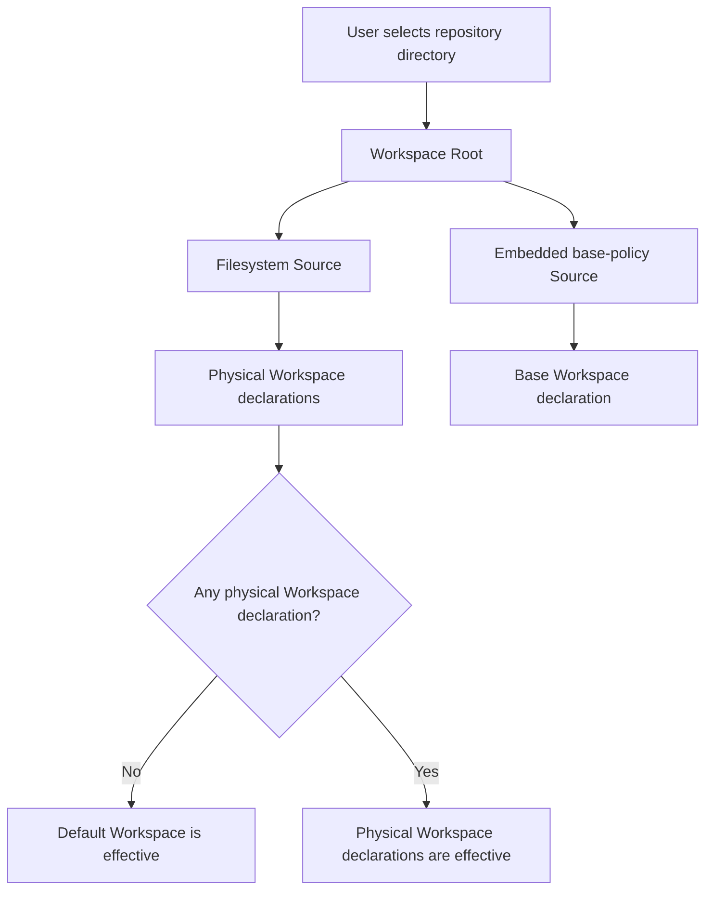
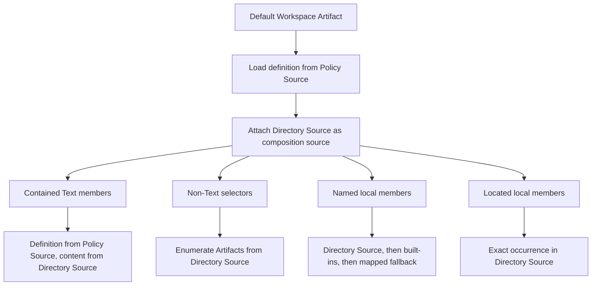

# Workspace Directory Feature HLD

- [Goal](#goal)
- [User requirements](#user-requirements)
  - [Directory-first onboarding](#directory-first-onboarding)
  - [One repository, many Workspace views](#one-repository-many-workspace-views)
  - [No arbitrary cross-repository composition](#no-arbitrary-cross-repository-composition)
  - [Explicit local, built-in, and mapped fallback behavior](#explicit-local-built-in-and-mapped-fallback-behavior)
  - [One enablement model](#one-enablement-model)
- [Terminology](#terminology)
- [Base Workspace policy](#base-workspace-policy)
  - [Location](#location)
  - [Why it is not a protected built-in Workspace](#why-it-is-not-a-protected-built-in-workspace)
  - [Policy contents](#policy-contents)
  - [Text behavior](#text-behavior)
  - [Policy validation restrictions](#policy-validation-restrictions)
- [Embedded policy lifecycle](#embedded-policy-lifecycle)
  - [Application startup](#application-startup)
  - [Workspace Root provisioning](#workspace-root-provisioning)
  - [No hydration](#no-hydration)
  - [Physical layout](#physical-layout)
- [Effective Workspace model](#effective-workspace-model)
  - [Physical Workspace](#physical-workspace)
  - [Default Workspace](#default-workspace)
- [Resolution and materialization flow](#resolution-and-materialization-flow)
  - [Default Workspace member resolution](#default-workspace-member-resolution)
  - [Contained Text in the default policy](#contained-text-in-the-default-policy)
  - [Selectors](#selectors)
  - [Named fallback behavior](#named-fallback-behavior)
- [Default and explicit declaration transitions](#default-and-explicit-declaration-transitions)
  - [Effective mode](#effective-mode)
  - [Transition table](#transition-table)
  - [Existing conversation selection](#existing-conversation-selection)
- [Discovery behavior](#discovery-behavior)
  - [Directory Source base discovery](#directory-source-base-discovery)
  - [Text resource discovery](#text-resource-discovery)
  - [Selector discovery](#selector-discovery)
- [Enablement](#enablement)
  - [Directory enablement](#directory-enablement)
  - [Artifact enablement](#artifact-enablement)
  - [Removed Workspace runtime state](#removed-workspace-runtime-state)
- [API surface](#api-surface)
  - [Directory APIs](#directory-apis)
  - [Paginated list API](#paginated-list-api)
  - [Existing runtime APIs](#existing-runtime-apis)
- [Non-goals](#non-goals)
- [Current implementation status](#current-implementation-status)
  - [Already available](#already-available)
  - [Not yet available](#not-yet-available)
- [Migration and implementation changes](#migration-and-implementation-changes)
  - [Artifact Contract changes](#artifact-contract-changes)
  - [Artifact Store changes](#artifact-store-changes)
  - [Workspace consumer changes](#workspace-consumer-changes)
- [Execution plan](#execution-plan)
  - [Backend phase: policy and Root foundation](#backend-phase-policy-and-root-foundation)
    - [Embed the base Workspace package](#embed-the-base-workspace-package)
    - [Add the in-memory base policy loader](#add-the-in-memory-base-policy-loader)
    - [Register the embedded provider](#register-the-embedded-provider)
    - [Define Root-local Workspace Source roles](#define-root-local-workspace-source-roles)
  - [Backend phase: effective Workspace behavior](#backend-phase-effective-workspace-behavior)
    - [Provision directory and policy Sources](#provision-directory-and-policy-sources)
    - [Add physical manifest inventory](#add-physical-manifest-inventory)
    - [Add effective default-versus-explicit reconciliation](#add-effective-default-versus-explicit-reconciliation)
    - [Add composition-Source context to Workspace resolution](#add-composition-source-context-to-workspace-resolution)
    - [Add template-aware Text materialization](#add-template-aware-text-materialization)
    - [Add source-local Workspace lookup](#add-source-local-workspace-lookup)
    - [Remove Workspace runtime disablement](#remove-workspace-runtime-disablement)
    - [Add paginated directory APIs and wrappers](#add-paginated-directory-apis-and-wrappers)
  - [Frontend bridge phase](#frontend-bridge-phase)
    - [Expose wrapper methods](#expose-wrapper-methods)
    - [Replace frontend Workspace spec and API client](#replace-frontend-workspace-spec-and-api-client)
  - [Frontend phase](#frontend-phase)
    - [Workspace directory list page](#workspace-directory-list-page)
    - [Default policy presentation](#default-policy-presentation)
    - [Workspace selection in conversations](#workspace-selection-in-conversations)
    - [Remove old Workspace UI](#remove-old-workspace-ui)
- [Final feature state](#final-feature-state)

## Goal

Provide a simple repository-oriented Workspace feature.

A user selects one directory. The application creates or reuses one Workspace Root for that directory and exposes one or more effective Workspaces:

- No physical Workspace declaration: one default Workspace policy is applied.
- One physical Workspace declaration: that Workspace is applied.
- Multiple physical Workspace declarations: all are available as peer Workspaces.
- Invalid intended Workspace declarations block default fallback and produce diagnostics.

The user does not configure discovery, source attachments, context paths, or Skill roots in the initial UI.

The repository author can copy the displayed default `workspace.yaml`, place it in the directory, modify it, and refresh.



The base policy is not a source of user configuration. It is a compiled application default that can be copied into the repository and replaced by an explicit declaration.

NOTE: All changes proposed i.e missing things are supposes to be BREAKING changes in the code with no backward compatibility supports. No version bumps are expected. This is a feature in development.
Once this feature is complete and everything is available, this note will be removed.

## User requirements

### Directory-first onboarding

The add flow accepts one directory only.

```text
Add Workspace Directory
  -> choose repository directory
  -> create or reuse Workspace Root
  -> refresh repository Source
  -> return effective Workspaces
```

The initial UI does not ask for:

- Workspace name
- Discovery include or exclude settings
- Source roles
- Context paths
- Skill paths
- Runtime disablement
- Empty Workspace mode

### One repository, many Workspace views

A single repository may contain multiple independent Workspace declarations.

```text
repository/
├── frontend.workspace.yaml
├── backend.workspace.yaml
├── bridge.workspace.yaml
├── frontend/
├── backend/
├── common/
└── skills/
```

These Workspaces are peers, not nested Workspaces.

```text
frontend Workspace
  -> frontend capabilities
  -> common capabilities

backend Workspace
  -> backend capabilities
  -> common capabilities

bridge Workspace
  -> frontend capabilities
  -> backend capabilities
  -> common capabilities
```

A bridge Workspace does not import the frontend or backend Workspace. It independently composes the underlying Artifacts.

### No arbitrary cross-repository composition

Each selected repository directory receives its own Artifact Root.

```text
Root: repository-a
  -> Source: /repos/repository-a

Root: repository-b
  -> Source: /repos/repository-b
```

A Workspace in repository A cannot compose user Artifacts from repository B.

Protected built-ins remain the only cross-Root fallback scope.

### Explicit local, built-in, and mapped fallback behavior

For an ordinary named Workspace member without `scope`:

```text
Workspace composition Source
  -> protected built-in Root
  -> mapped fallback provider
  -> unresolved
```

For:

```yaml
scope: builtin
```

the local Source lookup is skipped:

```text
Protected built-in Root
  -> mapped fallback provider
  -> unresolved
```

A located member never falls back:

```yaml
locator: ./workflows/change-workflow.yaml
```

It resolves that exact local occurrence or remains unavailable.

No lookup searches another user filesystem Source.

### One enablement model

The final feature has:

- Directory enablement through its Sources.
- Generic `Artifact.Enabled` for individual Workspace, Text, Skill, Agent, Plugin, Tool, Model, MCP, and other Artifacts.
- `Artifact.State` for lifecycle state such as available, missing, invalid, or incompatible.

The final feature does not have:

- Workspace-specific `RuntimeDisabled`
- A second “use in conversation” toggle
- Runtime-local enablement stored in `Artifact.Data`

## Terminology

| Term                | Meaning                                                                                 |
| ------------------- | --------------------------------------------------------------------------------------- |
| Workspace Root      | One user Root representing one selected repository directory                            |
| Directory Source    | The filesystem Source rooted at the selected repository directory                       |
| Policy Source       | The immutable embedded Source containing the base Workspace policy YAML                 |
| Physical Workspace  | A Workspace Artifact decoded from a repository file                                     |
| Default Workspace   | A Workspace Artifact decoded from the embedded base policy YAML                         |
| Effective Workspace | A Workspace currently available for selection in a directory                            |
| Declaration Source  | The Source containing the Workspace declaration bytes                                   |
| Composition Source  | The Source against which local Workspace members, selectors, and Text resources operate |

For ordinary physical Workspaces:

```text
Declaration Source = Composition Source = Directory Source
```

For the default Workspace:

```text
Declaration Source = Policy Source
Composition Source = Directory Source
```

## Base Workspace policy

### Location

The base policy is stored in the built-in embedded tree:

```text
internal/artifactcontract/builtin/
└── workspaces/
    └── base/
        └── workspace.yaml
```

`internal/artifactcontract/builtin/embedded.go` exposes this package tree through a dedicated function:

```text
EmbeddedWorkspacePackages()
```

The Workspace feature owns the policy interpretation. The generic built-in installer does not install the base Workspace as a protected built-in Workspace Artifact.

### Why it is not a protected built-in Workspace

A default Workspace in the protected built-in Root would have a different `RootID` from the repository Artifacts it needs to compose.

Current Workspace runtime paths require selected resources to share the Workspace Root.

Therefore, the active default Workspace Artifact must be instantiated in the user Workspace Root, even though its declaration bytes come from application embedded content.

### Policy contents

The base YAML is a normal `workspace` declaration.

It contains:

- Contained source-backed Text members for instructions and repository context.
- Selectors for non-Text declaration types.
- No Workspace members.
- No Text selectors.
- No contained non-Text declarations.
- No runtime state or enablement fields.

Conceptually:

```yaml
type: workspace
name: default-workspace
displayName: Default Workspace

members:
  - type: text
    name: default-workspace-instructions
    insert: instructions
    locator: .
    parameters:
      mediaType: text/markdown
      include:
        - "**/AGENTS.md"
        - "**/CLAUDE.md"
        - "**/GEMINI.md"
        - "**/COPILOT.md"
        - "**/INSTRUCTIONS.md"
        - "**/.cursorrules"
        - "**/.windsurfrules"
        - "**/.github/copilot-instructions.md"
        - "**/.cursor/rules/**/*.md"
        - "**/.github/instructions/**/*.md"

  - type: text
    name: default-workspace-context
    insert: user-message
    locator: .
    parameters:
      mediaType: text/markdown
      include:
        - "**/README.md"
        - "**/llms.txt"
        - "docs/**/*.md"

  - type: skill
    base: .
    include:
      - "**/SKILL.md"

  - type: agent
    base: .

  - type: plugin
    base: .

  - type: mcp
    base: .

  - type: mcp.policy
    base: .

  - type: model
    base: .

  - type: tool
    base: .

  - type: team
    base: .

  - type: loop
    base: .

  - type: workflow
    base: .
```

The exact convention list is product policy. It can evolve by editing this embedded YAML.

### Text behavior

The contained Text declarations are important.

They do not select Text Artifacts. They select source files and combine them into one Text Artifact contribution.

```text
Contained Text declaration
  -> one Text Artifact
  -> locator = repository root
  -> include and exclude patterns
  -> verified source files
  -> deterministic combined content
```

For example, all matching instruction files become content for:

```text
default-workspace-instructions
```

They do not become individual Text Artifacts merely because they match a pattern.

This preserves the existing Text contract:

```text
Text locator/include/exclude
  -> source materialization

Skill, Agent, Plugin, Tool, Model, MCP selectors
  -> declaration Artifact selection
```

### Policy validation restrictions

The embedded base policy is validated at application startup.

In addition to ordinary `workspacev1` validation, it must satisfy feature-specific restrictions:

- Every Text member is contained and source-backed.
- Every non-Text member is a selector or an explicit built-in named member.
- No contained non-Text declaration is permitted.
- No Workspace member is permitted.
- No Text selector is permitted.
- No local runtime state is present.

These restrictions make source-attachment behavior bounded and predictable.

## Embedded policy lifecycle

### Application startup

At startup:

- The application reads `workspaces/base/workspace.yaml` from the built-in embedded filesystem.
- It canonicalizes and validates the YAML as a Workspace declaration.
- It calculates the policy digest.
- It keeps raw YAML, canonical JSON, policy ID, version, and digest in memory.
- It registers the embedded package filesystem in `compositionapi.Config.EmbeddedProviders`.

At this point:

```text
No user Root is created.
No policy Source is created.
No policy Artifact is created.
No file is written to disk.
```

The in-memory policy is used for:

- Validation
- UI display
- Copy-to-clipboard content
- Version and digest reporting
- Provisioning policy Sources later

### Workspace Root provisioning

When a repository directory is added, the application creates or reuses:

```text
Workspace Root
├── workspace-directory Source
└── workspace-base-policy Source
```

The directory Source is:

```text
kind: fs-directory
rootPath: selected native directory
```

The policy Source is:

```text
kind: embedded-directory
providerKey: workspace-default-policy
root: base
```

The policy Source discovery configuration is intentionally narrow:

```text
explicit locator: workspace.yaml
decoder: artifact-declaration-yaml
```

The policy Source is immutable in content because it reads the compiled embedded filesystem.

### No hydration

The base policy does not use:

- `ManagedArtifactAPI.Publish`
- Managed package storage
- Protected topology installation
- Built-in package hydration
- Hydration markers
- Managed source content directories

It uses normal embedded Source refresh:

```text
Ensure embedded Source
  -> Refresh embedded Source
  -> YAML decoder
  -> Definitions
  -> Root-local Artifacts
```

### Physical layout

| Location                                 | Content                                                    |
| ---------------------------------------- | ---------------------------------------------------------- |
| Application binary                       | Embedded base Workspace YAML                               |
| User repository                          | No generated files                                         |
| Managed Artifact Store content directory | No policy copy                                             |
| Artifact Store SQLite                    | Root, Source, Definition, Artifact, and refresh-state rows |
| Embedded Source snapshot                 | Reads policy bytes directly from compiled `fs.FS`          |

## Effective Workspace model

The Workspace feature resolves an effective Workspace instance.

```text
EffectiveWorkspace
  -> Workspace ArtifactRef
  -> Origin
  -> Declaration Source ID
  -> Composition Source ID
  -> Policy metadata when origin is default
```

### Physical Workspace

```text
Origin = manifest
Workspace Artifact Source = Directory Source
Declaration Source = Directory Source
Composition Source = Directory Source
```

Normal resolver and runtime behavior applies.

### Default Workspace

```text
Origin = default
Workspace Artifact Source = Policy Source
Declaration Source = Policy Source
Composition Source = Directory Source
```

The default policy is treated as a template instantiated for the selected directory.

## Resolution and materialization flow

### Default Workspace member resolution



### Contained Text in the default policy

The contained Text Artifact itself belongs to the policy Source.

Its source content must come from the attached Directory Source.

```text
Text Artifact Definition
  -> policy Source

Text locator, include, exclude
  -> directory Source
```

The Workspace prompt adapter needs a template-aware Text materialization path.

It must:

- Resolve and verify the Text Artifact Definition through the policy Source.
- Resolve the Text locator relative to the policy template root.
- Read the source tree from the attached Directory Source.
- Apply Text include and exclude patterns.
- Return one deterministic Text contribution.

For a physical user-authored Workspace, the existing Text materialization path remains unchanged because declaration and content Sources are the same.

### Selectors

Non-Text selectors in the default policy operate against the attached Directory Source.

Examples:

```text
Skill selector
  -> Skill Artifacts from repository Source

Agent selector
  -> Agent Artifacts from repository Source

Plugin selector
  -> Plugin Artifacts from repository Source
```

Selectors remain unsupported for:

- Text
- Workspace

### Named fallback behavior

For Workspace resolution:

```text
Unscoped named member:
  composition Source
  -> protected built-in Root
  -> mapped fallback provider
  -> unresolved

scope: builtin:
  protected built-in Root
  -> mapped fallback provider
  -> unresolved
```

A located member remains exact and has no fallback.

No user Source other than the composition Source is searched.

## Default and explicit declaration transitions

### Effective mode

The default Workspace is effective only when all of the following are true:

```text
Directory Source is enabled
Policy Source is enabled
Default Workspace Artifact is available
Default Workspace Artifact is enabled
No physical Workspace manifest intent exists
No physical Workspace Artifact exists
```

Physical manifest intent includes known filenames such as:

```text
workspace.yaml
workspace.yml
workspace.json
*.workspace.yaml
*.workspace.yml
*.workspace.json
```

A known physical manifest blocks fallback even if it is invalid.

### Transition table

| Repository state               | Effective result                  |
| ------------------------------ | --------------------------------- |
| No manifest files              | Default Workspace                 |
| One valid manifest             | One physical Workspace            |
| Several valid manifests        | All physical Workspaces           |
| Manifest exists but is invalid | No default Workspace, diagnostics |
| Manifest removed               | Default Workspace returns         |
| Directory disabled             | No effective Workspace            |

### Existing conversation selection

The default Workspace has a normal Root-local `ArtifactRef`.

If a conversation selected it and a physical Workspace manifest later appears:

```text
Default Workspace reference
  -> no longer effective
  -> Workspace Store reports it unavailable for that directory
```

The conversation can then select an explicit Workspace.

If all physical manifests are later removed, the same default Workspace `ArtifactRef` becomes effective again.

## Discovery behavior

### Directory Source base discovery

The normal Workspace discovery profile remains the baseline Source configuration.

It discovers declaration candidates such as:

- Canonical YAML and JSON
- Skills
- Agents
- Plugins
- MCP configuration
- Markdown adapter inputs
- Standard Workspace documentation files

### Text resource discovery

Contained Text source patterns do not require every matching file to be discovered as an Artifact.

For example:

```text
docs/**/*.md
.cursor/rules/**/*.md
.github/instructions/**/*.md
```

These files are read as verified source resources through `ResourceAPI.ReadSourceTree`.

This is separate from declaration discovery.

### Selector discovery

Selectors require declaration Artifacts.

A Workspace refresh:

- Resolves active Workspace declarations.
- Identifies reachable selectors and located members.
- Adds required discovery scopes to the Directory Source.
- Refreshes the Directory Source.
- Re-resolves the active Workspace set.

Text include and exclude patterns are not added as declaration selector scopes.

## Enablement

### Directory enablement

A Workspace directory is enabled when both of its Sources are enabled:

```text
workspace-directory Source
workspace-base-policy Source
```

Disabling the directory disables both.

Effects:

- Physical Workspace Artifacts become unavailable.
- The default Workspace becomes unavailable.
- Source resource reads stop.
- No files are deleted.
- No Artifact enablement values are changed.

Re-enabling the directory enables both Sources and refreshes them.

### Artifact enablement

`Artifact.Enabled` is the only individual Artifact enable state.

It applies to:

- Workspace Artifacts
- Text Artifacts
- Skills
- Agents
- Plugins
- Tools
- Models
- MCP servers
- MCP policies
- Teams
- Loops
- Workflows

A disabled Artifact is not usable by Workspace runtime planning.

### Removed Workspace runtime state

The final feature removes:

```text
RuntimeDisabled
workspace.runtime.disabled
Use in conversations toggle
```

Fallback activation is derived from directory state and physical declaration presence. It is not represented by a second enable field.

## API surface

### Directory APIs

```go
type WorkspaceDirectoryRef struct {
  RootID root.RootID `json:"rootID"`
}

type WorkspaceDirectoryOrigin string

const (
  WorkspaceDirectoryOriginDefault  WorkspaceDirectoryOrigin = "default"
  WorkspaceDirectoryOriginManifest WorkspaceDirectoryOrigin = "manifest"
)

type WorkspaceDirectoryWorkspace struct {
  Workspace       workspaceDomain.WorkspaceView `json:"workspace"`
  Origin          WorkspaceDirectoryOrigin      `json:"origin"`
  ManifestLocator basespec.Locator              `json:"manifestLocator,omitempty"`
}

type WorkspaceDirectoryView struct {
  Ref             WorkspaceDirectoryRef          `json:"ref"`
  Root            root.Root                      `json:"root"`
  DirectorySource source.Summary                 `json:"directorySource"`
  Enabled         bool                          `json:"enabled"`
  PolicyID        string                        `json:"policyID"`
  PolicyVersion   string                        `json:"policyVersion"`
  PolicyDigest    cryptoutil.Digest             `json:"policyDigest"`
  Workspaces      []WorkspaceDirectoryWorkspace `json:"workspaces"`
  Diagnostics     []diagnostic.Diagnostic       `json:"diagnostics,omitempty"`
}
```

The Workspace Store exposes:

```go
RegisterWorkspaceDirectory(
    ctx context.Context,
    path string,
) (WorkspaceDirectoryView, error)

GetWorkspaceDirectory(
    ctx context.Context,
    ref WorkspaceDirectoryRef,
) (WorkspaceDirectoryView, error)

RefreshWorkspaceDirectory(
    ctx context.Context,
    ref WorkspaceDirectoryRef,
) (WorkspaceDirectoryView, error)

SetWorkspaceDirectoryEnabled(
    ctx context.Context,
    ref WorkspaceDirectoryRef,
    expectedRevision uint64,
    enabled bool,
) (WorkspaceDirectoryView, error)

RemoveWorkspaceDirectory(
    ctx context.Context,
    ref WorkspaceDirectoryRef,
    expectedRevision uint64,
) error
```

The exact Root creation boundary can remain in the application wrapper if the Store API should remain Root-aware.

### Paginated list API

```go
type WorkspacePageRequest struct {
  Cursor string `json:"cursor,omitempty"`
  Limit  int    `json:"limit,omitempty"`
}

type WorkspacePage struct {
  Items      []WorkspaceDirectoryView `json:"items"`
  NextCursor string                   `json:"nextCursor,omitempty"`
}
```

```go
ListWorkspaceDirectories(
    ctx context.Context,
    request WorkspacePageRequest,
) (WorkspacePage, error)
```

The first implementation pages directory Roots, not individual Workspace Artifacts.

One page item can contain:

```text
one repository directory
  -> one default Workspace
```

or:

```text
one repository directory
  -> several explicit Workspaces
```

### Existing runtime APIs

Current runtime APIs can remain `ArtifactRef`-based:

```text
ComposeWorkspacePrompt
LoadWorkspaceSkills
LoadWorkspaceMCPServers
ResolveWorkspaceRuntimePlan
```

They need Workspace Store resolution to determine whether an `ArtifactRef` is:

- A physical Workspace
- A default policy Workspace
- Currently effective
- Attached to a composition Source

## Non-goals

The initial feature does not add:

- Workspace-to-Workspace imports
- Nested Workspaces
- Arbitrary cross-Root imports
- Cross-repository Source fallback
- Text selectors
- Per-Workspace runtime disablement
- UI configuration of raw Source discovery specs
- Automatic writing of `workspace.yaml` into repositories
- Managed package hydration for Workspace policy bytes
- Remote Workspace policy locators

## Current implementation status

### Already available

| Capability                                                      | Status                         |
| --------------------------------------------------------------- | ------------------------------ |
| Workspace v1 declaration schema                                 | Available                      |
| Workspace YAML and JSON decoding                                | Available                      |
| Workspace Artifact creation from physical source                | Available                      |
| Contained declaration emission                                  | Available                      |
| Contained Text declarations                                     | Available                      |
| Text locator/include/exclude source materialization             | Available                      |
| Skill selectors                                                 | Available                      |
| Agent, Plugin, MCP, Model, Tool, Team, Loop, Workflow selectors | Available where schemas permit |
| Source-backed Artifact lifecycle                                | Available                      |
| Embedded Source adapter                                         | Available                      |
| Embedded provider registration capability                       | Available                      |
| Root-local Artifact identity                                    | Available                      |
| Workspace capability planning                                   | Available                      |
| Workspace prompt, Skill, and MCP planning                       | Available                      |
| Built-in fallback infrastructure                                | Available                      |
| Generic Artifact enablement                                     | Available                      |
| Source enablement                                               | Available                      |
| Root list API                                                   | Available                      |

### Not yet available

| Capability                                      | Status  |
| ----------------------------------------------- | ------- |
| Embedded base Workspace package                 | Missing |
| Embedded Workspace policy provider registration | Missing |
| Per-Root policy Source provisioning             | Missing |
| Default Workspace effective-mode calculation    | Missing |
| Default policy composition-source attachment    | Missing |
| Template-aware Text materialization             | Missing |
| Source-local Workspace named lookup             | Missing |
| Physical manifest intent inventory              | Missing |
| Multiple Workspace directory result             | Missing |
| Paginated Workspace directory list API          | Missing |
| Directory enable API                            | Missing |
| `RuntimeDisabled` removal                       | Missing |
| Workspace wrapper directory API                 | Missing |
| Simplified frontend                             | Missing |

## Migration and implementation changes

This section is implementation-oriented. It does not change the final-state requirements above.

### Artifact Contract changes

Required:

- No Text selector support.
- No Workspace selector support.
- No new portable Workspace fields.
- No new Text fields.
- No change to contained declaration semantics.

Potential resolver extension:

- Add an internal or additive Workspace resolution context that distinguishes declaration Source from composition Source.
- Preserve existing resolver behavior for normal physical declarations.
- Apply composition Source behavior only to the embedded policy template.

### Artifact Store changes

Required:

- No SQLite schema change.
- No new Artifact state.
- No new Source adapter.
- No managed package publication.
- No hydration installer.
- No protected Root policy change.

Application composition change:

- Register the embedded Workspace package filesystem through `EmbeddedProviders`.

Workspace feature change:

- Create `embedded-directory` policy Sources in user Workspace Roots.
- Use existing Source refresh and normal YAML decoding.

### Workspace consumer changes

Required:

- Replace singular `AddWorkspacePath` behavior.
- Introduce a directory-Root aggregate and effective Workspace calculation.
- Provision directory and policy Sources.
- Add default policy template attachment context.
- Add directory refresh behavior.
- Add paginated directory lists.
- Replace runtime disablement with generic Artifact enablement checks.
- Replace old Workspace wrapper methods.

## Execution plan

The work can be split into two backend phases, followed by a frontend bridge phase and frontend implementation.

### Backend phase: policy and Root foundation

#### Embed the base Workspace package

Files:

```text
internal/artifactcontract/builtin/embedded.go
internal/artifactcontract/builtin/workspaces/base/workspace.yaml
```

Work:

- Add `workspaces` to `go:embed`.
- Expose `EmbeddedWorkspacePackages`.
- Add the base Workspace YAML.
- Keep Text non-selector-based.
- Validate that Text members are source-backed contained declarations.

Completion:

```text
The base YAML is available as embedded immutable bytes.
```

#### Add the in-memory base policy loader

Files:

```text
internal/workspace/defaultpolicy/defaultpolicy.go
internal/workspace/store/consumerapi/api.go
```

Work:

- Read the base YAML from `builtin.EmbeddedWorkspacePackages`.
- Canonicalize and validate it through `workspacev1`.
- Validate policy-specific restrictions.
- Expose policy ID, version, digest, raw YAML, and canonical JSON.
- Load and validate the policy during Workspace Store construction.

Completion:

```text
Application startup rejects an invalid embedded base policy.
```

#### Register the embedded provider

Files:

```text
cmd/agentgo/wrapper_artifactstore.go
```

Work:

- Register the Workspace package filesystem through `compositionapi.Config.EmbeddedProviders`.
- Use a stable embedded provider key.

Completion:

```text
An `embedded-directory` Source can open the base Workspace package.
```

#### Define Root-local Workspace Source roles

Files:

```text
internal/workspace/store/consumerapi/types.go
internal/workspace/store/consumerapi/path.go
internal/workspace/store/consumerapi/api.go
```

Work:

- Define fixed Source-role storage keys:
  - `workspace-directory`
  - `workspace-base-policy`
- Define the Workspace Root storage-key convention.
- Define directory aggregate types.
- Add helpers to find or validate the two Sources in one Root.

Completion:

```text
Workspace code can identify the repository Source and policy Source for a Root.
```

### Backend phase: effective Workspace behavior

#### Provision directory and policy Sources

Files:

```text
internal/workspace/store/consumerapi/path.go
internal/workspace/store/consumerapi/api.go
internal/workspace/defaultpolicy/defaultpolicy.go
```

Work:

- Replace file-or-directory registration with directory-only registration.
- Ensure the filesystem Source.
- Ensure the embedded policy Source.
- Refresh both Sources.
- Keep Source configuration private.

Completion:

```text
Adding a directory creates one Root, one filesystem Source, and one embedded policy Source.
```

#### Add physical manifest inventory

Files:

```text
internal/workspace/store/consumerapi/path.go
internal/workspace/store/consumerapi/types.go
internal/artifactcontract/topology/contract.go
internal/artifactcontract/topology/contract_topology.yaml
```

Work:

- Define intended Workspace manifest filename rules.
- Detect manifest intent independently from successful decoding.
- List physical Workspace Artifacts from the Directory Source only.
- Preserve invalid-manifest diagnostics.

Completion:

```text
The system distinguishes no manifest, valid manifest, multiple manifests, and invalid manifest.
```

#### Add effective default-versus-explicit reconciliation

Files:

```text
internal/workspace/store/consumerapi/path.go
internal/workspace/store/consumerapi/workspace_resolution.go
internal/workspace/store/consumerapi/types.go
```

Work:

- Return the default Workspace only when no physical manifest intent or physical Workspace Artifact exists.
- Return all physical Workspaces otherwise.
- Reject default Workspace resolution when physical manifests are active.
- Restore the default Workspace when physical manifests disappear.

Completion:

```text
Directory refresh implements the intended fallback transition table.
```

#### Add composition-Source context to Workspace resolution

Files:

```text
internal/artifactcontract/resolve/types.go
internal/artifactcontract/resolve/core.go
internal/artifactcontract/resolve/structure.go
internal/artifactcontract/resolve/lookup.go
internal/artifactcontract/resolve/refresh.go
internal/workspace/store/consumerapi/workspace_resolution.go
```

Work:

- Add a Workspace-specific composition Source override.
- Keep declaration provenance separate from composition lookup Source.
- Use the policy Source for contained declaration identity.
- Use the Directory Source for selectors and local external lookup.
- Keep ordinary physical Workspace behavior unchanged.

Completion:

```text
Default policy selectors resolve repository Artifacts while contained declarations remain policy-owned.
```

#### Add template-aware Text materialization

Files:

```text
internal/artifactcontract/materializetext/adapter.go
internal/workspace/store/adapter/prompt/adapter.go
internal/workspace/store/domain/workspace.go
```

Work:

- Add a narrow Text materialization path with an explicit content Source override.
- Use it only for the default policy template.
- Keep ordinary Text materialization unchanged.
- Read content through verified Resource APIs.

Completion:

```text
Default policy Text Artifacts aggregate repository files through locator/include/exclude patterns.
```

#### Add source-local Workspace lookup

Files:

```text
internal/artifactcontract/resolve/types.go
internal/artifactcontract/resolve/lookup.go
internal/workspace/store/consumerapi/config.go
internal/workspace/store/consumerapi/api.go
```

Work:

- Add an additive named-lookup mode.
- Keep the generic resolver default behavior unchanged for other consumers.
- Configure Workspace resolution to use the composition Source, then built-ins, then mapped fallback.
- Ensure disabled, invalid, missing, or ambiguous local identities block fallback.

Completion:

```text
No Workspace can accidentally resolve a user Artifact from another Source.
```

#### Remove Workspace runtime disablement

Files:

```text
internal/workspace/store/domain/artifact_data.go
internal/workspace/store/consumerapi/api.go
internal/workspace/store/consumerapi/types.go
internal/workspace/store/adapter/prompt/adapter.go
internal/workspace/store/adapter/skill/adapter.go
internal/workspace/store/adapter/mcp/adapter.go
internal/workspace/conversation/conversation_selection.go
cmd/agentgo/wrapper_workspace_aggregate.go
```

Work:

- Remove `RuntimeDisabled`.
- Remove its API and wrapper.
- Enforce generic `Artifact.Enabled` in Workspace runtime paths.
- Use Source enablement for directory-level enablement.

Completion:

```text
Workspace runtime uses only Source.Enabled, Artifact.Enabled, and Artifact.State.
```

#### Add paginated directory APIs and wrappers

Files:

```text
internal/workspace/store/consumerapi/types.go
internal/workspace/store/consumerapi/api.go
internal/workspace/store/consumerapi/path.go
cmd/agentgo/wrapper_workspace_store.go
cmd/agentgo/wrapper_workspace_runtime.go
```

Work:

- Add directory registration, retrieval, refresh, enablement, removal, and paginated list APIs.
- Make wrappers create or reuse one Root per normalized directory.
- Provision baseline collections when creating a Root.
- Filter internal policy Artifacts from ordinary Workspace lists.

Completion:

```text
The desktop bridge can manage Workspace directories without frontend-specific configuration.
```

### Frontend bridge phase

#### Expose wrapper methods

Work:

- Generate Wails bindings for the new directory APIs.
- Remove bindings for obsolete singular Workspace path APIs.
- Remove runtime-disable bindings.
- Add page request and cursor types.

Completion:

```text
TypeScript can call the final backend API surface.
```

#### Replace frontend Workspace spec and API client

Files:

```text
frontend/spec/workspace.ts
frontend/apis/baseapi
```

Work:

- Replace Collection-oriented Workspace types.
- Introduce directory page, directory view, effective Workspace entry, policy summary, and diagnostics types.
- Remove attachment, pinning, suppression, and runtime-disable types from the Workspace feature client.

Completion:

```text
Frontend types exactly match the final backend model.
```

### Frontend phase

#### Workspace directory list page

Work:

- Add a directory picker.
- Call the add-directory API.
- Render paginated directory cards.
- Render effective Workspaces under each directory.
- Support refresh, enable, disable, and remove.
- Show default or manifest mode.

#### Default policy presentation

Work:

- Show policy ID, version, and digest.
- Show “Default policy applied” only when it is effective.
- Show the embedded YAML.
- Copy YAML as `workspace.yaml`.
- Explain refresh behavior after adding or editing a manifest.

#### Workspace selection in conversations

Work:

- List effective Workspaces only.
- Do not show inactive default policy Workspaces when explicit manifests exist.
- Show partial capability diagnostics.
- Preserve selected default Workspace behavior when no physical manifest exists.

#### Remove old Workspace UI

Work:

- Remove empty Workspace creation.
- Remove Source attachment editing.
- Remove discovery configuration forms.
- Remove pinning and suppression UI.
- Remove runtime-disable UI.
- Remove Collection-oriented Workspace management code.

## Final feature state

The final user-visible model is:

```text
User selects repository directory
  -> application owns one Workspace Root
  -> application owns one filesystem Source
  -> application owns one immutable embedded policy Source

No workspace declaration:
  -> one default Workspace policy applies

One or more workspace declarations:
  -> declarations apply
  -> default policy is inactive

Workspace declarations:
  -> explicitly compose capabilities
  -> may overlap
  -> do not nest
  -> do not cross into another repository Root

Text:
  -> uses locator/include/exclude source materialization
  -> aggregates source files into one Text Artifact
  -> does not use member selectors

Enablement:
  -> directory Source state
  -> generic Artifact.Enabled
  -> no Workspace runtime-disable state
```
