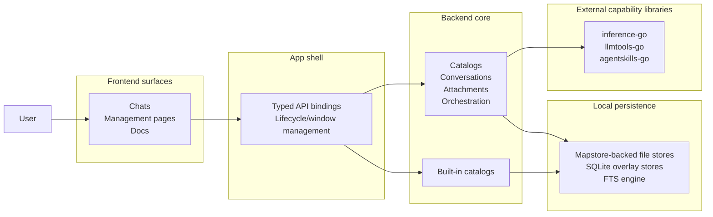

# Architecture Overview

This page describes FlexiGPT as a system of domains and responsibilities.
The goal is to show which parts own which concerns, how the parts fit together,
and where the major architectural decisions live.

## System view

## Domain responsibilities

| Domain                            | Responsibility                                                                        | Architectural reason                                                       |
| --------------------------------- | ------------------------------------------------------------------------------------- | -------------------------------------------------------------------------- |
| **Frontend surfaces**             | Present the docs, chat workspace, and management pages.                               | These are the user entry points and the main coordination surfaces.        |
| **App shell**                     | Own desktop lifecycle, app startup, bindings, and window behavior.                    | The desktop shell is the boundary between the UI and local Go services.    |
| **Conversation domain**           | Persist conversation history and support search.                                      | Chat history needs local persistence and queryable recall.                 |
| **Catalog domains**               | Manage settings, presets, prompts, tools, skills, and assistant presets.              | These are the reusable building blocks for conversations.                  |
| **Request orchestration**         | Build provider requests from the active conversation state and stream responses back. | This is where user intent becomes model execution.                         |
| **Attachment preparation**        | Convert files, images, PDFs, and URLs into request-ready content.                     | Attachments need normalization before they can enter a model request.      |
| **Built-in catalogs**             | Ship ready-to-use defaults and merge them with local content.                         | The app can start useful and still remain local-first.                     |
| **Local persistence**             | Store local state with file-backed data and small overlay stores.                     | Local data should survive app restarts without a server.                   |
| **External capability libraries** | Provide provider execution, tool shapes, and skill runtime support.                   | These libraries supply the execution and catalog mechanics behind the app. |

## How the app holds together

The system works as a chain of responsibilities rather than as a single large service.
A user works in the frontend, the frontend hands intent to the app shell through typed bindings,
the backend composes the relevant catalogs and runtime inputs, and the external capability
libraries carry out provider, tool, and skill work.

The important architectural idea is that each major domain owns one responsibility:

- the frontend owns user interaction and surface composition
- the shell owns desktop integration and the API boundary
- the backend owns local state, orchestration, and catalog management
- the capability libraries own specialized execution and storage primitives

## Where the major external libraries fit

- `mapstore-go` provides the file-backed store primitives used by the catalog and conversation domains.
- `inference-go` provides provider lifecycle, capability resolution, and streamed completions.
- `llmtools-go` provides the common tool definitions and concrete tool implementations used by the app.
- `agentskills-go` provides the skill runtime and the built-in skill tool shapes used in skill-aware requests.

## Request path at a glance

A typical chat turn follows this broad path:

1. the user prepares a message in the frontend
2. the frontend packages the turn through typed app APIs
3. the app shell routes the call into backend services
4. the backend resolves the active preset, attachments, tools, and skills
5. the request is sent through the provider layer
6. the response streams back to the frontend for display and inspection

The docs in this architecture section explain those responsibilities in more detail.
