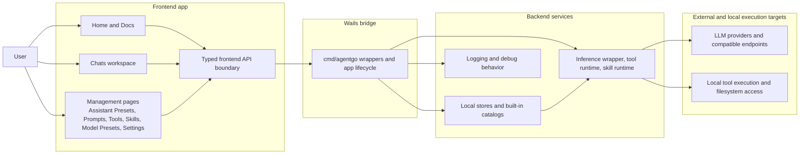
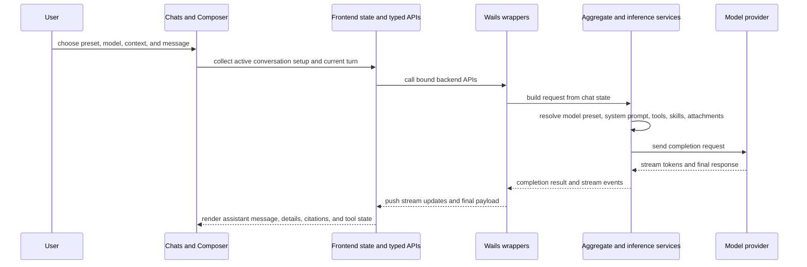

# Architecture Overview

This architecture section describe the roles and relationships inside the app.

The goal is to explain:

- what each major frontend and backend area is responsible for
- how user-facing pages relate to backend services
- how a request moves through the app
- where reusable building blocks such as presets, prompts, tools, and skills fit

## FlexiGPT at a glance

## Stable responsibility split

| Area                                      | Stable role                                                                                                     | User-visible outcome                                                     |
| ----------------------------------------- | --------------------------------------------------------------------------------------------------------------- | ------------------------------------------------------------------------ |
| **Home and Docs**                         | Give lightweight entry points into the real working areas and bundled reference material.                       | Fast onboarding and built-in documentation.                              |
| **Chats workspace**                       | Assemble search, tabs, conversation display, composer state, sending, streaming, and tool-assisted follow-up.   | Day-to-day work happens here.                                            |
| **Management pages**                      | Manage the reusable building blocks behind chat: presets, prompts, tools, skills, provider setup, and settings. | Reusable workflows instead of manual reconfiguration every turn.         |
| **Frontend API boundary**                 | Keep the UI working against typed app APIs instead of raw ad hoc calls.                                         | Clear separation between React surfaces and backend behavior.            |
| **Wails bridge**                          | Bind the frontend to Go services, own app startup and lifecycle, and serve bundled assets.                      | Desktop app behavior rather than a browser-only client.                  |
| **Backend stores and runtimes**           | Persist local data, expose built-ins, prepare requests, execute tools, manage skills, and stream completions.   | Local-first behavior with reusable catalogs and tool-assisted workflows. |
| **Providers and local execution targets** | Actually answer model requests or execute tool work.                                                            | Responses, citations, tool results, and execution side effects.          |

## How the main experience is organized

The architecture is intentionally split into two big user-facing planes.

### 1. Working plane: Chats

This is where the app turns configuration into action.

It combines:

- conversation state
- current request setup
- current turn context
- result rendering
- tool-assisted loops

### 2. Catalog and setup plane: management pages

These pages prepare the reusable pieces that Chats consumes later.

They answer questions such as:

- Which provider and models are available?
- Which prompts, tools, and skills exist?
- Which assistant presets bundle them into a starting workspace?
- Which keys and debug settings are active?

## End-to-end request flow

## Where reusable content enters the architecture

FlexiGPT's reusable building blocks exist so the chat workflow does not need to start from scratch every turn.

- **Model presets** define execution defaults.
- **Assistant presets** define starting workspace shape.
- **Prompts** define reusable instruction or message structure.
- **Tools** define callable capability.
- **Skills** define reusable workflow behavior.

The chat workflow is the place where these pieces are selected, combined, and turned into a live request.

## Built-ins and local customization

Several backend stores follow the same broad architectural pattern:

- the app ships with built-in catalogs embedded into the binary
- the user also has local writable data
- the runtime presents both together as the working catalog

That pattern is why the app can feel ready to use on first launch while still staying local-first and customizable.

## What not to overfocus on

For architecture discussions, the most stable questions are:

- which surface owns which role
- where the reusable building blocks are managed
- how a request gets from user intent to provider execution and back
