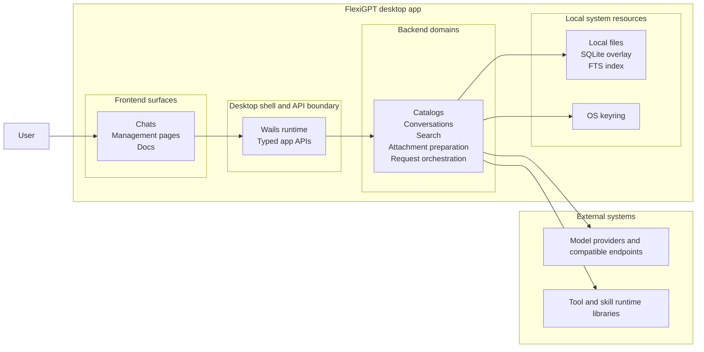

# Architecture Overview

This page gives the high-level system view of FlexiGPT.

It explains the major parts of the app, the boundaries between them, and the main runtime flows. Deeper details are covered by the companion architecture pages.

FlexiGPT is best understood as a **local-first desktop application**:

- the user works in a React frontend
- the frontend talks to a local Go backend through a typed Wails boundary
- the backend owns durable state, search, attachment preparation, and request orchestration
- local files, local indexes, and the OS keyring hold app data and secrets
- external model providers and runtime libraries are used only when the current workflow needs them

## Table of contents <!-- omit from toc -->

- [System view](#system-view)
- [Architectural boundaries](#architectural-boundaries)
  - [Frontend boundary](#frontend-boundary)
  - [Desktop boundary](#desktop-boundary)
  - [Backend boundary](#backend-boundary)
  - [Local system boundary](#local-system-boundary)
  - [External execution boundary](#external-execution-boundary)
- [Major layers and responsibilities](#major-layers-and-responsibilities)
- [Main system flows](#main-system-flows)
- [Load and manage local app data](#load-and-manage-local-app-data)
- [Send a chat turn](#send-a-chat-turn)
- [Data and persistence model](#data-and-persistence-model)
  - [Durable app data](#durable-app-data)
  - [UI-local state](#ui-local-state)
  - [Secrets](#secrets)
  - [Provider-facing request data](#provider-facing-request-data)
- [Why this split exists](#why-this-split-exists)

## System view

The important point is that FlexiGPT is not organized as a thin UI over a FlexiGPT-hosted cloud backend. The core application state and orchestration stay on the user's machine, with external provider calls happening only when the active workflow requires them.

## Architectural boundaries

The system is divided into a few clear boundaries.

### Frontend boundary

The frontend owns user-facing surfaces and interaction flow:

- chats workspace
- management pages for reusable content
- in-app docs
- rendering, navigation, and browser-local UI state

It does not own durable conversation storage, search indexing, or provider execution.

### Desktop boundary

The desktop shell is the bridge between the frontend and the local backend.

It owns:

- app startup and lifecycle
- window and shell integration
- typed APIs exposed to the frontend

This keeps UI code from reaching directly into backend implementation details.

### Backend boundary

The backend owns the durable application concerns:

- conversations and search
- settings and reusable catalogs
- built-in content exposure
- attachment preparation
- request orchestration for providers, tools, and skills

This is the layer where local state becomes executable model requests.

### Local system boundary

FlexiGPT uses local machine resources for its core state:

- local file-backed application data
- lightweight local database and index support where needed
- OS keyring for provider secrets

This is what makes the app local-first.

### External execution boundary

Some responsibilities are intentionally outside the app's own core storage and UI layers:

- model providers and compatible endpoints handle inference requests
- tool and skill runtime libraries provide specialized execution behavior

FlexiGPT integrates these capabilities, but does not collapse them into frontend code or mix them into basic storage responsibilities.

## Major layers and responsibilities

| Layer                                        | Primary responsibility                              | Owns                                                                                           | Does not own                                              |
| -------------------------------------------- | --------------------------------------------------- | ---------------------------------------------------------------------------------------------- | --------------------------------------------------------- |
| **Frontend surfaces**                        | Present the app and collect user intent             | Chats, management pages, docs, rendering, browser-local UI state                               | Durable storage, provider transport, search indexing      |
| **Desktop shell and API boundary**           | Bridge UI and backend cleanly                       | App lifecycle, typed bindings, route-to-backend boundary                                       | Core conversation and catalog logic                       |
| **Backend domains**                          | Own local state and execution orchestration         | Catalogs, conversations, search, attachment preparation, request assembly, streaming lifecycle | Route composition and UI-only workspace behavior          |
| **Local persistence and secret handling**    | Keep durable app data on the machine                | Local files, indexes, overlays, OS keyring                                                     | UI coordination and request composition                   |
| **External providers and runtime libraries** | Execute specialized model, tool, and skill behavior | Inference, tool runtime, skill runtime                                                         | App-level state management and user-facing workspace flow |

## Main system flows

## Load and manage local app data

A large part of FlexiGPT is local catalog and conversation management rather than live provider execution.

At a high level, that flow looks like this:

1. the user opens a surface such as **Chats**, **Model Presets**, **Tools**, or **Docs**
2. the frontend requests data through typed app APIs
3. the backend loads the relevant local state
4. where applicable, the backend presents built-in content alongside local user content
5. the frontend renders the result and manages only the UI state needed for interaction
6. when the user saves a durable change, it goes back through the backend rather than being written directly by the frontend

This keeps the frontend focused on user interaction while the backend remains the source of truth for application data.

## Send a chat turn

The main execution path of the app is the chat send flow.

At a high level, it works like this:

1. the user prepares a message in the chats workspace
2. the frontend submits the current draft and selected context through the typed API boundary
3. the backend resolves the active conversation state, model setup, tools, skills, prompts, and attachments
4. attachments are normalized into request-ready content
5. request orchestration sends the request to the selected provider or compatible endpoint
6. streaming results and related events are returned to the frontend
7. the final conversation result is persisted locally and made available for later search and restore

That flow can remain simple for a normal chat turn, or become more involved when tools or skills participate. The detailed behavior for those paths belongs in the backend and chats-specific docs, not this overview.

## Data and persistence model

The system has a deliberate split between **durable app data**, **UI-local state**, and **provider-facing request data**.

### Durable app data

The backend owns durable local data such as:

- conversations
- conversation search data
- settings and provider metadata
- model presets
- prompts
- tools
- skills
- assistant presets
- bundled built-in content shipped with the app

This data is intended to survive app restarts.

### UI-local state

The frontend may keep small browser-local state for continuity, such as:

- tab arrangement
- selected tab
- scroll position
- theme-related UI preferences

This is convenience state for the workspace, not the source of truth for conversations or catalogs.

### Secrets

Provider secrets are protected through the OS keyring rather than being treated like normal local settings values.

### Provider-facing request data

When the user sends a request, some of the local state may be assembled into a provider request, such as:

- the current message
- selected history
- prompt and system instructions
- attachments
- tool-related context
- skill-related context
- model and provider parameters

That means the app is local-first, but not provider-isolated. Requests still leave the machine when the user chooses a remote provider.

## Why this split exists

This architecture is meant to keep responsibilities clear.

- The frontend stays focused on surfaces and interaction.
- The desktop boundary keeps backend access typed and explicit.
- The backend stays responsible for durable state and orchestration.
- Local persistence remains separate from UI convenience state.
- External execution concerns remain separate from both the UI and the local storage model.

That split makes the system easier to evolve because a change usually has an obvious home:

- user-facing workflow changes belong in the frontend
- storage and orchestration changes belong in the backend
- workspace coordination changes belong in chats-specific frontend modules
- provider or runtime-specific behavior stays behind the execution boundary
