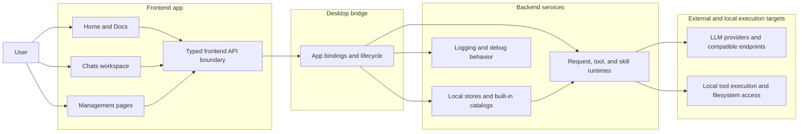
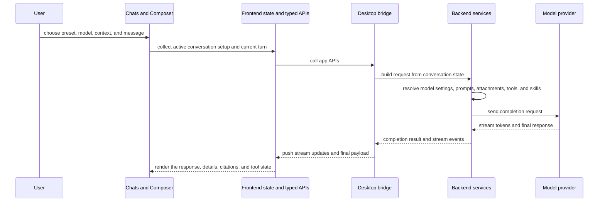

# Architecture Overview

This page is an advanced reference for how FlexiGPT is organized at a high level.

The goal is to explain:

- which major parts of the app are responsible for what
- how user-facing pages relate to local services and model providers
- how a request moves through the app
- where presets, prompts, tools, and skills fit

## FlexiGPT at a glance

## Stable responsibility split

| Area                                      | Stable role                                                                                                         | User-visible outcome                                                     |
| ----------------------------------------- | ------------------------------------------------------------------------------------------------------------------- | ------------------------------------------------------------------------ |
| **Home and Docs**                         | Provide entry points into the main workspace and bundled reference material.                                        | Faster onboarding and in-app reference.                                  |
| **Chats workspace**                       | Bring together search, tabs, conversation display, composer state, sending, streaming, and tool-assisted follow-up. | Day-to-day work happens here.                                            |
| **Management pages**                      | Manage the reusable building blocks behind chat: presets, prompts, tools, skills, provider setup, and settings.     | Reusable workflows instead of reconfiguring each turn by hand.           |
| **Frontend API boundary**                 | Keep the UI working against typed app APIs rather than ad hoc calls.                                                | Clear separation between interface and app behavior.                     |
| **Desktop bridge**                        | Connect the frontend to local services, app lifecycle, and bundled assets.                                          | Desktop app behavior instead of a browser-only client.                   |
| **Backend stores and runtimes**           | Persist local data, expose built-ins, prepare requests, execute tools, manage skills, and stream completions.       | Local-first behavior with reusable catalogs and tool-assisted workflows. |
| **Providers and local execution targets** | Answer model requests or execute tool work.                                                                         | Responses, citations, tool results, and execution side effects.          |

## Two user-facing planes

The app is easiest to understand as two main planes.

### 1. Working plane: Chats

This is where configuration becomes action.

It combines:

- conversation state
- request setup
- turn context
- response rendering
- tool-assisted loops

### 2. Catalog and setup plane: management pages

These pages prepare the reusable pieces that the chat workflow uses later.

They answer questions such as:

- Which providers and models are available?
- Which prompts, tools, and skills exist?
- Which assistant presets bundle them into a starting workspace?
- Which keys and debug settings are active?

## End-to-end request flow

## Where reusable content enters the architecture

FlexiGPT's reusable building blocks exist so the chat workflow does not start from scratch every turn.

- **Model presets** define execution defaults.
- **Assistant presets** define starting workspace shape.
- **Prompts** define reusable request structure.
- **Tools** define callable capability.
- **Skills** define reusable workflow behavior.

The chat workflow is where these pieces are selected, combined, and turned into a live request.

## Built-ins and local customization

Several parts of the app follow the same broad pattern:

- built-in catalogs ship with the app
- user-created content is stored locally
- the runtime presents both together as the working view

That is why FlexiGPT can feel ready to use on first launch while still staying local-first and customizable.

## Why this split matters

For architecture discussions, the most stable questions are:

- which surface owns which role
- where reusable building blocks are managed
- how a request gets from user intent to provider execution and back
