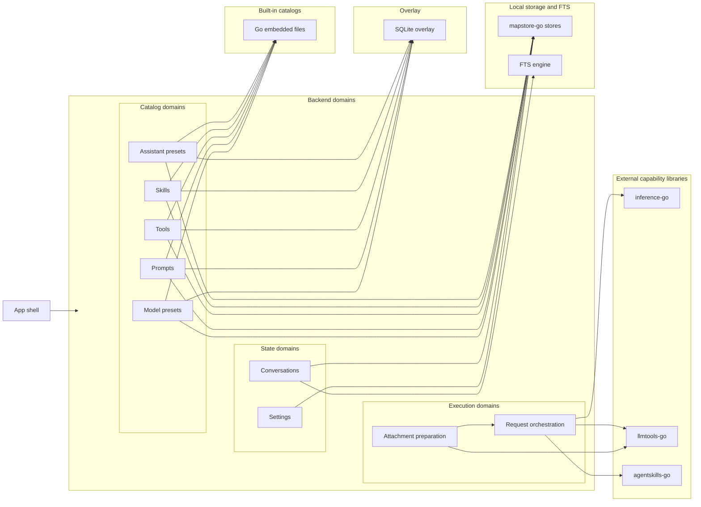

# Backend Roles and Responsibilities

This page is the backend overview for FlexiGPT.
It combines domain responsibilities with the high-level design decisions that shape storage, execution, search, built-in content, and external library usage.

The backend is organized as a set of domains that own local state, request orchestration, and execution support.
Supporting storage and capability libraries provide persistence, provider integration, tool execution, and skill runtime primitives.

## Table of contents <!-- omit from toc -->

- [Backend responsibility map](#backend-responsibility-map)
- [Domain responsibilities](#domain-responsibilities)
- [Supporting infrastructure and architectural role](#supporting-infrastructure-and-architectural-role)
- [Storage and persistence model](#storage-and-persistence-model)
  - [Map-backed local stores](#map-backed-local-stores)
  - [Directory-oriented storage for bundles and versions](#directory-oriented-storage-for-bundles-and-versions)
  - [Built-in catalog overlay model](#built-in-catalog-overlay-model)
  - [SQLite overlay](#sqlite-overlay)
  - [Conversations and search](#conversations-and-search)
- [Execution model](#execution-model)
  - [Attachment preparation](#attachment-preparation)
  - [Request orchestration](#request-orchestration)
  - [Separation of provider, tool, and skill concerns](#separation-of-provider-tool-and-skill-concerns)
- [External libraries as architectural dependencies](#external-libraries-as-architectural-dependencies)
  - [`mapstore-go`](#mapstore-go)
  - [`inference-go`](#inference-go)
  - [`llmtools-go`](#llmtools-go)
  - [`agentskills-go`](#agentskills-go)
- [Guiding design decisions](#guiding-design-decisions)
- [How to read the backend when making changes](#how-to-read-the-backend-when-making-changes)

## Backend responsibility map

<!-- Only --\> arrows in the diagram represent architectural relationships or direct usage. The `~~~` connectors are present only to stabilize Mermaid layout and should not be interpreted as backend dependencies.-->

## Domain responsibilities

| Domain                     | Responsibility                                                                                   | What it owns                                                                                                                         | Primary support                                                                                                                                           |
| -------------------------- | ------------------------------------------------------------------------------------------------ | ------------------------------------------------------------------------------------------------------------------------------------ | --------------------------------------------------------------------------------------------------------------------------------------------------------- |
| **App shell**              | Boot the desktop app, wire backend bindings, and expose the typed API boundary to the UI.        | Desktop lifecycle, backend initialization, service wiring, UI-facing backend entrypoints.                                            | Delegates into the backend domains.                                                                                                                       |
| **Model presets**          | Store provider and model configuration as local catalog content.                                 | Provider presets, model presets, defaults, capability overrides, related local catalog state.                                        | `mapstore-go` storage, built-in catalogs from Go embedded files, SQLite overlay for small mutable local state.                                            |
| **Prompts**                | Store reusable prompt bundles and templates.                                                     | Prompt bundles, template versions, bundle metadata, related local catalog state.                                                     | `mapstore-go` storage, built-in catalogs, SQLite overlay.                                                                                                 |
| **Tools**                  | Store reusable tool bundles and tool definitions that can be selected during execution.          | Tool bundles, tool definitions, bundle metadata, related local catalog state.                                                        | `mapstore-go` storage, built-in catalogs, SQLite overlay.                                                                                                 |
| **Skills**                 | Store skill bundles and skill definitions that can participate in skill-aware workflows.         | Skill bundles, skill definitions, bundle metadata, related local catalog state.                                                      | `mapstore-go` storage, built-in catalogs, SQLite overlay. Execution-time skill integration is handled through request orchestration and `agentskills-go`. |
| **Assistant presets**      | Store reusable starting workspaces that combine catalog choices into a curated setup.            | Presets that tie together model, prompt, tool, and skill selections, plus local preset state.                                        | `mapstore-go` storage, built-in catalogs, SQLite overlay.                                                                                                 |
| **Settings**               | Persist local app configuration and secrets that should stay on the machine.                     | Theme, auth keys, debug settings, local configuration.                                                                               | `mapstore-go` storage.                                                                                                                                    |
| **Conversations**          | Persist chat threads and keep them searchable without coupling thread storage to query behavior. | Conversation files, message history, conversation metadata, search indexing lifecycle.                                               | `mapstore-go` storage for threads, dedicated FTS engine for search.                                                                                       |
| **Attachment preparation** | Normalize local files and URLs into provider-ready content blocks before request execution.      | File, image, PDF, and URL conversion behavior.                                                                                       | `llmtools-go`, then hands normalized content into request orchestration.                                                                                  |
| **Request orchestration**  | Turn active backend state into executable provider requests and manage the response lifecycle.   | Request assembly, provider selection, capability resolution, tool and skill participation, streaming, cancellation, and result flow. | `inference-go` for provider execution, `llmtools-go` for tool-related shapes and execution support, `agentskills-go` for skill-aware runtime integration. |
| **Built-in catalogs**      | Ship defaults that appear alongside user-created local content.                                  | Read-only starter model presets, prompts, tools, skills, and assistant presets bundled with the app.                                 | Go embedded files exposed to catalog domains.                                                                                                             |

## Supporting infrastructure and architectural role

The backend keeps domain logic separate from the supporting primitives that make
storage, indexing, overlays, and execution possible.

| Support                  | Architectural role                                                                                                                             | Used by                                                                                     |
| ------------------------ | ---------------------------------------------------------------------------------------------------------------------------------------------- | ------------------------------------------------------------------------------------------- |
| **Go embedded files**    | Provide the bundled built-in catalog data that ships with the app.                                                                             | Built-in catalogs consumed by model presets, prompts, tools, skills, and assistant presets. |
| **`mapstore-go` stores** | Provide the primary local persistence substrate for map-backed files, directory-backed stores, partitioning, listeners, and paged file access. | Settings, conversations, and catalog domains.                                               |
| **FTS engine**           | Provide dedicated full-text indexing and querying for conversation search.                                                                     | Conversations.                                                                              |
| **SQLite overlay**       | Provide a lightweight local database for small, keyed, mutable overlay state where a flat file is not the best fit.                            | Model presets, prompts, tools, skills, assistant presets.                                   |
| **`inference-go`**       | Provide provider registration, capability lookup, request execution, and streaming responses.                                                  | Request orchestration.                                                                      |
| **`llmtools-go`**        | Provide tool abstractions, tool shapes, and concrete tool implementations, and support attachment normalization paths used by the app.         | Attachment preparation and request orchestration.                                           |
| **`agentskills-go`**     | Provide the runtime model and builtin skill tool shapes for skill-aware workflows.                                                             | Request orchestration.                                                                      |

## Storage and persistence model

FlexiGPT is local-first.
The backend keeps the main application data on the machine and does not depend
on a separate database server for its core state.

### Map-backed local stores

Most persistent backend state is stored as structured local content rather than
as opaque blobs.

`mapstore-go` is the main persistence substrate for this model.
It provides the primitives the backend needs for:

- map-backed files
- directory-backed stores
- partitioning
- listeners
- paged file access

Settings, conversations, and the catalog domains all build on this substrate in
different ways.

### Directory-oriented storage for bundles and versions

Where a domain naturally contains bundles, definitions, templates, or versions,
the backend uses directory-oriented layouts so related content can live together.

This is especially useful for catalog-style domains such as:

- prompts
- tools
- skills
- assistant presets
- other catalog data with bundle-level structure

The goal is to keep on-disk structure aligned with the shape of the data.

### Built-in catalog overlay model

Built-in defaults are shipped as catalog content, not as hardcoded UI defaults.

The app bundles starter data through Go embedded files, and the catalog domains
surface that built-in content alongside local user-created content in one working
view.
This keeps the shipped data effectively read-only while still allowing the user
to manage local entries in the same domain.

That pattern is used across the catalog domains that support built-ins:

- model presets
- prompts
- tools
- skills
- assistant presets

### SQLite overlay

Some catalog-related state is small, keyed, and mutable in a way that fits a
lightweight local database better than a file-only representation.

For that reason, the backend uses a SQLite overlay as a supporting persistence
primitive for the catalog domains shown in the diagram.
It is not the primary store for catalog content.
The primary content still lives in the local mapstore-backed model.

### Conversations and search

Conversation storage and conversation search are separate concerns.

- Conversation threads and message history are stored in the conversation store.
- Search is backed by a dedicated FTS index.

This separation avoids scanning every conversation file at query time and keeps
thread persistence independent from search behavior.

## Execution model

### Attachment preparation

Attachment preparation sits before request execution.
Its job is to take raw user inputs such as files, images, PDFs, and URLs and
normalize them into content blocks that downstream provider requests can use.

This keeps request orchestration focused on request assembly rather than file and
content conversion details.

### Request orchestration

Request orchestration is the point where stored backend state becomes an
execution request.

At execution time, it is responsible for assembling the active request from the
current context, including:

- selected model and provider configuration
- active conversation state
- assistant preset choices
- prepared attachments
- selected tools
- selected skills

It then manages the response lifecycle, including:

- provider selection
- capability resolution
- request execution
- response streaming
- cancellation
- integration of returned results into the conversation flow

### Separation of provider, tool, and skill concerns

Even when they appear together in one user interaction, provider execution, tool
execution, and skill-aware runtime behavior are intentionally not collapsed into
one implementation concern.

Instead:

- `inference-go` handles provider transport and streaming concerns
- `llmtools-go` handles tool abstractions and concrete tool behavior
- `agentskills-go` supplies the runtime shapes needed for skill-aware workflows

That separation keeps execution boundaries clearer and prevents UI code from
absorbing provider or runtime-specific logic.

## External libraries as architectural dependencies

The backend does not reimplement every low-level capability itself.
It relies on external libraries where doing so keeps the application architecture
smaller, clearer, and easier to evolve.

### `mapstore-go`

`mapstore-go` is the persistence substrate for the local catalog and conversation
model.

It provides the backend with primitives for:

- map files
- directory stores
- partitioning
- listeners
- paged file access

The backend domains use those primitives instead of inventing a custom storage
engine.

### `inference-go`

`inference-go` is the provider execution layer.

It handles:

- provider registration
- capability lookup
- request execution
- streaming responses

Request orchestration depends on it so the backend does not have to own provider
transport logic directly.

### `llmtools-go`

`llmtools-go` defines the tool model and provides concrete tool implementations
used by the app.

The backend uses it in two main ways:

- to support attachment preparation and normalization paths
- to expose and execute tool shapes during request orchestration

### `agentskills-go`

`agentskills-go` supplies the runtime model and builtin skill tool shapes needed
for skill-aware workflows.

The backend uses it through request orchestration so that stored skill choices
can align with the runtime model that execution expects.

## Guiding design decisions

The backend is shaped by a few consistent decisions:

- Main user data stays local.
- Store shape follows data shape instead of forcing one persistence pattern everywhere.
- Built-ins are shipped as catalog content, not as hardcoded UI defaults.
- Conversation search is indexed separately from conversation thread storage.
- Provider execution is delegated to the provider library layer rather than embedded into UI code.
- Tool behavior and skill-aware runtime behavior remain distinct from provider transport, even when they participate in the same conversation flow.
- SQLite overlay is a supporting mechanism for small mutable state, not the main catalog store.

## How to read the backend when making changes

If a change affects a particular concern, start in the corresponding place:

- If it affects persisted user data, start with the relevant domain store and its persistence shape.
- If it affects built-in defaults, start with the built-in catalog model and the overlay behavior for that domain.
- If it affects conversation search, look at conversations plus the FTS index.
- If it affects request construction, streaming, or cancellation, look at request orchestration and `inference-go`.
- If it affects file, image, PDF, or URL ingestion, look at attachment preparation and `llmtools-go`.
- If it affects tool behavior, look at the tools domain and `llmtools-go`.
- If it affects skill-aware behavior, look at the skills domain, request orchestration, and `agentskills-go`.
- If it affects application startup or the UI-facing backend boundary, look at the app shell.

This page is intended to be the single backend overview, so storage design,
module responsibilities, and architectural dependency boundaries can all be read
from here without needing a separate backend HLD document.
