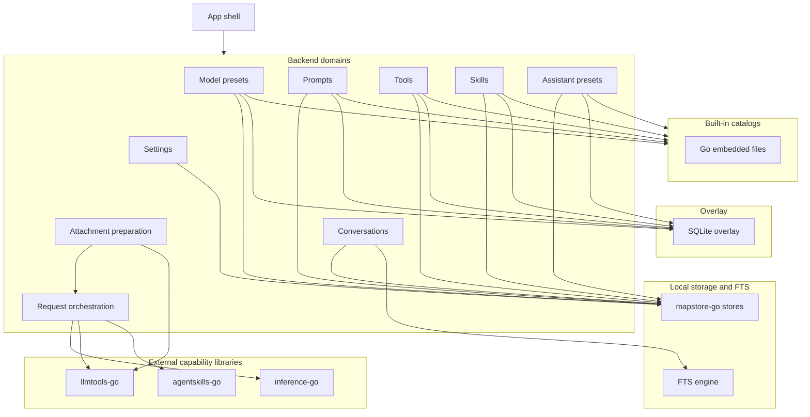

# Backend Roles and Responsibilities

This page describes the backend as a set of domains that own local state,
request orchestration, and execution support.

The emphasis is on what each domain is responsible for, how the domains compose,
and which external libraries fill in the execution and persistence primitives.

## Backend responsibility map

## Domain responsibilities

| Domain                     | Responsibility                                                                 | What it owns                                                                   |
| -------------------------- | ------------------------------------------------------------------------------ | ------------------------------------------------------------------------------ |
| **App shell**              | Boot the desktop app, wire bindings, and manage the Go-side entry to the UI.   | Desktop lifecycle, backend initialization, and the typed API boundary.         |
| **Model presets**          | Store provider and model configuration.                                        | Provider presets, model presets, defaults, and capability overrides.           |
| **Prompts**                | Store reusable prompt bundles and templates.                                   | Prompt bundles, template versions, and bundle metadata.                        |
| **Tools**                  | Store reusable tool bundles and tool versions.                                 | Tool bundles, tool definitions, and tool execution metadata.                   |
| **Skills**                 | Store skill bundles and skill definitions.                                     | Skill bundles, skill records, and runtime-visible skill state.                 |
| **Assistant presets**      | Store reusable starting workspaces.                                            | Bundle-level presets that tie model, prompt, tool, and skill choices together. |
| **Settings**               | Persist themes, auth keys, and debug settings.                                 | Local app configuration and secure key storage.                                |
| **Conversations**          | Persist chat threads and make them searchable.                                 | Conversation files, message history, and search indexing.                      |
| **Attachment preparation** | Normalize files and URLs into provider-ready content.                          | File, image, PDF, and URL conversion.                                          |
| **Request orchestration**  | Build provider requests from active conversation state and stream completions. | Provider selection, capability resolution, and completion flow.                |
| **Built-in catalogs**      | Ship defaults that appear alongside local user content.                        | Read-only or overlay-backed starter data.                                      |

## Architectural role of the external libraries

The backend does not reimplement every low-level capability itself.
It depends on a few external repos to keep the architecture focused:

- `mapstore-go` provides the file-backed storage substrate used by the catalog domains and conversation storage.
- `inference-go` provides provider registration, provider capability lookup, request execution, and response streaming.
- `llmtools-go` provides the tool abstractions and concrete tool implementations that the app exposes to the model and to the user.
- `agentskills-go` provides the runtime model and tool shapes for skill-aware workflows.

These libraries are part of the architecture because they supply the reusable mechanics that the app builds on.

## Local persistence decisions

FlexiGPT keeps the main application data local.
The backend uses different storage shapes for different kinds of data:

- single-file map stores for settings and bundle metadata
- map-directory stores for versioned items that live under bundle directories
- embedded built-in content merged with user data through overlay logic
- a dedicated FTS index for conversation search
- SQLite overlay storage for small flag-style local state where a lightweight local database is appropriate

That split keeps the persistence model aligned with the shape of the data rather than forcing one storage format everywhere.

## Conversations and search

Conversation data has two related concerns:

- the thread data itself is stored locally in the conversation store
- the search view is backed by a dedicated FTS index so query behavior does not depend on scanning every file at request time

That separation lets the app keep conversation storage and search responsibilities distinct.

## Request orchestration role

Request orchestration sits above the stores and above the provider layer.
It combines the active model preset, assistant preset, conversation state, attachments, tools, and skills into a provider request.
It also handles the return path, including streaming and cancellation behavior.

The orchestration layer is the point where catalog data becomes an execution request.

## Built-in content role

Built-in content is shipped with the app so that a fresh install still has usable defaults.
The backend merges built-in catalogs with local user content so the user sees one working view, not two unrelated lists.

This pattern is used across the catalog domains rather than only in one place.
