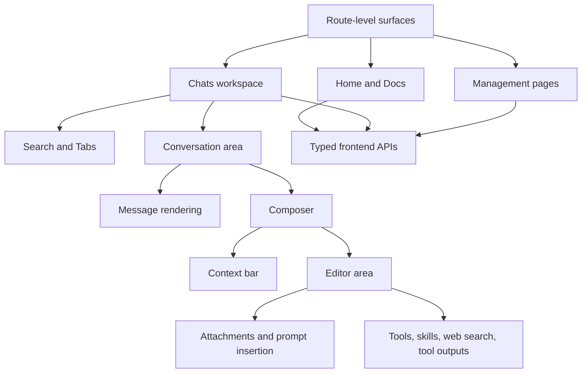

# Frontend Roles and Responsibilities

This page is an advanced reference for the frontend's stable responsibilities.

The emphasis is on what each surface coordinates and what the user gets from it.

## The frontend's overall job

At a high level, the frontend does four things:

1. presents the app's working surfaces
2. maintains conversation and composer state
3. turns user actions into typed app API calls
4. renders responses, details, and reusable content clearly

## Route-level pages are the stitching layer

The main route-level pages are the frontend's coordination points.

They decide which major controllers, views, and supporting components should work together for each surface.

| Surface               | Broad responsibility         | What it brings together                             |
| --------------------- | ---------------------------- | --------------------------------------------------- |
| **Home**              | Lightweight landing page     | Entry points into chats and docs                    |
| **Docs**              | Bundled documentation reader | Setup guide, user guide, and architecture reference |
| **Chats**             | Main working surface         | Search, tabs, conversation timeline, and composer   |
| **Assistant Presets** | Assistant preset management  | Reusable starting setups                            |
| **Prompts**           | Prompt management            | Bundles, templates, and reusable request structure  |
| **Tools**             | Tool management              | Tool definitions and availability                   |
| **Skills**            | Skill management             | Reusable workflow modes                             |
| **Model Presets**     | Provider and model setup     | Default provider, providers, and model presets      |
| **Settings**          | App-wide configuration       | Theme, auth keys, and debug settings                |

## Chats is the coordinating heart of the frontend

Among all surfaces, **Chats** is the main working workspace.

It brings together three user-visible concerns:

- local search and tab selection
- conversation display and streaming updates
- composer state for the next request

## Conversation area: the active thread coordinator

Inside the chat workspace, the conversation area keeps the active thread coherent.

That includes:

- the current message list
- the active input pane
- streaming state updates
- scroll restoration
- attachment drops into the active tab
- edit and resend behavior

From the user perspective, this is what makes one tab feel like a stable workspace rather than a loose collection of widgets.

## Composer: the next-request coordinator

The composer can be understood in two stable parts.

### Context bar

The context bar controls reusable setup for the next request.

It brings together controls for:

- assistant preset
- model choice
- temperature or reasoning
- output verbosity when supported
- history window
- advanced parameters

This is where the user changes how the next request should behave.

### Editor area

The editor area handles turn-specific preparation.

It brings together:

- message text
- attachments
- system prompt selection
- prompt template insertion
- conversation tool choices
- web search selection
- skill state
- pending tool calls and tool outputs

This is where the user decides what the next request should contain and what capabilities may be used.

## Message rendering: make responses inspectable

The message components exist so the timeline is not just raw text.

They render and expose:

- Markdown content
- code blocks
- Mermaid diagrams
- math
- citations
- attachments and tool state under messages
- message details and usage
- edit controls for user messages

That is what lets the conversation area work as both a reading surface and an inspection surface.

## Search and tabs: preserve working context

Tabs and search support continuity.

They let the user:

- keep multiple threads open
- return to older threads quickly
- move between active and stored work without losing place

This matters because FlexiGPT is designed as a workspace, not as a one-shot prompt window.

## Typed frontend APIs: the UI boundary

The frontend talks to the rest of the app through typed APIs.

That boundary helps:

- keep UI components working against stable app-level methods
- hide bridge-specific details behind clear interfaces
- make store, runtime, and orchestration access feel consistent from the React side

## Frontend relationship map

## What the user gets from this split

This frontend split matters because it gives the user:

- a chat workspace that can stay open across multiple threads
- reusable setup instead of repetitive manual re-entry
- a clear separation between chat work and catalog management
- inspectable responses rather than opaque model output
- bundled docs inside the app itself
