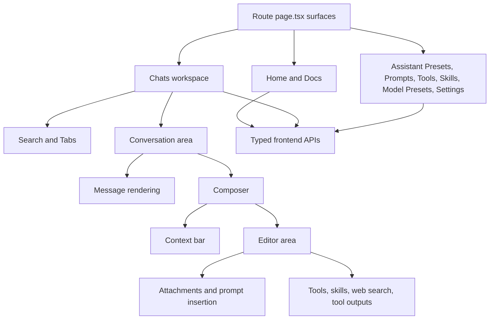

# Frontend Roles and Responsibilities

This page explains the frontend in terms of stable responsibilities.

The emphasis is on what each surface coordinates and what the user gets from it.

## The frontend's overall job

At a high level, the frontend has four responsibilities:

1. present the app's working surfaces
2. maintain conversation and composer state
3. translate user actions into typed backend API calls
4. render results, details, and reusable content clearly

## Route-level pages are the stitching layer

The route `page.tsx` files are the broad coordination points of the frontend.

They are the place where the app decides which major controllers, views, and supporting components should work together for that surface.

| Surface                     | Broad responsibility                | What it stitches together                                         |
| --------------------------- | ----------------------------------- | ----------------------------------------------------------------- |
| `home/page.tsx`             | Lightweight landing page            | Primary navigation into chats and docs                            |
| `docs/page.tsx`             | Bundled documentation reader        | docs manifest plus markdown rendering                             |
| `chats/page.tsx`            | Main working surface                | search, tabs, conversation area, and composer                     |
| `assistantpresets/page.tsx` | Assistant preset catalog management | bundles, versions, enable/disable, add/edit flows                 |
| `prompts/page.tsx`          | Prompt catalog management           | bundles, templates, enable/disable, add/edit flows                |
| `tools/page.tsx`            | Tool catalog management             | bundles, tool definitions, enable/disable, add/edit flows         |
| `skills/page.tsx`           | Skill catalog management            | bundles, skill records, runtime-aware enable/disable flows        |
| `modelpresets/page.tsx`     | Provider and model setup management | default provider, provider presets, model presets, auth-key state |
| `settings/page.tsx`         | App-wide configuration              | theme, auth keys, debug settings                                  |

## Chats is the coordinating heart of the frontend

Among all routes, `chats/page.tsx` is the most important coordinating surface.

It assembles three user-visible concerns into one working workspace:

- local search and tab selection
- conversation display and streaming updates
- composer state for the next request

## Conversation area: the thread and runtime coordinator

Inside Chats, `conversation_area.tsx` plays the role of page-level coordinator for the active conversation.

Its responsibility is not to define one tiny UI element. Its job is to keep the whole thread experience coherent.

That includes:

- the current message list
- the active tab's input pane
- streaming state updates
- scroll restoration
- attachment drops into the active tab
- edit and resend behavior

From the user perspective, this is what makes one tab feel like a stable workspace rather than a loose collection of widgets.

## Composer: the next-request coordinator

The composer is split into a few stable roles.

### Context bar

The context bar is responsible for the reusable setup for the next request.

It brings together controls for:

- assistant preset
- model choice
- temperature or reasoning
- output verbosity when supported
- history window
- advanced parameters

This is the place where the user changes how the next request should behave.

### Editor area

The editor area is responsible for turn-specific preparation.

It brings together:

- message text
- attachments
- system prompt selection
- prompt template insertion
- conversation tool choices
- web search selection
- skill state
- pending tool calls and tool outputs

This is the place where the user decides what the next request should contain and what extra capabilities it may use.

## Message rendering: make complex responses inspectable

The message components exist so the chat timeline is not just raw text.

Their stable responsibility is to render and expose:

- markdown content
- code blocks
- Mermaid diagrams
- math
- citations
- attachments and tool state under each message
- message details and usage
- edit controls for user messages

This is what lets the conversation area double as both a reading surface and an inspection surface.

## Search and tabs: preserve working context

The tabs and search modules support continuity.

Their broad job is to let the user:

- keep multiple threads open
- return to older threads quickly
- move between active and stored work without losing place

This is an important architectural role because FlexiGPT is designed as a workspace, not as a one-shot prompt window.

## Typed frontend APIs: the UI boundary

The `apis/interface.ts` and `apis/baseapi.ts` layer acts as the frontend's typed contract with the backend.

Its role is to:

- keep UI components working against stable app-level methods
- hide Wails-specific implementation detail behind typed interfaces
- make store, aggregate, tool runtime, and skill runtime access feel consistent from the React side

That boundary is part of why the route pages and conversation modules can focus on user behavior instead of backend transport detail.

## Frontend relationship map

## What the user gets from the frontend split

The frontend module split is worthwhile only if it produces a better user experience.

That split gives the user:

- a chat workspace that can stay open across multiple threads
- reusable setup instead of repetitive manual re-entry
- clear separation between chat work and catalog management
- inspectable responses rather than opaque model output
- a bundled docs surface inside the app itself
