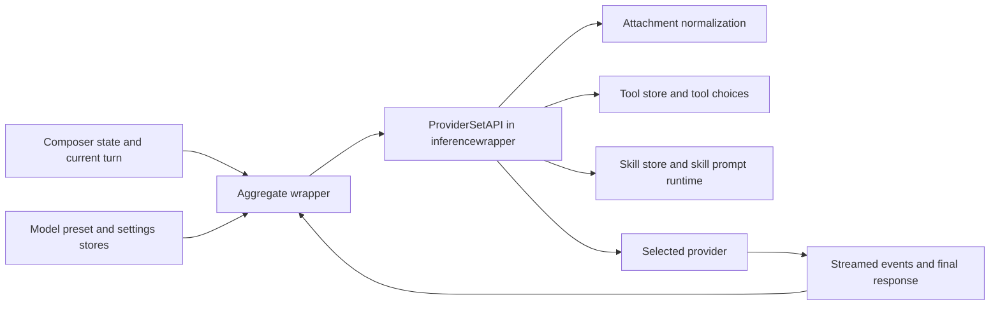

# Backend Roles and Data Flow

This page explains the backend in terms of service roles and request flow.

The emphasis is on what each backend area is for and what the user gets from it.

## The backend's broad job

At a high level, the backend does five things:

1. start and bind the desktop app through Wails
2. persist local catalogs and conversation data
3. expose built-in content alongside user-defined content
4. build and execute model requests
5. run tool and skill related runtime behavior

## Wails app layer: startup, binding, and lifecycle

The `cmd/agentgo/` layer is the backend's desktop-app shell.

From the current code, it is responsible for:

- starting the Wails application
- serving the embedded frontend assets
- creating app data directories
- initializing store wrappers and the aggregate wrapper
- binding backend wrappers into the frontend
- configuring app logging and shutdown behavior

This layer is what turns the Go backend plus frontend assets into a real desktop application.

## Wails wrappers: domain-specific backend entry points

The `wrapper_*.go` files expose backend capabilities to the frontend in domain-shaped boundaries.

Examples include wrappers for:

- settings
- conversations
- model presets
- prompts
- tools
- tool runtime
- skills
- assistant presets
- the aggregate orchestration layer

The user benefit is indirect but important: the frontend can call focused app APIs instead of one giant unstructured backend surface.

## Aggregate and inference layers: request orchestration

The broad orchestration role is centered on two layers.

### `wrapper_aggregate.go`

This layer coordinates things such as:

- provider preset lifecycle
- auth key propagation into provider runtime
- debug setting application
- streamed completion requests and cancellation

### `internal/inferencewrapper`

This layer translates app-level conversation state into provider-ready requests.

From the current code, it is responsible for:

- provider registry and provider lifecycle
- capability derivation from model presets
- request construction from history plus current turn
- attachment hydration into provider content items
- tool choice hydration from the tool store
- skill prompt and skill tool exposure for enabled skills
- forwarding the final request to the underlying provider set

This is the backend layer that most directly turns user intent into a real completion call.

## Local storage and catalog services

Most user-visible reusable content is managed by store packages under `internal/`.

| Package                    | Broad role                                                                        | What the user gets from it                      |
| -------------------------- | --------------------------------------------------------------------------------- | ----------------------------------------------- |
| `internal/setting`         | Theme, debug settings, and auth-key storage with keyring-backed secret handling.  | Keys, theme, and debug control.                 |
| `internal/conversation`    | Local conversation persistence plus local full-text search support.               | Saved chats, search, reopen, export continuity. |
| `internal/modelpreset`     | Provider and model preset catalogs, including built-ins and user-defined entries. | Multi-provider model setup and defaults.        |
| `internal/prompt`          | Prompt bundle and template storage.                                               | Reusable prompt structure.                      |
| `internal/tool`            | Tool bundle and tool definition storage.                                          | Callable capability catalog.                    |
| `internal/skill`           | Skill bundle and skill storage plus runtime-aware session behavior.               | Reusable workflow frames.                       |
| `internal/assistantpreset` | Assistant preset storage referencing model, prompt, tool, and skill selections.   | Reusable starting workspaces.                   |

## Runtime execution services

A second group of backend modules exists to execute or transform work rather than simply store it.

| Package                 | Broad role                                                                       | What the user gets from it                                                        |
| ----------------------- | -------------------------------------------------------------------------------- | --------------------------------------------------------------------------------- |
| `internal/toolruntime`  | Execute supported tools from stored tool definitions.                            | Local or HTTP-backed tool actions inside chat workflows.                          |
| `internal/attachment`   | Turn files, images, PDFs, and URLs into normalized content blocks for inference. | Attachments that actually become usable request context.                          |
| `internal/llmtoolsutil` | Register and call local Go tool functions.                                       | Built-in callable runtime functions.                                              |
| `internal/builtin`      | Expose built-in catalogs embedded into the app binary.                           | Ready-to-use starting content on first launch.                                    |
| `internal/overlay`      | Support local overlay state where built-in data needs mutable runtime flags.     | Built-ins that can still be enabled or disabled without editing embedded content. |

## Built-ins plus local customization

Several store layers use the same architectural pattern:

- built-in data is embedded with the app
- user-defined data is stored locally
- the runtime presents a merged working view
- built-ins remain conceptually read-only definitions while still allowing some mutable flags such as enable or disable behavior

That pattern matters because it explains how FlexiGPT can ship usable defaults without giving up local customization.

## Completion request flow

## Tool flow versus provider flow

One important backend distinction is that not all execution behaves the same way.

### Provider completion flow

This is the normal model request path:

- gather model and conversation state
- build provider request
- stream response
- persist assistant output

### Tool runtime flow

This is the local or HTTP execution path for user-managed tools:

- load the tool definition from the tool store
- validate the requested tool version and enabled state
- execute the appropriate runner
- return structured tool outputs back into the conversation workflow

This separation is why tool-assisted conversations can stay inside the same chat UI while still having a different execution path behind the scenes.

## What the user gets from the backend architecture

The user does not see package names, but they do feel the results:

- conversations remain local
- reusable catalogs survive across app launches
- built-in starting content is available immediately
- provider keys and model setup can be managed separately from chat behavior
- tool and skill workflows can exist inside a normal chat loop
- debugging and inspection can go deeper when needed
