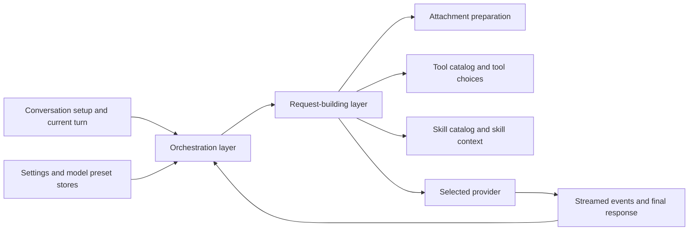

# Backend Roles and Data Flow

This page is an advanced reference for the backend's service roles and request flow.

The emphasis is on what each backend area is for and what the user gets from it.

## The backend's broad job

At a high level, the backend does five things:

1. starts and binds the desktop app
2. persists local catalogs and conversation data
3. exposes built-in content alongside user-defined content
4. builds and executes model requests
5. runs tool- and skill-related runtime behavior

## Desktop app layer: startup, binding, and lifecycle

The desktop app layer is responsible for:

- starting the application
- serving the bundled frontend
- creating app data directories
- initializing local stores and orchestration services
- exposing backend capabilities to the frontend
- configuring logging and shutdown behavior

This layer is what turns the frontend and backend into a real desktop application.

## Backend API boundaries

The frontend talks to the backend through focused app APIs rather than one giant surface.

Those APIs cover areas such as:

- settings
- conversations
- model presets
- prompts
- tools
- tool runtime
- skills
- assistant presets
- overall request orchestration

The user benefit is indirect but important: the app stays more structured and predictable.

## Request orchestration

A central orchestration layer coordinates things such as:

- provider setup and lifecycle
- auth key propagation into provider access
- debug setting application
- streamed completion requests and cancellation

A request-building layer then turns conversation state into provider-ready input.

That includes:

- provider selection
- capability derivation from model presets
- request construction from history plus the current turn
- attachment preparation
- tool availability and tool choice preparation
- skill context and skill-related behavior when enabled
- forwarding the final request to the selected provider

## Local storage and catalog services

Most reusable content in FlexiGPT is backed by local stores.

| Area                  | Broad role                                                                 | What the user gets                                  |
| --------------------- | -------------------------------------------------------------------------- | --------------------------------------------------- |
| **Settings**          | Theme, debug settings, and auth-key handling with OS keyring protection.   | Keys, theme, and debug control.                     |
| **Conversations**     | Local conversation persistence and local search support.                   | Saved chats, search, reopen, and export continuity. |
| **Model presets**     | Provider and model preset catalogs, including built-ins and local entries. | Multi-provider model setup and defaults.            |
| **Prompts**           | Prompt bundle and template storage.                                        | Reusable request structure.                         |
| **Tools**             | Tool bundle and tool definition storage.                                   | Callable capability catalog.                        |
| **Skills**            | Skill bundle and skill storage plus session-aware behavior.                | Reusable workflow modes.                            |
| **Assistant presets** | Preset storage that references model, prompt, tool, and skill selections.  | Reusable starting workspaces.                       |

## Runtime execution services

A second group of backend services executes or transforms work rather than simply storing it.

| Area                        | Broad role                                                            | What the user gets                                                       |
| --------------------------- | --------------------------------------------------------------------- | ------------------------------------------------------------------------ |
| **Tool runtime**            | Executes supported tools from stored definitions.                     | Local or HTTP-backed tool actions inside chat workflows.                 |
| **Attachment handling**     | Turns files, images, PDFs, and URLs into request-ready content.       | Attachments that become usable context.                                  |
| **Built-in catalogs**       | Exposes built-in content shipped with the app.                        | Ready-to-use defaults on first launch.                                   |
| **Overlay and local state** | Lets built-in content participate in local enabled or disabled state. | Built-ins that can still be managed without editing shipped definitions. |

## Built-ins plus local customization

Several store layers use the same pattern:

- built-in data ships with the app
- user-defined data is stored locally
- the runtime presents a merged working view
- built-in entries remain conceptually read-only while still allowing local enable or disable behavior

That is why FlexiGPT can ship usable defaults without giving up local customization.

## Completion request flow

## Tool flow versus provider flow

One important backend distinction is that not all execution behaves the same way.

### Provider completion flow

This is the normal model request path:

- gather model and conversation state
- build the provider request
- stream the response
- persist assistant output

### Tool runtime flow

This is the local or HTTP execution path for user-managed tools:

- load the tool definition
- validate the requested tool and its enabled state
- execute the appropriate runner
- return structured output into the conversation workflow

This separation is why tool-assisted conversations can stay inside the same chat UI while still following a different execution path behind the scenes.

## What the user gets from the backend architecture

The user does not need to see the internal service layout, but they do feel the results:

- conversations remain local
- reusable catalogs survive across app launches
- built-in starting content is available immediately
- provider keys and model setup stay separate from chat behavior
- tool and skill workflows can exist inside a normal chat loop
- debugging and inspection can go deeper when needed
