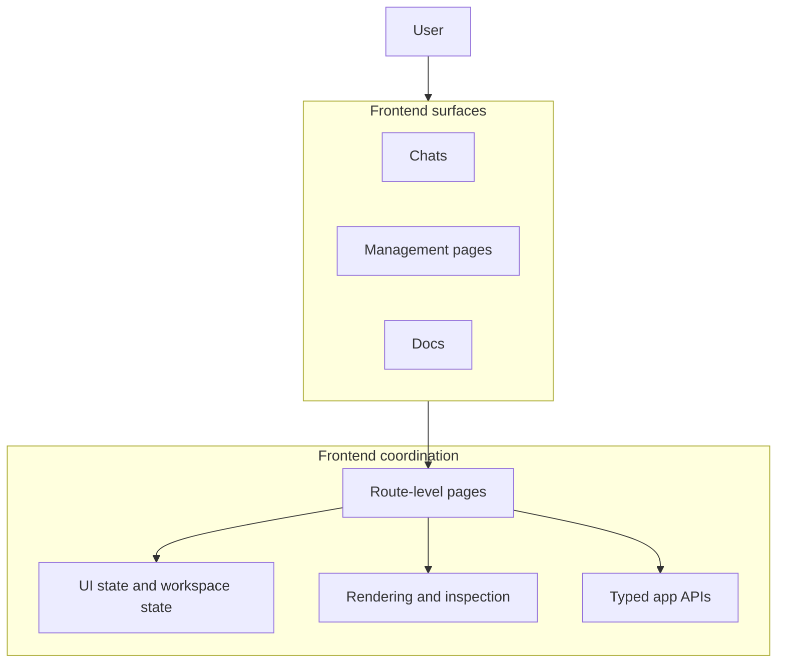

# Frontend Roles and Responsibilities

This page describes the frontend as the coordination layer for user surfaces.
It owns the routes, the page composition, the view state, and the typed boundary to the Go backend.

## Table of contents <!-- omit from toc -->

- [Frontend responsibility map](#frontend-responsibility-map)
- [What the frontend owns](#what-the-frontend-owns)
- [Surface responsibilities](#surface-responsibilities)
- [Route-level composition](#route-level-composition)
- [The typed API boundary](#the-typed-api-boundary)
- [Why this split matters](#why-this-split-matters)

## Frontend responsibility map

## What the frontend owns

The frontend owns the parts of the app that the user sees and manipulates directly:

- route selection and page composition
- chat workspace layout and turn-by-turn interaction
- management pages for reusable catalogs
- docs navigation and in-app reading
- presentation of streamed responses, citations, tool state, and message details
- the typed boundary that turns user intent into app API calls

The frontend does not own persistence or provider execution.
Those concerns belong to the backend.

## Surface responsibilities

| Surface               | Responsibility                                 | What it coordinates                                                                 |
| --------------------- | ---------------------------------------------- | ----------------------------------------------------------------------------------- |
| **Chats**             | Provide the main working workspace.            | Conversation history, composer state, streaming updates, and follow-up actions.     |
| **Management pages**  | Manage reusable app content.                   | Presets, prompts, tools, skills, settings, and provider setup.                      |
| **Docs**              | Show bundled documentation inside the app.     | Markdown content, navigation, and architecture reference material.                  |
| **Route-level shell** | Compose the page and keep navigation coherent. | Which surface is active, what supporting UI is present, and how the page is framed. |

## Route-level composition

The frontend is organized around route-level pages rather than around isolated widgets.
Each route page pulls together the controls and views that belong to that surface.
That makes the page itself the coordination point for the user-facing responsibility.

Examples of that pattern include:

- the docs route combining the docs navigation rail and markdown content
- the chats route combining the conversation timeline, composer, and workspace controls
- the management routes combining the relevant editors and list views for a reusable catalog

## The typed API boundary

The frontend talks to the backend through typed app APIs exposed by the Wails API bindings.
That boundary matters because it keeps the UI from depending on storage details, provider setup, or runtime mechanics.

The practical result is:

- the frontend asks for behavior instead of reaching into stores
- backend changes stay behind the typed API surface
- the UI can stay focused on state, presentation, and interaction

## Why this split matters

This split keeps the UI readable and the architecture understandable.
When the frontend grows, the important question is not which component knows the most logic.
It is which surface owns which user responsibility and how that surface composes the rest of the page.
