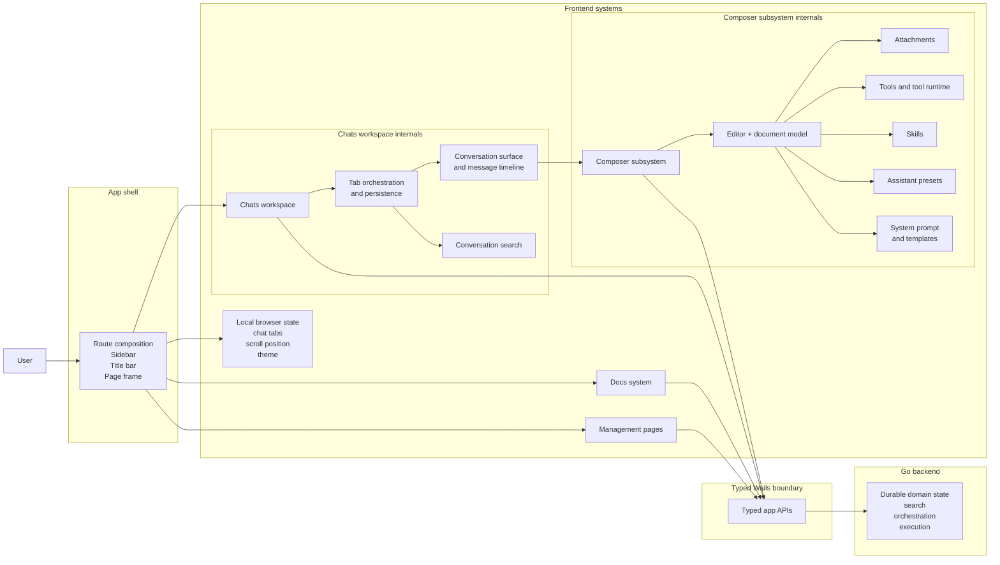

# Frontend Roles and Responsibilities

This page is the frontend responsibility reference for FlexiGPT.
It explains what the frontend owns, how the major surfaces fit together, and where the important architectural boundaries are.

The most important frontend concern is the `chats` workspace.
It is the primary surface, and it coordinates tab state, conversation restoration, message rendering, search, and the composer subsystem.

## Table of contents <!-- omit from toc -->

- [Frontend responsibility map](#frontend-responsibility-map)
- [What the frontend owns](#what-the-frontend-owns)
- [What the frontend does not own](#what-the-frontend-does-not-own)
- [Surface responsibilities](#surface-responsibilities)
- [Chats workspace in detail](#chats-workspace-in-detail)
  - [What it owns](#what-it-owns)
  - [Architectural shape](#architectural-shape)
- [Composer subsystem in detail](#composer-subsystem-in-detail)
  - [What the composer owns](#what-the-composer-owns)
  - [Main composer modules](#main-composer-modules)
- [Local browser state and persistence](#local-browser-state-and-persistence)
- [Why this split matters](#why-this-split-matters)

## Frontend responsibility map

## What the frontend owns

The frontend owns the parts of the app that the user directly sees and manipulates:

- route selection and route-level composition
- the app shell, title bar, drawer, and page framing
- the `chats` workspace and its internal coordination
- message presentation, composer state, and streaming UI updates
- management pages for reusable catalogs and settings
- docs navigation and in-app documentation rendering
- the typed boundary to Go through Wails APIs
- local browser-only state such as theme selection and chat workspace persistence

## What the frontend does not own

The frontend does **not** own the backend concerns that actually power the app:

- conversation persistence and durable storage
- catalog storage for presets, prompts, skills, tools, and settings
- provider execution and streaming transport
- tool execution and skill runtime
- search indexing
- file conversion and other backend-side attachment preparation

Those concerns belong to Go backend services and are reached through typed app APIs.

## Surface responsibilities

| Surface              | Responsibility                       | What it coordinates                                                                               |
| -------------------- | ------------------------------------ | ------------------------------------------------------------------------------------------------- |
| **Chats workspace**  | Primary work area for conversations. | Tabs, conversation restoration, timeline rendering, search, and the composer.                     |
| **Management pages** | Maintain reusable catalog content.   | Assistant presets, skills, tools, prompts, model presets, and settings.                           |
| **Docs**             | Render bundled documentation in-app. | Markdown content, navigation, architecture reference pages, and route-aware reading.              |
| **App shell**        | Frame every route consistently.      | Drawer navigation, title bar controls, page framing, theme bootstrap, and Wails script injection. |

## Chats workspace in detail

The `chats` workspace is the main frontend system.
It is responsible for more than just rendering a message list.
It coordinates the whole conversation experience.

### What it owns

- tab selection and tab lifecycle
- scratch tab creation and tab eviction behavior
- conversation hydration and restoration into tabs
- search and reopening of saved conversations
- scroll restoration and auto-follow behavior
- the active conversation timeline
- the composer mounted for the active tab
- message details, citations, reasoning, and tool result presentation

### Architectural shape

The `chats` route is intentionally a coordinator, not a thin page wrapper.
It pulls together several subsystems:

- `tabs` for workspace state and persistence
- `conversation` for hydration, restore, scroll, and stream orchestration
- `search` for query and reopen flows
- `messages` for presentation of conversation content
- `composer` for draft construction and request submission

That split keeps the workspace understandable while still making `chats` the clear owner of the overall user experience.

## Composer subsystem in detail

The composer is a major subsystem inside `chats`.
It is where the draft is built, edited, normalized, and submitted.
It also contains a large amount of UI state that belongs to the active message composition flow.

### What the composer owns

- the rich-text editor and document model
- attachments, including files, folders, and URLs
- conversation-level tool choices and per-message attached tools
- tool-call and tool-output runtime state
- skills enablement and skill session coordination
- assistant preset selection and compatibility checks
- system prompt composition and prompt template selection
- previous-message edit/replay flows
- web search selection and options
- submit, abort, and fast-forward behavior
- loading and restoring draft state from a saved conversation context

### Main composer modules

| Module                                                                  | Responsibility                                                                                         |
| ----------------------------------------------------------------------- | ------------------------------------------------------------------------------------------------------ |
| `ComposerBox`                                                           | Top-level composer coordinator; wires editor, runtime state, and submit behavior together.             |
| `EditorArea`                                                            | Hosts the editor and the primary draft submission/stop controls.                                       |
| `EditorBottomBar`                                                       | Manages the pickers and menus for attachments, prompts, tools, skills, system prompts, and web search. |
| `EditorChipsBar`                                                        | Renders the live draft chips for attachments, tools, tool calls, and outputs.                          |
| `useComposerDocument`                                                   | Owns the editor document model and editing interactions.                                               |
| `useComposerAttachments`                                                | Manages file, folder, and URL attachments plus directory grouping.                                     |
| `useComposerTools` / `useComposerToolRuntime` / `useComposerToolConfig` | Coordinate tool selection, tool-call runtime, tool outputs, and tool-argument validation.              |
| `useComposerSkills`                                                     | Manages skill catalog loading, enabled/active refs, and skill sessions.                                |
| `useAssistantPresetManager` / `useAssistantPresets`                     | Load assistant preset options, check compatibility, and apply or restore preset state.                 |
| `useComposerSystemPrompt`                                               | Builds the effective system prompt from model defaults and selected prompt sources.                    |
| `useSendMessage` / `useStreamingRuntime`                                | Manage request lifecycle, streaming updates, cancellation, and final conversation write-back.          |
| `platedoc` helpers                                                      | Define how template and tool nodes are represented inside the editor document.                         |

## Local browser state and persistence

The frontend uses local browser storage only for UI-local state.
That includes things like:

- saved chat tab state
- last selected chat tab
- scroll position per tab
- theme startup choice

This is deliberately different from durable application data.
The backend owns the real conversation store and catalog data; the frontend only keeps enough local state to make the workspace feel continuous.

## Why this split matters

This split keeps the frontend maintainable:

- route pages stay focused on composition
- `chats` stays the obvious home for workspace behavior
- the composer stays a subsystem instead of becoming a pile of ad hoc event handlers
- backend logic stays behind typed APIs
- local browser persistence stays limited to UI state

If a change touches a user surface, start from the surface owner.
If it touches draft construction, start from the composer.
If it touches conversation restoration or timeline behavior, start from `chats`.
