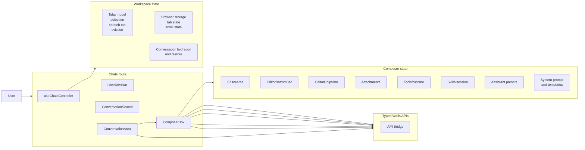

# Chats Workspace and Composer HLD

This page is the detailed high-level design for the `chats` workspace and the composer subsystem.
It exists because the workspace is the main frontend system and the composer is a deep subsystem with its own architecture, state, and runtime boundaries.

## Table of contents <!-- omit from toc -->

- [Scope](#scope)
- [Workspace view](#workspace-view)
- [Tabs and persistence](#tabs-and-persistence)
  - [Tab model decisions](#tab-model-decisions)
  - [Persisted workspace state](#persisted-workspace-state)
- [Conversation restoration and hydration](#conversation-restoration-and-hydration)
  - [Restoration flow](#restoration-flow)
  - [Why hydration is separate](#why-hydration-is-separate)
- [Search and reopening conversations](#search-and-reopening-conversations)
  - [Search behavior](#search-behavior)
  - [Architectural reason](#architectural-reason)
- [Message timeline and streaming](#message-timeline-and-streaming)
  - [Timeline responsibilities](#timeline-responsibilities)
  - [Streaming model](#streaming-model)
  - [Edit and resend model](#edit-and-resend-model)
- [Composer architecture](#composer-architecture)
  - [Top-level responsibilities](#top-level-responsibilities)
  - [Internal layers](#internal-layers)
    - [Editor and document model](#editor-and-document-model)
    - [Bottom bar and chips bar](#bottom-bar-and-chips-bar)
    - [Attachments](#attachments)
    - [Tools and tool runtime](#tools-and-tool-runtime)
    - [Skills](#skills)
    - [Assistant presets and system prompts](#assistant-presets-and-system-prompts)
  - [Composer module boundaries](#composer-module-boundaries)
- [Backend dependencies](#backend-dependencies)
- [Architectural decisions and invariants](#architectural-decisions-and-invariants)

## Scope

This document covers the architecture of the active conversation workspace, not the backend implementation.
It explains how the frontend keeps a chat session alive across tabs, how it restores a saved conversation, how it streams new answers, and how the composer assembles and submits a turn.

## Workspace view

## Tabs and persistence

`useChatsController` is the workspace controller.
It owns the tab model and decides which tab is active, which tabs are hydrated, and which tab should be created or evicted.

### Tab model decisions

- The workspace restores tabs from browser storage on startup.
- If the workspace has no tabs, it creates a scratch tab.
- A scratch tab is kept available so the user always has somewhere to start a new conversation.
- When the tab count reaches the workspace limit, the controller evicts the least-recently-used non-scratch tab.
- The selected tab is normalized if the stored selection no longer exists.

### Persisted workspace state

The workspace persists only frontend-local UI state, not the durable conversation data itself.
That local state includes:

- tab IDs and selected tab ID
- whether a tab is persisted or still scratch
- manual title lock state
- scroll position per tab
- last-activated timestamps used for tab normalization

The actual conversation content remains in backend storage.
The browser only remembers the workspace arrangement and scroll position.

## Conversation restoration and hydration

The conversation surface is responsible for restoring a saved thread into the active tab without collapsing the editor or timeline into a single blob of state.

### Restoration flow

1. the workspace selects a tab or reopens a saved conversation
2. the conversation record is fetched through the typed store API
3. the store data is hydrated into UI-friendly conversation state
4. the composer is synchronized from the restored conversation context
5. the timeline and composer are brought back into a consistent state

### Why hydration is separate

Hydration is separate from the persisted store shape because the UI needs more than raw stored messages.
It needs derived message content, restored tool calls, restored attachment chips, restored system prompt state, and restored skill state.

That means the frontend has two forms of the conversation:

- the stored conversation used for persistence
- the hydrated conversation used for rendering and editing

## Search and reopening conversations

Search is part of the workspace, not a standalone page concern.
It lets the user reopen old conversations from the same surface where new ones are created.

### Search behavior

- recent conversations are loaded first
- short queries use local filtering on recent items
- longer queries call backend search
- results are cached briefly to avoid repeat requests
- deleted conversations are removed from both the current results and the cache

### Architectural reason

This keeps search close to the workspace where it is used.
The workspace remains the coordination point even though the search data comes from the backend.

## Message timeline and streaming

The conversation timeline is responsible for rendering the active thread and showing streaming responses as they arrive.

### Timeline responsibilities

- render user and assistant messages
- show reasoning, citations, and tool details where available
- preserve scroll behavior across tabs and message updates
- show loading state while a conversation is hydrating
- render the latest assistant message as a streaming target when a request is in flight

### Streaming model

The workspace keeps a streaming buffer separate from the stored conversation until the request completes.
That lets the UI show partial text and partial thinking while the backend is still working.
When the response finishes, the final assistant message is persisted back into the conversation.

### Edit and resend model

The timeline also supports editing earlier user messages.
When editing is active, the composer can load the old message state, replace it, and drop later messages if the user submits the edited turn.

## Composer architecture

The composer is the most internally layered frontend subsystem in the workspace.
Its job is to turn the current draft into a valid request context.

### Top-level responsibilities

- own the editable draft document
- normalize attachments and chip state
- coordinate tools, skills, presets, and system prompt inputs
- validate required parameters before submit
- execute tool calls when the draft or response flow needs them
- submit the turn and handle abort or fast-forward behavior
- restore prior conversation context when editing an older message

### Internal layers

#### Editor and document model

The editor is not a plain text input.
It is a structured document model with template nodes, tool nodes, and editor-side validation behavior.
That is why `EditorArea` sits on top of document helpers rather than embedding all logic inside one component.

#### Bottom bar and chips bar

The bottom bar is the picker surface for things the user can add to the draft.
The chips bar is the live representation of what is already attached to the draft.
Together they cover:

- attachments
- prompt templates
- tools
- skills
- system prompts
- web search
- tool calls and tool outputs

#### Attachments

Attachment handling is a separate module because files, directories, and URLs are not equivalent.
The composer keeps them as UI attachments and directory groups so the draft can be edited without losing structure.

#### Tools and tool runtime

Tool behavior is split into selection, validation, and execution.
The frontend tracks attached tools, conversation-level tool choices, pending tool calls, running calls, and tool outputs separately because those states have different lifecycles.

#### Skills

Skills have their own catalog and session state.
The composer keeps enabled and active skill refs in sync and creates or refreshes a skill session when the draft requires it.

#### Assistant presets and system prompts

Assistant preset selection influences the whole draft context, not just one field.
The preset manager coordinates model selection, system prompt sources, template selections, and compatibility checks before applying a preset.
The system prompt controller separately manages the effective prompt text and the sources that contribute to it.

### Composer module boundaries

| Module                                                                  | Architectural role                                                                           |
| ----------------------------------------------------------------------- | -------------------------------------------------------------------------------------------- |
| `ComposerBox`                                                           | Owns the full composer coordinator and the bridge between editor, runtime, and submit logic. |
| `EditorArea`                                                            | Owns the editor surface and the send/stop control flow.                                      |
| `EditorBottomBar`                                                       | Owns the entry points for templates, tools, attachments, skills, and system prompts.         |
| `EditorChipsBar`                                                        | Owns the live draft visualization.                                                           |
| `useComposerDocument`                                                   | Owns the structured editor document state.                                                   |
| `useComposerAttachments`                                                | Owns attachment normalization and grouping.                                                  |
| `useComposerTools` / `useComposerToolRuntime` / `useComposerToolConfig` | Own tool selection, tool-call runtime, and tool-argument validation.                         |
| `useComposerSkills`                                                     | Owns skill refs and skill session lifecycle.                                                 |
| `useAssistantPresetManager` / `useAssistantPresets`                     | Own preset compatibility and application.                                                    |
| `useComposerSystemPrompt`                                               | Owns effective prompt composition.                                                           |
| `useSendMessage` / `useStreamingRuntime`                                | Own request lifecycle and stream buffering.                                                  |

## Backend dependencies

The workspace depends on typed Wails APIs rather than direct backend access.
The important dependencies are:

- `conversationStoreAPI` for restoring and persisting conversations
- `settingstoreAPI` for theme and settings-backed composer state
- `backendAPI` for attachment helpers and desktop behavior
- `toolRuntimeAPI` for tool execution
- `skillStoreAPI` for skill runtime calls and sessions
- `aggregateAPI` for provider and auth-key related actions

The frontend does not bypass these APIs.
That keeps the boundary clear and keeps backend concerns out of the workspace components.

## Architectural decisions and invariants

- `chats` is the primary workspace, so it owns the composition of the active conversation experience.
- The composer is a first-class subsystem, not a generic input widget.
- Workspace tabs are browser-local UI state; conversations themselves remain backend data.
- Hydration is a restore step, not a rendering shortcut.
- Streaming state is transient and separate from the persisted conversation until the request completes.
- Tool, skill, preset, and system-prompt behavior remain separate even though they meet in the same submit flow.
- Editing an older message is a replacement workflow, not an in-place append.

This document should be used when making changes that affect the overall chats workspace, its tab model, or any of the composer’s internal architecture.
