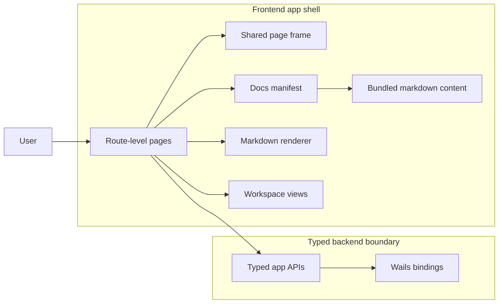

# Frontend HLD

This page captures the frontend's high-level design decisions.
It focuses on route composition, documentation delivery, rendering strategy,
and the typed boundary into the Wails-backed Go application.

## High-level frontend map

## Route composition as an architectural choice

The frontend uses route-level pages as the main composition unit.
That means the route owns the shape of the page, while smaller pieces only handle local UI concerns.
This keeps the architecture readable because each surface has one obvious place where it is assembled.

## Bundled docs as content, not code

The in-app docs are shipped as markdown files under `frontend/app/docs/content/`.
The docs manifest selects and orders those files for the in-app reader.
That gives the docs a content-driven shape and keeps the documentation separate from the route code that renders it.

## Rendering strategy

The frontend renders the bundled markdown through the same app shell that handles the rest of the UI.
The architecture docs rely on markdown rendering with mermaid support so diagrams can live next to the prose they explain.

That gives the docs two useful properties:

- the text stays easy to edit
- the architecture diagrams stay near the responsibilities they describe

## Typed app APIs as the only backend path

The frontend talks to Go through typed app APIs exposed by the Wails bindings.
That is the key architectural boundary.
It keeps the frontend from depending on direct file access, direct provider calls, or direct runtime orchestration.

The frontend can ask the backend for data and behavior, but it does not own those mechanics itself.

## HLD decisions that matter most

- Route-level pages are the main assembly point for each surface.
- Bundled docs are content-first markdown, not hardcoded UI strings.
- The docs manifest is the navigation source for the in-app docs area.
- The frontend uses a shared shell for page framing and layout consistency.
- Markdown and mermaid rendering make the architecture docs usable inside the app.
- Typed Wails APIs are the only supported way to reach backend behavior.

## What this means for changeability

When the frontend changes, the important architectural questions are:

- does the change affect a user surface or only a local component
- does it alter route composition or only surface content
- does it change the typed API boundary or only the data shown in the UI

Keeping those lines clear makes the frontend easier to evolve without turning it into a place where backend logic leaks upward.
